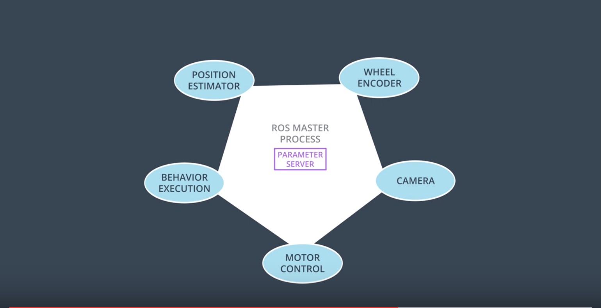
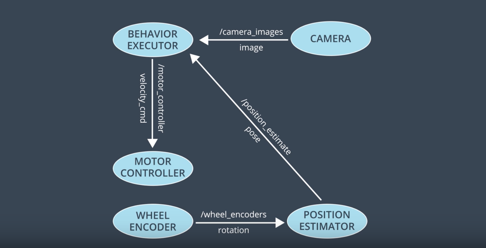
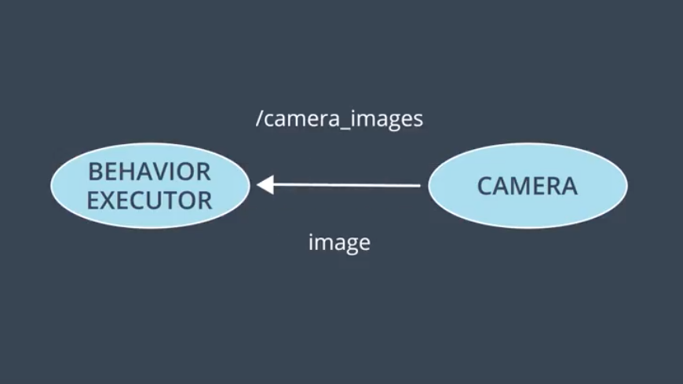
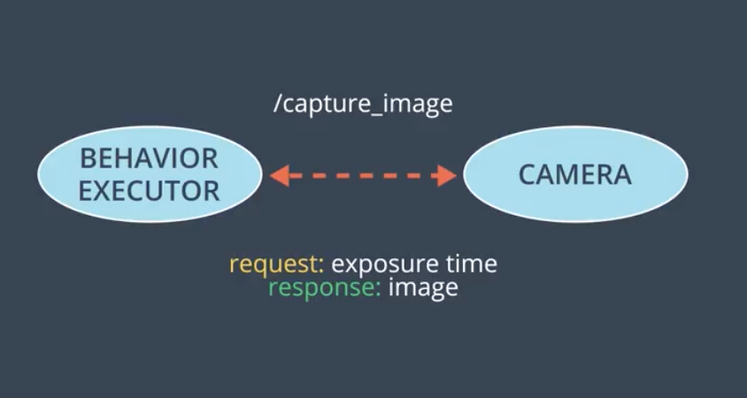

# Introduction
Building a robot used to be a long and cumbersome process. Essentially all of the components had to be built from scratch.

Robot Operating System, or “ROS”, which is a software framework that greatly simplifies robot development.

## Components and Features
ROS is an open-source software framework for robotics development. It is not an operating system in the typical sense. But like an OS, it provides a means of communicating with hardware. It also provides a way for different processes to communicate with one another via message passing. Lastly, ROS features a slick build and package management system called _**catkin**_, allowing you to develop and deploy software with ease. ROS also has tools for visualization, simulation, and analysis, as well as extensive community support and interfaces to numerous powerful software libraries.

Summary of ROS components and features:

- Open-source!
- Hardware abstraction of device drivers
- Communication via message passing
- Slick build and package management
- Tools for visualization, simulation, analysis
- Powerful software libraries

Also, check out this [short documentary](https://www.bloomberg.com/news/videos/2017-05-17/the-silicon-valley-startup-creating-robot-dna-video) on ROS.

## Nodes and topics
Pretty much any generic robot performs these three high level steps:

- Perception: gathering data through sensors
- Decision making: through the software
- Actuation: includes motors, controllers, etc.

ROS provides a powerful communication system allowing these components to communicate with each other.

ROS breaks these steps into _**nodes**_. Each node is responsible for a portion of the system functionality. For example, there may be one node for each sensor and actuator in the system. 

_**ROS master process**_ connects all the nodes to each other and allow them to share data and communicate between each other. It also functions as **parameter server** so that all the nodes store their data into it, making it available for all others nodes to use it. So rather than storing the same information over multiple places, nodes can look up the values as needed.

_**Topics:**_ Nodes can also share messages with one another over "topics". You can think of *topics* as pipes between nodes through which messages flow. 

In order to send a message the node needs to **publish** to a topic and the receiving node needs to **subscribe** to that topic.

Each node can simultaneously publish and subscribe to a variety of topics. 

This way of communicating messages is called **publisher-subscriber** or **pub-sub architecture**.

## Message passing
Each ROS distribution comes with a variety of pre-defined messages. 

There are messages for **physical quantities**:

- positions
- velocities
- accelerations
- rotations
- durations

There are also messages for **sensor readings**:

- laser scans
- images
- point clouds
- inertia measurements

Currently, there are over _200_ message types in ROS. However, you may still need to define your own message sometimes. 

Message types can contains any kind of data and not only limited to text. For example, check out the different message types in the topics example above.

## Services
The "pub-sub" interaction architecture is useful but it's not one size fit all solution. We still need some other architecture for other kinds of interactions. For example, there are times where **Request-Response** pattern is useful. For these kind of interactions, ROS provides what's called **Services**. 

Like _topics_, services allows passing message between nodes, however, unlike topics, services have no publishers or subscribers. Instead, nodes interact with services using 1-1 basis using _request_ and _response_ messages. 

For example, let's say the "behavior executor" node wants to capture an image from the camera. One way is to create a topic "`/camera_image`", so that every time the camera captures an image, it'll send it over to the "behavior executor". 

However, "behavior executor" may not want to receive images all the times, only sometimes based on its own request. In such case, we can create a service, call it "`/capture_image`". Now, everytime "behavior executor" wants an image, it'll send a request (maybe with some parameter like exposure time) and will receive an image from the camera.

## Compute Graph
These diagrams of nodes and their connections are usually referred to as "compute graphs". Visualizing the compute graphs is useful for understanding which nodes exist and how they communicate with one another. ROS can produce the compute graphs.

