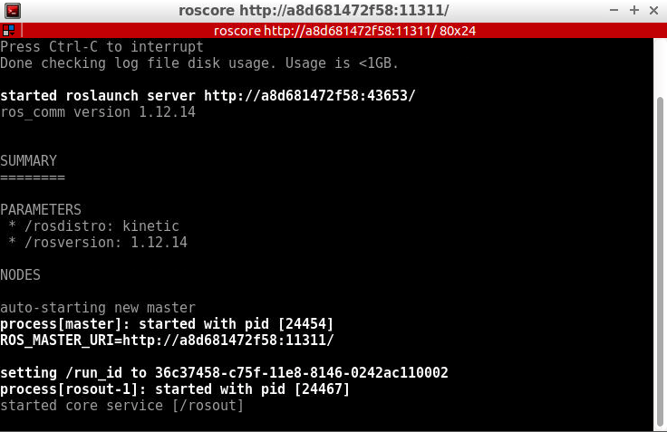
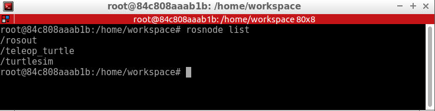
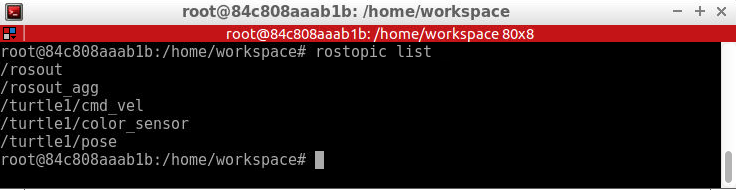
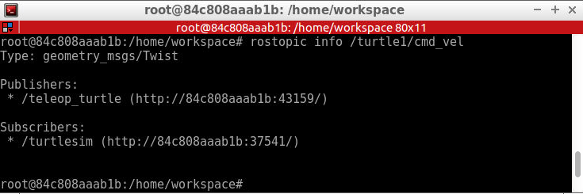

# Turtlesim Overview
We'll get familiar with the Turtlesim package for robotics.

## Some history of turtles in robotics
William Grey Walter's influence is still felt today. He referred to his robots as 'turtles' and, as you will see, the moniker stuck. The image below is William Walter's Elsie (the robot mentioned in the video) without her protective covering.

<div style="text-align:center"></div>

Long after William Walter’s work with Elmer and Elsie, Dr. Seymour Papert, a professor at MIT, began to use turtle robots for education. One of the characteristics of Papert's robots was their ability to draw on paper.

In addition to being involved with the creation and development of MIT’s turtle robots, Dr. Papert is also known as the creator and evangelist for the educational programming language LOGO.

Despite being a general-purpose language, LOGO is known for its use of “[turtle graphics](https://en.wikipedia.org/wiki/Turtle_graphics)”, a system that allows users to draw by sending simple commands to a robotic turtle. The robotic turtle mentioned here could be either a real turtle robot, or a virtual on-screen cursor within the LOGO programming environment.

The image below shows an example of Valiant Technology’s Turtle robot drawing on a sheet of paper.

<div style="text-align:center"></div>

While turtle graphics seem simple, people have used them to create a wide variety of interesting drawings and art.

The image below depicts some drawings of three dimensional spheres creating using turtle graphics. The website [turtleart.org](http://turtleart.org/) hosts a gallery containing even more outstanding examples!

<div style="text-align:center"></div>

If you'd like to have some fun with turtle graphics, feel free to try out the [Turtle Graphics 1.01](https://scratch.mit.edu/projects/1250518/) project, which allows you to experiment with turtle graphics through MIT’s graphical programming environment scratch.

Below is the result of a program written using Turtle Graphics. Looking at this image, answer the quiz question about it.

<div style="text-align:center"></div>

This tradition of turtles in robotics is alive and well today. In fact, each recent version of ROS has been named after some sort of turtle. In addition to this turtle-centric naming convention, the Open-Source Robotics Foundation also adds a new turtle to `turtle_sim` with each release.

<div style="text-align:center"></div>

## Run Turtlesim

### Setting up the environment
**Important Note:** ROS only runs on linux, there is no Mac/Windows version.

**Note:** ROS version used in Udacity is the Kinetic version, can be downloaded from [here](https://www.ros.org/install/).

First, we need to setup the ROS environment. Refer to [this video](https://youtu.be/CUdc3CACoyg) for instructions on how to do it.

**Caveat:** Make sure you use the bash command `source` rather than `./`. There’s a subtle distinction between the two commands, in that `source` executes the script in the current session, while `./` will start a new session, containing a copy of the current environment. When a script executed via `./` is exited, all environment variables set by it will be lost. We don’t want this. For more information on environment variables and terminal sessions, please see [here](https://help.ubuntu.com/community/EnvironmentVariables).

### Running Turtlesim
Now that we’ve added ROS’ environment variables to our terminal session, we can run the `turtlesim` package!

#### Starting the Master process
Before you can run any ROS nodes, you must start the Master process.

The Master process is responsible for the following (and more):

- Providing naming and registration services to other running nodes
- Tracking all publishers and subscribers
- Aggregating log messages generated by the nodes
- Facilitating connections between nodes

To run the master process, execute the command:

```bash
$ roscore
```

If all goes well (and it should), you will see output similar to this:

<div style="text-align:center"></div>

This indicates that ROS Master is running! To terminate the ROS Master process, you can simply send the SIGINT signal to the process by pressing ctrl-c in the roscore terminal window.

We are now ready to begin launching nodes!

#### Running Turtlesim Nodes
Now that the ROS Master is running, we can run our first two ROS nodes.

To do so, we will execute the `rosrun` command in a new terminal window, passing as parameters the name of the package we wish to run, and the name of the actual node.

**NOTE:** You can open a second instance of you current terminal using `CTRL + SHIFT + T`.

Tab completion is your friend. Each ROS distribution comes with a staggering number of packages, and an even more staggering number of nodes. In the bash shell, a single-tap of the tab key will autocomplete the command, if there is a single match. A double-tap of the tab key will result in a list of all possible matches, in the case that a single match cannot be found.

First we will start the `turtlesim_node`, in the `turtlesim` package using the following command in a second terminal instance.

```bash
$ rosrun turtlesim turtlesim_node
```

Next, we will start the `turtle_teleop_key` node, also from the `turtlesim` package in a third terminal instance.

```bash
$ rosrun turtlesim turtle_teleop_key
```

By using the arrow keys with the `turtle_teleop_key` node’s console selected, we are able to move the turtle in turtlesim!

<div style="text-align:center"></div>

See the video [here](https://youtu.be/tCo-jEAcAtc).

## Turtlesim Comms: List Nodes
To get a list of all nodes that are active and have been registered with the ROS Master, we can use the command `rosnode list`.

<div style="text-align:center"></div>

We can see that there are three active nodes that have been registered with the ROS Master: `/rosout`, `/teleop_turtle`, and `/turtlesim`.

- `/rosout`: This node is launched by roscore. It subscribes to the standard /rosout topic, the topic to which all nodes send log messages.
- `/teleop_turtle`: This is our keyboard teleop node. Notice that its not named turtle_teleop_key. There’s no requirement that a node’s broadcasted name is the same as the name of it’s associated executable.
- `/turtlesim`: The node name associated with the turtlebot_sim node.

See the video [here](https://youtu.be/urpcfbmJwO0)

## Turtlesim Comms: List Topics
In a similar fashion, we are able to query the ROS Master for a list of all topics. To do so, we use the command `rostopic list`.

<div style="text-align:center"></div>

- `/rosout_agg`: Aggregated feed of messages published to /rosout.
- `/turtle1/cmd_vel`: Topic on which velocity commands are sent/received. Publishing a velocity message to this topic will command turtle1 to move.
- `/turtle1/color_sensor`: Each turtle in turtlesim is equipped with a color sensor, and readings from the sensor are published to this topic.
- `/turtle1/pose`: The position and orientation of turtle1 are published to this topic.

See the video [here](https://youtu.be/eyCGtcNYaew)

## Turtlesim Comms: Get Topic Info
If we wish to get information about a specific topic, who is publishing to it, subscribed to it, or the type of message associated with it, we can use the command `rostopic info` . Let’s check into the `/turtle1/cmd_vel` topic:

<div style="text-align:center"></div>

As you might expect, there are two nodes registered on this topic. One publisher, the `teleop_turtle` node, and one subscriber, the `turtlesim` node. Additionally, we see that the type of message used on this topic is `geometry_msgs/Twist`.

## Turtlesim Comms: Message Information
Let’s get some more information about the `geometry_msgs/Twist` message on the `/turtle1/cmd_vel` topic. To do so, we will use the `rosmsg info` command:

<div style="text-align:center"></div>

We can see that a `Twist` message consists nothing more than two `Vector3` messages. One for linear velocity, and another for angular velocity, with each velocity component (x,y,z) represented by a float64.

**NOTE:** Sometimes the message definition doesn’t provide an ample amount of detail about a message type. For instance, in the example above, how can we be sure that linear and angular vectors above refer to velocities, and not positions? One way to get more detail would be to look at the comments in the message’s definition file. To do so, we can issue the following command: `rosed geometry_msgs` `Twist.msg`.

More information about `rosed`, including how to select which editor is used by default, can be found [here](http://wiki.ros.org/ROS/Tutorials/UsingRosEd).

See the video [here](https://youtu.be/bP4CQJ77iEw)

## Turtlesim Comms: Echo a Topic
Sometimes it may be useful to look at a topic’s published messages in real time. To do so, we can use the command `rostopic echo`. Let’s take a look at the `/turtle1/cmd_vel` topic.

```bash
rostopic echo /turtle1/cmd_vel
```
If we then command the turtle to move from the `turtle_teleop_key` window, we will be able to see the output message in real-time!

<div style="text-align:center"></div>


