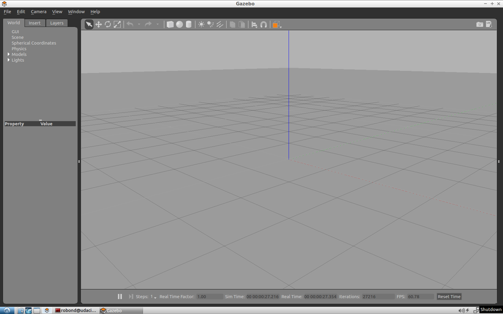
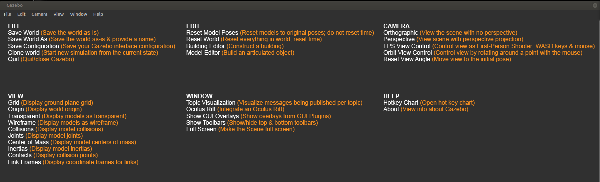

# Introduction
Gazebo is 3D robotic simulator. You can create enviroment with physical properties as in real world, add sensors, move the joints, and many more other things. It gives the advantage of making a robot without really investing a lot in buying the physical parts, etc., saving both cost and time. You can run all the experiments on the simulator (without really crashing a real robot) and when the code is ready, you can implement it on a real robot. 

# What is Gazebo?
Gazebo is a physics-based, high fidelity 3D simulator for robotics. Gazebo provides the ability to accurately simulate one or more robots in complex indoor and outdoor environments filled with static and dynamic objects, realistic lighting, and programmable interactions.

Gazebo facilitates robotic design, rapid prototyping, testing, and simulation of real-life scenarios. While Gazebo is platform agnostic and runs on Windows, Mac, and Linux, it is mostly used in conjunction with the Robotics Operating System (ROS) running on Linux systems. Gazebo is an essential tool for every roboticist.



## Gazebo Features
Gazebo has eight features that you can take advantage of:

1. **Dynamics Simulation:** Model a robot's dynamics with a high-performance physics engine.
2. **Advanced 3D Graphics:** Render your environment with high-fidelity graphics, including lighting, shadows, and textures.
3. **Sensors:** Add sensors to your robot, generate data, and simulate noise.
4. **Plugins:** Write a plugin to interact with your world, robot, or sensor.
5. **Model Database:** Download a robot or environment from Gazebo library or build your own through their engine.
6. **Socket-Based Communication:** Interact with Gazebo running on a remote server through [socket-based](https://en.wikipedia.org/wiki/Network_socket) communication.
7. **Cloud Simulation:** Run Gazebo on a server and interact with it through a browser.
8. **Command Line Tools:** Control your simulated environment through the command line tools.

For more information, refer to Gazebo's [website](http://gazebosim.org/)

# Gazebo Components
There are six components involved in running an instance of a Gazebo simulation:

1. Gazebo Server
2. Gazebo Client
3. World Files
4. Model Files
5. Environment Variables
6. Plugins

## 1. Gazebo Server
The first main component involved in running an instance of a Gazebo simulation is the Gazebo Server or also known by **gzserver**.

gzserver performs most of the heavy-lifting for Gazebo. It is responsible for parsing the description files related to the scene we are trying to simulate, as well as the objects within. It then simulates the complete scene using a physics and sensor engine.

While the server can be launched independently by using the following command in a terminal:

```bash

$ gzserver

```

It does not have any GUI component. Running gzserver in a so-called headless mode can come in handy in certain situations.

## 2. Gazebo Client
The second main component involved in running an instance of a Gazebo simulation is the Gazebo Client or also known by gzclient.

gzclient on the other hand provides the very essential Graphical Client that connects to the gzserver and renders the simulation scene along with useful interactive tools. While you can technically run gzclient by itself using the following command:

```bash

$ gzclient

```

It does nothing at all (except consume your compute resources), since it does not have a gzserver to connect to and receive instructions from.

### Combining Gazebo Server and Gazebo Client
It is a common practice to run gzserver first, followed by gzclient, allowing some time to initialize the simulation scene, objects within, and associated parameters before rendering it. To make our lives easier, there is a single intuitive command that necessarily launches both the components sequentially:

```bash

$ gazebo

```

## 3. World Files
A world file in Gazebo contains all the elements in the simulated environment. These elements are your robot model, its environment, lighting, sensors, and other objects. You have the ability to save your simulation to a world file that usually has a `.world` extension.

Gazebo can also read the content of a world file from your disk to generate the simulation. To launch the simulation from a world file, type:

```bash

$ gazebo <yourworld>.world

```

The world file is formatted using the **Simulation Description Format** or [SDF](http://sdformat.org/spec?ver=1.6&elem=world) for short. Here’s the basic format of an SDF world file:

```xml

<?xml version="1.0" ?>
<sdf version="1.5">
  <world name="default">
    <physics type="ode">
      ...
    </physics>

    <scene>
      ...
    </scene>

    <model name="box">
      ...
    </model>

    <model name="sphere">
      ...
    </model>

    <light name="spotlight">
      ...
    </light>

  </world>
</sdf>

```

## 4. Model Files
For simplification, you must create a separate SDF file of your robot with exactly the same format as your world file. This model file should only represent a single model (ex: a robot) and can be imported by your world file. The reason why you need to keep your model in a separate file is to use it in other projects. To include a model file of a robot or any other model inside your world file, you can add the following code to the world’s SDF file:

```xml

<include>
  <uri>model://model_file_name</uri>
</include>

```

## 5. Environment Variables
There are many environment variables that Gazebo uses, primarily to locate files (world, model, …) and set up communications between gzserver and gzclient. While working on a robotic project, you’ll leave these variables as default. Here’s an example of a variable that Gazebo uses:

`GAZEBO_MODEL_PATH`: List of directories where Gazebo looks to populate a model file.

## 6. Plugins
To interact with a world, model, or sensor in Gazebo, you can write plugins. These plugins can be either loaded from the command line or added to your SDF world file. You’ll learn about World Plugins later in the lesson.

# Understanding Gazebo GUI

[](https://www.youtube.com/watch?v=YJtzU64YTlg "gui")

The Gazebo GUI is divided into four major sections:

1. Scene
2. Side Panel
3. Toolbars
4. Menu

## Scene
The scene is where you will be spending most of your time, whether creating a simulation or running one. While you can use a trackpad to navigate inside the scene, a mouse is highly recommended.

You can pan the scene by pressing the left mouse button and dragging. If you hold down SHIFT in addition, you can now rotate the view. You can zoom in and out by using the mouse scroll or pressing and dragging the RMB.


## Side Panel
The side panel on the left consists of three tabs:

1. World
2. Insert
3. Layers

**`World`**

This tab displays the lights and models currently in the scene. By clicking on individual model, you can view or edit its basic parameters like position and orientation. In addition, you can also change the physics of the scene like gravity and magnetic field via the Physics option. The GUI option provides access to the default camera view angle and pose.

**`Insert`**

This is where you will find objects (models) to add to the simulation scene. Left click to expand or collapse a list of models. To place an object in the scene, simply left-click the object of interest under the Insert tab; this will bind the object to your mouse cursor, and now you can place it anywhere in the scene by left-clicking at that location.

**`Layers`**

This is an optional feature, so this tab will be empty in most cases. To learn more about Layers, click [here](http://gazebosim.org/tutorials?tut=visual_layers&cat=build_robot).

## Top Toolbar
Next, we have a toolbar at the top. It provides quick access to some cursor types, geometric shapes, and views.

**`Select mode`**

Select mode is the most commonly used cursor mode. It allows you to navigate the scene.

**`Translate mode`**

One way to change an object's position is to select the object in the world tab on the side panel and then change its pose via properties. This is cumbersome and also unnatural, the translate mode cursor allows you to change the position of any model in the scene. Simply select the cursor mode and then use the proper axis to drag the object to its desired location.

**`Rotate mode`**

Similar to translate mode, this cursor mode allows you to change the orientation of any given model.

**`Scale mode`**

Scale mode allows you to change the scale, and hence, overall size of any model.

**`Undo/redo`**

Since we humans are best at making mistakes, the undo tool helps us revert our mistakes. On the other hand if you undid something that you did not intend to, the redo tool can come to the rescue.

**`Simple shapes`**

You can insert basic 3D models like cubes, spheres, or cylinders into the scene.

**`Lights`**

Add different light sources like a spotlight, point light, or directional light to the scene.

**`Copy/paste`**

These tools let you copy/paste models in the scene. On the other hand, you can simply press Ctrl+C to copy and Ctrl+V to paste any model.

**`Alighn`**

This tool allows you to align one model with another along one of the three principal axes.

**`Change view`**

The change view tool lets you view the scene from different perspectives like top view, side view, front view, bottom view.

## Bottom Toolbar
The Bottom Toolbar has a neat play and pause button. This button allows you to pause the simulation and conveniently move objects around. This toolbar also displays data about the simulation, such as the simulation time, the real time, and the relationship between the two. There is also an frames-per-second counter that can be found to gauge your system's performance for any given scene.

## Menu
The Menu: Some of the menu options are duplicated in the Toolbars or as right-click context menu options in the Scene. If you click on Edit, you can switch to the Building Editor to design building or the Model Editor to build models. We will be working in both of these features in the upcoming concepts.



# Simulating first robot

Following videos include instructions to create a simple wheel robot:

- [video 1](https://youtu.be/hDZ5MXNTX0U)
- [video 2](https://youtu.be/IkG0PjAvdJI)
- [video 3](https://youtu.be/7VIj6Cvogjc)

The related files are in the following folders: `gz_workspace/myfirstrobot`

# Writing a Plugin
Here is a simple example of how to write an example for Gazebo so that as soon as simulation starts prints a "hello world" message.

**1. Create a directory for scripts inside “myrobot” to store a `hello.cpp` file**

```bash

$ cd /home/workspace/myrobot
$ mkdir script
$ cd script
$ gedit hello.cpp

```

Inside `hello.cpp`, include this code:

```cpp

#include <gazebo/gazebo.hh>

namespace gazebo
{
  class WorldPluginMyRobot : public WorldPlugin
  {
    public: WorldPluginMyRobot() : WorldPlugin()
            {
              printf("Hello World!\n");
            }

    public: void Load(physics::WorldPtr _world, sdf::ElementPtr _sdf)
            {
            }
  };
  GZ_REGISTER_WORLD_PLUGIN(WorldPluginMyRobot)
}

```

**2. Create a CMakeLists.txt file**

```bash

$ cd /home/workspace/myrobot
$ gedit CMakeLists.txt

```

Inside, `CMakeLists.txt`, include the following:

```cpp

cmake_minimum_required(VERSION 2.8 FATAL_ERROR)

find_package(gazebo REQUIRED)
include_directories(${GAZEBO_INCLUDE_DIRS})
link_directories(${GAZEBO_LIBRARY_DIRS})
list(APPEND CMAKE_CXX_FLAGS "${GAZEBO_CXX_FLAGS}")

add_library(hello SHARED script/hello.cpp)
target_link_libraries(hello ${GAZEBO_LIBRARIES})

```

**3. Create a build directory and compile the code**

```bash

$ cd /home/workspace/myrobot
$ mkdir build
$ cd build/
$ cmake ../
$ make # You might get errors if your system is not up to date!
$ export GAZEBO_PLUGIN_PATH=${GAZEBO_PLUGIN_PATH}:/home/workspace/myrobot/build

```

**4. Open your world file and attach the plugin to it**

```bash

$ cd /home/workspace/myrobot/world/
$ gedit myworld

```

Copy this code

```xml

<plugin name="hello" filename="libhello.so"/>

```

and paste it under

```xml

<world name="default">

```

**5. Launch the world file in Gazebo to load both the world and the plugin**

```bash

$ cd /home/workspace/myrobot/world/
$ gazebo myworld

```

**6. Visualize the output**

A `Hello World!` message is printed in the terminal. This message interacts with the Gazebo World that includes your two-wheeled robot.

**Troubleshooting**

In case your plugins failed to load, you'll have to check and troubleshoot your error. The best way to troubleshoot errors with Gazebo is to launch it with the verbose as such:

```bash

$ gazebo myworld --verbose

```


