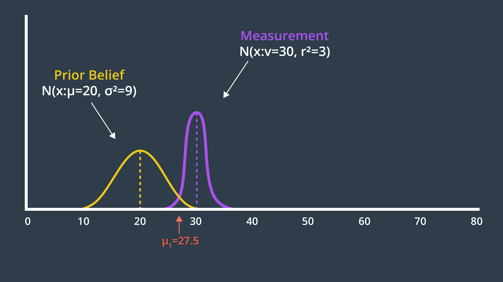
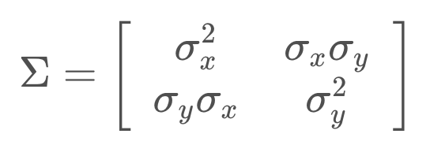
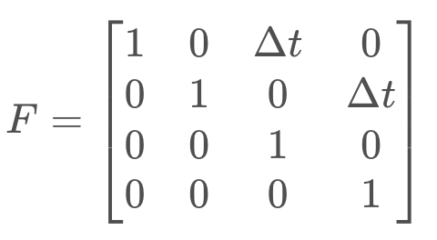
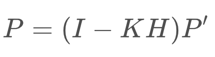
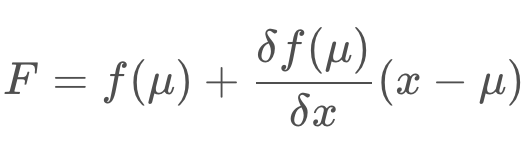
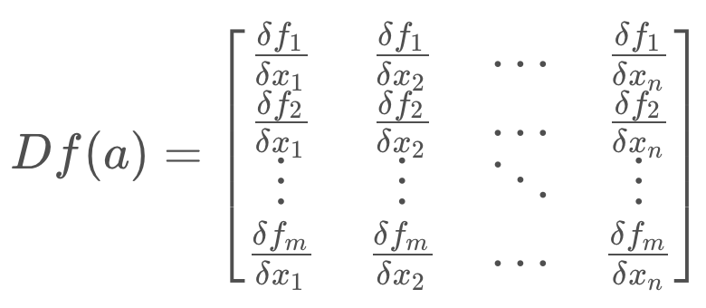

# Localization in Robotics

See the video [here](https://youtu.be/AcZY7n8XPZo).

**Resources for Additional Localization Knowledge:**

Textbook: [Probabilistic Robotics](http://www.probabilistic-robotics.org/) by Sebastian Thrun,‎ Wolfram Burgard,‎ and Dieter Fox.

## Localization Challenges

See the video [here](https://youtu.be/J_ggwD8zip0).

## Overview

See the video [here](https://youtu.be/NV1j739Tlw8).

# Kalman Filters

See the video [here](https://youtu.be/nA7tllSCpRA).

## What's a Kalman Filter?

See the video [here](https://youtu.be/Cd5KKT7PfdE).

Another way of looking at a Kalman Filter is just like you’d look at any other filter. What does it take as an input, what does it filter out, and what important substance does it let through? The graphic below compares a household coffee filter, an engineering low-pass filter, and a Kalman filter.

<p align="center">

</p>

## History

See the video [here](https://youtu.be/K1PT5I5hro0).

## Applications

See the video [here](https://youtu.be/EIOqFwzB4j8).

## Variations

See the video [here](https://youtu.be/ldg7uIhA08k).

## Robot Uncertainty

See the video [here](https://youtu.be/5NAb2iyu2uo).

## Kalman Filter Advantage 

See the video [here](https://youtu.be/thwTZvbzAgk).

## 1D Gaussian
At the basis of the Kalman Filter is the Gaussian distribution, sometimes referred to as a bell curve or normal distribution. Recall the rover example - after executing one motion, the rover’s location was represented by a Gaussian. It’s exact location was not certain, but the level of uncertainty was bounded. It was unlikely that the rover would be more than a few meters away from its target location, and it would be nearly impossible for it to show up at the 50 meter mark.

<p align="center">

</p>

This is the role of a Kalman Filter - after a movement or a measurement update, it outputs a unimodal Gaussian distribution. This is its best guess at the true value of a parameter.

A Gaussian distribution is a probability distribution, which is a continuous function. The probability that a random variable, x, will take a value between `x_1` and `x_2` is given by the integral of the function from `x1` to `x2`.

<p align="center">

</p>

In the image below, the probability of the rover being located between 8.7m and 9m is 7%.

<p align="center">

</p>

### Mean and Variance
A Gaussian is characterized by two parameters - its mean (μ) and its variance (σ²). The mean is the most probable occurrence and lies at the centre of the function, and the variance relates to the width of the curve. The term unimodal implies a single peak present in the distribution.

Gaussian distributions are frequently abbreviated as N(x: μ, σ²), and will be referred to in this way throughout the coming lessons.

The formula for the Gaussian distribution is printed below. Notice that the formula contains an exponential of a quadratic function. The quadratic compares the value of x to μ, and in the case that x=μ, the exponential is equal to 1 (`e^0 = 1`). You’ll note here, that the constant in front of the exponential is a necessary normalizing factor.

<p align="center">

</p>

Just like with discrete probability, like a coin toss, the probabilities of all the options must sum to one. Therefore, the area underneath the function always sums to one.

<p align="center">

</p>

Now that you are familiar with the formula, it’s time to code the Gaussian in C++. This will allow you to calculate the probability of a value occurring given a mean and a variance!

```cpp
#include <iostream>
#include <math.h>

using namespace std;

double f(double mu, double sigma2, double x)
{
    //Use mu, sigma2 (sigma squared), and x to code the 1-dimensional Gaussian
    //Put your code here
    double prob = 1.0 / sqrt(2.0 * M_PI * sigma2) * exp(-0.5 * pow((x - mu), 2.0) / sigma2);
    return prob;
}

int main()
{
    cout << f(10.0, 4.0, 8.0) << endl;
    return 0;
}
```

**What is represented by a Gaussian distribution?**

- Predicted motion
- Sensor measurement
- Estimated state of robot

That’s right, the Kalman Filter treats all noise as unimodal Gaussian. In reality, that’s not the case. However, the algorithm is optimal if the noise is Gaussian. The term optimal expresses that the algorithm minimizes the mean square error of the estimated parameters.

## Designing 1D Kalman Filters

See the video [here](https://youtu.be/5YChifc8z1M).

**Variable Naming Conventions**

<p align="center">

</p>

## Measurement Update

See the video [here](https://youtu.be/OaLfGr8xx9Q).

- `μ`: Mean of the prior belief 
- `σ^2`: Variance of the prior belief 
- `ν`: Mean of the measurement 
- `r^2`: Variance of the measurement

**New Belief Quiz: Where do you think the robot's new belief will be?**

<p align="center">

</p>

See the video [here](https://youtu.be/cKEVFynbJfs).

The new mean is a weighted sum of the prior belief and measurement means. With uncertainty, a larger number represents a more uncertain probability distribution. However, the new mean should be biased towards the measurement update, which has a smaller standard deviation than the prior. How do we accomplish this?

<p align="center">

</p>

The answer is - the uncertainty of the prior is multiplied by the mean of the measurement, to give it more weight, and similarly the uncertainty of the measurement is multiplied with the mean of the prior. Applying this formula to our example generates a new mean of 27.5, which we can label on our graph below.

<p align="center">

</p>

### Variance Calculation
Next, we need to determine the variance of the new state estimate.

The two Gaussians provide us with more information together than either Gaussian offered alone. As a result, our new state estimate is more confident than our prior belief and our measurement. This means that it has a higher peak and is narrower. You can see this in the graph below.

<p align="center">

</p>

The formula for the new variance is presented below.

<p align="center">

</p>

Entering the variances from our example into this formula produces a new variance of 2.25. The new state estimate, often called the posterior, is drawn below.

<p align="center">

</p>

- `μ`: Mean of the prior belief 
- `σ^2`: Variance of the prior belief 
- `ν`: Mean of the measurement 
- `r^2`: Variance of the measurement
- `τ`: Mean of the posterior 
- `s^2`: Variance of the posterior

It’s time to implement these two formulas in C++. Place your code within a function called measurement_update, such that you can use it as a building block in your Kalman Filter implementation.

When you’re done, calculate the posterior mean and variance for a prior of `N(x: μ_1=10, σ^2=8)` and measurement `N(x: μ_2=13, σ^2=2)`. Is it what you expected?

**Programming Quiz**
In this C++ code, the **measurement update** function returns two values: the newly computed mean and variance. Usually, a `tuple` or `struct` should be used in C++ to return more than one value from a function and easily assign them later to multiple variables. For more information on `tuples` and `structs` take a look at this [link](https://dzone.com/articles/returning-multiple-values-from-functions-in-c).

```cpp
#include <iostream>
#include <math.h>
#include <tuple>

using namespace std;

double new_mean, new_var;

tuple<double, double> measurement_update(double mean1, double var1, double mean2, double var2)
{
    new_mean = (var2 * mean1 + var1 * mean2) / (var1 + var2);
    new_var = 1 / (1 / var1 + 1 / var2);
    return make_tuple(new_mean, new_var);
}

int main()
{

    tie(new_mean, new_var) = measurement_update(10, 8, 13, 2);
    printf("[%f, %f]", new_mean, new_var);
    return 0;
}
```

I encourage you to think about what the posterior Gaussian would look like for the following example, and even calculate the exact values using your measurement_update function.

<p align="center">

</p>

## State Prediction

See the video [here](https://youtu.be/mjBpoGmNaqU).

### State Prediction Formulas

<p align="center">

</p>

```cpp
#include <iostream>
#include <math.h>
#include <tuple>

using namespace std;

double new_mean, new_var;

tuple<double, double> state_prediction(double mean1, double var1, double mean2, double var2)
{
    new_mean = mean1 + mean2;
    new_var =  var1 + var2;
    return make_tuple(new_mean, new_var);
}

int main()
{

    tie(new_mean, new_var) = state_prediction(10, 4, 12, 4);
    printf("[%f, %f]", new_mean, new_var);
    return 0;
}
```

## Kalman Filter

See the video [here](https://youtu.be/1nHSG4U_v2g).

In the programming quiz below, write the code that will iteratively go through the available measurements and motions, and apply a measurement update or a state prediction to each one of them.

```cpp
#include <iostream>
#include <math.h>
#include <tuple>

using namespace std;

double new_mean, new_var;

tuple<double, double> measurement_update(double mean1, double var1, double mean2, double var2)
{
    new_mean = (var2 * mean1 + var1 * mean2) / (var1 + var2);
    new_var = 1 / (1 / var1 + 1 / var2);
    return make_tuple(new_mean, new_var);
}

tuple<double, double> state_prediction(double mean1, double var1, double mean2, double var2)
{
    new_mean = mean1 + mean2;
    new_var = var1 + var2;
    return make_tuple(new_mean, new_var);
}

int main()
{
    //Measurements and measurement variance
    double measurements[5] = { 5, 6, 7, 9, 10 };
    double measurement_sig = 4;
    
    //Motions and motion variance
    double motion[5] = { 1, 1, 2, 1, 1 };
    double motion_sig = 2;
    
    //Initial state
    double mu = 0;
    double sig = 1000;

    for (int i = 0; i < sizeof(measurements) / sizeof(measurements[0]); i++) {
        tie(mu, sig) = measurement_update(mu, sig, measurements[i], measurement_sig);
        printf("update:  [%f, %f]\n", mu, sig);
        tie(mu, sig) = state_prediction(mu, sig, motion[i], motion_sig);
        printf("predict: [%f, %f]\n", mu, sig);
    }

    return 0;
}
```

## Multivariate Gaussians
Most robots that we would be interested in modeling are moving in more than one dimension. For instance, a robot on a plane would have an x & y position.

The simple approach to take, would be to have a 1-dimensional Gaussian represent each dimension - one for the x-axis and one for the y-axis.

Do you see any problems with this?

**Why couldn't we use multiple 1-dimensional Gaussians to represent multi-dimensional systems?**

There may be correlations between dimensions that we would not be able to model by using independent 1-dimensional Gaussians.

The image below depicts a two-dimensional Gaussian distribution.

<p align="center">

</p>

Let's dive into the details!

See the video [here](https://youtu.be/ih69P0KJgII).

### Formulas for the Multivariate Gaussian

**Mean**

The mean is now a vector,

<p align="center">

</p>

**Covariance**

And the multidimensional equivalent of variance is a covariance matrix, 

<p align="center">

</p>

where `{σ_x}^2` and `{σ_y}^2` represent the variances, while `σ_y.σ_x` and `σ_x.σ_y` are correlation terms. These terms are non-zero if there is a correlation between the variance in one dimension and the variance in another. When that is the case, the Gaussian function looks 'skewed' when looked at from above.

If we were to evaluate this mathematically, the eigenvalues and eigenvectors of the covariance matrix describe the amount and direction of uncertainty.

**Multivariate Gaussian**

Below is the formula for the multivariate Gaussian. Note that `x` and `μ` are vectors, and Σ is a matrix.

<p align="center">

</p>

If D=1, the formula simplifies to the formula for the one-dimensional Gaussian that you have seen before.

## Intro to Multi-dimensional KF
See the video [here](https://youtu.be/9Xb5WavDqKE).

## Design of Multi-Dimensional Kalman Filters
From this point forward we will transition to using linear algebra, as it allows us to easily work with multi-dimensional problems. To begin with, let’s write the state prediction in linear algebra form.

### State Transition
The formula below is the state transition function that advances the state from time _t_ to time _t + 1_. It is just the relationship between the robot’s position, `x`, and velocity, `xdot`. Here, we will assume that the robot’s velocity is not changing.

<p align="center">

</p>

We can express the same relationship in matrix form, as seen below. On the left, is the posterior state (denoted with the prime symbol, ' 
′
 ), and on the right are the state transition function and the prior state. This equation shows how the state changes over the time period, `Δt`. Note that we are only working with the means here; the covariance matrix will appear later.

<p align="center">

</p>

The State Transition Function is denoted `F`, and the formula can be written as so,

<p align="center">

</p>

In reality, the equation should also account for process noise, as its own term in the equation. However, process noise is a Gaussian with a mean of 0, so the update equation for the mean need not include it.

<p align="center">

</p>

Now, what happens to the covariance? How does it change in this process?

**NOTE:** While it is common to use `Σ` to represent the covariance of a Gaussian distribution in mathematics, it is more common to use the letter PP to represent the state covariance in localization.

If you multiply the state, xx, by FF, then the covariance will be affected by the square of FF. In matrix form, this will look like so:

<p align="center">

</p>

However, your intuition may suggest that it should be affected by more than just the state transition function. For instance, additional uncertainty may arise from the prediction itself. If so, you’re correct!

To calculate the posterior covariance, the prior covariance is multiplied by the state transition function squared, and `Q` added as an increase of uncertainty due to process noise. `Q` can account for a robot slowing down unexpectedly, or being drawn off course by an external influence.

<p align="center">

</p>

Now we’ve updated the mean and the covariance as part of the state prediction.

**Quiz**

Now that you've seen how a simple state transition function is created, let's see if you can construct a more complicated one for the following problem:

You are tracking the position and velocity of a robot in two dimensions, x and y. The state is represented as so,

<p align="center">

</p>

Find the state update function, F, that will advance the state from time _t_ to time _t + 1_ based on the state transition equation below.

<p align="center">

</p>

**Which of the following matrices is the correct state transition function for the problem defined above?**

<p align="center">

</p>

### Measurement Update
Next, we move onto the measurement update step. If we return to our original example, where we were tracking the position and velocity of a robot in the x-dimension, the robot was taking measurements of the location only (the velocity is a hidden state variable). Therefore the measurement function is very simple - a matrix containing a one and a zero. This matrix demonstrates how to map the state to the observation, `z`.

<p align="center">

</p>

This matrix, called the Measurement Function, is denoted `H`.

For the measurement update step, there are a few formulas. First, we calculate the measurement residual, `y`. The measurement residual is the difference between the measurement and the expected measurement based on the prediction (ie. we are comparing where the measurement tells us we are vs. where we think we are). The measurement residual will be used later on in a formula.

<p align="center">

</p>

Next, it's time to consider the measurement noise, denoted `R`. This formula maps the state prediction covariance into the measurement space and adds the measurement noise. The result, `S`, will be used in a subsequent equation to calculate the Kalman Gain.

<p align="center">

</p>

These equations need not be memorized, instead they can be referred to in text or implemented in code for use and reuse.

### Kalman Gain
Next, we calculate the Kalman Gain, K. As you will see in the next equation, the Kalman Gain determines how much weight should be placed on the state prediction, and how much on the measurement update. It is an averaging factor that changes depending on the uncertainty of the state prediction and measurement update.

<p align="center">

</p>

These equations may look complicated and intimidating, but they do nothing more than calculate an average factor. Let’s work through a quick example to gain a better understanding of this. Feel free to pause the video and follow along in your own notebook!

See the video [here](https://youtu.be/K-FobmdRMtI).

The last step in the Kalman Filter is to update the new state’s covariance using the Kalman Gain.

<p align="center">

</p>

### Kalman Filter Equations
These are the equations that implement the Kalman Filter in multiple dimensions.

**State Prediction:**

**Measurement Update:**

**Calculation of Kalman Gain:**

**Calculation of Posterior State and Covariance:**

The Kalman Filter can successfully recover from inaccurate initial estimates, but it is very important to estimate the noise parameters, Q and R, as accurately as possible - as they are used to determine which of the estimate or the measurement to believe more.

### Programming Exercise
Now it’s your chance to code the multi-dimensional Kalman Filter in C++. The code below uses the C++ `eigen` library to define matrices and easily compute their inverse and transpose. Check out the `eigen` library full documentation [here](https://eigen.tuxfamily.org/dox/group__QuickRefPage.html) and go through some of their examples. Here's a list of useful commands that you'll need while working on this quiz:

- Initializing a 2x1 float matrix K: `MatrixXf K(2, 1);`
- Inserting values to matrix K: `K << 0, 0`
- Computing the transpose of matrix K: `K.transpose()`
- Computing the inverse of matrix K: `K.inverse()`

```cpp
#include <iostream>
#include <math.h>
#include <tuple>
#include "Core" // Eigen Library
#include "LU"   // Eigen Library

using namespace std;
using namespace Eigen;

float measurements[3] = { 1, 2, 3 };

tuple<MatrixXf, MatrixXf> kalman_filter(MatrixXf x, MatrixXf P, MatrixXf u, MatrixXf F, MatrixXf H, MatrixXf R, MatrixXf I)
{
    for (int n = 0; n < sizeof(measurements) / sizeof(measurements[0]); n++) {

        // Measurement Update
        MatrixXf Z(1, 1);
        Z << measurements[n];

        MatrixXf y(1, 1);
        y << Z - (H * x);

        MatrixXf S(1, 1);
        S << H * P * H.transpose() + R;

        MatrixXf K(2, 1);
        K << P * H.transpose() * S.inverse();

        x << x + (K * y);

        P << (I - (K * H)) * P;

        // Prediction
        x << (F * x) + u;
        P << F * P * F.transpose();
    }

    return make_tuple(x, P);
}

int main()
{

    MatrixXf x(2, 1);// Initial state (location and velocity) 
    x << 0,
    	 0; 
    MatrixXf P(2, 2);//Initial Uncertainty
    P << 100, 0, 
    	 0, 100; 
    MatrixXf u(2, 1);// External Motion
    u << 0,
    	 0; 
    MatrixXf F(2, 2);//Next State Function
    F << 1, 1,
    	 0, 1; 
    MatrixXf H(1, 2);//Measurement Function
    H << 1,
    	 0; 
    MatrixXf R(1, 1); //Measurement Uncertainty
    R << 1;
    MatrixXf I(2, 2);// Identity Matrix
    I << 1, 0,
    	 0, 1; 

    tie(x, P) = kalman_filter(x, P, u, F, H, R, I);
    cout << "x= " << x << endl;
    cout << "P= " << P << endl;

    return 0;
}
```

## Introduction to the Extended Kalman Filter

See the video [here](https://youtu.be/dwpKthaQ6ts).

Additional Resources:

- [Taylor series Wikipedia page](https://en.wikipedia.org/wiki/Taylor_series)

### Summary
The Kalman Filter is applicable to problems with linear motion and measurement functions. This is limiting, as much of the real world is nonlinear.

A nonlinear function can be used to update the mean of a function,

<p align="center">

</p>

but not the variance, as this would result in a non-Gaussian distribution which is much more computationally expensive to work with. To update the variance, the Extended Kalman Filter linearizes the nonlinear function f(x) over a small section and calls it F. This linearization, F, is then used to update the state's variance.

<p align="center">

</p>

The linear approximation can be obtained by using the first two terms of the Taylor Series of the function centered around the mean.

<p align="center">

</p>

## Multi-dimensional Extended Kalman Filter
Now you’ve seen the fundamentals behind the Extended Kalman Filter. The mechanics are not too different from the Kalman Filter, with the exception of needing to linearize a nonlinear motion or measurement function to be able to update the variance.

You’ve seen how this can be done for a state prediction or measurement function that is of one-dimension, but now it’s time to explore how to linearize functions with multiple dimensions. To do this, we will be using multi-dimensional Taylor series.

### Linearization in Multiple Dimensions
The equation for a multidimensional Taylor Series is presented below.

<p align="center">

</p>

You will see that it is very similar to the 1-dimensional Taylor Series. As before, to calculate a linear approximation, we only need the first two terms.

<p align="center">

</p>

You may notice a new term, Df(a). This is the Jacobian matrix, and it holds the partial derivative terms for the multi-dimensional equation.

<p align="center">

</p>

You may notice a new term, Df(a). This is the Jacobian matrix, and it holds the partial derivative terms for the multi-dimensional equation.

<p align="center">

</p>

In it's expanded form, the Jacobian is a matrix of partial derivatives. It tells us how each of the components of f changes as we change each of the components of the state vector.

<p align="center">

</p>

The rows correspond to the dimensions of the function, f, and the columns relate to the dimensions (state variables) of x. The first element of the matrix is the first dimension of the function derived with respect to the first dimension of x.

The Jacobian is a generalization of the 1-dimensional case. In a 1-dimensional case, the Jacobian would have df/dx as its only term.

