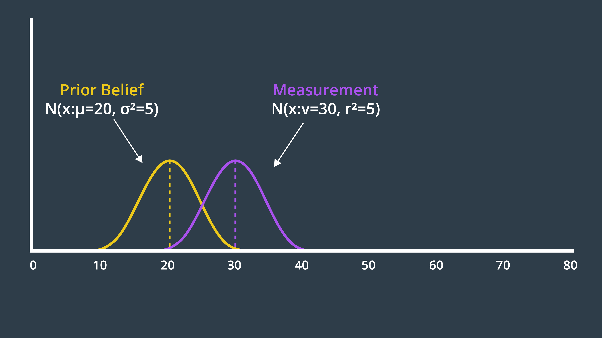
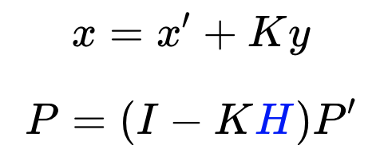

# Localization in Robotics
Localization is the challenge of determining your robot's pose in a mapped environment. We do this by implementing a probabilistic algorithm to filter noisy sensor measurements and track the robot's position and orientation. Robot's pose consists of its `X` and `Y` position coordinates within the room and its orientation, `theta`.

There are four very popular localization algorithms. 

- **Extended Kalman Filter (EKF):** the most common Gaussian filter that helps in estimating the state of non-linear models.
- **Markov Localization:** which is a base filter localization algorithm. Markov maintains a probability distribution over the set of all possible positions and orientation the robot might be located at. 
- **Grid Localization:** it is referred to as histogram filter since it's capable of estimating the robot's pose using grids.
- **Monte Carlo Localization (MCL):** also known as **particle filter** because it estimates the robot's pose using particles. 

Here, we'll be covering EKF and MCL algorithms. 

See the video [here](https://youtu.be/AcZY7n8XPZo).

**Resources for Additional Localization Knowledge:**

Textbook: [Probabilistic Robotics](http://www.probabilistic-robotics.org/) by Sebastian Thrun,‎ Wolfram Burgard,‎ and Dieter Fox.

## Localization Challenges
There are **three different types of localization problems**. These problems are not all equal. The amount of information present and the nature of the environment that a robot is operating determine the difficulty of the localization task. 

The easiest localization problem is called **Position Tracking**, also known as **Local Localization**. In this problem, the robot knows its initial pose and the localization challenge entails estimating the robot's pose as it moves out on the environment. This problem is not that trivial, since there is always some uncertainty in robot motion. However, the uncertainty is limited to regions surrounding the robot. 

A more complicated localization challenge is called **Global Localization**. In this case, the robot's initial pose is unknown and the robot must determine its pose relative to the ground truth map. The amount of uncertainty in **Global Localization** is much greater than that in **Position Tracking**, making it a much more difficult problem. 

The most challenging localization problem is the **Kidnapped Robot** problem. This problem is just like **Global Localization** except that the robot may be kidnapped at any time and moved to a new location on the map. Although, this is that common, but we can think of it as the worst possible case. _As a roboticist, one should always design robots to deal with the worst circumstances._

It should be noted that localization algorithms are not free from error and there will instances of a robot miscalcualting where it is. The **Kidnapped Robot** problem teaches the robot to recover from such instances, and once again, correctly locate itself on a map. Doing so is critical to building robot's localization algorithms. 

See the video [here](https://youtu.be/J_ggwD8zip0).

## Overview
We're going to be covering the implementation of the two most common localization algoruthms. We'll be learning about **Kalman Filter**, a very robust algorithm for filtering noisy sensor data. We'll also talk about the limitations of KF and the variations (e.g. Extended KF) to overcome those limitations. We'll learn about **sensor fusion**, which is the process of combining data from multiple sensors to calculate the most accurate estimate of a measured value. We'll then use our knowledge and apply sensor fusion Extended Kalman Filter package with ROS to estimate the robot's pose. 

We'll also learn about **Monte Carlo Localization**. MCL uses particle filters to track your robot pose and present many advantages over EKF. After learning MCL algorithm, we'll code in C++ to generate particles and localize our robot in a 2D map. And we'll also visualize how particles can estimate our robot's pose. 

Finally, we'll build and customize our mobile robot in Gazebo. We'll be tracking the robot's pose while it navigates in a map using the adaptive Monte Carlo Localization package in ROS.

See the video [here](https://youtu.be/NV1j739Tlw8).

# Kalman Filters

See the video [here](https://youtu.be/nA7tllSCpRA).

## What's a Kalman Filter?
The Kalman filter is an estimation algorithm that is **very prominent in controls**. **It's used to estimate the value of a variable in real time as the data is being collected**. This variable can represent the position or velocity of a robot, or for example, the temperature of a process. **The reason that the Kalman filter is so noteworthy is because it can take data with a lot of uncertainty or noise in the measurements, and provide a very accurate estimate of the real value, and it can do so fast**. Unlike other estimation algorithms, **you don't need to wait for a lot of data to come in in order to calculate an accurate estimate**. 

In the most general level, KF is a continuous iteration of a **two-step process**. The **first step** is a **measurement update**. We use the recorded measurement to update our state. The **second step** is **state prediction**. We use the information that we have about the current state to predict what the future state will be. At the start, we use an initial guess. We continue to iterate through these two steps and it doesn't take many iteration to converge on real value. 

See the video [here](https://youtu.be/Cd5KKT7PfdE).

Another way of looking at a Kalman Filter is just like you’d look at any other filter. What does it take as an input, what does it filter out, and what important substance does it let through? The graphic below compares a household coffee filter, an engineering low-pass filter, and a Kalman filter.

At the start, we use an **initial guess**. We continue to iterate through these two steps and it doesn't take many iterations for our estimate to converge on the real value. 

<p align="center">

</p>

## History
The Kalman filter was invented by Rudolph Kalman at a very convenient time in American history. Soon after developing the algorithm, Kalman visited his acquaintance Stanley Schmit at his workplace in NASA and introduced the algorithm to NASA staff. At the time, NASA was struggling to apply existing algorithms to the nonlinear problem of trajectory estimation for the Apollo program. The hope was to launch a spacecraft into a trajectory around the moon. The challenge lay in being able to create something accurate enough to guide the spacecraft through very narrow corridors of space but also efficient enough to run on an onboard computer in the 1960s. At the time, computing power was very limited in both the onboard computer and the computer that was used for simulation and testing. Another challenge was that during the flight of the spacecraft measurements would be coming in at irregular time intervals. After some tweaks, the Kalman filter algorithm provided the Apollo mission with a navigational accuracy to successfully enter orbit around the moon. 

See the video [here](https://youtu.be/K1PT5I5hro0).

## Applications
Since its success with the Apollo program, the Kalman filter has become one of the most practical algorithms in the field of controls engineering. Today, the Kalman filter is applied in many different disciplines. Within **engineering** the Kalman filter is often used to estimate the state of a system when the measurements are noisy. For example, the fluid level in a tank, or position tracking of a mobile robot. Outside of engineering, the Kalman filter is very popular in the field of **economics**. For instance, to esimtate the exchange rate of a particular currency or the global domestic product (GDP). **Computer vision** is another big user of the Kalman filter for many different applications including feature tracking. 

See the video [here](https://youtu.be/EIOqFwzB4j8).

## Variations
There are three common types of Kalman filters:

- **Standard Kalman filter (KF):** linear
- **Extended Kalman filter (EKF):** nonlinear (more applicable in robotics)
- **Unscented Kalman filter (UKF):** highly nonlinear (where EKF fail to converge)

See the video [here](https://youtu.be/ldg7uIhA08k).

Resources for UKF:

- [UKF-Wikipedia](https://en.wikipedia.org/wiki/Kalman_filter#Unscented_Kalman_filter)
- [UKF by Cyrill Stachniss, University of Freiburg](http://ais.informatik.uni-freiburg.de/teaching/ws12/mapping/pdf/slam05-ukf.pdf)

## Robot Uncertainty
Before diving into KF, it's important to understand a few intercacies of robot operation that will context to why KF works the way it does. 

**Motion Uncertainty**

Let's explore two different robot worlds: the _ideal world_ and the _real world_. In both worlds, the robots know their starting positions. In the **ideal world**, the robot is instructed to move 10 meters forward. The robot proceeds to do so and stops precisely 10 meters from its starting position. The movement was error-free. The robot in the **real world** is also asked to move forward 10 meters. In the real world, however, there are few complexities that result in the robot's movement being imprecise. The robot may encounter imperfections in the terrain, experience wheel slip, or adversely affected by other factors in its environment. Upon completion of its movement, the robot may not be at the 10 meter mark precisely, but some distance ahead of or behind of its desired goal. This error will be different with every movement performed due to the randomness encountered in the environment. 

We can think of as if there is normal distribution stopped position around the 10 meter mark for the robot in real world. The shape of the Gaussian is specific to the robot and environment it is operating in. For example, in less noisy environment (factory floor), the distribution will be narrower, whereas a more risky environment (like a rescue mission where robot can affected by many adverse effects like weather, unstable terrain, etc.), will have a wider Gaussian distribution. 

**Sensor Uncertainty**
But, the distribution of uncertainty is not the only problem here. If a robot were to continue to take blind movements one after the other, then its location would become less and less certain with every movement (the uncertainties stack up over time). **With all these uncertainties in motion, a robot needs a way to sense its own action. But, unfortunately, the sensory data is often uncertain, too**. Examples would be sensors to measure speed of the robot through sensor which will contain some amount of noise. 

See the video [here](https://youtu.be/5NAb2iyu2uo).

## Kalman Filter Advantage 
Now that we know that both movements and sensory measurements are uncertain, how can the Kalman filter help us make better sense of our robot's current state? **The Kalman filter can very quickly develop a surprising accurate estimate of the true value of the variable being measured**. For instance, the robot's location in the one dimensional real world, in the previous example. **Unlike other algorithms that require a lot of data to make an estimate, the Kalman filter is able to do so after just a few sensor measurements**. It does so by using an initial guess and taking into account the expected uncertainty of a sensor or movement. 

There is another advantageous application of the Kalman filter. Let's say that your robot is using GPS data to identify its location. Today's GPS measurements are only accurate to a few meters. It is possible that by using the GPS alone, you cannot obtain accurate enough estimate of your robot's location. However, if you use additional sensors onboard the robot, you may be able to combine measurements from all of them to obtain a more accurate estimate. This is called **sensor fusion**. Sensor fusion uses the Kalman filter to calculate a more accurate estimate using data from multiple sensors. Once again, Kalman filter takes into account the uncertainty of each sensor's measurements. So, whether it's making sense of noisy data from one sensor or from multiple. The Kalman filter is a very useful algorithm to learn. 

See the video [here](https://youtu.be/thwTZvbzAgk).

## 1D Gaussian
At the basis of the Kalman Filter is the Gaussian distribution, sometimes referred to as a bell curve or normal distribution. Recall the rover example - after executing one motion, the rover’s location was represented by a Gaussian. It’s exact location was not certain, but the level of uncertainty was bounded. It was unlikely that the rover would be more than a few meters away from its target location, and it would be nearly impossible for it to show up at the 50 meter mark.

<p align="center">

</p>

This is the role of a Kalman Filter - after a movement or a measurement update, it outputs a unimodal Gaussian distribution. This is its best guess at the true value of a parameter.

A Gaussian distribution is a probability distribution, which is a continuous function. The probability that a random variable, x, will take a value between `x_1` and `x_2` is given by the integral of the function from `x1` to `x2`.

<p align="center">

</p>

In the image below, the probability of the rover being located between 8.7m and 9m is 7%.

<p align="center">

</p>

### Mean and Variance
A Gaussian is characterized by two parameters - its mean (μ) and its variance (σ²). The mean is the most probable occurrence and lies at the centre of the function, and the variance relates to the width of the curve. The term unimodal implies a single peak present in the distribution.

Gaussian distributions are frequently abbreviated as N(x: μ, σ²), and will be referred to in this way throughout the coming lessons.

The formula for the Gaussian distribution is printed below. Notice that the formula contains an exponential of a quadratic function. The quadratic compares the value of x to μ, and in the case that x=μ, the exponential is equal to 1 (`e^0 = 1`). You’ll note here, that the constant in front of the exponential is a necessary normalizing factor.

<p align="center">

</p>

Just like with discrete probability, like a coin toss, the probabilities of all the options must sum to one. Therefore, the area underneath the function always sums to one.

<p align="center">

</p>

Now that you are familiar with the formula, it’s time to code the Gaussian in C++. This will allow you to calculate the probability of a value occurring given a mean and a variance!

```cpp
#include <iostream>
#include <math.h>

using namespace std;

double f(double mu, double sigma2, double x)
{
    //Use mu, sigma2 (sigma squared), and x to code the 1-dimensional Gaussian
    //Put your code here
    double prob = 1.0 / sqrt(2.0 * M_PI * sigma2) * exp(-0.5 * pow((x - mu), 2.0) / sigma2);
    return prob;
}

int main()
{
    cout << f(10.0, 4.0, 8.0) << endl;
    return 0;
}
```

**What is represented by a Gaussian distribution?**

- Predicted motion
- Sensor measurement
- Estimated state of robot

That’s right, the Kalman Filter treats all noise as unimodal Gaussian. In reality, that’s not the case. However, the algorithm is optimal if the noise is Gaussian. The term optimal expresses that the algorithm minimizes the mean square error of the estimated parameters.

## Designing 1D Kalman Filters
Before we dive into designing a Kalman filter, let's make sure that we're on the same page when it comes to naming conventions. Since a robot is unable to sense the world around it with complete uncertainty, it holds an internal belief which is its best guess at the state of the environment, including itself. As mentioned before, a robot constraint to a plane can be described with three state variables: two coordinates `x` and `y` to identify its position and one angle `\theta` to identify its orientation. These are its state variables and we will denote a state the bold letter **`x`**. **States** may change over time so sometimes we will use a subscript to represent state `x` at time `t`. 

Two steps are involved in the Kalman filter algorithm: **measurement update**, and **state prediction**. 

**Measurement Update:** You know that a robot can perceive its environment using sensors which produces a **measurement**. This is denoted with the letter **`z`** and `z_t` represents measurement obtained at time `t`. Next, our control actions such as movement can change the state of our environment. **Control options** are denoted by **`u`** and `u_t` represents the change of state that occurred between time `t-1` and `t`. 

We need to start Kalman filter cycle somewhere and this is usually with an initial estimate of the state. The estimate does not have to be accurate. It can be aweful guess and the Kalman filter will still manage to give us good results very quickly. 

Then, we iterate between the measurement update where we gain knowledge about our environment and the state prediction which causes us to lose knowledge due to uncertainty of robot motion. 

See the video [here](https://youtu.be/5YChifc8z1M).

**Variable Naming Conventions**

<p align="center">

</p>

## Measurement Update
Let's begin our KF implementation with measurement update and et's use the previous example (mobile robot in real world moving 10 meters etc.) here. Let's assume that our robot has been roaming around for a while. However, we have an inkling that the robot's current position is near 20 meter mark. But we are not certain. So, the prior belief Gaussian has a rather wide probability distribution. 

Next, the robot takes its first sensory measurement providing us with data to work with. The measurement data, **`z`**, is more certain. So, it'll have a narrower Gaussian with a mean of 30.

See the video [here](https://youtu.be/OaLfGr8xx9Q).

**Given our prior belief about the robot's state and the measurement that is collected, where do you think the robot's new belief will be?**

- `μ`: Mean of the prior belief 
- `σ^2`: Variance of the prior belief 
- `ν`: Mean of the measurement 
- `r^2`: Variance of the measurement

<p align="center">

</p>

See the video [here](https://youtu.be/cKEVFynbJfs).

The new mean is a weighted sum of the prior belief and measurement means. With uncertainty, a larger number represents a more uncertain probability distribution. However, the new mean should be biased towards the measurement update, which has a smaller standard deviation than the prior. How do we accomplish this?

<p align="center">

</p>

The answer is - the uncertainty of the prior is multiplied by the mean of the measurement, to give it more weight, and similarly the uncertainty of the measurement is multiplied with the mean of the prior. Applying this formula to our example generates a new mean of 27.5, which we can label on our graph below.

<p align="center">

</p>

### Variance Calculation
Next, we need to determine the variance of the new state estimate.

The two Gaussians provide us with more information together than either Gaussian offered alone. As a result, our new state estimate is more confident than our prior belief and our measurement. This means that it has a higher peak and is narrower. You can see this in the graph below.

<p align="center">

</p>

The formula for the new variance is presented below.

<p align="center">

</p>

Entering the variances from our example into this formula produces a new variance of 2.25. The new state estimate, often called the posterior, is drawn below.

<p align="center">

</p>

- `μ`: Mean of the prior belief 
- `σ^2`: Variance of the prior belief 
- `ν`: Mean of the measurement 
- `r^2`: Variance of the measurement
- `τ`: Mean of the posterior 
- `s^2`: Variance of the posterior

It’s time to implement these two formulas in C++. Place your code within a function called measurement_update, such that you can use it as a building block in your Kalman Filter implementation.

When you’re done, calculate the posterior mean and variance for a prior of `N(x: μ_1=10, σ^2=8)` and measurement `N(x: μ_2=13, σ^2=2)`. Is it what you expected?

**Programming Quiz**
In this C++ code, the **measurement update** function returns two values: the newly computed mean and variance. Usually, a `tuple` or `struct` should be used in C++ to return more than one value from a function and easily assign them later to multiple variables. For more information on `tuples` and `structs` take a look at this [link](https://dzone.com/articles/returning-multiple-values-from-functions-in-c).

```cpp
#include <iostream>
#include <math.h>
#include <tuple>

using namespace std;

double new_mean, new_var;

tuple<double, double> measurement_update(double mean1, double var1, double mean2, double var2)
{
    new_mean = (var2 * mean1 + var1 * mean2) / (var1 + var2);
    new_var = 1 / (1 / var1 + 1 / var2);
    return make_tuple(new_mean, new_var);
}

int main()
{

    tie(new_mean, new_var) = measurement_update(10, 8, 13, 2);
    printf("[%f, %f]", new_mean, new_var);
    return 0;
}
```

I encourage you to think about what the posterior Gaussian would look like for the following example, and even calculate the exact values using your measurement_update function.

<p align="center">

</p>

## State Prediction
By implementing the measurement update, we've completed half of KF's iterative cycle. **State prediction** is the estimation that takes place after an inevitably uncertain motion. Continuing from previous section example and after taking into account the measurement, the posterior distribution was a Gaussian with a mean of 27.5 and a variance of 2.25. However, since we moved onto the state predictions step in the KF cycle, this Gaussian is now referred to as the **prior belief**. This is the robot's best estimate of its current location. 

Next, the robot executes a command. "Move forward 7.5 meters." The result of this motion is a Gaussian distribution centered around 7.5 meters with a variance of 5 meters. 

**Calculating the new estimate is as easy as adding the mean of the motion to the mean of the prior**. Similarly, **adding two variances together to produce the posterior Gaussian**. 

See the video [here](https://youtu.be/mjBpoGmNaqU).

### State Prediction Formulas

<p align="center">

</p>

```cpp
#include <iostream>
#include <math.h>
#include <tuple>

using namespace std;

double new_mean, new_var;

tuple<double, double> state_prediction(double mean1, double var1, double mean2, double var2)
{
    new_mean = mean1 + mean2;
    new_var =  var1 + var2;
    return make_tuple(new_mean, new_var);
}

int main()
{

    tie(new_mean, new_var) = state_prediction(10, 4, 12, 4);
    printf("[%f, %f]", new_mean, new_var);
    return 0;
}
```

## 1D Kalman Filter
So far we learned that the **measurement update** is a weighted sum of the prior belief and the measurement. The **state prediction** is the addition of the prior belief's mean and variance to the motion's mean and variance. 

As long as measurement data is available, and the robot has motions to implement. Below, we write the code that will iteratively go through the available measurements and motions, and apply a measurement update or a state prediction to each one of them. 

See the video [here](https://youtu.be/1nHSG4U_v2g).

```cpp
#include <iostream>
#include <math.h>
#include <tuple>

using namespace std;

double new_mean, new_var;

tuple<double, double> measurement_update(double mean1, double var1, double mean2, double var2)
{
    new_mean = (var2 * mean1 + var1 * mean2) / (var1 + var2);
    new_var = 1 / (1 / var1 + 1 / var2);
    return make_tuple(new_mean, new_var);
}

tuple<double, double> state_prediction(double mean1, double var1, double mean2, double var2)
{
    new_mean = mean1 + mean2;
    new_var = var1 + var2;
    return make_tuple(new_mean, new_var);
}

int main()
{
    //Measurements and measurement variance
    double measurements[5] = { 5, 6, 7, 9, 10 };
    double measurement_sig = 4;
    
    //Motions and motion variance
    double motion[5] = { 1, 1, 2, 1, 1 };
    double motion_sig = 2;
    
    //Initial state
    double mu = 0;
    double sig = 1000;

    for (int i = 0; i < sizeof(measurements) / sizeof(measurements[0]); i++) {
        tie(mu, sig) = measurement_update(mu, sig, measurements[i], measurement_sig);
        printf("update:  [%f, %f]\n", mu, sig);
        tie(mu, sig) = state_prediction(mu, sig, motion[i], motion_sig);
        printf("predict: [%f, %f]\n", mu, sig);
    }

    return 0;
}
```

## Multivariate Gaussians
Most robots that we would be interested in modeling are moving in more than one dimension. For instance, a robot on a plane would have an x & y position.

The simple approach to take, would be to have a 1-dimensional Gaussian represent each dimension - one for the x-axis and one for the y-axis.

Do you see any problems with this?

**Why couldn't we use multiple 1-dimensional Gaussians to represent multi-dimensional systems?**

There may be correlations between dimensions that we would not be able to model by using independent 1-dimensional Gaussians.

The image below depicts a two-dimensional Gaussian distribution.

<p align="center">

</p>

For more details on multivariate Gaussian see [this video](https://youtu.be/ih69P0KJgII).

### Formulas for the Multivariate Gaussian

**Mean**

The mean is now a vector,

<p align="center">

</p>

**Covariance**

And the multidimensional equivalent of variance is a covariance matrix, 

<p align="center">

</p>

where `{σ_x}^2` and `{σ_y}^2` represent the variances, while `σ_y.σ_x` and `σ_x.σ_y` are correlation terms. These terms are non-zero if there is a correlation between the variance in one dimension and the variance in another. When that is the case, the Gaussian function looks 'skewed' when looked at from above.

If we were to evaluate this mathematically, the eigenvalues and eigenvectors of the covariance matrix describe the amount and direction of uncertainty.

**Multivariate Gaussian**

Below is the formula for the multivariate Gaussian. Note that `x` and `μ` are vectors, and Σ is a matrix.

<p align="center">

</p>

If D=1, the formula simplifies to the formula for the one-dimensional Gaussian that you have seen before.

## Intro to Multi-dimensional KF
In our multi-dimensional examples, the system state was represented by one variable. In _N-dimensional_ systems, the state is a vector with **N** state variables. If we are to explore a two dimensional example, these two state variables could be the `x` and `y` positions of a robot. Or, if you're looking for a more interesting example, it could be the position and velocity of a robot. 

This leads right into another important matter. **When working in one dimension, your state has to be observable, meaning that it had to be something that can be measured directly. In multi-dimensional states, there may exist hidden state variables, ones that you cannot measure with the sensors available**. However, you may be able to infer value from other states and measurements. 

In the 2D example of position and velocity, the **location of the robot is observable while its velocity is not, making it a hidden state variable**. However, a robot's position and velocity over time are linked through a very simple formula (see below).

<p align="center">

</p>

If initially, the position of the robot is known but its velocity is not. The estimate of the robot's state will be a Gaussian that is very narrow in the `x` dimension, representing confidence about the robot's location, and very wide in the `x_dot` dimension, since the robot's velocity is completely unknown. (see the figure below)

<p align="center">

</p>

Next, a state prediction can be calculated. **Knowing the relationship between the hidden variable and observable variable is key here**. Let's assume that one iteration of the Kalman filter takes 1 second. Now, using the formula, we can calculate the posterior state for each possible velocity. For instance, if the velocity is zero, the posterior state would be identical to the prior and if the velocity is one, the posterior will move, and so forth. From this, we can draw a posterior Gaussian that looks like image below,

<p align="center">

</p>

However, it doesn't tell us anything about the velocity. It just graphs the correlation between the velocity and the location of the robot. However, what we do next, is a **measurement update**. The initial belief was useful to calculate state prediction but has no additional value and the result of state prediction can be called a **prior belief** for our measurement update. 

Let's say that the new measurement suggests a location of `x = 50`.  Now, if we apply the measurement update to our prior, we will have a very small posterior centered around `x = 50` and `x_dot = 15`. (see the image below)

<p align="center">

</p>

This is the very similar measurement update in 1D case. The posterior belief is the sume of the prior belief and the measurement, which is more confident that either the prior or the measurement.  

<p align="center">

</p>

Then, the relationship between the two dimensions narrows down the posterior for the `x_dot` axis. After all, if the robot moved from `x = 35` to `x = 50` in one second, the speed should be trivial to calculate. And so it seems that two iterations of the Kalman filter cycle were enough to infer the robot's velocity. Continuing iterating through the measurement update and state prediction steps will update the robot's internal state to keep it aligned with where it is in the real world. 


See the video [here](https://youtu.be/9Xb5WavDqKE).

## Design of Multi-Dimensional Kalman Filters
From this point forward we will transition to using linear algebra, as it allows us to easily work with multi-dimensional problems. To begin with, let’s write the state prediction in linear algebra form.

### State Transition
The formula below is the state transition function that advances the state from time _t_ to time _t + 1_. It is just the relationship between the robot’s position, `x`, and velocity, `xdot`. Here, we will assume that the robot’s velocity is not changing.

<p align="center">

</p>

We can express the same relationship in matrix form, as seen below. On the left, is the posterior state (denoted with the prime symbol, ' 
′
 ), and on the right are the state transition function and the prior state. This equation shows how the state changes over the time period, `Δt`. Note that we are only working with the means here; the covariance matrix will appear later.

<p align="center">

</p>

The State Transition Function is denoted `F`, and the formula can be written as so,

<p align="center">

</p>

In reality, the equation should also account for process noise, as its own term in the equation. However, process noise is a Gaussian with a mean of 0, so the update equation for the mean need not include it.

<p align="center">

</p>

Now, what happens to the covariance? How does it change in this process?

**NOTE:** While it is common to use `Σ` to represent the covariance of a Gaussian distribution in mathematics, it is more common to use the letter PP to represent the state covariance in localization.

If you multiply the state, xx, by FF, then the covariance will be affected by the square of FF. In matrix form, this will look like so:

<p align="center">

</p>

However, your intuition may suggest that it should be affected by more than just the state transition function. For instance, additional uncertainty may arise from the prediction itself. If so, you’re correct!

To calculate the posterior covariance, the prior covariance is multiplied by the state transition function squared, and `Q` added as an increase of uncertainty due to process noise. `Q` can account for a robot slowing down unexpectedly, or being drawn off course by an external influence.

<p align="center">

</p>

Now we’ve updated the mean and the covariance as part of the state prediction.

**Quiz**

Now that you've seen how a simple state transition function is created, let's see if you can construct a more complicated one for the following problem:

You are tracking the position and velocity of a robot in two dimensions, x and y. The state is represented as so,

<p align="center">

</p>

Find the state update function, F, that will advance the state from time _t_ to time _t + 1_ based on the state transition equation below.

<p align="center">

</p>

**Which of the following matrices is the correct state transition function for the problem defined above?**

<p align="center">

</p>

### Measurement Update
Next, we move onto the measurement update step. If we return to our original example, where we were tracking the position and velocity of a robot in the x-dimension, the robot was taking measurements of the location only (the velocity is a hidden state variable). Therefore the measurement function is very simple - a matrix containing a one and a zero. This matrix demonstrates how to map the state to the observation, `z`.

<p align="center">

</p>

This matrix, called the Measurement Function, is denoted `H`.

For the measurement update step, there are a few formulas. First, we calculate the measurement residual, `y`. The measurement residual is the difference between the measurement and the expected measurement based on the prediction (ie. we are comparing where the measurement tells us we are vs. where we think we are). The measurement residual will be used later on in a formula.

<p align="center">

</p>

Next, it's time to consider the measurement noise, denoted `R`. This formula maps the state prediction covariance into the measurement space and adds the measurement noise. The result, `S`, will be used in a subsequent equation to calculate the Kalman Gain.

<p align="center">

</p>

These equations need not be memorized, instead they can be referred to in text or implemented in code for use and reuse.

### Kalman Gain
Next, we calculate the Kalman Gain, K. As you will see in the next equation, the Kalman Gain determines how much weight should be placed on the state prediction, and how much on the measurement update. It is an averaging factor that changes depending on the uncertainty of the state prediction and measurement update.

<p align="center">

</p>

These equations may look complicated and intimidating, but they do nothing more than calculate an average factor. 

See the video [here](https://youtu.be/K-FobmdRMtI), for a thorough explanation of how the equations are derived.

The last step in the Kalman Filter is to update the new state’s covariance using the Kalman Gain.

<p align="center">

</p>

### Kalman Filter Equations
These are the equations that implement the Kalman Filter in multiple dimensions.

**State Prediction:**

<p align="center">

</p>

**Measurement Update:**

<p align="center">

</p>

**Calculation of Kalman Gain:**

<p align="center">

</p>

**Calculation of Posterior State and Covariance:**

<p align="center">

</p>

The Kalman Filter can successfully recover from inaccurate initial estimates, but it is very important to estimate the noise parameters, Q and R, as accurately as possible - as they are used to determine which of the estimate or the measurement to believe more.

### Programming Exercise
Now it’s your chance to code the multi-dimensional Kalman Filter in C++. The code below uses the C++ `eigen` library to define matrices and easily compute their inverse and transpose. Check out the `eigen` library full documentation [here](https://eigen.tuxfamily.org/dox/group__QuickRefPage.html) and go through some of their examples. Here's a list of useful commands that you'll need while working on this quiz:

- Initializing a 2x1 float matrix K: `MatrixXf K(2, 1);`
- Inserting values to matrix K: `K << 0, 0`
- Computing the transpose of matrix K: `K.transpose()`
- Computing the inverse of matrix K: `K.inverse()`

```cpp
#include <iostream>
#include <math.h>
#include <tuple>
#include "Core" // Eigen Library
#include "LU"   // Eigen Library

using namespace std;
using namespace Eigen;

float measurements[3] = { 1, 2, 3 };

tuple<MatrixXf, MatrixXf> kalman_filter(MatrixXf x, MatrixXf P, MatrixXf u, MatrixXf F, MatrixXf H, MatrixXf R, MatrixXf I)
{
    for (int n = 0; n < sizeof(measurements) / sizeof(measurements[0]); n++) {

        // Measurement Update
        MatrixXf Z(1, 1);
        Z << measurements[n];

        MatrixXf y(1, 1);
        y << Z - (H * x);

        MatrixXf S(1, 1);
        S << H * P * H.transpose() + R;

        MatrixXf K(2, 1);
        K << P * H.transpose() * S.inverse();

        x << x + (K * y);

        P << (I - (K * H)) * P;

        // Prediction
        x << (F * x) + u;
        P << F * P * F.transpose();
    }

    return make_tuple(x, P);
}

int main()
{

    MatrixXf x(2, 1);// Initial state (location and velocity) 
    x << 0,
    	 0; 
    MatrixXf P(2, 2);//Initial Uncertainty
    P << 100, 0, 
    	 0, 100; 
    MatrixXf u(2, 1);// External Motion
    u << 0,
    	 0; 
    MatrixXf F(2, 2);//Next State Function
    F << 1, 1,
    	 0, 1; 
    MatrixXf H(1, 2);//Measurement Function
    H << 1,
    	 0; 
    MatrixXf R(1, 1); //Measurement Uncertainty
    R << 1;
    MatrixXf I(2, 2);// Identity Matrix
    I << 1, 0,
    	 0, 1; 

    tie(x, P) = kalman_filter(x, P, u, F, H, R, I);
    cout << "x= " << x << endl;
    cout << "P= " << P << endl;

    return 0;
}
```

## Introduction to the Extended Kalman Filter
The assumptions under which the Kalman filter operates are:

- Motion and measurement functions are **linear**,
- State space can be represented by a unimodal Gaussian distribution. 

It turns out that **these assumptions are very limiting**, and would only suffice for very primitive robots. **Most mobile robots will execute non-linear motions**. For example, moving in a circle or following a curve. 

So, _what can we do if our Kalman filter can't be applied to most robotics problems?_

First, let's understand **why we can't apply the Kalman filter** in more detail and maybe we'll find answers there. 

Let's consider a prior distribution which is a unimodal Gaussian distribution with a mean of `mu` and the variance of `sigma^2`. When this distribution undergoes a linear transformation, for instance `y=ax+b`, the resulting posterior distribution is another Gaussian distribution with a mean of `a*mu + b` and a variance of `a^2 * sigma^2`. This is precisely what can happen in a state prediction. The **important thing** to note is that **a linear transformation that takes a Gaussian as input, will always have a Gaussian as output**. 

**What happens if the transformation is non-linear?**

Let's assume the same unimodal Gaussian distribution of previous example. But now, let's assume the transformation function is a non-linear function, say `atan(x)`. **The resulting distribution is no longer a Gaussian**. **In fact, the distribution cannot be computed in closed form, instead, to model this distribution many thousands of samples must be collected according to the prior distribution and pass through the function to create the posterior distribution**. What used to be simple algebra or matrix manipulation has become much more computationally intensive which is not the responsiveness that the Kalman filter is known for. 

**So, what can we do?**

For small section of the function, we can use linear approximation. If it's centered on the best estimate, the mean and updated with every step, it turns out that it can produce sufficiently accurate results. **The mean can continue to be updated with a non-linear function, but the covariance must be updated by a linearization of the function `f(x)`**. 

To calculate the **local linear approximation**, a **Taylor series** can be of help. A function can be represented by the sum of an **infinite** number of terms as represented in the Taylor series formula. However, **an infinite number of terms is not needed**. **An approximation can be obtained by using just a few of the terms**. **A linear approximation can be obtained by using just the first two terms of the Taylor series**. **This linear approximation centered around the mean, will be used to update the covariance matrix of the prior state Gaussian**. 

By applying the linear approximation, we'll again be able to get Gaussain output, however, it will inevitably have an error. **The tradeoff is in the simplicity and speed of the calculation**.

To recap the differences between KF and EKF:

- Either the state transformation function, measurement function, or both are non-linear.
- These non-linear functions can be used to update the mean, but not the variance, as this would result in a non-Gaussian distribution.
- For this reason, locally linear approximations are calculated and used to update the variance. 

See the video [here](https://youtu.be/dwpKthaQ6ts).

Additional Resources:

- [Taylor series Wikipedia page](https://en.wikipedia.org/wiki/Taylor_series)

### Summary
The Kalman Filter is applicable to problems with linear motion and measurement functions. This is limiting, as much of the real world is nonlinear.

A nonlinear function can be used to update the mean of a function,

<p align="center">

</p>

but not the variance, as this would result in a non-Gaussian distribution which is much more computationally expensive to work with. To update the variance, the Extended Kalman Filter linearizes the nonlinear function f(x) over a small section and calls it F. This linearization, F, is then used to update the state's variance.

<p align="center">

</p>

The linear approximation can be obtained by using the first two terms of the Taylor Series of the function centered around the mean.

<p align="center">

</p>

## Multi-dimensional Extended Kalman Filter
Now you’ve seen the fundamentals behind the Extended Kalman Filter. The mechanics are not too different from the Kalman Filter, with the exception of needing to linearize a nonlinear motion or measurement function to be able to update the variance.

You’ve seen how this can be done for a state prediction or measurement function that is of one-dimension, but now it’s time to explore how to linearize functions with multiple dimensions. To do this, we will be using multi-dimensional Taylor series.

### Linearization in Multiple Dimensions
The equation for a multidimensional Taylor Series is presented below.

<p align="center">

</p>

You will see that it is very similar to the 1-dimensional Taylor Series. As before, to calculate a linear approximation, we only need the first two terms.

<p align="center">

</p>

You may notice a new term, Df(a). This is the Jacobian matrix, and it holds the partial derivative terms for the multi-dimensional equation.

<p align="center">

</p>

You may notice a new term, Df(a). This is the Jacobian matrix, and it holds the partial derivative terms for the multi-dimensional equation.

<p align="center">

</p>

In it's expanded form, the Jacobian is a matrix of partial derivatives. It tells us how each of the components of f changes as we change each of the components of the state vector.

<p align="center">

</p>

The rows correspond to the dimensions of the function, f, and the columns relate to the dimensions (state variables) of x. The first element of the matrix is the first dimension of the function derived with respect to the first dimension of x.

The Jacobian is a generalization of the 1-dimensional case. In a 1-dimensional case, the Jacobian would have df/dx as its only term.

### Example Application
This will make more sense in context, so let’s look at a specific example. Let’s say that we are tracking the x-y coordinate of an object. This is to say that our state is a vector x, with state variables x and y.

<p align="center">

</p>

However, our sensor does not allow us to measure the x and y coordinates of the object directly. Instead, our sensor measures the distance from the robot to the object, `r`, as well as the angle between r and the x-axis, `θ`.

<p align="center">

</p>

It is important to notice that our state is using a Cartesian representation of the world, while the measurements are in a polar representation. How will this affect our measurement function?

Our measurement function maps the state to the observation, as so,

<p align="center">

</p>

Thus, our measurement function must map from Cartesian to polar coordinates. But there is no matrix, `H`, that will successfully make this conversion, as the relationship between Cartesian and polar coordinates is nonlinear.

<p align="center">

</p>

For this reason, instead of using the measurement residual equation

<p align="center">

</p>

the mapping must be made with a dedicated function, `h(x')`.

<p align="center">

</p>

Then the measurement residual equation becomes

<p align="center">

</p>

The Jacobian, `Df(mu)`,  is defined below. But let's call it H since it's the linearization of our measurement function, `h(x)`.

<p align="center">

</p>

If you were to compute each of those partial derivatives, the matrix would reduce to the following,

<p align="center">

</p>

It's this matrix, `H`, that can then be used to update the state's covariance.

To summarize the flow of calculations for the Extended Kalman Filter, it's worth revisiting the equations to see what has changed and what has remained the same.

### Extended Kalman Filter Equations
These are the equations that implement the Extended Kalman Filter - you'll notice that most of them remain the same, with a few changes highlighted in red.

**State Prediction**

<p align="center">

</p>

**Measurement Update**

<p align="center">

</p>

**Calculation of Kalman Gain**

<p align="center">

</p>

**Calculation of Posterior State and Covariance**

<p align="center">

</p>

Highlighted in blue are the Jacobians that replaced the measurement and state transition functions.

The Extended Kalman Filter requires us to calculate the Jacobian of a nonlinear function as part of every single iteration, since the mean (which is the point that we linearize about) is updated.

### Summary
Here are the key take-aways about Extended Kalman Filters:

- The Kalman Filter cannot be used when the measurement and/or state transition functions are nonlinear, since this would result in a non-Gaussian distribution.
- Instead, we take a local linear approximation and use this approximation to update the covariance of the estimate. The linear approximation is made using the first terms of the Taylor Series, which includes the first derivative of the function.
- In the multi-dimensional case, taking the first derivative isn't as easy as there are multiple state variables and multiple dimensions. Here we employ a Jacobian, which is a matrix of partial derivatives, containing the partial derivative of each dimension with respect to each state variable.

While it's important to understand the underlying math to employ the Kalman Filter, don't feel the need to memorize these equations. Chances are, whatever software package or programming language you're working with will have libraries that allow you to apply the Kalman Filter, or at the very least perform linear algebra calculations (such as matrix multiplication and calculating the Jacobian).

## EKF Example
Let's look at another example of a vehicle taking measurements - this time, a quadrotor! This quadrotor is a bit simplified - it's motion is constrained to the y-axis. Therefore, it's state can be defined by the following vector,

<p align="center">

</p>

that is: its roll angle, its velocity, and its position.

Imagine you have a quadrotor, such as the one in the image below. This quadrotor would like to know the distance between it and the wall. This is an important measurement to have if the quadrotor would like to traverse the inside of a room, or outside of a building, while maintaining a safe distance from the wall.

To estimate this distance, the quadrotor is equipped with a range finger.

<p align="center">

</p>

Shown in blue, are the true distances from an arbitrary point on the left to the quadrotor, and to the wall.

**In the quadrotor's current configuration, what would you expect it's measurement to the wall to be?**

`h(x) = wall - y`

That's right - while the quadrotor is hovering perpendicular to the wall, the measurement, `h(x)`, is equal to `wall - y`.

Now, what would happen if the quadrotor were to roll to some angle `ϕ`? What is a more general equation for the measurement that takes into account the roll angle?

<p align="center">

</p>

**What is the equation for the measurement when the quadrotor has a roll angle of `ϕ`?**

`h(x) = (wall - y)/cosϕ`

Applying some basic trigonometry, we've now determined the measurement model for this quadrotor's range finder.

<p align="center">

</p>

The function has a cosine in it's denominator, making this function non-linear. This means that we will need to use the Extended Kalman Filter for our estimation, and in the process, linearize the function.

### Calculating `H`
To apply the Extended Kalman Filter, we will need to calculate H, the Jacobian of the measurement model that we defined above. This won't be too strenuous since the measurement function is a 1x1 matrix.

**Without calculating the partial derivatives, which of the following is the correct Jacobian for the measurement model?**

<p align="center">

</p>

Calculating the three partial derivatives will result in the following,

<p align="center">

</p>

When implementing the Extended Kalman Filter in code, there are software libraries that can take the partial derivative of a function, simplifying your implementation. There are, of course, also EKF implementations readily available too. However, it's _always_ helpful to understand the inner workings of an algorithm and apply it intelligently to the problem at hand.

After calculating `H`,

<p align="center">

</p>

it can be used in the EKF equations to update the covariance of the state.


