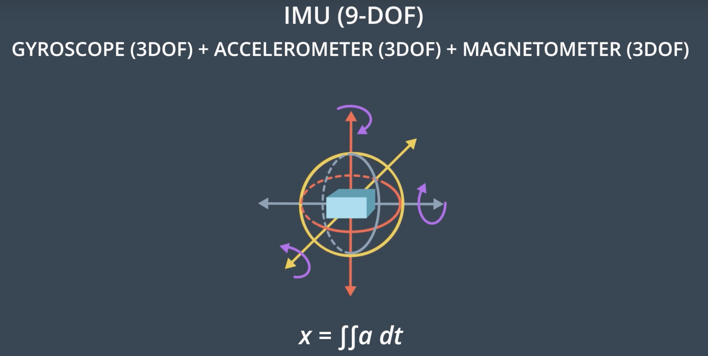
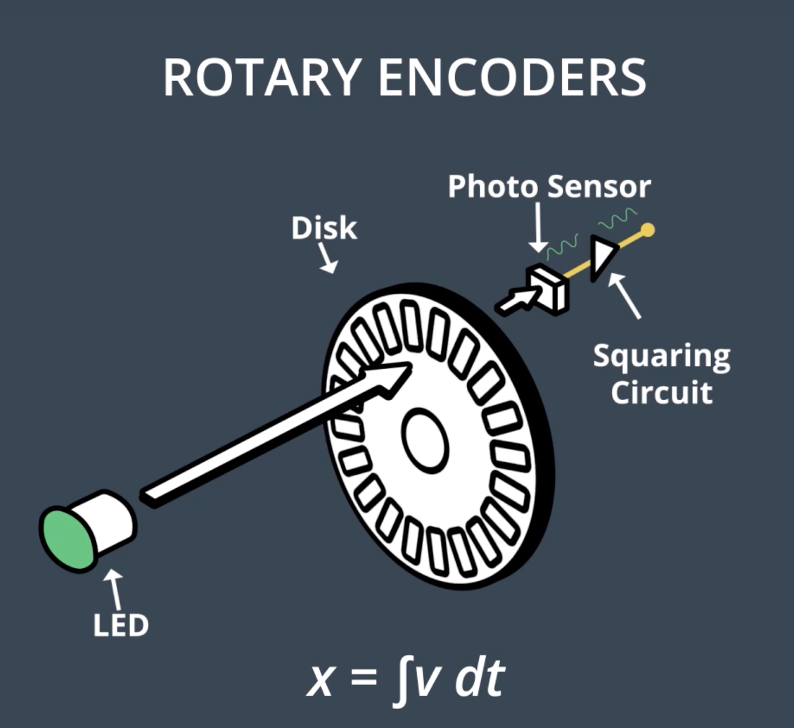
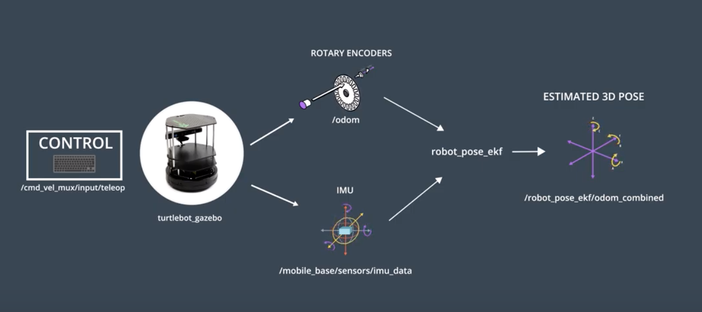
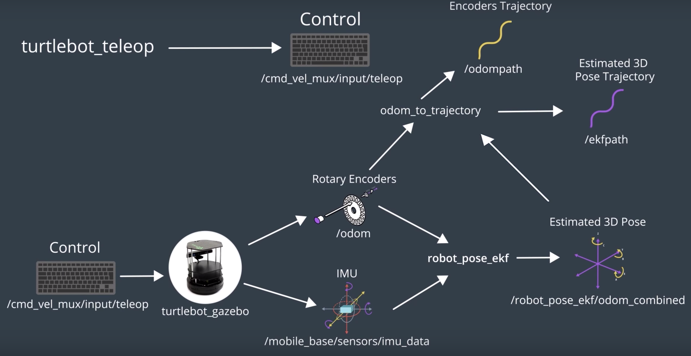

# Introduction

(Access this [link](https://github.com/udacity/RoboND-EKFLab) and grab the lab from GitHub)

Here, we want to use the power of ROS and implement an EKF package. 

In this lab, we've controlled a robot inside a simulator and you collect sensitive information from the robots inertial measurement unit, rotary encoders and vision sensors. 

Then, you'll apply an EKF ROS package to this robot. The EKF ROS package will compare data generated from the robot's on-boars sensors and apply sensor fusion to estimate the robot's pose as it moves around. 

Within this lab, you'll be working with five different ROS packages, each with a different purpose.

- **turtlebot_gazebo:** launches a mobile robot inside a gazebo environment. 
- **robot_pose_ekf:** estimates the position and orientation of the robot.
- **odom_to_trajectory:** opens the odometry values generated over time into a trajectory path.
- **turtlebot_teleop:** lets you drive the robot using keyboard commands.
- **rviz:** lets you visualize the estimated position and orientation of the robot.

While working through this lab, you'll learn how to go through the documentation of ROS packages, identify the subscriber and publisher topics, and then make the necessary changes to integrate the different packages. By the end of this lab, you'll know how to merge all the nodes of the five different packages into a single launch file. Then, you'll be able to launch your project with a single command. 

See the video [here](https://youtu.be/AwjP4ABJjoo).

# Sensor Fusion
Before we dive into the lab, let's see how the sensor fusion process works. 

Inside an environment, a robot will localize itself by collecting data from its different on-board sensors. Each of these sensors has limitations which manifest as noise and error. Nowadays, the **three most common types of mobile robot sensors** are **inertial measurement units**, **rotary encoders**, and **vision sensors**. 

**Inertial Measurement Unit (IMU)** can measure both the linear acceleration and angular velocity. _**To estimate the robot's position, a double integral of the acceleration is calculated**_. However, the IMU is noisy and so a double integration accumulates even more error over time. So, when using IMU, we need to make sure to check the _drift for error parameters_. 

<p align="center">

</p>

**Rotary Encoder** sensors are attached to the robot's actuated wheels and measures the velocity and position of the wheels. _**To estimate the robot's position, the integral of the velocity is calculated**_. But the robot wheel might be stuck between obstacles, or even worse, it might be driven on slippery floors which would lead to inaccurate and noisy measurements. So when using encoders, make sure to check its _resolution_. Encoders with low resolution are usually highly sensitive to slippage. 

<p align="center">

</p>

**Vision Sensor** is often an RGB-D camera. Using an RGB-D camera, the robot can capture images and sense the _**depth towards the obstacles which can be translated to a position**_. But the image quality is usually affected by the light and the camera is usually unable to measure the depths at small distances. So, when using RGB-D camera, make sure to check its _smallest range of operation_. 

So, as we can see, each of these sensors have their own limitations. The IMU and encoder tends to drift where the camera tends to not always work as expected. So, we cannot only rely on one sensor. A **sensor fusion** of at least two of them is usually required. EKF will take all the nosiy measurements, compare them, filter the noise, remove the uncertainties, and provide a good estimate of the robot's pose.

See the video [here](https://youtu.be/Uc_MUK_olJk).

# Catkin Workspace
Before you start downloading the different ROS packages, you need to create a `catkin_ws` to hold them in. If you already have a workspace in your `/home/workspace` directory, it is recommended that you keep a copy of it by renaming it to `catkin_ws_saved`. By doing so, you’ll avoid any possible conflict with pre-installed packages.

### Udacity Workspace
For this lab, you'll get a chance to work in the Udacity Workspace. Thus, move to the next concept, enable GPU, and GO TO DESKTOP.

Now, follow these steps to create your `catkin_ws` and perform a system update:

```bash
$ mkdir -p /home/workspace/catkin_ws/src
$ cd /home/workspace/catkin_ws/src
$ catkin_init_workspace
$ cd ..
$ catkin_make
```

### Perform System Update/Upgrade:

```bash
$ apt-get update
$ apt-get upgrade -y
```

# `turtlebot_gazebo` Package
The `turtlebot` is one of the most robots used by roboticists around the world to perform localization, mapping, and path planning. At this point in time, the `turtlebot` comes in **three different versions**. The **turtlebot One** was introduced in 2010 with an _iRobot Create base_. The **turtlebot Two** was introduced in 2012 with the _Kabuki base_. And the latest, **turtlebot Three** family was introduced in 2017. In this lab, you will deploy a _turtlebot Two_ in a Gazebo environment and then estimate its pose. The _turtlebot Two_ has multiple on-board sensors ranging from rotary encoders to IMU to vision. So, you'll use and EKF package to fuse at least two of these sensors and estimate the robot's pose. 

<p align="center">

</p>

Going through the documentation of the **turtlebot Gazebo package**, we see that not much information is provided. Usually, the lists of subscriber and publisher topics ot ROS package is provided. No worries! You can always clone the package and obtain the lists of subscriber and publisher topics. 

The _turtlebot_ is publishing data from different on-board sensors and subscribing to control commands. The robot can accept control commands through the `cmd_vel_mux/input/teleop` topic. The depth images are being published to a camera depth `/camera/depth/image_raw` topic. Other than that, the encoders position and velocity are being published to the `/odom` topic. Finally, the robot is publishing IMU data to the `mobile_base/sensors/imu_data` topic. In the `turtlebot` package, nodes are subscribing and publishing to other topics but we are only interested in these for now. 

See the video [here](https://youtu.be/huR9KRtmNAM).

### Turtlebot package
Access this [link](http://wiki.ros.org/turtlebot_gazebo) and go through the `turtlebot_gazebo` documentation. After that, follow the instructions listed below to clone the `turtlebot_gazebo` package in the `src` directory of your `catkin_ws` and build it.

While scrolling through these instructions, you will notice that some statements are a bit different than the one presented in the videos. The reason behind that is the different environment used. In the videos, a **Virtual Machine** booted with LUbuntu is used. Here in the description, you are presented with instructions on how to replicate the steps in the **Udacity Workspace**. The only difference between what you see and what is listed is the directory of the `catkin_ws`. In VM, you can store it anywhere you want, preferably in the root `~` directory. Whereas, in the workspace, you will have to store it under `/home/workspace/` so it won't get deleted after a reboot.

**Clone Package**

```bash
$ cd /home/workspace/catkin_ws/src
$ git clone https://github.com/turtlebot/turtlebot_simulator
```

**Install Dependencies**

```bash
$ cd /home/workspace/catkin_ws
$ source devel/setup.bash
$ rosdep -i install turtlebot_gazebo
```

**Build Package**

```bash
$ catkin_make
$ source devel/setup.bash
```

**Launch Nodes**

```bash
$ roslaunch turtlebot_gazebo turtlebot_world.launch
```

**Topics**

```bash
$ rostopic list
Or
$ rosrun rqt_graph rqt_graph
```

# Robot Pose EKF Package
Now that the robot is inside the Gazebo environment, you can apply an EKF and localize it. The **Robot Pose EKF package** applies sensor fusion to the robot's sensor measurement to estimate its pose. Going through the package, we see solid documentation with the launch file, different parameters, and the list of subscriber and publisher topics. Access this [link](http://wiki.ros.org/robot_pose_ekf) and go through the `robot_pose_ekf` documentation. 

After reviewing the package, we can conclude that the **Robot Pose EKF node** is subscribing to three different sensor topics and publishing a filtered pose. The **EKF node** is _subscribing_ to the **encoder's data** through the **`/odom` topic**. It is also _subscribing_ to **IMU data** through the **`/img_data` topic**. Lastly, the node is _subscribing_ to **3D odometry data** through the **`/vo` topic**. Now, EKF is fusing all these three sensor values and and _publishing_ the filtered results in the **`/robot_pos_ekf/odom_combined` topic**. 

<p align="center">

</p>

To interface the **Robot Pose EKF package** with the **`turtlebot` Gazebo package** and estimate the robot's pose, we'll need to rename some topics to match them with the others. At first glance, we see that depth imaging is unique to the _`turtlebot` Gazebo package_, so the EKF node will not be able to subscribe to it. So, let's cross it out in our diagram, as we won't be using it. The same applies to the _3D odometry topic_, which is unique to the _Robot Pose EKF package_. We need to modify the EKF launch file in order to turn off the _3D odometry_. Now, we can see that the _encoders_ perfectly match, since they are not unique to any package and hold the same topic name. The same applies to the _IMU_ data, but be careful here, since the **topic names are not identical**. You should **rename the IMU topic** either into `turtlebot` package topic or in the _EKF package_. 

Afte performing the corresponding changes, you can see how the `turtlebot` nodes are publishing sensor data directly to the _EKF node_. The _EKF node_ will subscribe to the sensor data, remove the uncertainties, and ultimately estimate the robot's 3D pose. 

<p align="center">

</p>

<p align="center">

</p>

To **rename a topic** go to the launch file of the package and then write the statement. Here, this statement is remapping the `/odom` topic to a `pr2_base_odometry` topic: `<remap from="odom" to="pr2_base_odometry/odom" />`. We'll need to delete this statement, since the `odom` topic of both packages are identical. Now, **clone the EKF package** inside the `src` folder of your Catkin workspace (`catkin_ws`), and **edit the launch file** with the following changes: 

- First, **delete the remap statement**, since you want the _encoders_ to publish on the `odom` topic. 
- Then, **turn off 3D odometry pose**, since it's unique to this package. 
- Inside the same launch file, **remap the IMU topic** to match with `turtlebot` one. 

After you complete these steps, build your package, and launch the node.

**Here are the steps to recap:**

1. Delete the remap odom statement
2. Disable the 3D odometry from the launch file
3. Remapp the `/imu_data` topic to `/mobile_base/sensors/imu_data`
4. Build the package and launch the node

See the video [here](https://youtu.be/1XW1VtpztGE).

**Install the package**

```bash
$ cd /home/workspace/catkin_ws/src/
$ git clone https://github.com/udacity/robot_pose_ekf 
```

**Here are the steps to edit and launch the `ros_pose_ekf` launch file**

1. edit `robot_pose_ekf.launch` file:

```bash
<launch>

<node pkg="robot_pose_ekf" type="robot_pose_ekf" name="robot_pose_ekf">
  <param name="output_frame" value="odom_combined"/>
  <param name="base_footprint_frame" value="base_footprint"/>
  <param name="freq" value="30.0"/>
  <param name="sensor_timeout" value="1.0"/>  
  <param name="odom_used" value="true"/>
  <param name="imu_used" value="true"/>
  <param name="vo_used" value="false"/>

  <remap from="imu_data" to="/mobile_base/sensors/imu_data" />    

</node>

</launch>
```

2. Build the package:

```bash
$ cd /home/workspace/catkin_ws
$ catkin_make
$ source devel/setup.bash
```

3. Launch the node:

```bash
$ roslaunch robot_pose_ekf robot_pose_ekf.launch
```

Now, topics from the `robot` and `ekf` nodes should be communicating. To confirm that, run the `rqt graph`. In `rqt graph`, visualize how the topics and nodes are connected. In the `active nodes and topic`, you won’t be able to see the `3D filtered pose` topic since we haven’t yet subscribed to it.

4. Visualize the topics:

```bash
$ rosrun rqt_graph rqt_graph
```

<p align="center">

</p>

# Turtlebot Teleop Package
We're still unable to generate the filtered and unfiltered trajectories since the robot is static. Currently, the trajectories are appending zero values. The robot is performing only a sensor update without any motion update. Therefore, we'll have to drive the robot in the environment as it collects sensory information. With the `turtlebot` package we can publish driving commands to the robot. You'll be able to control the robot with either keyboard or joystick commands. 

Now, let's have a closer look at the properties of this package and its nodes. The **`turtlebot_teleop`** node has no subcribers and only publishes control commands. Now, we need to integrate this package with the turtlebot Gazebo package. As you can see in the picture below, the control topics of both nodes in the two packages perfectly match each other. Here, you can see the final result of integrating the four packages. You can drive the robot with the `turtlebot_teleop` package and generate filtered and unfiltered trajectories.

<p align="center">

</p>

Now, we can launch the node and drive the robot in the Gazebo environment. To do so:

**Clone the Package:**

```bash
$ cd /home/workspace/catkin_ws/src
$ git clone https://github.com/turtlebot/turtlebot
```

**Install the Dependencies:**

```bash
$ cd /home/workspace/catkin_ws
$ source devel/setup.bash
$ rosdep -i install turtlebot_teleop
```

**Build the Package:**

```bash
$ catkin_make
$ source devel/setup.bash
```

**Launch the Nodes:**

```bash
$ roslaunch turtlebot_teleop keyboard_teleop.launch
```

#### Teleop package
Access this [link](http://wiki.ros.org/turtlebot_teleop) and go through the `turtlebot_teleop` documentation.

See the video [here](https://youtu.be/zoM5A9PN6VA).

# Rviz Package
So far, we itengrated four packages, successfully drove the robot, and published filtered and unfiltered trajectories. Now, it's time to subscribe these topics into `Rviz` and visualize the robot's path as we control it. To do so, follow the steps below:

**Launch `rviz`:**

```bash
$ rosrun rviz rviz
```

**Edit the rviz configuration:**

1. Change the **Fixed Frame** to `base_footprint`
2. Change the **Reference Frame** to `odom`
3. Add a `RobotModel`
4. Add a `camera` and select the `/camera/rgb/image_raw` **topic**
5. Add a `/ekfpath` **topic** and change the **display name** to `EKFPath`
6. Add a `/odompath` **topic** and change the **display name** to `OdomPath`
7. Change the `OdomPath` **color** to `red:255;0;0`

**Save the `rviz` configuration:**

Save the rviz configuration in `/home/workspace/catkin_ws/src` as `EKFLab.rviz`

**Now, kill the `rviz` terminal!**

**Relaunch `rviz`:**

```bash
$ rosrun rviz rviz -d /home/workspace/catkin_ws/src/EKFLab.rviz
```

### How to create a `rviz` launch file?

**The `RvizLaunch.launch` file:**

```bash
<launch>
  <!--RVIZ-->
  <node pkg="rviz" type="rviz" name="rviz" args="-d /home/workspace/catkin_ws/src/EKFLab.rviz"/>
</launch>
```

**Launch `Rvizlaunch.launch`:**

```bash
$ cd /home/workspace/catkin_ws/src
$ roslaunch RvizLaunch.launch
```

See the video [here](https://youtu.be/b3_kNyi7KLY).

# Main Launch
Up until now, we worked with five different packages, each with its unqiue launch file. We had to open five different terminals, source the ROS environment multiple times and lancu each file. This is tedious and error prone. It even gets worse in large projects with more than 20 launch files. So, here we want to create a **main package**. Inside the main package, create a launch directory and store a main launch file (`main.launch`). The main launch file will contain the nodes of all the packages we worked with so far. After writing the main launch file, open a terminal and launch it. 

<p align="center">

</p>

**Create a `main package`:**

```bash
$ cd /home/workspace/catkin_ws/src
$ catkin_create_pkg main
```

**Build the package:**

```bash
$ cd /home/workspace/catkin_ws
$ catkin_make
```

**Create and edit the `main.launch` file:**

```bash
$ cd /home/workspace/catkin_ws/src/main
$ mkdir launch
$ cd launch 
$ gedit main.launch
```

Copy the `main.launch` file from [GitHub](https://github.com/udacity/RoboND-EKFLab/blob/master/main/launch/main.launch)

**Launch the `main.launch` file:**

```bash
$ cd /home/workspace/catkin_ws/
$ source devel/setup.bash
$ roslaunch main main.launch
```

See the video [here](https://youtu.be/dh1PlulCxtA).

# Rqt Multiplot
So far, you've controlled the robot and generated the filtered and unfiltered trajectories. Also, you saw how EKF can estimate the pose of the robot. But, we are still unable to quantitatively visualize how close th filter path is from the unfiltered one. 

To do this, you can use the `rqt_plot` which is a great ROS package to graph the values echoed by different topics. Using `rqt_plot`, you can graph the filtered and unfiltered robot poses. But, `rqt_plot` can only generate graphs with respect to time. So, it can be used to plot the `Y` position of our robot vs its `X` position. In this lab, you will use the **`rqt_multiplot`** since you can define both the `Y` and `X` axis when generating the graphs. **`rqt _multiplot`** is not installed by default on your system. See the instructions below to install and run the package.

#### Instructions for _Installing_ and _Running_ the `rqt_multiplot` ROS plugin

**Open a new terminal and install the `rqt_multiplot`:**

```bash
$ apt-get install ros-kinetic-rqt -y
$ apt-get install ros-kinetic-rqt-multiplot -y
$ apt-get install libqwt-dev -y
$ rm -rf ~/.config/ros.org/rqt_gui.ini
```

**Run the rqt_plot package node:**

```bash
$ rosrun rqt_multiplot rqt_multiplot
```

**GitHub documentation:**

Access this [link](https://github.com/ethz-asl/rqt_multiplot_plugin) and go through the `rqt_multiplot` ROS plugin documentation.


- After installing the package, in `rqt_multiplot` select the **Configure plot** settings. Let's give a **title** to our plot as `RobotYPosvsXPos`. 
- Now, define the unfiltered and filtered curve. Start with the _unfiltered curve_. Select **Add a Curve** and then give it a title as `UnfilteredYPosvsXPos`. In **X-Aixs**, select the `/odom` as topic. Since we're plotting Y vs X, select the Y `/odom` topic in the **Y-Axis**. 
- Keep the **color** as red since we chose the red color for the unfiltered trajectory earlier. 
- Now, follow the same steps and define the _filtered curve_. (change the **color** to green).

After that, press **Play** and start driving the robot around. Now, you can quantitatively visualize how close the filtered path is from the unfiltered one and how your EKF is filtering the uncertainties and estimating the pose of the robot. 

Keep playing around with the `rqt_plot` and graph the orientation of the robot.

See the video [here](https://youtu.be/ZEpVMvXC6jQ).


