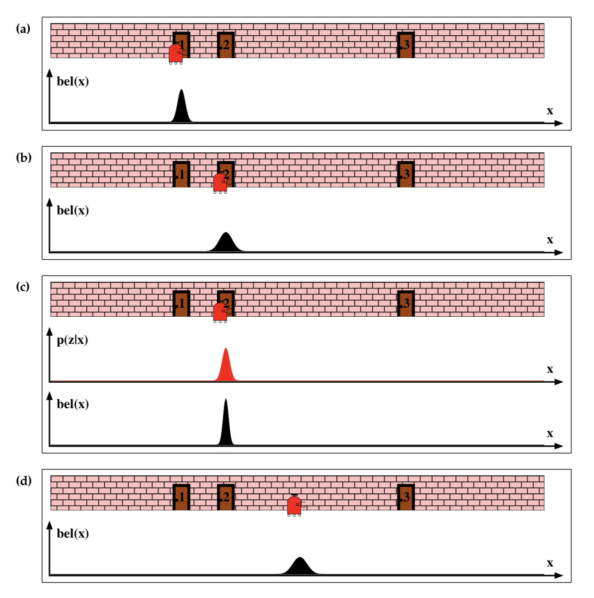

# Introduction
Here, we'll cover another famous localization algorithm. We'll learn about **Monte Carlo Localization (MCL)**. We'll be discussing the advantages of MCL over KF in localizing robots. Then, we'll learn the role of **Particle Filters** in the MCL algorithm. Moreover, we'll learn about **Bayes Filtering** and evaluate the _information state_ or _belief_. After that, we'll learn the MCL pseduo code and then implement it in action to estimate a robot's pose. 

For a good discussion of MCL and its challenges read [this paper](http://robots.stanford.edu/papers/thrun.robust-mcl.pdf) by Sebastian Thrun.

# What is MCL?
As a roboticist, you'll certainly be interested in mapping your home, office, or backyard with the help of your robot. Then, you'd like to operate your robot inside the mapped environment by keeping track of its position and orientation. To do so, you have a wide choice of localization algorithms you could implement ranging from _EKF_, to _Marco_, to _Monte Carlo_, and finally _Grid_. **The MCL algorithm is the most popular localization algorithm in robotics**. So, you might want to choose MCL and deploy it to your robot to keep track of its pose. 

Now, your robot will be navigating inside its known map and collecting sensory information using rangefinder sensors. MCL will use these sensor measurements to keep track of your robot pose. Many scientists refer to MCL as **particle filter localization algorithm**, since it uses particles to localize your robot. 

In robotics, you can think of **a particles as a virtual element that resembles the robot**. **Each particle has a position and orientation and represent a guess of where your robot might be located**. **These particles are re-sampled each time your robot moves and senses its environment**. Keep in mind that MCL is limited to local and global localization problem only. So, you lose sight of your robot if someone hacks into it (**kidnapped robot**). The **Adaptive MCL**, on the other hand, is capable of solving the Kidnapped robot problem.  

# Power of MCL

See the table below for a comparison of MCL and EKF:

<p align="center">

</p>

# Particle Filters
In this particular tow-dimensional map (image below), the robot has no idea where it's located at. Since the initial state is unknow, the robot is trying to estimate its pose by solving a _global localization problem_. 

<p align="center">

</p>

The robot has on-board range sensors which permits it to sense obstacles such as objects, walls, and ultimately determine where it's located. Here, the current robot pose is represented by and `x` and `y` coordinates and the _orientation `θ`_, all with respect to the global coordinate frame. 

<p align="center">

</p>

With the MCL algorithm, particles are initially spread randomly and uniformly through this entire map. These particles do not physically exist and are just shown in simulation. 

<p align="center">

</p>

Every red circle, represents a single particle, and just like the robot, each particle has `x` and `y` coordinate, and orientation `θ`. **So, each of these particles represents the hypothesis of where the robot might be**. In addition to the three-dimensional vector, particles are each assigned a weight. The **weight of a particle** is the difference between the robot's actual pose and the particle's predicted pose. **The importance of a particle depends on its weight**, and the bigger the particle the more accurate it is. Particles with large weights are more likely to survive during a resampling process. After the resampling process, particles with significant weight are more likely to survive whereas the others are more likely to die. 

Finally, after several iterations of MCL algorithm, and after different stages of resampling, particles will converge and estimate the robot's pose. 

See the video [here](https://youtu.be/flFKViJI-18).

# Bayes Filtering
The powerful Monte Carlo localization algorithm estimates the posterior distribution of a robot’s position and orientation based on sensory information. This process is known as a recursive `Bayes filter`.

Using a Bayes filtering approach, roboticists can estimate the **state** of a **dynamical system** from sensor measurements.

In mobile robot localization, it’s important to be acquainted with the following definitions:

- **Dynamical system:** The mobile robot and its environment
- **State:** The robot’s pose, including its position and orientation.
- **Measurements:** Perception data(e.g. laser scanners) and odometry data(e.g. rotary encoders)

The goal of Bayes filtering is to estimate a probability density over the state space conditioned on the measurements. The probability density, or also known as posterior is called the belief and is denoted as:

<p align="center">

</p>

where:

- **`X_t`** is `state` at time `t`
- **`Z_{1...t}`** is `measurement` from time `1` to `t`

### Probability
Given a set of probabilities, **`P(A|B)`** is calculated as follows:

<p align="center">

</p>

### Quiz

<p align="center">

</p>

This robot is located inside of a 1D hallway which has three doors. The robot doesn't know where it is located in this hallway, but it has sensors onboard that can tell it, with some amount of precision, whether it is standing in front of a door, or in front of a wall. The robot also has the ability to move around - with some precision provided by its odometry data. Neither the sensors nor the movement is perfectly accurate, but the robot aims to locate itself in this hallway.

The mobile robot is now moving in the 1D hallway and collecting odometry and perception data. With the odometry data, the robot is keeping track of its current position. Whereas, with the perception data, the robot is identifying the presence of doors.

In this quiz, we are aiming to calculate the state of the robot, given its measurements. This is known by the belief: **`P(X_t|Z)`**!

_**Given**_:

- **P(POS):** The probability of the robot being at the actual position
- **P(DOOR|POS):** The probability of the robot seeing the door given that it’s in the actual position
- **P(DOOR|¬POS):** The probability of the robot seeing the door given that it’s not in the actual position

_**Compute**_:

- **P(POS|DOOR):** The belief or the probability of the robot being at the actual position given that it’s seeing the door.

```cpp
#include <iostream>
using namespace std;

int main() {
	
	//Given P(POS), P(DOOR|POS) and P(DOOR|¬POS)
	double a = 0.0002 ; //P(POS) = 0.002
	double b = 0.6    ; //P(DOOR|POS) = 0.6
	double c = 0.05   ; //P(DOOR|¬POS) = 0.05
	
	//TODO: Compute P(¬POS) and P(POS|DOOR)
	double d = 1-a ;                  //P(¬POS)
	double e =  (b*a)/((a*b)+(d*c)) ; //P(POS|DOOR)
	
	//Print Result
	cout << "P(POS|DOOR)= " <<    e    << endl;
	
	return 0;
}
```

# MCL: The Algorithm
The MCL algorithm is composed of two main sections represented by two for loops. The **first section is the motion and sensor update**, and the **second section is the resampling process**. 

<p align="center">

</p>

Given a map of the environment, the **goal of MCL is to determine the robot's pose represented by the belief**. At each iteration, the algorithm takes the previous belief (`X_{t-1}`), the acutation command (`u_t`), and the sensor measurements (`z_t`) as input. Initially, the belief is obtained by randomly generating `m` particles. 

Then, in the first for loop, the hypothetical state is computed whenever the robot moves. Following, the particles' weight is computed using the latest sensor measurements. Now, motion and measurement are both added to the previous state. 

Moving onto the second section of the MCL where a sampling process happens. Here, the particles with high probability survive and are re-drawn in the next iteration, while the others die. 

Finally, the algorithm outputs the new belief and another cycle of iteration starts implementing the next motion by reading the new sensor measurements. 

# MCL in Action
Let's try to apply MCL to a one-dimensional hallway. In this hallway, the mobile robot can move upward and downward. Also, the robot is capable of collecting all the battery information and sensing the presence of doors. Initially, at time `t=1`, particles are drawn randomly and uniformly over the entire post space. Then, at time `t=2`, the robot senses a door and MCL assigns weights to each particle. The number of particles remains constant, whereas the particles' weights are adjusted. Now, at `t=3`, the robot moves down the hallway and the particle set is shifted. The new set has uniform importance weight and the high number of particles near the three likely places. Moving on, at `t=4`, the robot senses another door and the new measurement assigns non-uniform importance weight to the particle set. Finally, at time `t=5`, the robot keeps moving down the hallway causing a new particle set to generate. 

<p align="center">

</p>

**At time:**

- **t=1**, Particles are drawn randomly and uniformly over the entire pose space.
- **t=2**, Measurement is updated and an importance weight is assigned to each particle.
- **t=3**, Motion is updated and a new particle set with uniform weights and high number of particles around the three most likely places is obtained in resampling.
- **t=4**, Measurement assigns non-uniform weight to the particle set.
- **t=5**, Motion is updated and a new resampling step is about to start.

**EKF**

<p align="center">

</p>

**At time:**

- **t=1**, Initial belief represented by a Gaussian distribution around the first door.
- **t=2**, Motion is updated and the new belief is represented by a shifted Gaussian of increased weight.
- **t=3**, Measurement is updated and the robot is more certain of its location. The new posterior is represented by a Gaussian with a small variance.
- **t=4**, Motion is updated and the uncertainty increases.

See the video [here](https://youtu.be/VgEGrvgty_k).

