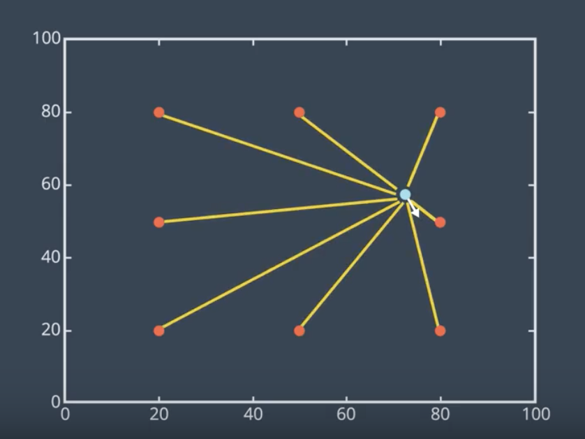
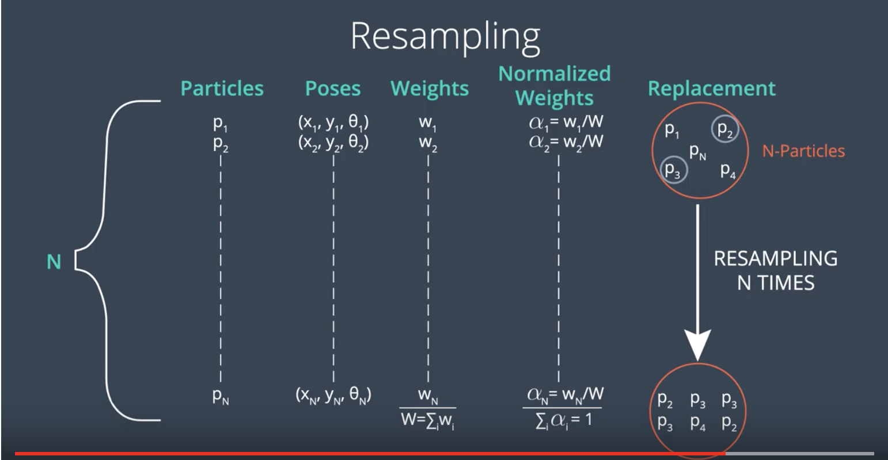
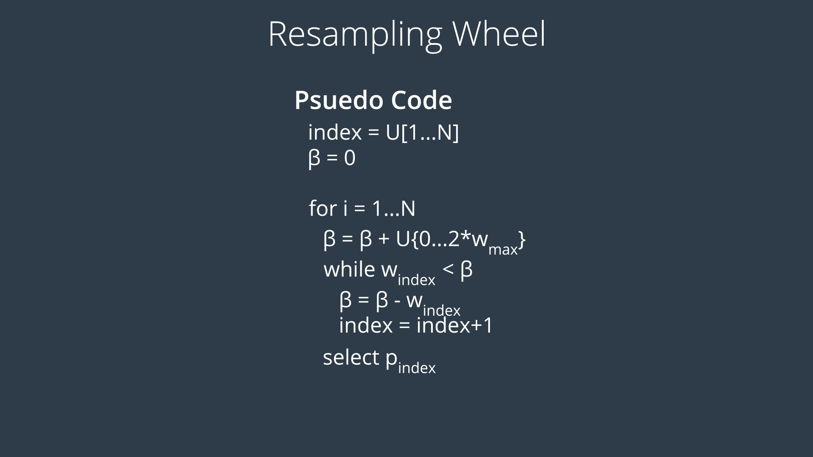
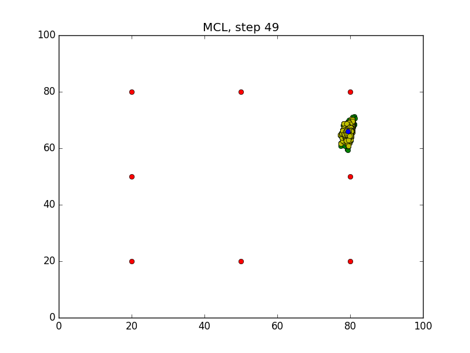

# Introduction
In this lesson, you will code the MCL algorithm in C++. Before we start, let's take a look at the problem in hand. 

Inside the below two-dimensional map, a mobile robot represented by a blue color, lives in a world of size 100x100. This robot can rotate left or right and move forward. The robot can also measure its distance to the eight landmarks, represented in red using RangeFinder sensor. It's important to note that this is a _cyclic_ world which means that the robot can cross the walls and re-appear from the other side.

<p align="center">

</p>

Now, we aim to estimate the robot's pose using particle filtering as it moves and senses the environment. We'll be spreading virtual particles randomly and uniformly throughout the map. In this lesson, you will code the MCL algorithm in sections. 

- First, you will move the robot and measure its distance to the landmarks. 
- Then, you will simulate noise and add it to the measurements. 
- Next, you will randomly and uniformly spread particles throughout the map. 
- You will also evaluate the importance weight of each particle.
- Following, you will resample the particles.
- Then, you will generate an error value to check the overall quality of the solution. 
- This will enable you to identify how close the particles are to the robot. 
- By the end, you'll plot the position of the robot and the particles at each iteration of the MCL algorithm. 

See the video [here](https://youtu.be/Z7tgQBESh7A).

# Robot Class
Below is the robot class with supporting and global functions. You need to instantiate a robot object from this class. The instantiated robot object will have a random position and orientation based on a Gaussian distribution. Also, the forward, turn, and sensing noise parameters will initially be set to zero. To update the position and orientation of the robot, you use the `set` function (line 42). 

To simulate noise, use the `set_noise` function and add random noise values to the robot's pose and measurement. Now, if you want to measure the distance between the robot and each of the eight landmarks, use the `sense` function. With the `move` function, you can rotate the robot and move it forward. Finally, you can request the robot to show you its current pose or the distances toward the eight landmarks ('read_sensors`). There are still some other functions that we'll cover later.

See the video [here](https://youtu.be/BBEVf9csMOo).

**NOTE:** While scrolling through the C++ code, you'll notice some statements and functions commented out. These statements and functions are part of the `matplotlib` python library and are later used to graph and visualize the results. After you finish coding the MCL algorithm, you'll be asked to interface with this function on the Workspace and generate images to visualize the process of the MCL algorithm.

```cpp
//#include "src/matplotlibcpp.h"//Graph Library
#include <iostream>
#include <string>
#include <math.h>
#include <vector>
#include <stdexcept> // throw errors
#include <random> //C++ 11 Random Numbers

//namespace plt = matplotlibcpp;
using namespace std;

// Landmarks
double landmarks[8][2] = { { 20.0, 20.0 }, { 20.0, 80.0 }, { 20.0, 50.0 },
    { 50.0, 20.0 }, { 50.0, 80.0 }, { 80.0, 80.0 },
    { 80.0, 20.0 }, { 80.0, 50.0 } };

// Map size in meters
double world_size = 100.0;
 
// Random Generators
random_device rd;
mt19937 gen(rd());

// Global Functions
double mod(double first_term, double second_term);
double gen_real_random();

class Robot {
public:
    Robot()
    {
        // Constructor
        x = gen_real_random() * world_size; // robot's x coordinate
        y = gen_real_random() * world_size; // robot's y coordinate
        orient = gen_real_random() * 2.0 * M_PI; // robot's orientation

        forward_noise = 0.0; //noise of the forward movement
        turn_noise = 0.0; //noise of the turn
        sense_noise = 0.0; //noise of the sensing
    }

    void set(double new_x, double new_y, double new_orient)
    {
        // Set robot new position and orientation
        if (new_x < 0 || new_x >= world_size)
            throw std::invalid_argument("X coordinate out of bound");
        if (new_y < 0 || new_y >= world_size)
            throw std::invalid_argument("Y coordinate out of bound");
        if (new_orient < 0 || new_orient >= 2 * M_PI)
            throw std::invalid_argument("Orientation must be in [0..2pi]");

        x = new_x;
        y = new_y;
        orient = new_orient;
    }

    void set_noise(double new_forward_noise, double new_turn_noise, double new_sense_noise)
    {
        // Simulate noise, often useful in particle filters
        forward_noise = new_forward_noise;
        turn_noise = new_turn_noise;
        sense_noise = new_sense_noise;
    }

    vector<double> sense()
    {
        // Measure the distances from the robot toward the landmarks
        vector<double> z(sizeof(landmarks) / sizeof(landmarks[0]));
        double dist;

        for (int i = 0; i < sizeof(landmarks) / sizeof(landmarks[0]); i++) {
            dist = sqrt(pow((x - landmarks[i][0]), 2) + pow((y - landmarks[i][1]), 2));
            dist += gen_gauss_random(0.0, sense_noise);
            z[i] = dist;
        }
        return z;
    }

    Robot move(double turn, double forward)
    {
        if (forward < 0)
            throw std::invalid_argument("Robot cannot move backward");

        // turn, and add randomness to the turning command
        orient = orient + turn + gen_gauss_random(0.0, turn_noise);
        orient = mod(orient, 2 * M_PI);

        // move, and add randomness to the motion command
        double dist = forward + gen_gauss_random(0.0, forward_noise);
        x = x + (cos(orient) * dist);
        y = y + (sin(orient) * dist);

        // cyclic truncate
        x = mod(x, world_size);
        y = mod(y, world_size);

        // set particle
        Robot res;
        res.set(x, y, orient);
        res.set_noise(forward_noise, turn_noise, sense_noise);

        return res;
    }

    string show_pose()
    {
        // Returns the robot current position and orientation in a string format
        return "[x=" + to_string(x) + " y=" + to_string(y) + " orient=" + to_string(orient) + "]";
    }

    string read_sensors()
    {
        // Returns all the distances from the robot toward the landmarks
        vector<double> z = sense();
        string readings = "[";
        for (int i = 0; i < z.size(); i++) {
            readings += to_string(z[i]) + " ";
        }
        readings[readings.size() - 1] = ']';

        return readings;
    }

    double measurement_prob(vector<double> measurement)
    {
        // Calculates how likely a measurement should be
        double prob = 1.0;
        double dist;

        for (int i = 0; i < sizeof(landmarks) / sizeof(landmarks[0]); i++) {
            dist = sqrt(pow((x - landmarks[i][0]), 2) + pow((y - landmarks[i][1]), 2));
            prob *= gaussian(dist, sense_noise, measurement[i]);
        }

        return prob;
    }

    double x, y, orient; //robot poses
    double forward_noise, turn_noise, sense_noise; //robot noises

private:
    double gen_gauss_random(double mean, double variance)
    {
        // Gaussian random
        normal_distribution<double> gauss_dist(mean, variance);
        return gauss_dist(gen);
    }

    double gaussian(double mu, double sigma, double x)
    {
        // Probability of x for 1-dim Gaussian with mean mu and var. sigma
        return exp(-(pow((mu - x), 2)) / (pow(sigma, 2)) / 2.0) / sqrt(2.0 * M_PI * (pow(sigma, 2)));
    }
};

// Functions
double gen_real_random()
{
    // Generate real random between 0 and 1
    uniform_real_distribution<double> real_dist(0.0, 1.0); //Real
    return real_dist(gen);
}

double mod(double first_term, double second_term)
{
    // Compute the modulus
    return first_term - (second_term)*floor(first_term / (second_term));
}

double evaluation(Robot r, Robot p[], int n)
{
    //Calculate the mean error of the system
    double sum = 0.0;
    for (int i = 0; i < n; i++) {
        //the second part is because of world's cyclicity
        double dx = mod((p[i].x - r.x + (world_size / 2.0)), world_size) - (world_size / 2.0);
        double dy = mod((p[i].y - r.y + (world_size / 2.0)), world_size) - (world_size / 2.0);
        double err = sqrt(pow(dx, 2) + pow(dy, 2));
        sum += err;
    }
    return sum / n;
}
double max(double arr[], int n)
{
    // Identify the max element in an array
    double max = 0;
    for (int i = 0; i < n; i++) {
        if (arr[i] > max)
            max = arr[i];
    }
    return max;
}
/*
void visualization(int n, Robot robot, int step, Robot p[], Robot pr[])
{
	//Draw the robot, landmarks, particles and resampled particles on a graph
	
    //Graph Format
    plt::title("MCL, step " + to_string(step));
    plt::xlim(0, 100);
    plt::ylim(0, 100);

    //Draw particles in green
    for (int i = 0; i < n; i++) {
        plt::plot({ p[i].x }, { p[i].y }, "go");
    }

    //Draw resampled particles in yellow
    for (int i = 0; i < n; i++) {
        plt::plot({ pr[i].x }, { pr[i].y }, "yo");
    }

    //Draw landmarks in red
    for (int i = 0; i < sizeof(landmarks) / sizeof(landmarks[0]); i++) {
        plt::plot({ landmarks[i][0] }, { landmarks[i][1] }, "ro");
    }
    
    //Draw robot position in blue
    plt::plot({ robot.x }, { robot.y }, "bo");

	//Save the image and close the plot
    plt::save("./Images/Step" + to_string(step) + ".png");
    plt::clf();
}
*/

//####   DON'T MODIFY ANYTHING ABOVE HERE! ENTER CODE BELOW ####
int main()
{
    // TODO: Print "I am ready for coding the MCL!"

    return 0;
}
```

# First Interaction
Now that you have reviewed the Robot class, it's time to interact with it. In this section you'll learn how to instantiate a robot object from the Robot class. 

- This robot will be initialized with random position and orientation. 
- Then, you'll learn how to change the robot initial position and orientation. 
- You maybe curious to know where the robot is located, so you'll learn how to print its pose. 
- Following, you'll learn how to rotate the robot and move it forward into 2D map.
- Finally, you'll learn how to print the distances from the robot toward each of the eight landmarks. 

<p align="center">

</p>

See the instructions in the C++ code below. 

[video](https://youtu.be/-GxyQuh5LJ8)

```cpp
//#include "src/matplotlibcpp.h"//Graph Library
#include <iostream>
#include <string>
#include <math.h>
#include <vector>
#include <stdexcept> // throw errors
#include <random> //C++ 11 Random Numbers

//namespace plt = matplotlibcpp;
using namespace std;

// Landmarks
double landmarks[8][2] = { { 20.0, 20.0 }, { 20.0, 80.0 }, { 20.0, 50.0 },
    { 50.0, 20.0 }, { 50.0, 80.0 }, { 80.0, 80.0 },
    { 80.0, 20.0 }, { 80.0, 50.0 } };

// Map size in meters
double world_size = 100.0;

// Random Generators
random_device rd;
mt19937 gen(rd());

// Global Functions
double mod(double first_term, double second_term);
double gen_real_random();

class Robot {
public:
    Robot()
    {
        // Constructor
        x = gen_real_random() * world_size; // robot's x coordinate
        y = gen_real_random() * world_size; // robot's y coordinate
        orient = gen_real_random() * 2.0 * M_PI; // robot's orientation

        forward_noise = 0.0; //noise of the forward movement
        turn_noise = 0.0; //noise of the turn
        sense_noise = 0.0; //noise of the sensing
    }

    void set(double new_x, double new_y, double new_orient)
    {
        // Set robot new position and orientation
        if (new_x < 0 || new_x >= world_size)
            throw std::invalid_argument("X coordinate out of bound");
        if (new_y < 0 || new_y >= world_size)
            throw std::invalid_argument("Y coordinate out of bound");
        if (new_orient < 0 || new_orient >= 2 * M_PI)
            throw std::invalid_argument("Orientation must be in [0..2pi]");

        x = new_x;
        y = new_y;
        orient = new_orient;
    }

    void set_noise(double new_forward_noise, double new_turn_noise, double new_sense_noise)
    {
        // Simulate noise, often useful in particle filters
        forward_noise = new_forward_noise;
        turn_noise = new_turn_noise;
        sense_noise = new_sense_noise;
    }

    vector<double> sense()
    {
        // Measure the distances from the robot toward the landmarks
        vector<double> z(sizeof(landmarks) / sizeof(landmarks[0]));
        double dist;

        for (int i = 0; i < sizeof(landmarks) / sizeof(landmarks[0]); i++) {
            dist = sqrt(pow((x - landmarks[i][0]), 2) + pow((y - landmarks[i][1]), 2));
            dist += gen_gauss_random(0.0, sense_noise);
            z[i] = dist;
        }
        return z;
    }

    Robot move(double turn, double forward)
    {
        if (forward < 0)
            throw std::invalid_argument("Robot cannot move backward");

        // turn, and add randomness to the turning command
        orient = orient + turn + gen_gauss_random(0.0, turn_noise);
        orient = mod(orient, 2 * M_PI);

        // move, and add randomness to the motion command
        double dist = forward + gen_gauss_random(0.0, forward_noise);
        x = x + (cos(orient) * dist);
        y = y + (sin(orient) * dist);

        // cyclic truncate
        x = mod(x, world_size);
        y = mod(y, world_size);

        // set particle
        Robot res;
        res.set(x, y, orient);
        res.set_noise(forward_noise, turn_noise, sense_noise);

        return res;
    }

    string show_pose()
    {
        // Returns the robot current position and orientation in a string format
        return "[x=" + to_string(x) + " y=" + to_string(y) + " orient=" + to_string(orient) + "]";
    }

    string read_sensors()
    {
        // Returns all the distances from the robot toward the landmarks
        vector<double> z = sense();
        string readings = "[";
        for (int i = 0; i < z.size(); i++) {
            readings += to_string(z[i]) + " ";
        }
        readings[readings.size() - 1] = ']';

        return readings;
    }

    double measurement_prob(vector<double> measurement)
    {
        // Calculates how likely a measurement should be
        double prob = 1.0;
        double dist;

        for (int i = 0; i < sizeof(landmarks) / sizeof(landmarks[0]); i++) {
            dist = sqrt(pow((x - landmarks[i][0]), 2) + pow((y - landmarks[i][1]), 2));
            prob *= gaussian(dist, sense_noise, measurement[i]);
        }

        return prob;
    }

    double x, y, orient; //robot poses
    double forward_noise, turn_noise, sense_noise; //robot noises

private:
    double gen_gauss_random(double mean, double variance)
    {
        // Gaussian random
        normal_distribution<double> gauss_dist(mean, variance);
        return gauss_dist(gen);
    }

    double gaussian(double mu, double sigma, double x)
    {
        // Probability of x for 1-dim Gaussian with mean mu and var. sigma
        return exp(-(pow((mu - x), 2)) / (pow(sigma, 2)) / 2.0) / sqrt(2.0 * M_PI * (pow(sigma, 2)));
    }
};

// Functions
double gen_real_random()
{
    // Generate real random between 0 and 1
    uniform_real_distribution<double> real_dist(0.0, 1.0); //Real
    return real_dist(gen);
}

double mod(double first_term, double second_term)
{
    // Compute the modulus
    return first_term - (second_term)*floor(first_term / (second_term));
}

double evaluation(Robot r, Robot p[], int n)
{
    //Calculate the mean error of the system
    double sum = 0.0;
    for (int i = 0; i < n; i++) {
        //the second part is because of world's cyclicity
        double dx = mod((p[i].x - r.x + (world_size / 2.0)), world_size) - (world_size / 2.0);
        double dy = mod((p[i].y - r.y + (world_size / 2.0)), world_size) - (world_size / 2.0);
        double err = sqrt(pow(dx, 2) + pow(dy, 2));
        sum += err;
    }
    return sum / n;
}
double max(double arr[], int n)
{
    // Identify the max element in an array
    double max = 0;
    for (int i = 0; i < n; i++) {
        if (arr[i] > max)
            max = arr[i];
    }
    return max;
}
/*
void visualization(int n, Robot robot, int step, Robot p[], Robot pr[])
{
	//Draw the robot, landmarks, particles and resampled particles on a graph
	
    //Graph Format
    plt::title("MCL, step " + to_string(step));
    plt::xlim(0, 100);
    plt::ylim(0, 100);

    //Draw particles in green
    for (int i = 0; i < n; i++) {
        plt::plot({ p[i].x }, { p[i].y }, "go");
    }

    //Draw resampled particles in yellow
    for (int i = 0; i < n; i++) {
        plt::plot({ pr[i].x }, { pr[i].y }, "yo");
    }

    //Draw landmarks in red
    for (int i = 0; i < sizeof(landmarks) / sizeof(landmarks[0]); i++) {
        plt::plot({ landmarks[i][0] }, { landmarks[i][1] }, "ro");
    }
    
    //Draw robot position in blue
    plt::plot({ robot.x }, { robot.y }, "bo");

	//Save the image and close the plot
    plt::save("./Images/Step" + to_string(step) + ".png");
    plt::clf();
}
*/

//####   DON'T MODIFY ANYTHING ABOVE HERE! ENTER CODE BELOW ####
int main()
{
    // Instantiating a robot object from the Robot class
    Robot myrobot;

    // Set robot new position to x=10.0, y=10.0 and orientation=0
    // Fill in the position and orientation values in myrobot.set() function
    myrobot.set(10.0, 10.0, 0);

    // Printing out the new robot position and orientation
    cout << myrobot.show_pose() << endl;

    // Rotate the robot by PI/2.0 and then move him forward by 10.0
    // Use M_PI for the pi value
    myrobot.move(M_PI / 2.0, 10.0);

    // Print out the new robot position and orientation
    cout << myrobot.show_pose() << endl;

    // Printing the distance from the robot toward the eight landmarks
    cout << myrobot.read_sensors() << endl;

    return 0;
}
```

# Motion and Sensoring
In the previous lesson, you’ve learned how to interact with the Robot class. Now, you’ll be asked to  **instantiate**  a robot object, simulate  **motion**  update and  **sensor**  update similar to what you’ve learned in the first quiz.

Scroll down to the  `main`  function and complete the following tasks:

- Instantiate a robot object from the Robot class
- Set robot new position to `x=30.0` and `y=50.0` and orietation `pi/2`.
- Turn clockwise by `pi/2` and move by 15 meters
- Print the distance from the robot toward the eight landmarks
- Turn clockwise by `pi/2` and move by 10 meters
- Print the distance from the robot toward the eight landmarks

```cpp
//#include "src/matplotlibcpp.h"//Graph Library
#include <iostream>
#include <string>
#include <math.h>
#include <vector>
#include <stdexcept> // throw errors
#include <random> //C++ 11 Random Numbers

//namespace plt = matplotlibcpp;
using namespace std;

// Landmarks
double landmarks[8][2] = { { 20.0, 20.0 }, { 20.0, 80.0 }, { 20.0, 50.0 },
    { 50.0, 20.0 }, { 50.0, 80.0 }, { 80.0, 80.0 },
    { 80.0, 20.0 }, { 80.0, 50.0 } };

// Map size in meters
double world_size = 100.0;

// Random Generators
random_device rd;
mt19937 gen(rd());

// Global Functions
double mod(double first_term, double second_term);
double gen_real_random();

class Robot {
public:
    Robot()
    {
        // Constructor
        x = gen_real_random() * world_size; // robot's x coordinate
        y = gen_real_random() * world_size; // robot's y coordinate
        orient = gen_real_random() * 2.0 * M_PI; // robot's orientation

        forward_noise = 0.0; //noise of the forward movement
        turn_noise = 0.0; //noise of the turn
        sense_noise = 0.0; //noise of the sensing
    }

    void set(double new_x, double new_y, double new_orient)
    {
        // Set robot new position and orientation
        if (new_x < 0 || new_x >= world_size)
            throw std::invalid_argument("X coordinate out of bound");
        if (new_y < 0 || new_y >= world_size)
            throw std::invalid_argument("Y coordinate out of bound");
        if (new_orient < 0 || new_orient >= 2 * M_PI)
            throw std::invalid_argument("Orientation must be in [0..2pi]");

        x = new_x;
        y = new_y;
        orient = new_orient;
    }

    void set_noise(double new_forward_noise, double new_turn_noise, double new_sense_noise)
    {
        // Simulate noise, often useful in particle filters
        forward_noise = new_forward_noise;
        turn_noise = new_turn_noise;
        sense_noise = new_sense_noise;
    }

    vector<double> sense()
    {
        // Measure the distances from the robot toward the landmarks
        vector<double> z(sizeof(landmarks) / sizeof(landmarks[0]));
        double dist;

        for (int i = 0; i < sizeof(landmarks) / sizeof(landmarks[0]); i++) {
            dist = sqrt(pow((x - landmarks[i][0]), 2) + pow((y - landmarks[i][1]), 2));
            dist += gen_gauss_random(0.0, sense_noise);
            z[i] = dist;
        }
        return z;
    }

    Robot move(double turn, double forward)
    {
        if (forward < 0)
            throw std::invalid_argument("Robot cannot move backward");

        // turn, and add randomness to the turning command
        orient = orient + turn + gen_gauss_random(0.0, turn_noise);
        orient = mod(orient, 2 * M_PI);

        // move, and add randomness to the motion command
        double dist = forward + gen_gauss_random(0.0, forward_noise);
        x = x + (cos(orient) * dist);
        y = y + (sin(orient) * dist);

        // cyclic truncate
        x = mod(x, world_size);
        y = mod(y, world_size);

        // set particle
        Robot res;
        res.set(x, y, orient);
        res.set_noise(forward_noise, turn_noise, sense_noise);

        return res;
    }

    string show_pose()
    {
        // Returns the robot current position and orientation in a string format
        return "[x=" + to_string(x) + " y=" + to_string(y) + " orient=" + to_string(orient) + "]";
    }

    string read_sensors()
    {
        // Returns all the distances from the robot toward the landmarks
        vector<double> z = sense();
        string readings = "[";
        for (int i = 0; i < z.size(); i++) {
            readings += to_string(z[i]) + " ";
        }
        readings[readings.size() - 1] = ']';

        return readings;
    }

    double measurement_prob(vector<double> measurement)
    {
        // Calculates how likely a measurement should be
        double prob = 1.0;
        double dist;

        for (int i = 0; i < sizeof(landmarks) / sizeof(landmarks[0]); i++) {
            dist = sqrt(pow((x - landmarks[i][0]), 2) + pow((y - landmarks[i][1]), 2));
            prob *= gaussian(dist, sense_noise, measurement[i]);
        }

        return prob;
    }

    double x, y, orient; //robot poses
    double forward_noise, turn_noise, sense_noise; //robot noises

private:
    double gen_gauss_random(double mean, double variance)
    {
        // Gaussian random
        normal_distribution<double> gauss_dist(mean, variance);
        return gauss_dist(gen);
    }

    double gaussian(double mu, double sigma, double x)
    {
        // Probability of x for 1-dim Gaussian with mean mu and var. sigma
        return exp(-(pow((mu - x), 2)) / (pow(sigma, 2)) / 2.0) / sqrt(2.0 * M_PI * (pow(sigma, 2)));
    }
};

// Functions
double gen_real_random()
{
    // Generate real random between 0 and 1
    uniform_real_distribution<double> real_dist(0.0, 1.0); //Real
    return real_dist(gen);
}

double mod(double first_term, double second_term)
{
    // Compute the modulus
    return first_term - (second_term)*floor(first_term / (second_term));
}

double evaluation(Robot r, Robot p[], int n)
{
    //Calculate the mean error of the system
    double sum = 0.0;
    for (int i = 0; i < n; i++) {
        //the second part is because of world's cyclicity
        double dx = mod((p[i].x - r.x + (world_size / 2.0)), world_size) - (world_size / 2.0);
        double dy = mod((p[i].y - r.y + (world_size / 2.0)), world_size) - (world_size / 2.0);
        double err = sqrt(pow(dx, 2) + pow(dy, 2));
        sum += err;
    }
    return sum / n;
}
double max(double arr[], int n)
{
    // Identify the max element in an array
    double max = 0;
    for (int i = 0; i < n; i++) {
        if (arr[i] > max)
            max = arr[i];
    }
    return max;
}
/*
void visualization(int n, Robot robot, int step, Robot p[], Robot pr[])
{
	//Draw the robot, landmarks, particles and resampled particles on a graph
	
    //Graph Format
    plt::title("MCL, step " + to_string(step));
    plt::xlim(0, 100);
    plt::ylim(0, 100);

    //Draw particles in green
    for (int i = 0; i < n; i++) {
        plt::plot({ p[i].x }, { p[i].y }, "go");
    }

    //Draw resampled particles in yellow
    for (int i = 0; i < n; i++) {
        plt::plot({ pr[i].x }, { pr[i].y }, "yo");
    }

    //Draw landmarks in red
    for (int i = 0; i < sizeof(landmarks) / sizeof(landmarks[0]); i++) {
        plt::plot({ landmarks[i][0] }, { landmarks[i][1] }, "ro");
    }
    
    //Draw robot position in blue
    plt::plot({ robot.x }, { robot.y }, "bo");

	//Save the image and close the plot
    plt::save("./Images/Step" + to_string(step) + ".png");
    plt::clf();
}
*/

//####   DON'T MODIFY ANYTHING ABOVE HERE! ENTER CODE BELOW ####
int main()
{
    // Instantiate a robot object from the Robot class
    Robot myrobot;

    // Set robot new position to x=30.0, y=50.0 and orientation=PI/2.0
    myrobot.set(30.0, 50.0, M_PI / 2.0);

    // Turn clockwise by PI/2.0 and move by 15.0 meters
    myrobot.move(-M_PI / 2.0, 15.0);

    // Print the distance from the robot toward the eight landmarks
    cout << myrobot.read_sensors() << endl;

    // Turn clockwise by PI/2.0 and move by 10.0 meters
    myrobot.move(-M_PI / 2.0, 10.0);

    // Print the distance from the robot toward the eight landmarks
    cout << myrobot.read_sensors() << endl;

    return 0;
}
```

# Noise
Almost all real-world sensors are noisy and require filtering. Here, we'll alter the robot's pose and measurement values to noisy ones. 

You’ll now alter the robot’s  **pose**  and  **measurement**  values to  **noisy**  ones. Add the following noise values:

-   `Forward Noise`=5.0
-   `Turn Noise`=0.1
-   `Sense Noise`=5.0.

Scroll down to the main function and follow the instructions.

```cpp
//#include "src/matplotlibcpp.h"//Graph Library
#include <iostream>
#include <string>
#include <math.h>
#include <vector>
#include <stdexcept> // throw errors
#include <random> //C++ 11 Random Numbers

//namespace plt = matplotlibcpp;
using namespace std;

// Landmarks
double landmarks[8][2] = { { 20.0, 20.0 }, { 20.0, 80.0 }, { 20.0, 50.0 },
    { 50.0, 20.0 }, { 50.0, 80.0 }, { 80.0, 80.0 },
    { 80.0, 20.0 }, { 80.0, 50.0 } };

// Map size in meters
double world_size = 100.0;

// Random Generators
random_device rd;
mt19937 gen(rd());

// Global Functions
double mod(double first_term, double second_term);
double gen_real_random();

class Robot {
public:
    Robot()
    {
        // Constructor
        x = gen_real_random() * world_size; // robot's x coordinate
        y = gen_real_random() * world_size; // robot's y coordinate
        orient = gen_real_random() * 2.0 * M_PI; // robot's orientation

        forward_noise = 0.0; //noise of the forward movement
        turn_noise = 0.0; //noise of the turn
        sense_noise = 0.0; //noise of the sensing
    }

    void set(double new_x, double new_y, double new_orient)
    {
        // Set robot new position and orientation
        if (new_x < 0 || new_x >= world_size)
            throw std::invalid_argument("X coordinate out of bound");
        if (new_y < 0 || new_y >= world_size)
            throw std::invalid_argument("Y coordinate out of bound");
        if (new_orient < 0 || new_orient >= 2 * M_PI)
            throw std::invalid_argument("Orientation must be in [0..2pi]");

        x = new_x;
        y = new_y;
        orient = new_orient;
    }

    void set_noise(double new_forward_noise, double new_turn_noise, double new_sense_noise)
    {
        // Simulate noise, often useful in particle filters
        forward_noise = new_forward_noise;
        turn_noise = new_turn_noise;
        sense_noise = new_sense_noise;
    }

    vector<double> sense()
    {
        // Measure the distances from the robot toward the landmarks
        vector<double> z(sizeof(landmarks) / sizeof(landmarks[0]));
        double dist;

        for (int i = 0; i < sizeof(landmarks) / sizeof(landmarks[0]); i++) {
            dist = sqrt(pow((x - landmarks[i][0]), 2) + pow((y - landmarks[i][1]), 2));
            dist += gen_gauss_random(0.0, sense_noise);
            z[i] = dist;
        }
        return z;
    }

    Robot move(double turn, double forward)
    {
        if (forward < 0)
            throw std::invalid_argument("Robot cannot move backward");

        // turn, and add randomness to the turning command
        orient = orient + turn + gen_gauss_random(0.0, turn_noise);
        orient = mod(orient, 2 * M_PI);

        // move, and add randomness to the motion command
        double dist = forward + gen_gauss_random(0.0, forward_noise);
        x = x + (cos(orient) * dist);
        y = y + (sin(orient) * dist);

        // cyclic truncate
        x = mod(x, world_size);
        y = mod(y, world_size);

        // set particle
        Robot res;
        res.set(x, y, orient);
        res.set_noise(forward_noise, turn_noise, sense_noise);

        return res;
    }

    string show_pose()
    {
        // Returns the robot current position and orientation in a string format
        return "[x=" + to_string(x) + " y=" + to_string(y) + " orient=" + to_string(orient) + "]";
    }

    string read_sensors()
    {
        // Returns all the distances from the robot toward the landmarks
        vector<double> z = sense();
        string readings = "[";
        for (int i = 0; i < z.size(); i++) {
            readings += to_string(z[i]) + " ";
        }
        readings[readings.size() - 1] = ']';

        return readings;
    }

    double measurement_prob(vector<double> measurement)
    {
        // Calculates how likely a measurement should be
        double prob = 1.0;
        double dist;

        for (int i = 0; i < sizeof(landmarks) / sizeof(landmarks[0]); i++) {
            dist = sqrt(pow((x - landmarks[i][0]), 2) + pow((y - landmarks[i][1]), 2));
            prob *= gaussian(dist, sense_noise, measurement[i]);
        }

        return prob;
    }

    double x, y, orient; //robot poses
    double forward_noise, turn_noise, sense_noise; //robot noises

private:
    double gen_gauss_random(double mean, double variance)
    {
        // Gaussian random
        normal_distribution<double> gauss_dist(mean, variance);
        return gauss_dist(gen);
    }

    double gaussian(double mu, double sigma, double x)
    {
        // Probability of x for 1-dim Gaussian with mean mu and var. sigma
        return exp(-(pow((mu - x), 2)) / (pow(sigma, 2)) / 2.0) / sqrt(2.0 * M_PI * (pow(sigma, 2)));
    }
};

// Functions
double gen_real_random()
{
    // Generate real random between 0 and 1
    uniform_real_distribution<double> real_dist(0.0, 1.0); //Real
    return real_dist(gen);
}

double mod(double first_term, double second_term)
{
    // Compute the modulus
    return first_term - (second_term)*floor(first_term / (second_term));
}

double evaluation(Robot r, Robot p[], int n)
{
    //Calculate the mean error of the system
    double sum = 0.0;
    for (int i = 0; i < n; i++) {
        //the second part is because of world's cyclicity
        double dx = mod((p[i].x - r.x + (world_size / 2.0)), world_size) - (world_size / 2.0);
        double dy = mod((p[i].y - r.y + (world_size / 2.0)), world_size) - (world_size / 2.0);
        double err = sqrt(pow(dx, 2) + pow(dy, 2));
        sum += err;
    }
    return sum / n;
}
double max(double arr[], int n)
{
    // Identify the max element in an array
    double max = 0;
    for (int i = 0; i < n; i++) {
        if (arr[i] > max)
            max = arr[i];
    }
    return max;
}
/*
void visualization(int n, Robot robot, int step, Robot p[], Robot pr[])
{
	//Draw the robot, landmarks, particles and resampled particles on a graph
	
    //Graph Format
    plt::title("MCL, step " + to_string(step));
    plt::xlim(0, 100);
    plt::ylim(0, 100);

    //Draw particles in green
    for (int i = 0; i < n; i++) {
        plt::plot({ p[i].x }, { p[i].y }, "go");
    }

    //Draw resampled particles in yellow
    for (int i = 0; i < n; i++) {
        plt::plot({ pr[i].x }, { pr[i].y }, "yo");
    }

    //Draw landmarks in red
    for (int i = 0; i < sizeof(landmarks) / sizeof(landmarks[0]); i++) {
        plt::plot({ landmarks[i][0] }, { landmarks[i][1] }, "ro");
    }
    
    //Draw robot position in blue
    plt::plot({ robot.x }, { robot.y }, "bo");

	//Save the image and close the plot
    plt::save("./Images/Step" + to_string(step) + ".png");
    plt::clf();
}
*/

//####   DON'T MODIFY ANYTHING ABOVE HERE! ENTER CODE BELOW ####
int main()
{
    Robot myrobot;
    // Simulate Noise
    // Forward Noise=5.0, Turn Noise=0.1,Sense Noise=5.0
    myrobot.set_noise(5.0, 0.1, 5.0);
    myrobot.set(30.0, 50.0, M_PI / 2.0);
    myrobot.move(-M_PI / 2.0, 15.0);
    cout << myrobot.read_sensors() << endl;
    myrobot.move(-M_PI / 2.0, 10.0);
    cout << myrobot.read_sensors() << endl;

    return 0;
}
```

# Particle Filters
Now, it's time to code the particle filter, which is the most essential step in the MCL algorithm. As we saw previously, the MCL algorithm consists of two main sections.

In the first part of the first section, particles are generated and motion is assigned to each of them. In this section, we'll be coding this part by generating the particles and simulating motion to each one of them. 

First, we generate the particles. Inside the 2D map of size 100x100 meters, we randomly and uniformly spread 1000 particles. To replicate real-world conditions, we'd simulate noise and add random Gaussian digits to the particle forward turn, and sensing values. Remember that each particle represents a guess of where the robot might be. Then, we'd simulate motion for each of these particles by rotating them and moving them forward. 

See the [video here](https://youtu.be/UN9e0li6W38).

### 1- Generating Particles
You'll first  **generate**  1000 particles by uniformly and randomly spreading them in the 2D map. To replicate real world conditions, you’ll  **simulate noise**  and add random Gaussian digits to the particle forward, turn and sensing values.

- Loop over the set of particles
- For each particle add `Forward_Noise=0.05`, `Turn_Noise=0.05`, and `Sense_Noise=5.0`
- Print the pose of each particle on a single line

```cpp
//#include "src/matplotlibcpp.h"//Graph Library
#include <iostream>
#include <string>
#include <math.h>
#include <vector>
#include <stdexcept> // throw errors
#include <random> //C++ 11 Random Numbers

//namespace plt = matplotlibcpp;
using namespace std;

// Landmarks
double landmarks[8][2] = { { 20.0, 20.0 }, { 20.0, 80.0 }, { 20.0, 50.0 },
    { 50.0, 20.0 }, { 50.0, 80.0 }, { 80.0, 80.0 },
    { 80.0, 20.0 }, { 80.0, 50.0 } };

// Map size in meters
double world_size = 100.0;

// Random Generators
random_device rd;
mt19937 gen(rd());

// Global Functions
double mod(double first_term, double second_term);
double gen_real_random();

class Robot {
public:
    Robot()
    {
        // Constructor
        x = gen_real_random() * world_size; // robot's x coordinate
        y = gen_real_random() * world_size; // robot's y coordinate
        orient = gen_real_random() * 2.0 * M_PI; // robot's orientation

        forward_noise = 0.0; //noise of the forward movement
        turn_noise = 0.0; //noise of the turn
        sense_noise = 0.0; //noise of the sensing
    }

    void set(double new_x, double new_y, double new_orient)
    {
        // Set robot new position and orientation
        if (new_x < 0 || new_x >= world_size)
            throw std::invalid_argument("X coordinate out of bound");
        if (new_y < 0 || new_y >= world_size)
            throw std::invalid_argument("Y coordinate out of bound");
        if (new_orient < 0 || new_orient >= 2 * M_PI)
            throw std::invalid_argument("Orientation must be in [0..2pi]");

        x = new_x;
        y = new_y;
        orient = new_orient;
    }

    void set_noise(double new_forward_noise, double new_turn_noise, double new_sense_noise)
    {
        // Simulate noise, often useful in particle filters
        forward_noise = new_forward_noise;
        turn_noise = new_turn_noise;
        sense_noise = new_sense_noise;
    }

    vector<double> sense()
    {
        // Measure the distances from the robot toward the landmarks
        vector<double> z(sizeof(landmarks) / sizeof(landmarks[0]));
        double dist;

        for (int i = 0; i < sizeof(landmarks) / sizeof(landmarks[0]); i++) {
            dist = sqrt(pow((x - landmarks[i][0]), 2) + pow((y - landmarks[i][1]), 2));
            dist += gen_gauss_random(0.0, sense_noise);
            z[i] = dist;
        }
        return z;
    }

    Robot move(double turn, double forward)
    {
        if (forward < 0)
            throw std::invalid_argument("Robot cannot move backward");

        // turn, and add randomness to the turning command
        orient = orient + turn + gen_gauss_random(0.0, turn_noise);
        orient = mod(orient, 2 * M_PI);

        // move, and add randomness to the motion command
        double dist = forward + gen_gauss_random(0.0, forward_noise);
        x = x + (cos(orient) * dist);
        y = y + (sin(orient) * dist);

        // cyclic truncate
        x = mod(x, world_size);
        y = mod(y, world_size);

        // set particle
        Robot res;
        res.set(x, y, orient);
        res.set_noise(forward_noise, turn_noise, sense_noise);

        return res;
    }

    string show_pose()
    {
        // Returns the robot current position and orientation in a string format
        return "[x=" + to_string(x) + " y=" + to_string(y) + " orient=" + to_string(orient) + "]";
    }

    string read_sensors()
    {
        // Returns all the distances from the robot toward the landmarks
        vector<double> z = sense();
        string readings = "[";
        for (int i = 0; i < z.size(); i++) {
            readings += to_string(z[i]) + " ";
        }
        readings[readings.size() - 1] = ']';

        return readings;
    }

    double measurement_prob(vector<double> measurement)
    {
        // Calculates how likely a measurement should be
        double prob = 1.0;
        double dist;

        for (int i = 0; i < sizeof(landmarks) / sizeof(landmarks[0]); i++) {
            dist = sqrt(pow((x - landmarks[i][0]), 2) + pow((y - landmarks[i][1]), 2));
            prob *= gaussian(dist, sense_noise, measurement[i]);
        }

        return prob;
    }

    double x, y, orient; //robot poses
    double forward_noise, turn_noise, sense_noise; //robot noises

private:
    double gen_gauss_random(double mean, double variance)
    {
        // Gaussian random
        normal_distribution<double> gauss_dist(mean, variance);
        return gauss_dist(gen);
    }

    double gaussian(double mu, double sigma, double x)
    {
        // Probability of x for 1-dim Gaussian with mean mu and var. sigma
        return exp(-(pow((mu - x), 2)) / (pow(sigma, 2)) / 2.0) / sqrt(2.0 * M_PI * (pow(sigma, 2)));
    }
};

// Functions
double gen_real_random()
{
    // Generate real random between 0 and 1
    uniform_real_distribution<double> real_dist(0.0, 1.0); //Real
    return real_dist(gen);
}

double mod(double first_term, double second_term)
{
    // Compute the modulus
    return first_term - (second_term)*floor(first_term / (second_term));
}

double evaluation(Robot r, Robot p[], int n)
{
    //Calculate the mean error of the system
    double sum = 0.0;
    for (int i = 0; i < n; i++) {
        //the second part is because of world's cyclicity
        double dx = mod((p[i].x - r.x + (world_size / 2.0)), world_size) - (world_size / 2.0);
        double dy = mod((p[i].y - r.y + (world_size / 2.0)), world_size) - (world_size / 2.0);
        double err = sqrt(pow(dx, 2) + pow(dy, 2));
        sum += err;
    }
    return sum / n;
}
double max(double arr[], int n)
{
    // Identify the max element in an array
    double max = 0;
    for (int i = 0; i < n; i++) {
        if (arr[i] > max)
            max = arr[i];
    }
    return max;
}
/*
void visualization(int n, Robot robot, int step, Robot p[], Robot pr[])
{
	//Draw the robot, landmarks, particles and resampled particles on a graph
	
    //Graph Format
    plt::title("MCL, step " + to_string(step));
    plt::xlim(0, 100);
    plt::ylim(0, 100);

    //Draw particles in green
    for (int i = 0; i < n; i++) {
        plt::plot({ p[i].x }, { p[i].y }, "go");
    }

    //Draw resampled particles in yellow
    for (int i = 0; i < n; i++) {
        plt::plot({ pr[i].x }, { pr[i].y }, "yo");
    }

    //Draw landmarks in red
    for (int i = 0; i < sizeof(landmarks) / sizeof(landmarks[0]); i++) {
        plt::plot({ landmarks[i][0] }, { landmarks[i][1] }, "ro");
    }
    
    //Draw robot position in blue
    plt::plot({ robot.x }, { robot.y }, "bo");

	//Save the image and close the plot
    plt::save("./Images/Step" + to_string(step) + ".png");
    plt::clf();
}
*/

int main()
{
    //Practice Interfacing with Robot Class
    Robot myrobot;
    myrobot.set_noise(5.0, 0.1, 5.0);
    myrobot.set(30.0, 50.0, M_PI / 2.0);
    myrobot.move(-M_PI / 2.0, 15.0);
    //cout << myrobot.read_sensors() << endl;
    myrobot.move(-M_PI / 2.0, 10.0);
    //cout << myrobot.read_sensors() << endl;

    //####   DON'T MODIFY ANYTHING ABOVE HERE! ENTER CODE BELOW ####
    
    // Instantiating 1000 Particles each with a random position and orientation
    int n = 1000;
    Robot p[n]; 
    //Your job is to loop over the set of particles
    //For each particle add noise: Forward_Noise=0.05, Turn_Noise=0.05, and Sense_Noise=5.0
    //And print its pose on a single line
    for (int i = 0; i < n; i++) {
        p[i].set_noise(0.05, 0.05, 5.0);
        cout << p[i].show_pose() << endl;
    }

    return 0;
}
```

### 2- Simulating Motion
Now that you've generated the particles, you’ll  **simulate**  motion for each one of them by  **rotating**  them and  **moving**  them forward.

- Create a new particle set p2
- Rotate each particle by 0.1 and move it forward by 5.0
- Assign p2 to p and print the particle poses, each on single line

```cpp
//#include "src/matplotlibcpp.h"//Graph Library
#include <iostream>
#include <string>
#include <math.h>
#include <vector>
#include <stdexcept> // throw errors
#include <random> //C++ 11 Random Numbers

//namespace plt = matplotlibcpp;
using namespace std;

// Landmarks
double landmarks[8][2] = { { 20.0, 20.0 }, { 20.0, 80.0 }, { 20.0, 50.0 },
    { 50.0, 20.0 }, { 50.0, 80.0 }, { 80.0, 80.0 },
    { 80.0, 20.0 }, { 80.0, 50.0 } };

// Map size in meters
double world_size = 100.0;

// Random Generators
random_device rd;
mt19937 gen(rd());

// Global Functions
double mod(double first_term, double second_term);
double gen_real_random();

class Robot {
public:
    Robot()
    {
        // Constructor
        x = gen_real_random() * world_size; // robot's x coordinate
        y = gen_real_random() * world_size; // robot's y coordinate
        orient = gen_real_random() * 2.0 * M_PI; // robot's orientation

        forward_noise = 0.0; //noise of the forward movement
        turn_noise = 0.0; //noise of the turn
        sense_noise = 0.0; //noise of the sensing
    }

    void set(double new_x, double new_y, double new_orient)
    {
        // Set robot new position and orientation
        if (new_x < 0 || new_x >= world_size)
            throw std::invalid_argument("X coordinate out of bound");
        if (new_y < 0 || new_y >= world_size)
            throw std::invalid_argument("Y coordinate out of bound");
        if (new_orient < 0 || new_orient >= 2 * M_PI)
            throw std::invalid_argument("Orientation must be in [0..2pi]");

        x = new_x;
        y = new_y;
        orient = new_orient;
    }

    void set_noise(double new_forward_noise, double new_turn_noise, double new_sense_noise)
    {
        // Simulate noise, often useful in particle filters
        forward_noise = new_forward_noise;
        turn_noise = new_turn_noise;
        sense_noise = new_sense_noise;
    }

    vector<double> sense()
    {
        // Measure the distances from the robot toward the landmarks
        vector<double> z(sizeof(landmarks) / sizeof(landmarks[0]));
        double dist;

        for (int i = 0; i < sizeof(landmarks) / sizeof(landmarks[0]); i++) {
            dist = sqrt(pow((x - landmarks[i][0]), 2) + pow((y - landmarks[i][1]), 2));
            dist += gen_gauss_random(0.0, sense_noise);
            z[i] = dist;
        }
        return z;
    }

    Robot move(double turn, double forward)
    {
        if (forward < 0)
            throw std::invalid_argument("Robot cannot move backward");

        // turn, and add randomness to the turning command
        orient = orient + turn + gen_gauss_random(0.0, turn_noise);
        orient = mod(orient, 2 * M_PI);

        // move, and add randomness to the motion command
        double dist = forward + gen_gauss_random(0.0, forward_noise);
        x = x + (cos(orient) * dist);
        y = y + (sin(orient) * dist);

        // cyclic truncate
        x = mod(x, world_size);
        y = mod(y, world_size);

        // set particle
        Robot res;
        res.set(x, y, orient);
        res.set_noise(forward_noise, turn_noise, sense_noise);

        return res;
    }

    string show_pose()
    {
        // Returns the robot current position and orientation in a string format
        return "[x=" + to_string(x) + " y=" + to_string(y) + " orient=" + to_string(orient) + "]";
    }

    string read_sensors()
    {
        // Returns all the distances from the robot toward the landmarks
        vector<double> z = sense();
        string readings = "[";
        for (int i = 0; i < z.size(); i++) {
            readings += to_string(z[i]) + " ";
        }
        readings[readings.size() - 1] = ']';

        return readings;
    }

    double measurement_prob(vector<double> measurement)
    {
        // Calculates how likely a measurement should be
        double prob = 1.0;
        double dist;

        for (int i = 0; i < sizeof(landmarks) / sizeof(landmarks[0]); i++) {
            dist = sqrt(pow((x - landmarks[i][0]), 2) + pow((y - landmarks[i][1]), 2));
            prob *= gaussian(dist, sense_noise, measurement[i]);
        }

        return prob;
    }

    double x, y, orient; //robot poses
    double forward_noise, turn_noise, sense_noise; //robot noises

private:
    double gen_gauss_random(double mean, double variance)
    {
        // Gaussian random
        normal_distribution<double> gauss_dist(mean, variance);
        return gauss_dist(gen);
    }

    double gaussian(double mu, double sigma, double x)
    {
        // Probability of x for 1-dim Gaussian with mean mu and var. sigma
        return exp(-(pow((mu - x), 2)) / (pow(sigma, 2)) / 2.0) / sqrt(2.0 * M_PI * (pow(sigma, 2)));
    }
};

// Functions
double gen_real_random()
{
    // Generate real random between 0 and 1
    uniform_real_distribution<double> real_dist(0.0, 1.0); //Real
    return real_dist(gen);
}

double mod(double first_term, double second_term)
{
    // Compute the modulus
    return first_term - (second_term)*floor(first_term / (second_term));
}

double evaluation(Robot r, Robot p[], int n)
{
    //Calculate the mean error of the system
    double sum = 0.0;
    for (int i = 0; i < n; i++) {
        //the second part is because of world's cyclicity
        double dx = mod((p[i].x - r.x + (world_size / 2.0)), world_size) - (world_size / 2.0);
        double dy = mod((p[i].y - r.y + (world_size / 2.0)), world_size) - (world_size / 2.0);
        double err = sqrt(pow(dx, 2) + pow(dy, 2));
        sum += err;
    }
    return sum / n;
}
double max(double arr[], int n)
{
    // Identify the max element in an array
    double max = 0;
    for (int i = 0; i < n; i++) {
        if (arr[i] > max)
            max = arr[i];
    }
    return max;
}
/*
void visualization(int n, Robot robot, int step, Robot p[], Robot pr[])
{
	//Draw the robot, landmarks, particles and resampled particles on a graph
	
    //Graph Format
    plt::title("MCL, step " + to_string(step));
    plt::xlim(0, 100);
    plt::ylim(0, 100);

    //Draw particles in green
    for (int i = 0; i < n; i++) {
        plt::plot({ p[i].x }, { p[i].y }, "go");
    }

    //Draw resampled particles in yellow
    for (int i = 0; i < n; i++) {
        plt::plot({ pr[i].x }, { pr[i].y }, "yo");
    }

    //Draw landmarks in red
    for (int i = 0; i < sizeof(landmarks) / sizeof(landmarks[0]); i++) {
        plt::plot({ landmarks[i][0] }, { landmarks[i][1] }, "ro");
    }
    
    //Draw robot position in blue
    plt::plot({ robot.x }, { robot.y }, "bo");

	//Save the image and close the plot
    plt::save("./Images/Step" + to_string(step) + ".png");
    plt::clf();
}
*/

int main()
{
    //Practice Interfacing with Robot Class
    Robot myrobot;
    myrobot.set_noise(5.0, 0.1, 5.0);
    myrobot.set(30.0, 50.0, M_PI / 2.0);
    myrobot.move(-M_PI / 2.0, 15.0);
    //cout << myrobot.read_sensors() << endl;
    myrobot.move(-M_PI / 2.0, 10.0);
    //cout << myrobot.read_sensors() << endl;

    // Create a set of particles
    int n = 1000;
    Robot p[n];

    for (int i = 0; i < n; i++) {
        p[i].set_noise(0.05, 0.05, 5.0);
        //cout << p[i].show_pose() << endl;
    }

    //####   DON'T MODIFY ANYTHING ABOVE HERE! ENTER CODE BELOW ####

    //Now, simulate motion for each particle
    //Create a new particle set 'p2'
    //Rotate each particle by 0.1 and move it forward by 5.0
    //Assign p2 to p and print the particle poses, each on a single line
    Robot p2[n];
    for (int i = 0; i < n; i++) {
        p2[i] = p[i].move(0.1, 5.0);
        p[i] = p2[i];
        cout << p[i].show_pose() << endl;
    }

    return 0;
}
```

# Importance Weight
So far, we've generated the particles and simulated motion. Now, we should assign an importance weight to each one of the generated particles. 

At each time step, the robot is rotating and moving forward into the map and sensing the landmarks position. These are the actual measurements denoted by `Z`. In order to assign weight to each particle, you need to compare the measurements of each particle also known as **predicted measurement**, to the actual robot measurement. The mismatch between the actual and predicted measurements of each particle is known as the **particle importance weight**. _The larger the weight the more important the particle is and the more likely it is to represent the robot's actual position. 

In this section, we'll generate a weight vector which holds the weight values of 1000 particles. 

See the [video here](https://youtu.be/MPJVPvjruZo).

So far, you’ve generated the particles and simulated motion. Now, you should assign an **importance weight** to each one of the generated particles. Scroll down to the main function. follow the instructions and generate a weight vector which holds the weight values of the 1000 particles.

- Generate particle weights depending on robot's measurement
- Print particle weights, each on a single line

```cpp
//#include "src/matplotlibcpp.h"//Graph Library
#include <iostream>
#include <string>
#include <math.h>
#include <vector>
#include <stdexcept> // throw errors
#include <random> //C++ 11 Random Numbers

//namespace plt = matplotlibcpp;
using namespace std;

// Landmarks
double landmarks[8][2] = { { 20.0, 20.0 }, { 20.0, 80.0 }, { 20.0, 50.0 },
    { 50.0, 20.0 }, { 50.0, 80.0 }, { 80.0, 80.0 },
    { 80.0, 20.0 }, { 80.0, 50.0 } };

// Map size in meters
double world_size = 100.0;

// Random Generators
random_device rd;
mt19937 gen(rd());

// Global Functions
double mod(double first_term, double second_term);
double gen_real_random();

class Robot {
public:
    Robot()
    {
        // Constructor
        x = gen_real_random() * world_size; // robot's x coordinate
        y = gen_real_random() * world_size; // robot's y coordinate
        orient = gen_real_random() * 2.0 * M_PI; // robot's orientation

        forward_noise = 0.0; //noise of the forward movement
        turn_noise = 0.0; //noise of the turn
        sense_noise = 0.0; //noise of the sensing
    }

    void set(double new_x, double new_y, double new_orient)
    {
        // Set robot new position and orientation
        if (new_x < 0 || new_x >= world_size)
            throw std::invalid_argument("X coordinate out of bound");
        if (new_y < 0 || new_y >= world_size)
            throw std::invalid_argument("Y coordinate out of bound");
        if (new_orient < 0 || new_orient >= 2 * M_PI)
            throw std::invalid_argument("Orientation must be in [0..2pi]");

        x = new_x;
        y = new_y;
        orient = new_orient;
    }

    void set_noise(double new_forward_noise, double new_turn_noise, double new_sense_noise)
    {
        // Simulate noise, often useful in particle filters
        forward_noise = new_forward_noise;
        turn_noise = new_turn_noise;
        sense_noise = new_sense_noise;
    }

    vector<double> sense()
    {
        // Measure the distances from the robot toward the landmarks
        vector<double> z(sizeof(landmarks) / sizeof(landmarks[0]));
        double dist;

        for (int i = 0; i < sizeof(landmarks) / sizeof(landmarks[0]); i++) {
            dist = sqrt(pow((x - landmarks[i][0]), 2) + pow((y - landmarks[i][1]), 2));
            dist += gen_gauss_random(0.0, sense_noise);
            z[i] = dist;
        }
        return z;
    }

    Robot move(double turn, double forward)
    {
        if (forward < 0)
            throw std::invalid_argument("Robot cannot move backward");

        // turn, and add randomness to the turning command
        orient = orient + turn + gen_gauss_random(0.0, turn_noise);
        orient = mod(orient, 2 * M_PI);

        // move, and add randomness to the motion command
        double dist = forward + gen_gauss_random(0.0, forward_noise);
        x = x + (cos(orient) * dist);
        y = y + (sin(orient) * dist);

        // cyclic truncate
        x = mod(x, world_size);
        y = mod(y, world_size);

        // set particle
        Robot res;
        res.set(x, y, orient);
        res.set_noise(forward_noise, turn_noise, sense_noise);

        return res;
    }

    string show_pose()
    {
        // Returns the robot current position and orientation in a string format
        return "[x=" + to_string(x) + " y=" + to_string(y) + " orient=" + to_string(orient) + "]";
    }

    string read_sensors()
    {
        // Returns all the distances from the robot toward the landmarks
        vector<double> z = sense();
        string readings = "[";
        for (int i = 0; i < z.size(); i++) {
            readings += to_string(z[i]) + " ";
        }
        readings[readings.size() - 1] = ']';

        return readings;
    }

    double measurement_prob(vector<double> measurement)
    {
        // Calculates how likely a measurement should be
        double prob = 1.0;
        double dist;

        for (int i = 0; i < sizeof(landmarks) / sizeof(landmarks[0]); i++) {
            dist = sqrt(pow((x - landmarks[i][0]), 2) + pow((y - landmarks[i][1]), 2));
            prob *= gaussian(dist, sense_noise, measurement[i]);
        }

        return prob;
    }

    double x, y, orient; //robot poses
    double forward_noise, turn_noise, sense_noise; //robot noises

private:
    double gen_gauss_random(double mean, double variance)
    {
        // Gaussian random
        normal_distribution<double> gauss_dist(mean, variance);
        return gauss_dist(gen);
    }

    double gaussian(double mu, double sigma, double x)
    {
        // Probability of x for 1-dim Gaussian with mean mu and var. sigma
        return exp(-(pow((mu - x), 2)) / (pow(sigma, 2)) / 2.0) / sqrt(2.0 * M_PI * (pow(sigma, 2)));
    }
};

// Functions
double gen_real_random()
{
    // Generate real random between 0 and 1
    uniform_real_distribution<double> real_dist(0.0, 1.0); //Real
    return real_dist(gen);
}

double mod(double first_term, double second_term)
{
    // Compute the modulus
    return first_term - (second_term)*floor(first_term / (second_term));
}

double evaluation(Robot r, Robot p[], int n)
{
    //Calculate the mean error of the system
    double sum = 0.0;
    for (int i = 0; i < n; i++) {
        //the second part is because of world's cyclicity
        double dx = mod((p[i].x - r.x + (world_size / 2.0)), world_size) - (world_size / 2.0);
        double dy = mod((p[i].y - r.y + (world_size / 2.0)), world_size) - (world_size / 2.0);
        double err = sqrt(pow(dx, 2) + pow(dy, 2));
        sum += err;
    }
    return sum / n;
}
double max(double arr[], int n)
{
    // Identify the max element in an array
    double max = 0;
    for (int i = 0; i < n; i++) {
        if (arr[i] > max)
            max = arr[i];
    }
    return max;
}
/*
void visualization(int n, Robot robot, int step, Robot p[], Robot pr[])
{
	//Draw the robot, landmarks, particles and resampled particles on a graph
	
    //Graph Format
    plt::title("MCL, step " + to_string(step));
    plt::xlim(0, 100);
    plt::ylim(0, 100);

    //Draw particles in green
    for (int i = 0; i < n; i++) {
        plt::plot({ p[i].x }, { p[i].y }, "go");
    }

    //Draw resampled particles in yellow
    for (int i = 0; i < n; i++) {
        plt::plot({ pr[i].x }, { pr[i].y }, "yo");
    }

    //Draw landmarks in red
    for (int i = 0; i < sizeof(landmarks) / sizeof(landmarks[0]); i++) {
        plt::plot({ landmarks[i][0] }, { landmarks[i][1] }, "ro");
    }
    
    //Draw robot position in blue
    plt::plot({ robot.x }, { robot.y }, "bo");

	//Save the image and close the plot
    plt::save("./Images/Step" + to_string(step) + ".png");
    plt::clf();
}
*/

int main()
{
    //Practice Interfacing with Robot Class
    Robot myrobot;
    myrobot.set_noise(5.0, 0.1, 5.0);
    myrobot.set(30.0, 50.0, M_PI / 2.0);
    myrobot.move(-M_PI / 2.0, 15.0);
    //cout << myrobot.read_sensors() << endl;
    myrobot.move(-M_PI / 2.0, 10.0);
    //cout << myrobot.read_sensors() << endl;

    // Create a set of particles
    int n = 1000;
    Robot p[n];

    for (int i = 0; i < n; i++) {
        p[i].set_noise(0.05, 0.05, 5.0);
        //cout << p[i].show_pose() << endl;
    }

    //Re-initialize myrobot object and Initialize a measurment vector
    myrobot = Robot();
    vector<double> z;

    //Move the robot and sense the environment afterwards
    myrobot = myrobot.move(0.1, 5.0);
    z = myrobot.sense();

    // Simulate a robot motion for each of these particles
    Robot p2[n];
    for (int i = 0; i < n; i++) {
        p2[i] = p[i].move(0.1, 5.0);
        p[i] = p2[i];
    }

    //####   DON'T MODIFY ANYTHING ABOVE HERE! ENTER CODE BELOW ####

    //Generate particle weights depending on robot's measurement
    //Print particle weights, each on a single line
    double w[n];
    for (int i = 0; i < n; i++) {
        w[i] = p[i].measurement_prob(z);
        cout << w[i] << endl;
    }

    return 0;
}
```

# Resampling
By finishing up the previous section code, we've essentially coded the first section of MCL algorithm, known as **motion and sensor update**. 

Now, we move to the second section known by **resampling** and code it. Before we start on that, let's see how particles are resampled.

Given a set of `N` particles, each particle has a pose `(x,y,θ)`. In addition to the pose, each particle has a weight denoting how close the particle is from the robot position. We sum all of these weights and denote it by `W`. With that we get the normalized weights, `α_i = w_i/W`. `α_i` is the probability of each particle being selected from the whole. The sum of all alphas should add up to 1. 

<p align="center">

</p>

The _resampler_ will group all `N` normalized weights in a bag. The resampling process happens `N` times, picking a particle from the bag every time. By the end of the resampling process, there will be the same `N` number of particles as there were originally. **But, which particles stays or go will change?**

At each iteration the resampling process is more likely to pick particles with large probabilities. This process happens randomly, but is always more likely to pick particles with higher probabilities. 

See the [video here](https://youtu.be/WdW72nTVT8M).

Suppose that you have 5 particles, each with an importance weight. **Compute** the probability of drawing each particle in the new set. Use the C++ coding section and follow the instructions to **print**the results.

```cpp
//One out of many possible solutions
#include <iostream>

using namespace std;

double w[] = { 0.6, 1.2, 2.4, 0.6, 1.2 };
double sum = 0;

void ComputeProb(double w[], int n)
{
    for (int i = 0; i < n; i++) {
        sum = sum + w[i];
    }
    for (int j = 0; j < n; j++) {
        w[j] = w[j] / sum;
        cout << "P" << j + 1 << "=" << w[j] << endl;
    }
}

int main()
{
    ComputeProb(w, sizeof(w) / sizeof(w[0]));
    return 0;
}
```

# Resampling Wheel
Resampling wheel is just an simpler way of explaining why when picking particles randomly, those with higher probability are sample more often. In simple words, _resampling wheel_ assumes a pie chart like shape with slices of different sizes (i.e. different area sizes). Now, if we want to randomly pick a point in the pie (circle), the larger slices (i.e. higher area size) will have higher chance of being sampled. See the [video here](https://youtu.be/tYuSA4I09O8).

<p align="center">

</p>

Now that you’ve learned the resampling wheel pseudo code, you'll try to implement it in C++. In this quiz,  **resample**  the particles with a sample probability proportional to the importance weight.

```cpp
//#include "src/matplotlibcpp.h"//Graph Library
#include <iostream>
#include <string>
#include <math.h>
#include <vector>
#include <stdexcept> // throw errors
#include <random> //C++ 11 Random Numbers

//namespace plt = matplotlibcpp;
using namespace std;

// Landmarks
double landmarks[8][2] = { { 20.0, 20.0 }, { 20.0, 80.0 }, { 20.0, 50.0 },
    { 50.0, 20.0 }, { 50.0, 80.0 }, { 80.0, 80.0 },
    { 80.0, 20.0 }, { 80.0, 50.0 } };

// Map size in meters
double world_size = 100.0;

// Random Generators
random_device rd;
mt19937 gen(rd());

// Global Functions
double mod(double first_term, double second_term);
double gen_real_random();

class Robot {
public:
    Robot()
    {
        // Constructor
        x = gen_real_random() * world_size; // robot's x coordinate
        y = gen_real_random() * world_size; // robot's y coordinate
        orient = gen_real_random() * 2.0 * M_PI; // robot's orientation

        forward_noise = 0.0; //noise of the forward movement
        turn_noise = 0.0; //noise of the turn
        sense_noise = 0.0; //noise of the sensing
    }

    void set(double new_x, double new_y, double new_orient)
    {
        // Set robot new position and orientation
        if (new_x < 0 || new_x >= world_size)
            throw std::invalid_argument("X coordinate out of bound");
        if (new_y < 0 || new_y >= world_size)
            throw std::invalid_argument("Y coordinate out of bound");
        if (new_orient < 0 || new_orient >= 2 * M_PI)
            throw std::invalid_argument("Orientation must be in [0..2pi]");

        x = new_x;
        y = new_y;
        orient = new_orient;
    }

    void set_noise(double new_forward_noise, double new_turn_noise, double new_sense_noise)
    {
        // Simulate noise, often useful in particle filters
        forward_noise = new_forward_noise;
        turn_noise = new_turn_noise;
        sense_noise = new_sense_noise;
    }

    vector<double> sense()
    {
        // Measure the distances from the robot toward the landmarks
        vector<double> z(sizeof(landmarks) / sizeof(landmarks[0]));
        double dist;

        for (int i = 0; i < sizeof(landmarks) / sizeof(landmarks[0]); i++) {
            dist = sqrt(pow((x - landmarks[i][0]), 2) + pow((y - landmarks[i][1]), 2));
            dist += gen_gauss_random(0.0, sense_noise);
            z[i] = dist;
        }
        return z;
    }

    Robot move(double turn, double forward)
    {
        if (forward < 0)
            throw std::invalid_argument("Robot cannot move backward");

        // turn, and add randomness to the turning command
        orient = orient + turn + gen_gauss_random(0.0, turn_noise);
        orient = mod(orient, 2 * M_PI);

        // move, and add randomness to the motion command
        double dist = forward + gen_gauss_random(0.0, forward_noise);
        x = x + (cos(orient) * dist);
        y = y + (sin(orient) * dist);

        // cyclic truncate
        x = mod(x, world_size);
        y = mod(y, world_size);

        // set particle
        Robot res;
        res.set(x, y, orient);
        res.set_noise(forward_noise, turn_noise, sense_noise);

        return res;
    }

    string show_pose()
    {
        // Returns the robot current position and orientation in a string format
        return "[x=" + to_string(x) + " y=" + to_string(y) + " orient=" + to_string(orient) + "]";
    }

    string read_sensors()
    {
        // Returns all the distances from the robot toward the landmarks
        vector<double> z = sense();
        string readings = "[";
        for (int i = 0; i < z.size(); i++) {
            readings += to_string(z[i]) + " ";
        }
        readings[readings.size() - 1] = ']';

        return readings;
    }

    double measurement_prob(vector<double> measurement)
    {
        // Calculates how likely a measurement should be
        double prob = 1.0;
        double dist;

        for (int i = 0; i < sizeof(landmarks) / sizeof(landmarks[0]); i++) {
            dist = sqrt(pow((x - landmarks[i][0]), 2) + pow((y - landmarks[i][1]), 2));
            prob *= gaussian(dist, sense_noise, measurement[i]);
        }

        return prob;
    }

    double x, y, orient; //robot poses
    double forward_noise, turn_noise, sense_noise; //robot noises

private:
    double gen_gauss_random(double mean, double variance)
    {
        // Gaussian random
        normal_distribution<double> gauss_dist(mean, variance);
        return gauss_dist(gen);
    }

    double gaussian(double mu, double sigma, double x)
    {
        // Probability of x for 1-dim Gaussian with mean mu and var. sigma
        return exp(-(pow((mu - x), 2)) / (pow(sigma, 2)) / 2.0) / sqrt(2.0 * M_PI * (pow(sigma, 2)));
    }
};

// Functions
double gen_real_random()
{
    // Generate real random between 0 and 1
    uniform_real_distribution<double> real_dist(0.0, 1.0); //Real
    return real_dist(gen);
}

double mod(double first_term, double second_term)
{
    // Compute the modulus
    return first_term - (second_term)*floor(first_term / (second_term));
}

double evaluation(Robot r, Robot p[], int n)
{
    //Calculate the mean error of the system
    double sum = 0.0;
    for (int i = 0; i < n; i++) {
        //the second part is because of world's cyclicity
        double dx = mod((p[i].x - r.x + (world_size / 2.0)), world_size) - (world_size / 2.0);
        double dy = mod((p[i].y - r.y + (world_size / 2.0)), world_size) - (world_size / 2.0);
        double err = sqrt(pow(dx, 2) + pow(dy, 2));
        sum += err;
    }
    return sum / n;
}
double max(double arr[], int n)
{
    // Identify the max element in an array
    double max = 0;
    for (int i = 0; i < n; i++) {
        if (arr[i] > max)
            max = arr[i];
    }
    return max;
}
/*
void visualization(int n, Robot robot, int step, Robot p[], Robot pr[])
{
	//Draw the robot, landmarks, particles and resampled particles on a graph
	
    //Graph Format
    plt::title("MCL, step " + to_string(step));
    plt::xlim(0, 100);
    plt::ylim(0, 100);

    //Draw particles in green
    for (int i = 0; i < n; i++) {
        plt::plot({ p[i].x }, { p[i].y }, "go");
    }

    //Draw resampled particles in yellow
    for (int i = 0; i < n; i++) {
        plt::plot({ pr[i].x }, { pr[i].y }, "yo");
    }

    //Draw landmarks in red
    for (int i = 0; i < sizeof(landmarks) / sizeof(landmarks[0]); i++) {
        plt::plot({ landmarks[i][0] }, { landmarks[i][1] }, "ro");
    }
    
    //Draw robot position in blue
    plt::plot({ robot.x }, { robot.y }, "bo");

	//Save the image and close the plot
    plt::save("./Images/Step" + to_string(step) + ".png");
    plt::clf();
}
*/

int main()
{
    //Practice Interfacing with Robot Class
    Robot myrobot;
    myrobot.set_noise(5.0, 0.1, 5.0);
    myrobot.set(30.0, 50.0, M_PI / 2.0);
    myrobot.move(-M_PI / 2.0, 15.0);
    //cout << myrobot.read_sensors() << endl;
    myrobot.move(-M_PI / 2.0, 10.0);
    //cout << myrobot.read_sensors() << endl;

    // Create a set of particles
    int n = 1000;
    Robot p[n];

    for (int i = 0; i < n; i++) {
        p[i].set_noise(0.05, 0.05, 5.0);
        //cout << p[i].show_pose() << endl;
    }

    //Re-initialize myrobot object and Initialize a measurment vector
    myrobot = Robot();
    vector<double> z;

    //Move the robot and sense the environment afterwards
    myrobot = myrobot.move(0.1, 5.0);
    z = myrobot.sense();

    // Simulate a robot motion for each of these particles
    Robot p2[n];
    for (int i = 0; i < n; i++) {
        p2[i] = p[i].move(0.1, 5.0);
        p[i] = p2[i];
    }

    //Generate particle weights depending on robot's measurement
    double w[n];
    for (int i = 0; i < n; i++) {
        w[i] = p[i].measurement_prob(z);
        //cout << w[i] << endl;
    }

    //####   DON'T MODIFY ANYTHING ABOVE HERE! ENTER CODE BELOW ####

    //Resample the particles with a sample probability proportional to the importance weight
    Robot p3[n];
    int index = gen_real_random() * n;
    //cout << index << endl;
    double beta = 0.0;
    double mw = max(w, n);
    //cout << mw;
    for (int i = 0; i < n; i++) {
        beta += gen_real_random() * 2.0 * mw;
        while (beta > w[index]) {
            beta -= w[index];
            index = mod((index + 1), n);
        }
        p3[i] = p[index];
    }
    for (int k=0; k < n; k++) {
        p[k] = p3[k];
        cout << p[k].show_pose() << endl;
    }

    return 0;
}
```

# Error
Now, we should evaluate the overall quality of our MCL algorithm-based solution. To do so, we need to compute the average distance between particles and the robot. 

A good solution will result in an average distance smaller than a meter. See [this video](https://youtu.be/z1pBWLzqqsc) for further explanation.

```cpp
//#include "src/matplotlibcpp.h"//Graph Library
#include <iostream>
#include <string>
#include <math.h>
#include <vector>
#include <stdexcept> // throw errors
#include <random> //C++ 11 Random Numbers

//namespace plt = matplotlibcpp;
using namespace std;

// Landmarks
double landmarks[8][2] = { { 20.0, 20.0 }, { 20.0, 80.0 }, { 20.0, 50.0 },
    { 50.0, 20.0 }, { 50.0, 80.0 }, { 80.0, 80.0 },
    { 80.0, 20.0 }, { 80.0, 50.0 } };

// Map size in meters
double world_size = 100.0;

// Random Generators
random_device rd;
mt19937 gen(rd());

// Global Functions
double mod(double first_term, double second_term);
double gen_real_random();

class Robot {
public:
    Robot()
    {
        // Constructor
        x = gen_real_random() * world_size; // robot's x coordinate
        y = gen_real_random() * world_size; // robot's y coordinate
        orient = gen_real_random() * 2.0 * M_PI; // robot's orientation

        forward_noise = 0.0; //noise of the forward movement
        turn_noise = 0.0; //noise of the turn
        sense_noise = 0.0; //noise of the sensing
    }

    void set(double new_x, double new_y, double new_orient)
    {
        // Set robot new position and orientation
        if (new_x < 0 || new_x >= world_size)
            throw std::invalid_argument("X coordinate out of bound");
        if (new_y < 0 || new_y >= world_size)
            throw std::invalid_argument("Y coordinate out of bound");
        if (new_orient < 0 || new_orient >= 2 * M_PI)
            throw std::invalid_argument("Orientation must be in [0..2pi]");

        x = new_x;
        y = new_y;
        orient = new_orient;
    }

    void set_noise(double new_forward_noise, double new_turn_noise, double new_sense_noise)
    {
        // Simulate noise, often useful in particle filters
        forward_noise = new_forward_noise;
        turn_noise = new_turn_noise;
        sense_noise = new_sense_noise;
    }

    vector<double> sense()
    {
        // Measure the distances from the robot toward the landmarks
        vector<double> z(sizeof(landmarks) / sizeof(landmarks[0]));
        double dist;

        for (int i = 0; i < sizeof(landmarks) / sizeof(landmarks[0]); i++) {
            dist = sqrt(pow((x - landmarks[i][0]), 2) + pow((y - landmarks[i][1]), 2));
            dist += gen_gauss_random(0.0, sense_noise);
            z[i] = dist;
        }
        return z;
    }

    Robot move(double turn, double forward)
    {
        if (forward < 0)
            throw std::invalid_argument("Robot cannot move backward");

        // turn, and add randomness to the turning command
        orient = orient + turn + gen_gauss_random(0.0, turn_noise);
        orient = mod(orient, 2 * M_PI);

        // move, and add randomness to the motion command
        double dist = forward + gen_gauss_random(0.0, forward_noise);
        x = x + (cos(orient) * dist);
        y = y + (sin(orient) * dist);

        // cyclic truncate
        x = mod(x, world_size);
        y = mod(y, world_size);

        // set particle
        Robot res;
        res.set(x, y, orient);
        res.set_noise(forward_noise, turn_noise, sense_noise);

        return res;
    }

    string show_pose()
    {
        // Returns the robot current position and orientation in a string format
        return "[x=" + to_string(x) + " y=" + to_string(y) + " orient=" + to_string(orient) + "]";
    }

    string read_sensors()
    {
        // Returns all the distances from the robot toward the landmarks
        vector<double> z = sense();
        string readings = "[";
        for (int i = 0; i < z.size(); i++) {
            readings += to_string(z[i]) + " ";
        }
        readings[readings.size() - 1] = ']';

        return readings;
    }

    double measurement_prob(vector<double> measurement)
    {
        // Calculates how likely a measurement should be
        double prob = 1.0;
        double dist;

        for (int i = 0; i < sizeof(landmarks) / sizeof(landmarks[0]); i++) {
            dist = sqrt(pow((x - landmarks[i][0]), 2) + pow((y - landmarks[i][1]), 2));
            prob *= gaussian(dist, sense_noise, measurement[i]);
        }

        return prob;
    }

    double x, y, orient; //robot poses
    double forward_noise, turn_noise, sense_noise; //robot noises

private:
    double gen_gauss_random(double mean, double variance)
    {
        // Gaussian random
        normal_distribution<double> gauss_dist(mean, variance);
        return gauss_dist(gen);
    }

    double gaussian(double mu, double sigma, double x)
    {
        // Probability of x for 1-dim Gaussian with mean mu and var. sigma
        return exp(-(pow((mu - x), 2)) / (pow(sigma, 2)) / 2.0) / sqrt(2.0 * M_PI * (pow(sigma, 2)));
    }
};

// Functions
double gen_real_random()
{
    // Generate real random between 0 and 1
    uniform_real_distribution<double> real_dist(0.0, 1.0); //Real
    return real_dist(gen);
}

double mod(double first_term, double second_term)
{
    // Compute the modulus
    return first_term - (second_term)*floor(first_term / (second_term));
}

double evaluation(Robot r, Robot p[], int n)
{
    //Calculate the mean error of the system
    double sum = 0.0;
    for (int i = 0; i < n; i++) {
        //the second part is because of world's cyclicity
        double dx = mod((p[i].x - r.x + (world_size / 2.0)), world_size) - (world_size / 2.0);
        double dy = mod((p[i].y - r.y + (world_size / 2.0)), world_size) - (world_size / 2.0);
        double err = sqrt(pow(dx, 2) + pow(dy, 2));
        sum += err;
    }
    return sum / n;
}
double max(double arr[], int n)
{
    // Identify the max element in an array
    double max = 0;
    for (int i = 0; i < n; i++) {
        if (arr[i] > max)
            max = arr[i];
    }
    return max;
}
/*
void visualization(int n, Robot robot, int step, Robot p[], Robot pr[])
{
	//Draw the robot, landmarks, particles and resampled particles on a graph
	
    //Graph Format
    plt::title("MCL, step " + to_string(step));
    plt::xlim(0, 100);
    plt::ylim(0, 100);

    //Draw particles in green
    for (int i = 0; i < n; i++) {
        plt::plot({ p[i].x }, { p[i].y }, "go");
    }

    //Draw resampled particles in yellow
    for (int i = 0; i < n; i++) {
        plt::plot({ pr[i].x }, { pr[i].y }, "yo");
    }

    //Draw landmarks in red
    for (int i = 0; i < sizeof(landmarks) / sizeof(landmarks[0]); i++) {
        plt::plot({ landmarks[i][0] }, { landmarks[i][1] }, "ro");
    }
    
    //Draw robot position in blue
    plt::plot({ robot.x }, { robot.y }, "bo");

	//Save the image and close the plot
    plt::save("./Images/Step" + to_string(step) + ".png");
    plt::clf();
}
*/

int main()
{
    //Practice Interfacing with Robot Class
    Robot myrobot;
    myrobot.set_noise(5.0, 0.1, 5.0);
    myrobot.set(30.0, 50.0, M_PI / 2.0);
    myrobot.move(-M_PI / 2.0, 15.0);
    //cout << myrobot.read_sensors() << endl;
    myrobot.move(-M_PI / 2.0, 10.0);
    //cout << myrobot.read_sensors() << endl;

    // Create a set of particles
    int n = 1000;
    Robot p[n];

    for (int i = 0; i < n; i++) {
        p[i].set_noise(0.05, 0.05, 5.0);
        //cout << p[i].show_pose() << endl;
    }

    //Re-initialize myrobot object and Initialize a measurment vector
    myrobot = Robot();
     vector<double> z;

    //Iterating 50 times over the set of particles
    int steps = 50;
    for (int t = 0; t < steps; t++) {

        //Move the robot and sense the environment afterwards
        myrobot = myrobot.move(0.1, 5.0);
        z = myrobot.sense();

        // Simulate a robot motion for each of these particles
        Robot p2[n];
        for (int i = 0; i < n; i++) {
            p2[i] = p[i].move(0.1, 5.0);
            p[i] = p2[i];
        }

        //Generate particle weights depending on robot's measurement
        double w[n];
        for (int i = 0; i < n; i++) {
            w[i] = p[i].measurement_prob(z);
            //cout << w[i] << endl;
        }

        //Resample the particles with a sample probability proportional to the importance weight
        Robot p3[n];
        int index = gen_real_random() * n;
        //cout << index << endl;
        double beta = 0.0;
        double mw = max(w, n);
        //cout << mw;
        for (int i = 0; i < n; i++) {
            beta += gen_real_random() * 2.0 * mw;
            while (beta > w[index]) {
                beta -= w[index];
                index = mod((index + 1), n);
            }
            p3[i] = p[index];
        }
        for (int k=0; k < n; k++) {
            p[k] = p3[k];
            //cout << p[k].show_pose() << endl;
        }

        //####   DON'T MODIFY ANYTHING ABOVE HERE! ENTER CODE BELOW ####
        
        //Evaluate the error by priting it in this form:
        // cout << "Step = " << t << ", Evaluation = " << ErrorValue << endl;
        cout << "Step = " << t << ", Evaluation = " << evaluation(myrobot, p, n) << endl;

    } //End of Steps loop
    return 0;
}
```

Each number generated denotes the **average distance** between the particles and the robot in a world of 100mx100m. Notice how the number starts relatively high and converges to a smaller number after several iterations.

# Graphing
So far, you’ve coded MCL and evaluated the overall quality of your solution. Now, you’ll be able to visualize what you’ve coded, or more precisely MCL in action.

### Clone the Lab from GitHub:

```
$ cd /home/workspace/
$ git clone https://github.com/udacity/RoboND-MCL-Lab

```

### Next, edit  `main.cpp`:

Enter the code in the designated section:

```
//####   DON'T MODIFY ANYTHING ABOVE HERE! ENTER CODE BELOW ####

//TODO: Graph the position of the robot and the particles at each step 

```

### Then, compile the program:

```
$ cd RoboND-MCL-Lab/
$ rm -rf Images/*
$ g++ main.cpp -o app -std=c++11 -I/usr/include/python2.7 -lpython2.7

```

### Finally run the program:

Before you run the program, make sure the  `Images`  folder is empty!

```
./app

```

If you get a warning regarding the  `matplotlib`  library, just ignore it.

### Now, wait for the program to iterate  `50`  times, this should take at least a minute!

### Generated Images:

After running the program,  `50`  images will be generated in the  `Images`  folder:

#### Step 0:

<p align="center">

</p>

#### Step 49:

<p align="center">

</p>

Watch [this video](https://youtu.be/_E96yrPxVrM) for a wrap up.