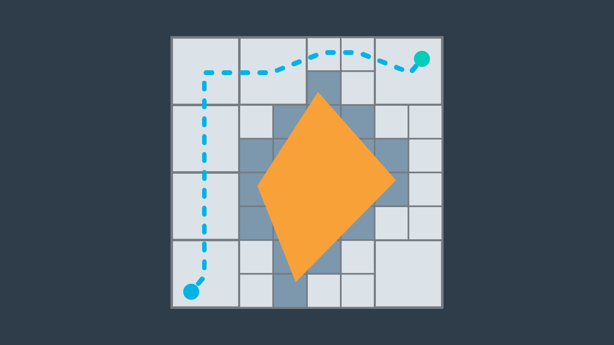
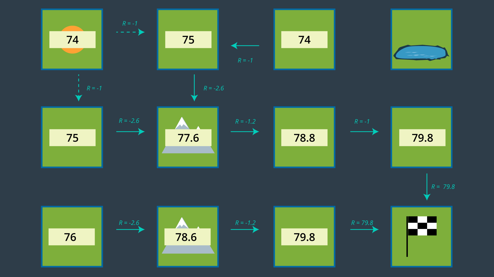

# Introduction to this Lesson
In this lesson, we'll focus on the decision making aspects of mobile robotics, i.e. path planning and navigation. Path planning is a strategic solution to the problem of "How do I get there?", while obstacle avoidance is a series of tactical decisions the robot must make as it moves along its path.

# Applications
Before we dive into the details - let’s look at where path planning can be applied!

Sitting in your home or office, some environment-specific examples come to mind right away - vacuum robots plan their paths around a house to ensure that every square inch of space gets cleaned. Self-driving cars are starting to appear around us. These vehicles can accept a destination as an input from a human and plan an efficient path that avoids collisions and obeys all traffic regulations.

More peculiar applications of path planning in robotics include assistive robotics. Whether working with the disabled or elderly, robots are starting to appear in care homes and hospitals to assist humans with their everyday tasks. Such robots must be mindful of their surroundings when planning paths - some obstacles stay put over time, such as walls and large pieces of furniture, while others may move around from day to day. Path planning in dynamic environments is undoubtedly more difficult.

Another robotic application of path planning is the planning of paths by exploratory rovers, such as Curiosity on Mars. The rover must safely navigate the surface of Mars (which is between 55 and 400 million kilometers away!). Accurate problem-free planning that avoids risks is incredibly important.

Path planning is not limited to robotics applications, in fact it is widely used in several other disciplines. Computer graphics and animation use path planning to generate the motion of characters. While computational biology applies path planning to the folding of protein chains.

With many different applications, there are naturally many different approaches. In the next few lessons you will gain the knowledge required to implement several different path planning algorithms.

# Introduction to Path Planning
It relates to teaching our robot to operate in the real world. Just like in localization and SLAM, there's one correct way to accomplish the task of path planning. 

A **Path Planning Algorithm** takes in as input the provided _environment geometry_, the _robot's geometry_, and the _start_ and _goal_ poses and uses this information to produce a path from start to goal. 

# Examples of Path Planning
Let's look at an application of path building to gain a better understanding of the problem at hand and to learn some relevant terminology that we will use throughout the lesson. 

An exploratory robot may find itself dropped off at a starting position and need to traverse the land, water, or air to get to its goal position. In between its _start_ and _goal_ locations, there will inevitably be some obstacles. Let's assume that our rover on land, performing a recovery operation after a natural disaster. The rover was dropped off at one position and needs to get to another position to evaluate whether it's safer for humans to follow his path. 

From the map, the robot knows that there's rubble present along its path. Using GPS data and aerial photographs of the environment, the rover must plan a path through the rubble to get to its destination. 

One option that the rover has is to follow the shortest path; the straight line between a start and goal locations. However, due to the large amount of rubble present, the rover might have to slow down considerably to safely navigate this path. If time is of the essence, this is likely not the ideal path to take. Taking the direct route may not even be possible if there are large obstacles in the way of that the rover is unable to overcome. The rover will need a solution to this problem instead of just stopping dead in its tracks. 

One algorithm that the robot can apply would have the robot traverse and encountered obstacles clockwise until it reaches its intended path once again. This algorithm often referred to as the **Bug Algorithm**. 

An alternate route altogether would be to go around as much rubble as possible. To accomplish this, the path planning algorithm would need a way to evaluate how long it takes to traverse different types of land and take this information into account when planning a path. Although the resulting path is longer, the rover would get to the goal location faster because it can move quicker on flat land. 

More sophisticated algorithms may take into account the risk that rover faces. Rovers are expensive tools. So, it'd be wise to avoid unnecessary danger in their operation. The rover's path planning algorithm may have it avoid unstable terrain or moving too closely to a cliff. 

Two methods of evaluating algorithms are to assess whether they are **complete** and whether they are **optimal**. 

**An algorithm is complete** if it's able to find a path between the start and the goal when one exists. A **complete algorithm** is able to solve all solvable problems and return no solution found to unsolvable problems. 

**An algorithm is optimal** if it is able to find the _best_ solution. **Best** may mean different things. In the simplest case, _best_ refers to the shortest path. But _best_ can also mean quickest or the path that minimizes the risk the most or a combination of factors. 

### Is Bug Algorithm complete or optimal?
Neither! The bug algorithm is neither complete nor optimal. It would be able to solve some rudimentary path planning problems, but as you will see in the image below - others can certainly stumble this naive algorithm.

The problem below will demonstrate one instance where a solution exists, but the bug algorithm is unable to find it.

In the above example, the robot would end up traversing the outer wall of the obstacle endlessly. There exist variants to the bug algorithm that will remedy this error, but the bulk of path planning algorithms rely on other principles that you will be introduced to throughout this lesson. In studying new algorithms, we will revisit the notion of Completeness and Optimality in analyzing the applicability of an algorithm to a task.

See the video [here](https://youtu.be/uIHSZ6N7Xok).

# Approaches to Path Planning
In this lesson, you will be studying _**three**_ different approaches to path planning. The first, called **discrete (or combinatorial) path planning**, is the most straightforward of the three approaches. The other two approaches, called **sample-based path planning** and **probabilistic path planning**, will build on the foundation of discrete planning to develop more widely applicable path planning solutions.

### Discrete Planning
Discrete planning looks to explicitly discretize the robot’s workspace into a connected graph, and apply a graph-search algorithm to calculate the best path. This procedure is very precise (in fact, the precision can be adjusted explicitly by changing how fine you choose to discretize the space) and very thorough, as it discretizes the _complete_ workspace. As a result, _**discrete planning can be very computationally expensive - possibly prohibitively so for large path planning problems**_.

The image below displays one possible implementation of discrete path planning applied to a 2-dimensional workspace.

_**Discrete path planning is elegant in its preciseness, but is best suited for low-dimensional problems. For high-dimensional problems, sample-based path planning is a more appropriate approach.**_

### Sample-Based Planning
Sample-based path planning probes the workspace to incrementally construct a graph. Instead of discretizing every segment of the workspace, sample-based planning takes a number of samples and uses them to build a discrete representation of the workspace. The resultant graph is not as precise as one created using discrete planning, but it is _much quicker to construct_ because of the relatively small number of samples used.

A path generated using sample-based planning _may not be the best path_, but in certain applications - _**it’s better to generate a feasible path quickly than to wait hours or even days to generate the optimal path**_.

The image below displays a graph representation of a 2-dimensional workspace created using sample-based planning.

### Probabilistic Path Planning
The last type of path planning that you will learn about in this module is probabilistic path planning. While the first two approaches looked at the path planning problem generically - with no understanding of who or what may be executing the actions - probabilistic path planning takes into account the uncertainty of the robot’s motion.

While this may not provide significant benefits in some environments, it is especially helpful in highly-constrained environment or environments with sensitive or high-risk areas.

The image below displays probabilistic path planning applied to an environment containing a hazard (the lake at the top right).

# Discrete Planning
Solving the path planning problem through discrete planning, otherwise known as combinatorial planning can be broken down into _**three distinct steps**_. 

- The **first** is to develop a convenient continuous representation. This can be done by representing the problem space as the **configuration space**. The **configuration space**, also known as a **C space**, is an alternative way of representing the problem space. The _C space_ takes into account the geometry of the robot and makes it easier to apply discrete search algorithms. 
- Next, the configuration space must be discretized into a representation that is more easily manipulated by algorithms. The **discretized space** is represented by a **graph**. 
- Finally, a _search algorithm_ can be applied to the graph to find the best path from the start node to the goal node. For each of these steps, there are a variety of methods that can be applied to accomplish the desired outcomes, each with their own advantages and disadvantages. 

See the video [here](https://youtu.be/paeOudcnghM).

# Continuous Representation
Here, we have an environment with several obstables. We can call this the _**workspace**_. Our goal in path planning is to find a path between some start location and some end location that avoids collision with obstacles. 

_**If we treat the robot as a single point, then the task of path planning is quite simple**_. Within this workspace, the robot can move anywhere in the free space. That is the space not occupied by obstacles. The robot can even travel along the wall of an obstacle. After all, we're representing it as a dimensionless point. In such as case, the path planning problem is relatively simple. _**Find a curve or piece-wise linear path connecting the robot's start pose to the goal pose that does not collide with any obstacles**_. As long as there's an infinitesimally small gap between two obstacles, a point robot would be able to squeeze through.

However, **in reality robots have more dimensions that a point**. If we model a robot as two-dimensional disc, and try to attempt to follow the same paths that we developed earlier for point robot, we run into trouble. Some of the paths may have the robot collide with obstacles. **So, what do we do?**

For every step of the path, we could compute the distance from the robot center to every obstacle, and ensure that the space is greater than the radius of the robot. But, that would be a lot of work. 

The same can be accomplished in an easier manner. We can inflate every single obstacle by the radius of the robot, and then treat the robot as a point. Doing so, may show that some paths may no longer an option for the robot of this size. The robot would not be able to fit in between the two obstacles. This representation of the environment is called the **Configuration Space (or C Space)**. 

A configuration space is a set of all robot poses. The C space is divided into **C Free** and **C Obstacle**. 

**C Free** represents the set of poses in the free space that do not collide with obstacles. **C Obstacle** is the compliment to C Free, representing the set of robot poses that are in collision with obstacles or walls. 

See the video [here](https://youtu.be/4Npk-v3sg2U).

