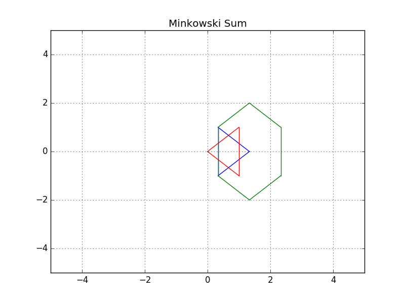
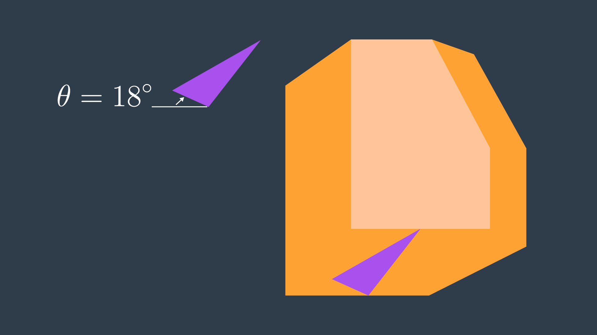
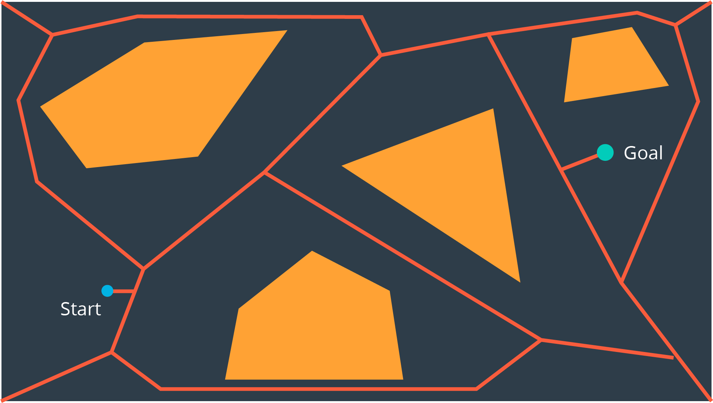

# Introduction to this Lesson
In this lesson, we'll focus on the decision making aspects of mobile robotics, i.e. path planning and navigation. Path planning is a strategic solution to the problem of "How do I get there?", while obstacle avoidance is a series of tactical decisions the robot must make as it moves along its path.

# Applications
Before we dive into the details - let’s look at where path planning can be applied!

Sitting in your home or office, some environment-specific examples come to mind right away - vacuum robots plan their paths around a house to ensure that every square inch of space gets cleaned. Self-driving cars are starting to appear around us. These vehicles can accept a destination as an input from a human and plan an efficient path that avoids collisions and obeys all traffic regulations.

More peculiar applications of path planning in robotics include assistive robotics. Whether working with the disabled or elderly, robots are starting to appear in care homes and hospitals to assist humans with their everyday tasks. Such robots must be mindful of their surroundings when planning paths - some obstacles stay put over time, such as walls and large pieces of furniture, while others may move around from day to day. Path planning in dynamic environments is undoubtedly more difficult.

Another robotic application of path planning is the planning of paths by exploratory rovers, such as Curiosity on Mars. The rover must safely navigate the surface of Mars (which is between 55 and 400 million kilometers away!). Accurate problem-free planning that avoids risks is incredibly important.

Path planning is not limited to robotics applications, in fact it is widely used in several other disciplines. Computer graphics and animation use path planning to generate the motion of characters. While computational biology applies path planning to the folding of protein chains.

With many different applications, there are naturally many different approaches. In the next few lessons you will gain the knowledge required to implement several different path planning algorithms.

<p align="center">

</p>

# Introduction to Path Planning
It relates to teaching our robot to operate in the real world. Just like in localization and SLAM, there's one correct way to accomplish the task of path planning. 

A **Path Planning Algorithm** takes in as input the provided _environment geometry_, the _robot's geometry_, and the _start_ and _goal_ poses and uses this information to produce a path from start to goal. 

# Examples of Path Planning
Let's look at an application of path building to gain a better understanding of the problem at hand and to learn some relevant terminology that we will use throughout the lesson. 

An exploratory robot may find itself dropped off at a starting position and need to traverse the land, water, or air to get to its goal position. In between its _start_ and _goal_ locations, there will inevitably be some obstacles. Let's assume that our rover on land, performing a recovery operation after a natural disaster. The rover was dropped off at one position and needs to get to another position to evaluate whether it's safer for humans to follow his path. 

From the map, the robot knows that there's rubble present along its path. Using GPS data and aerial photographs of the environment, the rover must plan a path through the rubble to get to its destination. 

One option that the rover has is to follow the shortest path; the straight line between a start and goal locations. However, due to the large amount of rubble present, the rover might have to slow down considerably to safely navigate this path. If time is of the essence, this is likely not the ideal path to take. Taking the direct route may not even be possible if there are large obstacles in the way of that the rover is unable to overcome. The rover will need a solution to this problem instead of just stopping dead in its tracks. 

<p align="center">

</p>

One algorithm that the robot can apply would have the robot traverse and encountered obstacles clockwise until it reaches its intended path once again. This algorithm often referred to as the **Bug Algorithm**. 

An alternate route altogether would be to go around as much rubble as possible. To accomplish this, the path planning algorithm would need a way to evaluate how long it takes to traverse different types of land and take this information into account when planning a path. Although the resulting path is longer, the rover would get to the goal location faster because it can move quicker on flat land. 

More sophisticated algorithms may take into account the risk that rover faces. Rovers are expensive tools. So, it'd be wise to avoid unnecessary danger in their operation. The rover's path planning algorithm may have it avoid unstable terrain or moving too closely to a cliff. 

Two methods of evaluating algorithms are to assess whether they are **complete** and whether they are **optimal**. 

**An algorithm is complete** if it's able to find a path between the start and the goal when one exists. A **complete algorithm** is able to solve all solvable problems and return no solution found to unsolvable problems. 

**An algorithm is optimal** if it is able to find the _best_ solution. **Best** may mean different things. In the simplest case, _best_ refers to the shortest path. But _best_ can also mean quickest or the path that minimizes the risk the most or a combination of factors. 

### Is Bug Algorithm complete or optimal?
Neither! The bug algorithm is neither complete nor optimal. It would be able to solve some rudimentary path planning problems, but as you will see in the image below - others can certainly stumble this naive algorithm.

The problem below will demonstrate one instance where a solution exists, but the bug algorithm is unable to find it.

<p align="center">

</p>

In the above example, the robot would end up traversing the outer wall of the obstacle endlessly. There exist variants to the bug algorithm that will remedy this error, but the bulk of path planning algorithms rely on other principles that you will be introduced to throughout this lesson. In studying new algorithms, we will revisit the notion of Completeness and Optimality in analyzing the applicability of an algorithm to a task.

See the video [here](https://youtu.be/uIHSZ6N7Xok).

# Approaches to Path Planning
In this lesson, you will be studying _**three**_ different approaches to path planning. The first, called **discrete (or combinatorial) path planning**, is the most straightforward of the three approaches. The other two approaches, called **sample-based path planning** and **probabilistic path planning**, will build on the foundation of discrete planning to develop more widely applicable path planning solutions.

### Discrete Planning
Discrete planning looks to explicitly discretize the robot’s workspace into a connected graph, and apply a graph-search algorithm to calculate the best path. This procedure is very precise (in fact, the precision can be adjusted explicitly by changing how fine you choose to discretize the space) and very thorough, as it discretizes the _complete_ workspace. As a result, _**discrete planning can be very computationally expensive - possibly prohibitively so for large path planning problems**_.

The image below displays one possible implementation of discrete path planning applied to a 2-dimensional workspace.

<p align="center">

</p>

_**Discrete path planning is elegant in its preciseness, but is best suited for low-dimensional problems. For high-dimensional problems, sample-based path planning is a more appropriate approach.**_

### Sample-Based Planning
Sample-based path planning probes the workspace to incrementally construct a graph. Instead of discretizing every segment of the workspace, sample-based planning takes a number of samples and uses them to build a discrete representation of the workspace. The resultant graph is not as precise as one created using discrete planning, but it is _much quicker to construct_ because of the relatively small number of samples used.

A path generated using sample-based planning _may not be the best path_, but in certain applications - _**it’s better to generate a feasible path quickly than to wait hours or even days to generate the optimal path**_.

The image below displays a graph representation of a 2-dimensional workspace created using sample-based planning.

<p align="center">

</p>

### Probabilistic Path Planning
The last type of path planning that you will learn about in this module is probabilistic path planning. While the first two approaches looked at the path planning problem generically - with no understanding of who or what may be executing the actions - probabilistic path planning takes into account the uncertainty of the robot’s motion.

While this may not provide significant benefits in some environments, it is especially helpful in highly-constrained environment or environments with sensitive or high-risk areas.

The image below displays probabilistic path planning applied to an environment containing a hazard (the lake at the top right).

<p align="center">

</p>

# Discrete Planning
Solving the path planning problem through discrete planning, otherwise known as combinatorial planning can be broken down into _**three distinct steps**_. 

- The **first** is to develop a convenient continuous representation. This can be done by representing the problem space as the **configuration space**. The **configuration space**, also known as a **C space**, is an alternative way of representing the problem space. The _C space_ takes into account the geometry of the robot and makes it easier to apply discrete search algorithms. 
- Next, the configuration space must be discretized into a representation that is more easily manipulated by algorithms. The **discretized space** is represented by a **graph**. 
- Finally, a _search algorithm_ can be applied to the graph to find the best path from the start node to the goal node. For each of these steps, there are a variety of methods that can be applied to accomplish the desired outcomes, each with their own advantages and disadvantages. 

See the video [here](https://youtu.be/paeOudcnghM).

# Continuous Representation
Here, we have an environment with several obstables. We can call this the _**workspace**_. Our goal in path planning is to find a path between some start location and some end location that avoids collision with obstacles. 

<p align="center">

</p>

_**If we treat the robot as a single point, then the task of path planning is quite simple**_. Within this workspace, the robot can move anywhere in the free space. That is the space not occupied by obstacles. The robot can even travel along the wall of an obstacle. After all, we're representing it as a dimensionless point. In such as case, the path planning problem is relatively simple. _**Find a curve or piece-wise linear path connecting the robot's start pose to the goal pose that does not collide with any obstacles**_. As long as there's an infinitesimally small gap between two obstacles, a point robot would be able to squeeze through.

However, **in reality robots have more dimensions that a point**. If we model a robot as two-dimensional disc, and try to attempt to follow the same paths that we developed earlier for point robot, we run into trouble. Some of the paths may have the robot collide with obstacles. **So, what do we do?**

For every step of the path, we could compute the distance from the robot center to every obstacle, and ensure that the space is greater than the radius of the robot. But, that would be a lot of work. 

The same can be accomplished in an easier manner. We can inflate every single obstacle by the radius of the robot, and then treat the robot as a point. Doing so, may show that some paths may no longer an option for the robot of this size. The robot would not be able to fit in between the two obstacles. This representation of the environment is called the **Configuration Space (or C Space)**. 

<p align="center">

</p>

A configuration space is a set of all robot poses. The C space is divided into **C Free** and **C Obstacle**. 

**C Free** represents the set of poses in the free space that do not collide with obstacles. **C Obstacle** is the compliment to C Free, representing the set of robot poses that are in collision with obstacles or walls. 

<p align="center">

</p>

See the video [here](https://youtu.be/4Npk-v3sg2U).

**Summary**

To account for the geometry of a robot and simplify the task of path planning, obstacles in the workspace can be inflated to create a new space called the configuration space (or C-space). With the obstacles inflated by the radius of the robot, the robot can then be treated as a point, making it easier for an algorithm to search for a path. The C-space is the set of all robot poses, and can be broken-down into `C_{Free}` and `C_{Obs}`.

# Minkowski Sum
The Minkowski sum is a mathematical property that can be used to compute the configuration space given an obstacle geometry and robot geometry.

The intuition behind how the Minkowski sum is calculated can be understood by imagining to paint the outside of an obstacle using a paintbrush that is shaped like your robot, with the robot’s origin as the tip of the paintbrush. The painted area is `C_{Obs}`. The image below shows just this.

<p align="center">

</p>

To create the configuration space, the Minkowski sum is calculated in such a way for every obstacle in the workspace. The image below shows three configuration spaces created from a single workspace with three different sized robots. As you can see, if the robot is just a dot, then the obstacles in the workspace are only inflated by a small amount to create the C-space. As the size of the robot increases, the obstacles are inflated more and more.

<p align="center">

</p>

For convex polygons, computing the convolution is trivial and can be done in linear time - however for non-convex polygons (i.e. ones with gaps or holes present), the computation is much more expensive.

If you are interested in understanding the Minkowski Sum in more detail, then you may find the following resources helpful:

- [A blog post on Minkowski sums and differences](http://twistedoakstudios.com/blog/Post554_minkowski-sums-and-differences),
- [An interesting read on how collisions are detected in video games](https://www.toptal.com/game/video-game-physics-part-ii-collision-detection-for-solid-objects).

# Minkowski Sum C++
Now that you've learned the Minkowski Sum, you'll get a chance to code it in C++!

**Example**

<p align="center">

</p>

In this example, you can see two triangles - a blue and a red one. Let's suppose the robot is represented by a blue triangle and the obstacle is represented by a red triangle. Your task is to compute the configuration space **C** of robot **A** and obstacle **B** in C++.
- **Robot:** Blue triangle denoted by A
- **Obstacle:** Red triangle denoted by B

Here are the steps that you should follow in order to code the Minkowski Sum in C++. 

- `main()`: Define the coordinates of triangle A and B in 2D vectors.
- `minkowski_sum()`: Compute the Minkowski Sum of two vectors
- `delete_duplicate()`: Check for duplicate coordinates inside a 2D vector and delete them.

```cpp
#include <iostream>
#include <vector>
#include <algorithm>

using namespace std;

// Print 2D vectors coordinate values
void print2DVector(vector<vector<int> > vec)
{
    // Sorting the vector for grading purpose
    sort(vec.begin(), vec.end());
    for (int i = 0; i < vec.size(); ++i) {
        for (int j = 0; j < vec[0].size(); ++j) {
                cout << vec[i][j] << "  ";
        }
        cout << endl;
    }
}

// Check for duplicate coordinates inside a 2D vector and delete them
vector<vector<int> > delete_duplicate(vector<vector<int> > C)
{
    // Sort the C vector
    sort(C.begin(), C.end());
    // Initialize a non duplicated vector
    vector<vector<int> > Cn;
    for (int i = 0; i < C.size() - 1; i++) {
        // Check if it's a duplicate coordinate
        if (C[i] != C[i + 1]) {
            Cn.push_back(C[i]);
        }
    }
    Cn.push_back(C[C.size() - 1]);
    return Cn;
}

// Compute the Minkowski Sum of two vectors
vector<vector<int> > minkowski_sum(vector<vector<int> > A, vector<vector<int> > B)
{
    vector<vector<int> > C;
    for (int i = 0; i < A.size(); i++) {
        for (int j = 0; j < B.size(); j++) {
            // Compute the current sum
            vector<int> Ci = { A[i][0] + B[j][0], A[i][1] + B[j][1] };
            // Push it to the C vector
            C.push_back(Ci);
        }
    }
    C = delete_duplicate(C);
    return C;
}

int main()
{
    // Define the coordinates of triangle A and B using 2D vectors
    vector<vector<int> > A(3, vector<int>(2));
    A = {{ 1, 0 }, { 0, 1 }, { 0, -1 },};
    vector<vector<int> > B(3, vector<int>(2));
    B = {{ 0, 0 }, { 1, 1 }, { 1, -1 },};

    // Compute the minkowski sum of triangle A and B
    vector<vector<int> > C;
    C = minkowski_sum(A, B);

    // Print the resulting vector
    print2DVector(C);

    return 0;
}
```

### Generated Configuration Space

<p align="center">

</p>

### Translation
You successfully coded the Minkowski sum in C++ and generated the configuration space. You can easily notice that the red obstacle is not well inflated and the blue robot can still hit the obstacle. That's because the configuration space still has to be shifted to the obstacle.

Initially, the robot should be translated to the obstacle, and then after computing the configuration space, it should be translated to both the robot and obstacle.

### Final Result

<p align="center">

</p>

Above is the resulting image where both the blue robot and the green configuration space have been shifted. You can now see the yellow padding which represents the translated configurations space all around the red obstacle. The blue robot will never be able to hit the red obstacle since it's well inflated.

### Plotting
If you are eager to know how I generated these plots and translated the shapes, you can clone the [GitHub repo](https://github.com/udacity/RoboND-MinkowskiSum) and read through the C++ code. In short, I had to follow these steps to generate any polygon:

1. Computed the centroid of each polygon
2. Computed the angle of each point-centroid with respect to the x-axis
3. Sorted the points in ascending order of their angles (clockwise)
4. Plotted a line between each consecutive point

# Translation and Rotation
In first few examples above, the robot was represented by a circle. This was a very easy shape to use because its rotation did not affect the geometry of the configuration space. Our most recent representation of a robot has been a triangle (image below).

<p align="center">

</p>

Now, **what would happen if we were to rotate our robot by, say, 38 degrees?**

Well, the configuration would look quite different (image below). So, what do we do?

<p align="center">

</p>

**The configuration space changes depending on the orientation of the robot**. 

One way to **standardize the configuration space** for an odd shape robot would be to enclose the robot in a **bounding circle**. The circle represents the worst-case scenario. For some orientation of the robot, it is a relatively accurate representation of the bounds of its vertices. But, for others, it may be a significant exaggeration. However, at all times, the bounding circle is equal to or larger than the robot and is current configuration. So, if a path is found for the bounding circle, it will work for the robot. 

This method is simple, but it does come with a significant _**drawback**_. An algorithm applied to this generalization **would not be complete**. Let's look at a particular example to understand this. 

Here, the robot is represented by the triangle. It must navigate a tight corridor and get to its goal. The task is possible. With two rotations the robot can navigate the corner and make it to the other end of the corridor. 

<p align="center">

</p>

However, if we were to enclose a triangle robot representation into a bounding circle, the algorithm would not be able to find a solution, since the circle's diameter is larger than the width of the corridor. Any algorithm applied here will return no solution found. 

So, while **bounding circles** can be an acceptable solution to some planning problems, for instance, ones in a wide open environments, they **are not a complete solution**. 

When you add the ability for the robot to rotate, you are adding a _degree of freedom_. The appropriate way to represent this in the configuration space is to _add a dimension_. The XY plane would continue to represent the translation of the robot in the workspace, while the vertical axis would represent rotation of the robot.

See the video [here](https://youtu.be/ZVAJmzOk5p4).

# 3D Configuration Space
As you saw, the configuration space for a robot changes depending on its rotation. Allowing a robot to rotate adds a degree of freedom - so, sensibly, it complicates the configuration space as well. Luckily, this is actually very simple to handle. The dimension of the configuration space is equal to the number of degrees of freedom that the robot has.

While a 2D configuration space was able to represent the x- and y-translation of the robot, a third dimension is required to represent the rotation of the robot.

Let’s look at a robot and its corresponding configuration space for two different rotations. The first will have the robot at 0°, and the second at 18°.

<p align="center">

</p>

<p align="center">

</p>

A three-dimensional configuration space can be generated by stacking two-dimensional configuration spaces as layers - as seen in the image below.

<p align="center">

</p>

If we were to calculate the configuration spaces for infinitesimally small rotations of the robot, and stack them on top of each other - we would get something that looks like the image below.

<p align="center">

</p>

The image above displays the configuration space for a triangular robot that is able to translate in two dimensions as well as rotate about its z-axis. While this image looks complicated to construct, there are a few tricks that can be used to generate 3D configuration spaces and move about them. The following video from the Freie Universität Berlin is a wonderful visualization of a 3D configuration space. The video will display different types of motion, and describe how certain robot motions map into the 3D configuration space.

[Configuration Space Visualization](https://www.youtube.com/watch?v=SBFwgR4K1Gk) - This is a must watch!

# Discretization
To be able to apply a search algorithm, the configuration space must be reduced to a finite size that an algorithm can traverse in a reasonable amount of time, as it searches for a path from the start to the goal. This reduction in size can be accomplished by discretization.

**Discretization** is the process of breaking down a continuous entity, in this case a configuration space, into discrete segments. 

There different methods that can be applied to discretize a continuous space. Here, we'll learn about **three different methods of discretization**. 

- Roadmap
- Cell Decomposition
- Gradient Field

Each has its own advantages and disadvantages, balancing tradeoffs such as time and the level of detail. After that, we'll dive into graph search which can be applied to find a path from start node to goal node. 

# Roadmap
The first group of discretization approaches that you will learn is referred to by the name Roadmap. These methods represent the configuration space using a simple connected graph - similar to how a city can be represented by a metro map.

<p align="center">

</p>

Roadmap methods are typically implemented in two phases:

- The **construction phase** builds up a graph from a continuous representation of the space. This phase usually takes a significant amount of time and effort, but the resultant graph can be used for multiple queries with minimal modifications.
- The **query phase** evaluates the graph to find a path from a start location to a goal location. This is done with the help of a search algorithm.

In this Discretization section, we will only discuss and evaluate the construction phase of each Roadmap method. Whereas the query phase will be discussed in more detail in the Graph Search section, following Discretization.

The two roadmap methods that you will learn next are the **Visibility Graph**, and **Voronoi Diagram** methods.

# Visibility Graph
The Visibility Graph builds a roadmap by connecting the start node, all of the obstacles’ vertices, and goal node to each other - except those that would result in collisions with obstacles. The Visibility Graph has its name for a reason - it connects every node to all other nodes that are ‘visible’ from its location.

>**Nodes:** Start, Goal, and all obstacle vertices.

>**Edges:** An edge between two nodes that does not intersect an obstacle, including obstacle edges.

The following image illustrates a visibility graph for a configuration space containing polygonal obstacles.

<p align="center">

</p>

The motivation for building Visibility Graphs is that the shortest path from the start node to the goal node will be a piecewise linear path that bends only at the obstacles’ vertices. This makes sense intuitively - the path would want to hug the obstacles’ corners as tightly as possible, as not to add any additional length.

Once the Visibility Graph is built, a search algorithm can be applied to find the shortest path from Start to Goal. The image below displays the shortest path in this visibility graph.

<p align="center">

</p>


**Is the visibility graph complete? Does it contain the optimal path?**

Yes, That’s right, it is complete and contains the optimal path!

Having completed the quiz, you should have by now seen the advantages of the Visibility Graph method. One **disadvantage** to the Visibility Graph is that it leaves no clearance for error. A robot traversing the optimal path would have to pass incredibly close to obstacles, increasing the risk of collision significantly. In certain applications, such as animation or path planning for video games, this is acceptable. However the uncertainty of real-world robot localization makes this method impractical.

# Voronoi Diagram
Another discretization method that generates a roadmap is called the Voronoi Diagram. Unlike the visibility graph method which generates the shortest paths, Voronoi Diagrams maximize clearance between obstacles.

A Voronoi Diagram is a graph whose edges bisect the free space in between obstacles. Every edge lies equidistant from each obstacle around it - with the greatest amount of clearance possible. You can see a Voronoi Diagram for our configuration space in the graphic below.

<p align="center">

</p>

Once a Voronoi Diagram is constructed for a workspace, it can be used for multiple queries. Start and goal nodes can be connected into the graph by constructing the paths from the nodes to the edge closest to each of them.

Every edge will either be a straight line, if it lies between the edges of two obstacles, or it will be a quadratic, if it passes by the vertex of an obstacle.

**Is the Voronoi Diagram complete? Does it contain the optimal path?**

The Voronoi Diagram is complete, but it does not contain the optimal path. However, it contains a path from start to goal with the most possible clearance, which in certain applications is more desirable than the optimal path.

# Cell Decomposition
Another discretization method that can be used to convert a configuration space into a representation that can easily be explored by a search algorithm is cell decomposition. Cell decomposition divides the space into discrete cells, where each cell is a node and adjacent cells are connected with edges. There are two distinct types of cell decomposition:

- Exact Cell Decomposition
- Approximate Cell Decomposition.

### Exact Cell Decomposition
Exact cell decomposition divides the space into non-overlapping cells. This is commonly done by breaking up the space into triangles and trapezoids, which can be accomplished by adding vertical line segments at every obstacle’s vertex. You can see the result of exact cell decomposition of a configuration space in the image below.

<p align="center">

</p>

Once a space has been decomposed, the resultant graph can be used to search for the shortest path from start to goal. The resultant graph can be seen in the image below.

<p align="center">

</p>

Exact cell decomposition is elegant because of its precision and completeness. Every cell is either ‘full’, meaning it is completely occupied by an obstacle, or it is ‘empty’, meaning it is free. And the union of all cells exactly represents the configuration space. If a path exists from start to goal, the resultant graph will contain it.

To implement exact cell decomposition, the algorithm must order all obstacle vertices along the x-axis, and then for every vertex determine whether a new cell must be created or whether two cells should be merged together. Such an algorithm is called the Plane Sweep algorithm.

Exact cell decomposition results in cells of awkward shapes. Collections of uniquely-shaped trapezoids and triangles are more difficult to work with than a regular rectangular grid. This results in an added computational complexity, especially for environments with greater numbers of dimensions. It is also difficult to compute the decomposition when obstacles are not polygonal, but of an irregular shape.

For this reason, there is an alternate type of cell decomposition, that is much more practical in its implementation.

# Approximate Cell Decomposition
Approximate cell decomposition divides a configuration space into discrete cells of simple, regular shapes - such as rectangles and squares (or their multidimensional equivalents). Aside from simplifying the computation of the cells, this method also supports hierarchical decomposition of space (more on this below).

### Simple Decomposition
A 2-dimensional configuration space can be decomposed into a grid of rectangular cells. Then, each cell could be marked full or empty, as before. A search algorithm can then look for a sequence of free cells to connect the start node to the goal node.

Such a method is more efficient than exact cell decomposition, but it loses its completeness. It is possible that a particular configuration space contains a feasible path, but the resolution of the cells results in some of the cells encompassing the path to be marked ‘full’ due to the presence of obstacles. A cell will be marked ‘full’ whether 99% of the space is occupied by an obstacle or a mere 1%. Evidently, this is not practical.

### Iterative Decomposition
An alternate method of partitioning a space into simple cells exists. Instead of immediately decomposing the space into small cells of equal size, the method recursively decomposes a space into four quadrants. Each quadrant is marked full, empty, or a new label called ‘mixed’ - used to represent cells that are somewhat occupied by an obstacle, but also contain some free space. If a sequence of free cells cannot be found from start to goal, then the mixed cells will be further decomposed into another four quadrants. Through this process, more free cells will emerge, eventually revealing a path if one exists.

The 2-dimensional implementation of this method is called quadtree decomposition. It can be seen in the graphic below.

<p align="center">

</p>

### Algorithm
The algorithm behind approximate cell decomposition is much simpler than the exact cell decomposition algorithm. The pseudocode for the algorithm is provided below.

- >Decompose the configuration space into four cells, label cells free, mixed, or full.
- >Search for a sequence of free cells that connect the start node to the goal node.
- >If such a sequence exists:
- >    Return path
- >Else:
- >    Further decompose the mixed cells

<p align="center">

</p>

The three dimensional equivalent of quadtrees are octrees, depicted in the image below. The method of discretizing a space with any number of dimensions follows the same procedure as the algorithm described above, but expanded to accommodate the additional dimensions.

<p align="center">

</p>

Although exact cell decomposition is a more elegant method, it is much more computationally expensive than approximate cell decomposition for non-trivial environments. For this reason, approximate cell decomposition is commonly used in practice.

With enough computation, approximate cell decomposition approaches completeness. However, it is not optimal - the resultant path depends on how cells are decomposed. Approximate cell decomposition finds the obvious solution quickly. It is possible that the optimal path squeezes through a minuscule opening between obstacles, but the resultant path takes a much longer route through wide open spaces - one that the recursively-decomposing algorithms would find first.

Approximate cell decomposition is functional, but like all discrete/combinatorial path planning methods - it starts to be computationally intractable for use with high-dimensional environments.

- In practice, approximate cell decomosition is preferred due to its more manageable computation.
- Approximate cell decomposition is not optimal because obvious (wide/open) paths are found first.
- The quadtree and octree methods recursively decompose mixed cells until they find a sequence of free cells from start to goal.

# Potential Field
Onto the last discretization method that you will be learning in this lesson - potential field method. Unlike the methods discussed thus far that discretize the continuous space into a connected graph, the potential field method performs a different type of discretization.

To accomplish its task, the potential field method generates two functions - one that attracts the robot to the goal and one that repels the robot away from obstacles. The two functions can be summed to create a discretized representation. By applying an optimization algorithm such as gradient descent, a robot can move toward the goal configuration while steering around obstacles. Let’s look at how each of these steps is implemented in more detail.

### Attractive Potential Field
The attractive potential field is a function with the global minimum at the goal configuration. If a robot is placed at any point and required to follow the direction of steepest descent, it will end up at the goal configuration. This function does not need to be complicated, a simple quadratic function can achieve all of the requirements discussed above.

<p align="center">

</p>

Where **`x`** represents the robot’s current position, and **`x_goal`** the goal position. **`ν`** is a scaling factor.

A fragment of the attractive potential field is displayed in the image below.

<p align="center">

</p>

### Repulsive Potential Field
The repulsive potential field is a function that is equal to zero in free space, and grows to a large value near obstacles. One way to create such a potential field is with the function below.

<p align="center">

</p>

Where the function **`ρ(x)`** returns the distance from the robot to its nearest obstacle, **`ρ0`**
​	  is a scaling parameter that defines the reach of an obstacle’s repulsiveness, and **`ν`** is a scaling parameter.

An image of a repulsive potential field for an arbitrary configuration space is provided below.

<p align="center">

</p>

The value **`ρ0`** controls how far from an obstacle the potential field will be non-zero, and how steep the area surrounding an obstacle will be.

Past **`ρ0`**, the potential field is zero. Within a **`ρ0`** distance of the obstacle, the potential field scales with proximity to the obstacle.

### Potential Field Sum
The attractive and repulsive functions are summed to produce the potential field that is used to guide the robot from anywhere in the space to the goal. The image below shows the summation of the functions, and the image immediately after displays the final function.

<p align="center">

</p>

<p align="center">

</p>

Imagine placing a marble onto the surface of the function - from anywhere in the field it will roll in the direction of the goal without colliding with any of the obstacles (as long as **`ρ0`** is set appropriately)!

The gradient of the function dictates which direction the robot should move, and the speed can be set to be constant or scaled in relation to the distance between the robot and the goal.

### Problems with the Potential Field Method
The potential field method is not without its faults - the method is neither complete nor optimal. In certain environments, the method will lead the robot to a **local minimum**, as opposed to the global minimum. The images below depict one such instance. Depending on where the robot commences, it may be led to the bottom of the smile.

The image below depicts the configuration space, and the following image displays the corresponding potential field.

<p align="center">

</p>

<p align="center">

</p>

The problem of a robot becoming stuck in a local minimum can be resolved by adding random walks, and other strategies that are commonly applied to gradient descent, but ultimately the method is not complete.

The potential field method isn’t optimal either, as it may not always find the shortest (or cheapest) path from start to goal. The shortest path may not follow the path of steepest descent. In addition, potential field does not take into consideration the cost of every step.

# Discretization Wrap-Up
In this lesson, we are studying **Discrete Path Planning**, which we've broken down into three steps:

- Continuous Representation
- Discretization
- Graph Search

In **continuous representation**, we learned how to create a configuration space. In **discretization**, we learned about three different types of methods that can be used to represent a configuration space with discrete segments. The first of these methods is the **roadmap** group of methods. Here, we modeled the configuration space as a simple graph by either connecting the vertices of the obstacles or building a Voronoi diagram. Next, we looked at **cell decomposition**, which broke the space into a finite number of cells, each of which was assessed to be empty, full, or mixed. The empty cells were then linked together to create a graph. Lastly, **gradient field** is a method that models the configuration space using a 3D function that has the goal as global minimum and obstacles as tall structures. Most of these methods left us with a **graph representation** of the space. Later, we'll learn how to traverse a graph to find the best path for your robot.

See the video [here](https://youtu.be/YuH5HQ7DJUE).

# Graph Search
Graph search is used to find a finite sequence of discrete actions to connect a start state to a goal state. It does so by searching. Visiting states sequentially asking every goal state. Computer (unlike humans) has to go node by node and doesn't see the goal node until it's next to it. 

As the size of space grows and dimensions are added, the problem naturally becomes less trivial. It becomes imperative to choose the appropriate algorithm for the task to achieve satisfactory results. 

There **two** different types of search algorithms:

- **Informed**
- **Uninformed**

**Uninformed algorithms** search blindly. They're not given any contextual information about how close they are to the goal or how much of an effect every consequent action has. 

**Infomed searches**, on the other hand, can guide the search algorithm to make more intelligent decisions. Ideally, getting them to the goal faster. 

### Uninformed Vs Informed Search
Uninformed search algorithms are not provided with any information about the whereabouts of the goal, and thus search blindly. The only difference between different uninformed algorithms is the order in which they expand nodes. Several different types of uninformed algorithms are listed below:

- Breadth-first Search
- Depth-first Search
- Uniform Cost Search
  
Informed searches, on the other hand, are provided with information pertaining to the location of the goal. As a result, these search algorithms are able to evaluate some nodes to be more promising than others. This makes their search more efficient. The informed algorithm that you will be learning in this lesson is,

- A* Search
  
Several variations on the above searches exist, and will be briefly discussed.

See the video [here](https://youtu.be/aA17XOlX044).

# Terminology
You are already familiar with two terms that can be used to describe an algorithm - completeness and optimality. However, there are a few others that you should know before starting to learn individual graph search algorithms.

The **time complexity** of an algorithm assesses how long it takes an algorithm to generate a path, usually with respect to the number of nodes or dimensions present. It can also refer to the trade-off between quality of an algorithm (ex. completeness) vs its computation time.

The **space complexity** of an algorithm assesses how much memory is required to execute the search. Some algorithms must keep significant amounts of information in memory throughout their run-time, while others can get away with very little.

The **generality** of an algorithm considers the type of problems that the algorithm can solve - is it limited to very specific types of problems, or will the algorithm perform well in a broad range of problems?

Keep these concepts in mind as you learn about each search algorithm. Let’s dive into the algorithms!

# Breadth-First Search (BFS)
One of the simplest types of search is called breadth-first search (or BFS). It has its name because the algorithm searches a space broadly before it search deeply. Let's look at a the search tree below.

<p align="center">

</p>

Here, we have a number of interconnected nodes with the start node at the top of the tree. BFS traverses the tree exploring at one level at a time. It will traverse all the nodes at the highest level (the children nodes), before it moves on to traverse the grandchildren nodes and so forth. 

_How the algorithm breaks ties changes from implementation to implementation_. But on a search tree like above, **it is usually implied that you move left to right**. So, after a few steps of searching through the tree, the nodes would have been seach in this order:

<p align="center">

</p>

Here's the search tree with all of its values filled in. As you can see, the BFS algorithm would have reached node A on the 23rd step, node B on the 27th step, and node C on the 22nd. 

<p align="center">

</p>

**BFS is an uninformed search algorithm**. This means that it searches blindly without any knowledge of the space it's traversing or where the goal may be. For this reason, it isn't the most efficient in its operation. For this reason, it isn't the most efficient in its operation. 

Let's look at a more complicated example. Below is a discretized map of an environment. The robot starts off at the 'S' location (blue cell) in the middle of the open space and would like to find a path to its goal location marked in green. 

<p align="center">

</p>

Let's assume that the space is four connected, meaning that the robot can move up, right, down, or left, but not diagonally. Thus, from a start location, the robot has four options for where to explore next. We can't expect all four at once. So, we're going to add each of these options to something called the **frontier**. The **frontier** is the collection of all nodes that we have seen but not yet explored. When the time comes, each of these nodes will be removed from the frontier and explored. 

Before we add these nodes to the frontier, let's set a standard. In our examples, we will _**break ties**_ in the following manner. When we have new nodes to add to the frontier, we will choose the add the top node first, then the one on the right, then the left, and if no other options are available, then the node directly below. Now, we can add four nodes to our frontier. 

For BFS, the **data structure** underlying frontier is a **queue**. In a queue, the first element to enter will be the first to exit. So, we remove the first element from the frontier and explore that node. In this manner, we won't be always exploring the top node, but the first one in the queue (see the [video](https://youtu.be/Z_ZvAnyfUeE), minute 2 to 3). 

Exploring in this fashion, you'll notice that the explored area radiates outward from the starting node. BFS searches broadly, visiting the closest nodes first. For this reason, it takes the algorithm a long time to travel a certain distance because it is radiating in all directions. Eventually, the algorithm will find the goal node. 

<p align="center">

</p>

BFS is _**complete**_ because it will always find _a_ solution, and it is _**optimal**_ because it will always find the shortest solution (since it explores the shortest routes first), but it might take the algorithm a loooong time to find the solution. So the algorithm is _**not efficient**_!

See the video 1 [here](https://youtu.be/5JUpzI75iuk).

See the video 2 [here](https://youtu.be/Z_ZvAnyfUeE)

# Depth-First Search (DFS)
DFS is another **uninformed** search algorithm. Like the name suggests, DFS searches deep before it searches broadly. Going back to our search tree from BFS section, instead of commencing at the top node and searching level by level, DFS will explore the start node's first child and then that node's first child and so on until it hits the lowest leaf in a branch. Only then will DFS back up a node which had more than one child and explore this node's second child. 

<p align="center">

</p>

After few steps of searching through the tree, the nodes would've been searched in this order:

<p align="center">

</p>

Below, is the search tree with all of its values filled in.

<p align="center">

</p>

Let's return to our discretized environment (from BFS section) to see how DFS would perform. Our start and goal nodes will remain the same and so will our rules for breaking ties. However, __**our frontier will change**_. 

In **BFS**, we use the queue for our frontier which supported expanding the _oldest_ nodes first. In **DFS**, we wish to expand _newly_ visited nodes first. To accomodate this, the data structure underlying the frontier will be a stack and so the four nodes visible from the start location will be added to the frontier stack. They're ordered in a way that would have the node _above expanded before the right, left, or below nodes_. After adding these nodes, to the frontier, DFS would pop the top element off the stack and explore it next. And the process continues like that (See the [video](https://youtu.be/2_hHQBhD1n8), minute 1 to 2). 

DFS is exploring deep on the upwards direction. Simply, because that's the way that ties are broken. The DFS algorithm continues searching and soon finds itself at the goal. 

<p align="center">

</p>

Now, if we were to number the nodes in the order that they were explored, the goal would be number 5 (vs 29 in BFS). **Will that be always the case?** 

No, it's certainly not guaranteed. Let's see what would happen if the goal node was placed in the bottom right instead (image below). It'd take DFS 30 moves to find the goal. In comparison, BFS would have found it in 29. 

<p align="center">

</p>

Seems like neither of these algorithms are too efficient. 

**DFS is neither complete, nor optimal, nor efficient.**

See the video 1 [here](https://youtu.be/MxdxqfN1-P8).

See the video 2 [here](https://youtu.be/2_hHQBhD1n8).

# Uniform Cost Search (UCS)
As we mentioned, **BFS is optimal** because it expands the shallowest unexplored node with every step. However, BFS is limited to graphs where all step costs are equal. **The UCS algorithm builds upon BFS to be able to search graphs with differing edge costs**.

**UCS is also optimal** because it expands in order of increasing path cost. In certain environments, you can assign a cost to every edge. The cost may represent one of many things. For instance, the time it takes a robot to move from one node to another. A robot may have to slow down to turn corners or to move across rough terrain. The associated delay can be represented with a higher cost to that edge. 

 


