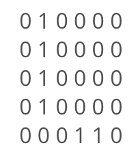
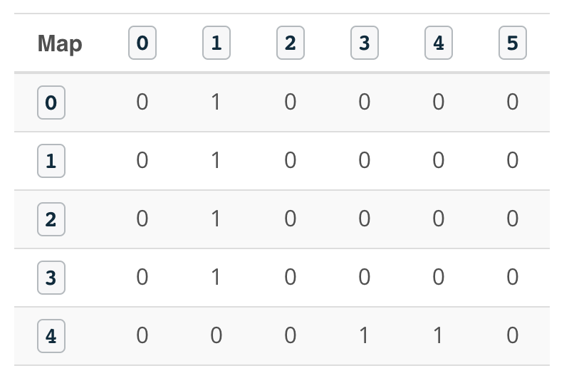
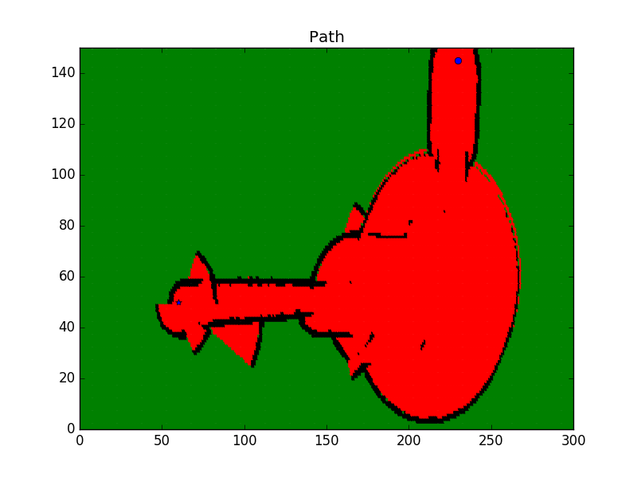

# Introduction
Welcome to the path planning lab! Here, you will get a chance to code two of the path planning algorithms that you’ve learned earlier.

You will first code the **Breadth-first search** algorithm in C++. This algorithm is divided into different coding quizzes. You will challenge yourself and code each one of them to finally generate the shortest path of a robot moving from start to goal.

Then, you will move on and make the necessary changes to code the **A\*** algorithm. After coding both the BFS and A* algorithms, you will visually compare the expansion lists generated. After a close inspection, you will judge which of these algorithms is more efficient.

Later in this lab, you will apply the A* algorithm to a real-world problem. The real-world problem is nothing but the map that you’ve generated using the occupancy grid mapping algorithm.

Alright now, let’s get started!

# Modeling the Problem
The purpose of this lab is to find the shortest path for a robot moving inside a 5x6 map from start to goal position using different path planning algorithms. The robot can only move in four directions: up, left, down, and right. We will first model this problem using classes in C++ and later solve it with the BFS and A* algorithms.

**Given**

<p align="center">

</p>

Where 1's represent obstacles and 0's represent free space.

**Robot Start position:** `0,0`

**Robot Goal Position:** `4,5`

**Direction of Movement:** Up(`-1,0`) - left(`0,-1`) - down(`1,0`) - right(`0,1`)

The Direction of Movement vector is a collection of four different 2D vectors each of which enables you to move between grid cells in the map.

**Movement Arrows:** Up(`^`) - left(`<`) - down(`v`) - right(`>`)

The Movement Arrows vector store the robot actions, this vector will be used later in this lab to visualize the robot orientation at each grid cell on the shortest path.

**Cost of Movement:** `1`

The Cost of Movement value indicates how much it cost to move from one cell to another. Here, the cost is equal for all possible movements.

### Quiz
In this quiz, you'll have three main tasks to accomplish in order to model the problem:

- Define a Map class and initialize the grid, its width, and height
- Define a Planner class and initialize the robot's start position, goal position, cost of movement, movements arrows, and values
- Define a `print2DVector` function which will print 2D vectors of any data type.

### Note
Throughout this lab, you'll be working with 1D and 2D vectors in C++. Vectors allow you to easily manage and manipulate the data with pre-built functions. For example: the `pop_back` function can be used to delete the last element in the vector.

If you are not already familiar with vectors, I recommend you read the following two sources before you start coding:

1. [2D Vectors](https://www.geeksforgeeks.org/2d-vector-in-cpp-with-user-defined-size/): Learn how to define and use 2D Vectors in C++.
2. [Documentation](http://www.cplusplus.com/reference/vector/vector/): Learn the vectors iterators and modifiers.

```cpp
#include <iostream>
#include <string.h>
#include <vector>
#include <algorithm>

using namespace std;

// Map class
class Map {
public:
    const static int mapWidth = 6;
    const static int mapHeight = 5;
    vector<vector<int> > grid = {
        { 0, 1, 0, 0, 0, 0 },
        { 0, 1, 0, 0, 0, 0 },
        { 0, 1, 0, 0, 0, 0 },
        { 0, 1, 0, 0, 0, 0 },
        { 0, 0, 0, 1, 1, 0 }
    };
};

// Planner class
class Planner : Map {
public:
    int start[2] = { 0, 0 };
    int goal[2] = { mapHeight - 1, mapWidth - 1 };
    int cost = 1;

    string movements_arrows[4] = { "^", "<", "v", ">" };

    vector<vector<int> > movements{
        { -1, 0 },
        { 0, -1 },
        { 1, 0 },
        { 0, 1 }
    };
};

// Template function to print 2D vectors of any type
template <typename T>
void print2DVector(T Vec)
{
    for (int i = 0; i < Vec.size(); ++i) {
        for (int j = 0; j < Vec[0].size(); ++j) {
            cout << Vec[i][j] << ' ';
        }
        cout << endl;
    }
}

int main()
{
    // Instantiate map and planner objects
    Map map;
    Planner planner;

    // Print classes variables
    cout << "Map:" << endl;
    print2DVector(map.grid);
    cout << "Start: " << planner.start[0] << " , " << planner.start[1] << endl;
    cout << "Goal: " << planner.goal[0] << " , " << planner.goal[1] << endl;
    cout << "Cost: " << planner.cost << endl;
    cout << "Robot Movements: " << planner.movements_arrows[0] << " , " << planner.movements_arrows[1] << " , " << planner.movements_arrows[2] << " , " << planner.movements_arrows[3] << endl;
    cout << "Delta:" << endl;
    print2DVector(planner.movements);

    return 0;
}
```

# BFS: Expansion List
Now that you’ve modeled the problem using a Map and a Planner class in C++, you'll start with the first part of the BFS algorithm. In this quiz, you’ll write the search function which will expand the cells with the lowest cost until the goal is reached.

For that, you will need to represent each cell with a triplet value **`[g, x, y]`** where **`g`** represents the total cost of expanding toward this cell, **`x`** is the row value, and **`y`** is the column value.

Your function should print the final triplet value of the goal once it expands towards it.

### Multiple things to keep in mind while coding the search function
- As you expand towards a new cell, check if you have reached the goal; and once you reach it, print its triplet value.
- Actively check if you have reached a roadblock. If you do, stop expanding and print a message indicating that you have failed to reach the goal.
- Expand the cells with the lowest **`g`** value and store your expansions in an **`open`** vector. If two cells have equal **`g`** values, then you can to pick one of them to expand further.

### Hint
Here's how the cells are being expanded with the **BFS** algorithm until the goal is reached:

<p align="center">

</p>

```
Expansion #: 0
Open List: [0 0 0 ] 
Cell Picked: [0 0 0]

Expansion #: 1 
Open List: [1 1 0 ] 
Cell Picked: [1 1 0]

Expansion #: 2
Open List: [2 2 0 ]
Cell Picked: [2 2 0]

Expansion #: 3
Open List: [3 3 0 ]
Cell Picked: [3 3 0]

Expansion #: 4
Open List: [4 4 0 ]
Cell Picked: [4 4 0]

Expansion #: 5
Open List: [5 4 1 ]
Cell Picked: [5 4 1]

Expansion #: 6
Open List: [6 4 2 ]
Cell Picked: [6 4 2]

Expansion #: 7
Open List: [7 3 2 ]
Cell Picked: [7 3 2]

Expansion #: 8
Open List: [8 3 3 ], [8 2 2 ]
Cell Picked: [8 2 2]

Expansion #: 9
Open List: [9 2 3 ], [9 1 2 ], [8 3 3 ]
Cell Picked: [8 3 3]

Expansion #: 10
Open List: [9 3 4 ], [9 2 3 ], [9 1 2 ]
Cell Picked: [9 1 2]

Expansion #: 11 
Open List: [10 1 3 ], [10 0 2 ], [9 3 4 ], [9 2 3 ]
Cell Picked: [9 2 3]

Expansion #: 12
Open List: [10 2 4 ], [10 1 3 ], [10 0 2 ], [9 3 4 ]
Cell Picked: [9 3 4]

Expansion #: 13
Open List: [10 3 5 ], [10 2 4 ], [10 1 3 ], [10 0 2 ]
Cell Picked: [10 0 2]

Expansion #: 14
Open List: [11 0 3 ], [10 3 5 ], [10 2 4 ], [10 1 3 ]
Cell Picked: [10 1 3]

Expansion #: 15
Open List: [11 1 4 ], [11 0 3 ], [10 3 5 ], [10 2 4 ]
Cell Picked: [10 2 4]

Expansion #: 16
Open List: [11 2 5 ], [11 1 4 ], [11 0 3 ], [10 3 5 ]
Cell Picked: [10 3 5]

Expansion #: 17
Open List: [11 4 5 ], [11 2 5 ], [11 1 4 ], [11 0 3 ]
Cell Picked: [11 0 3]

Expansion #: 18
Open List: [12 0 4 ], [11 4 5 ], [11 2 5 ], [11 1 4 ]
Cell Picked: [11 1 4]

Expansion #: 19
Open List: [12 1 5 ], [12 0 4 ], [11 4 5 ], [11 2 5 ]
Cell Picked: [11 2 5]

Expansion #: 20
Open List: [12 1 5 ], [12 0 4 ], [11 4 5 ]
Cell Picked: [11 4 5]
```

```cpp
#include <iostream>
#include <string.h>
#include <vector>
#include <algorithm>

using namespace std;

// Map class
class Map {
public:
    const static int mapWidth = 6;
    const static int mapHeight = 5;
    vector<vector<int> > grid = {
        { 0, 1, 0, 0, 0, 0 },
        { 0, 1, 0, 0, 0, 0 },
        { 0, 1, 0, 0, 0, 0 },
        { 0, 1, 0, 0, 0, 0 },
        { 0, 0, 0, 1, 1, 0 }
    };
};

// Planner class
class Planner : Map {
public:
    int start[2] = { 0, 0 };
    int goal[2] = { mapHeight - 1, mapWidth - 1 };
    int cost = 1;

    string movements_arrows[4] = { "^", "<", "v", ">" };

    vector<vector<int> > movements{
        { -1, 0 },
        { 0, -1 },
        { 1, 0 },
        { 0, 1 }
    };
};

// Template function to print 2D vectors of any type
template <typename T>
void print2DVector(T Vec)
{
    for (int i = 0; i < Vec.size(); ++i) {
        for (int j = 0; j < Vec[0].size(); ++j) {
            cout << Vec[i][j] << ' ';
        }
        cout << endl;
    }
}

// Search function which generates the expansions
void search(Map map, Planner planner)
{
    // Create a closed 2 array filled with 0s and first element 1
    vector<vector<int> > closed(map.mapHeight, vector<int>(map.mapWidth));
    closed[planner.start[0]][planner.start[1]] = 1;

    // Defined the triplet values
    int x = planner.start[0];
    int y = planner.start[1];
    int g = 0;

    // Store the expansions
    vector<vector<int> > open;
    open.push_back({ g, x, y });

    // Flags
    bool found = false;
    bool resign = false;

    int x2;
    int y2;

    // While I am still searching for the goal and the problem is solvable
    while (!found && !resign) {
        // Resign if no values in the open list and you can't expand anymore
        if (open.size() == 0) {
            resign = true;
            cout << "Failed to reach a goal" << endl;
        }
        // Keep expanding
        else {
            // Remove triplets from the open list
            sort(open.begin(), open.end());
            reverse(open.begin(), open.end());
            vector<int> next;
            // Stored the poped value into next
            next = open.back();
            open.pop_back();

            x = next[1];
            y = next[2];
            g = next[0];
            
            // Check if we reached the goal:
            if (x == planner.goal[0] && y == planner.goal[1]) {
                found = true;
                cout << "[" << g << ", " << x << ", " << y << "]" << endl;
            }

            //else expand new elements
            else {
                for (int i = 0; i < planner.movements.size(); i++) {
                    x2 = x + planner.movements[i][0];
                    y2 = y + planner.movements[i][1];
                    if (x2 >= 0 && x2 < map.grid.size() && y2 >= 0 && y2 < map.grid[0].size()) {
                        if (closed[x2][y2] == 0 and map.grid[x2][y2] == 0) {
                            int g2 = g + planner.cost;
                            open.push_back({ g2, x2, y2 });
                            closed[x2][y2] = 1;
                        }
                    }
                }
            }
        }
    }
}

int main()
{
    // Instantiate map and planner objects
    Map map;
    Planner planner;

    // Search for the expansions
    search(map, planner);

    return 0;
}
```

# BFS: Expansion Vector
Now that you have expanded the cells until you've reached the goal, you are asked to print the order in which each cell was expanded. For that, you’ll need to modify the search function and create a 2D **expansion** vector that is equal in size to the map. Each cell in the expansion vector will store the order at which it was expanded. Some of the cells were never expanded, and should show a value of **-1**.

### Hint
Take a look at the expansion list generated after running the code:

<p align="center">

</p>

You can see that we started with the first cell and ended at the goal cell which was expanded after **20** iterations. All the obstacles and some cells were never expanded and thus are showing a value of **-1**.

Now, go ahead and modify the search function to generate and print the expansion 2D vector.

```cpp
#include <iostream>
#include <string.h>
#include <vector>
#include <algorithm>

using namespace std;

// Map class
class Map {
public:
    const static int mapWidth = 6;
    const static int mapHeight = 5;
    vector<vector<int> > grid = {
        { 0, 1, 0, 0, 0, 0 },
        { 0, 1, 0, 0, 0, 0 },
        { 0, 1, 0, 0, 0, 0 },
        { 0, 1, 0, 0, 0, 0 },
        { 0, 0, 0, 1, 1, 0 }
    };
};

// Planner class
class Planner : Map {
public:
    int start[2] = { 0, 0 };
    int goal[2] = { mapHeight - 1, mapWidth - 1 };
    int cost = 1;

    string movements_arrows[4] = { "^", "<", "v", ">" };

    vector<vector<int> > movements{
        { -1, 0 },
        { 0, -1 },
        { 1, 0 },
        { 0, 1 }
    };
};

// Template function to print 2D vectors of any type
template <typename T>
void print2DVector(T Vec)
{
    for (int i = 0; i < Vec.size(); ++i) {
        for (int j = 0; j < Vec[0].size(); ++j) {
            cout << Vec[i][j] << ' ';
        }
        cout << endl;
    }
}

// Search function will generate the expansions
void search(Map map, Planner planner)
{
    // Create a closed 2 array filled with 0s and first element 1
    vector<vector<int> > closed(map.mapHeight, vector<int>(map.mapWidth));
    closed[planner.start[0]][planner.start[1]] = 1;

    // Create expand array filled with -1
    vector<vector<int> > expand(map.mapHeight, vector<int>(map.mapWidth, -1));

    // Defined the triplet values
    int x = planner.start[0];
    int y = planner.start[1];
    int g = 0;

    // Store the expansions
    vector<vector<int> > open;
    open.push_back({ g, x, y });

    // Flags and counters
    bool found = false;
    bool resign = false;
    int count = 0;

    int x2;
    int y2;

    // While I am still searching for the goal and the problem is solvable
    while (!found && !resign) {
        // Resign if no values in the open list and you can't expand anymore
        if (open.size() == 0) {
            resign = true;
            cout << "Failed to reach a goal" << endl;
        }
        // Keep expanding
        else {
            // Remove triplets from the open list
            sort(open.begin(), open.end());
            reverse(open.begin(), open.end());
            vector<int> next;
            // Stored the poped value into next
            next = open.back();
            open.pop_back();

            x = next[1];
            y = next[2];
            g = next[0];

            // Fill the expand vectors with count
            expand[x][y] = count;
            count += 1;
            
            // Check if we reached the goal:
            if (x == planner.goal[0] && y == planner.goal[1]) {
                found = true;
                //cout << "[" << g << ", " << x << ", " << y << "]" << endl;
            }

            //else expand new elements
            else {
                for (int i = 0; i < planner.movements.size(); i++) {
                    x2 = x + planner.movements[i][0];
                    y2 = y + planner.movements[i][1];
                    if (x2 >= 0 && x2 < map.grid.size() && y2 >= 0 && y2 < map.grid[0].size()) {
                        if (closed[x2][y2] == 0 and map.grid[x2][y2] == 0) {
                            int g2 = g + planner.cost;
                            open.push_back({ g2, x2, y2 });
                            closed[x2][y2] = 1;
                        }
                    }
                }
            }
        }
    }
    // Print the expansion List
    print2DVector(expand);
}

int main()
{
    // Instantiate map and planner objects
    Map map;
    Planner planner;

    // Search for the expansions
    search(map, planner);

    return 0;
}
```

# BFS: Shortest Path
The final step is to print the shortest path that the robot has to take in order to travel from start to goal. You will need to record each action that the robot should take(ex: turning left **`<`**) and store all the actions in a **policy** 2D vector.

### Hint
Here’s the output policy vector generated after running the code:

<p align="center">

</p>

You can see the different actions(**`v`** - **`>`** - **`<`** - **`^`**) that the robot has to take in order to reach the goal marked with the **`*`**. Some of these cells will never be visited by the robot and are marked with an **`-`**.

Now, go ahead and modify the search function to generate the policy 2D Vector.

```cpp
#include <iostream>
#include <string.h>
#include <vector>
#include <algorithm>

using namespace std;

// Map class
class Map {
public:
    const static int mapWidth = 6;
    const static int mapHeight = 5;
    vector<vector<int> > grid = {
        { 0, 1, 0, 0, 0, 0 },
        { 0, 1, 0, 0, 0, 0 },
        { 0, 1, 0, 0, 0, 0 },
        { 0, 1, 0, 0, 0, 0 },
        { 0, 0, 0, 1, 1, 0 }
    };
};

// Planner class
class Planner : Map {
public:
    int start[2] = { 0, 0 };
    int goal[2] = { mapHeight - 1, mapWidth - 1 };
    int cost = 1;

    string movements_arrows[4] = { "^", "<", "v", ">" };

    vector<vector<int> > movements{
        { -1, 0 },
        { 0, -1 },
        { 1, 0 },
        { 0, 1 }
    };
};

// Template function to print 2D vectors of any type
template <typename T>
void print2DVector(T Vec)
{
    for (int i = 0; i < Vec.size(); ++i) {
        for (int j = 0; j < Vec[0].size(); ++j) {
            cout << Vec[i][j] << ' ';
        }
        cout << endl;
    }
}

// Search function will generate the expansions
void search(Map map, Planner planner)
{
    // Create a closed 2 array filled with 0s and first element 1
    vector<vector<int> > closed(map.mapHeight, vector<int>(map.mapWidth));
    closed[planner.start[0]][planner.start[1]] = 1;

    // Create expand array filled with -1
    vector<vector<int> > expand(map.mapHeight, vector<int>(map.mapWidth, -1));

    // Create action array filled with -1
    vector<vector<int> > action(map.mapHeight, vector<int>(map.mapWidth, -1));

    // Defined the triplet values
    int x = planner.start[0];
    int y = planner.start[1];
    int g = 0;

    // Store the expansions
    vector<vector<int> > open;
    open.push_back({ g, x, y });

    // Flags and counters
    bool found = false;
    bool resign = false;
    int count = 0;

    int x2;
    int y2;

    // While I am still searching for the goal and the problem is solvable
    while (!found && !resign) {
        // Resign if no values in the open list and you can't expand anymore
        if (open.size() == 0) {
            resign = true;
            cout << "Failed to reach a goal" << endl;
        }
        // Keep expanding
        else {
            // Remove triplets from the open list
            sort(open.begin(), open.end());
            reverse(open.begin(), open.end());
            vector<int> next;
            // Stored the poped value into next
            next = open.back();
            open.pop_back();

            x = next[1];
            y = next[2];
            g = next[0];

            // Fill the expand vectors with count
            expand[x][y] = count;
            count += 1;

            // Check if we reached the goal:
            if (x == planner.goal[0] && y == planner.goal[1]) {
                found = true;
                //cout << "[" << g << ", " << x << ", " << y << "]" << endl;
            }

            //else expand new elements
            else {
                for (int i = 0; i < planner.movements.size(); i++) {
                    x2 = x + planner.movements[i][0];
                    y2 = y + planner.movements[i][1];
                    if (x2 >= 0 && x2 < map.grid.size() && y2 >= 0 && y2 < map.grid[0].size()) {
                        if (closed[x2][y2] == 0 and map.grid[x2][y2] == 0) {
                            int g2 = g + planner.cost;
                            open.push_back({ g2, x2, y2 });
                            closed[x2][y2] = 1;
                            action[x2][y2] = i;
                        }
                    }
                }
            }
        }
    }
    // Print the expansion List
    //print2DVector(expand);

    // Find the path with robot orientation
    vector<vector<string> > policy(map.mapHeight, vector<string>(map.mapWidth, "-"));

    // Going backward
    x = planner.goal[0];
    y = planner.goal[1];
    policy[x][y] = '*';

    while (x != planner.start[0] or y != planner.start[1]) {
        x2 = x - planner.movements[action[x][y]][0];
        y2 = y - planner.movements[action[x][y]][1];
        policy[x2][y2] = planner.movements_arrows[action[x][y]];
        x = x2;
        y = y2;
    }

    // Print the path with arrows
    print2DVector(policy);
}

int main()
{
    // Instantiate map and planner objects
    Map map;
    Planner planner;

    // Search for the expansions
    search(map, planner);

    return 0;
}
```

# A*: Shortest Path
You’ll now implement the A* algorithm and find the shortest path by modifying your previous code. As you know, A* is based on a heuristic function. Thus, we will implement a Manhattan-based heuristic vector and compute the Manhattan distance of each cell with respect to the goal position where:

<p align="center">

</p>

By computing the Manhattan distance of each cell, we'll obtain this heuristic vector

<p align="center">

</p>

You can always experiment with other heuristic-based vectors such as the Euclidean distance or the Chebyshev distance where:

<p align="center">

</p>

### Expansion
And now instead of expanding cells with lowest path cost **g**, you’ll expand cells with lowest **f** value which is the sum of the path cost **g** and the heuristic value **h** of that cell.

<p align="center">

</p>

Each cell is now represented with a quadruplet **`[f,g,x,y]`** instead of a triplet **`[g,x,y]`**.

### A*: Shortest Path
Follow these steps and make the necessary changes to find the shortest path using the A* algorithm:

- Define a Manhattan-based **heuristic** vector inside the Map class.
- Introduce an **`f`** value.
- Represent cells in terms of a quadruplet **`[f,g,x,y]`** and expand the ones with the lowest **`f`** value.
- Print both the **expansion** vector and the **policy** vector.

### Hint
Here's how the cells are being expanded with the **A\*** algorithm until the goal is reached:

<p align="center">

</p>

```
Expansion #: 0
Open List: [9 0 0 0 ] 
Cell Picked: [9 0 0 0]

Expansion #: 1
Open List: [9 1 1 0 ] 
Cell Picked: [9 1 1 0]

Expansion #: 2
Open List: [9 2 2 0 ] 
Cell Picked: [9 2 2 0]

Expansion #: 3
Open List: [9 3 3 0 ] 
Cell Picked: [9 3 3 0]

Expansion #: 4
Open List: [9 4 4 0 ] 
Cell Picked: [9 4 4 0]

Expansion #: 5
Open List: [9 5 4 1 ] 
Cell Picked: [9 5 4 1]

Expansion #: 6
Open List: [9 6 4 2 ] 
Cell Picked: [9 6 4 2]

Expansion #: 7
Open List: [11 7 3 2 ] 
Cell Picked: [11 7 3 2]

Expansion #: 8
Open List: [13 8 2 2 ], [11 8 3 3 ] 
Cell Picked: [11 8 3 3]

Expansion #: 9
Open List: [13 9 2 3 ], [13 8 2 2 ], [11 9 3 4 ] 
Cell Picked: [11 9 3 4]

Expansion #: 10
Open List: [13 10 2 4 ], [13 9 2 3 ], [13 8 2 2 ], [11 10 3 5 ] 
Cell Picked: [11 10 3 5]

Expansion #: 11
Open List: [13 11 2 5 ], [13 10 2 4 ], [13 9 2 3 ], [13 8 2 2 ], [11 11 4 5 ] 
Cell Picked: [11 11 4 5]
```

```cpp
#include <iostream>
#include <string.h>
#include <vector>
#include <algorithm>

using namespace std;

// Map class
class Map {
public:
    const static int mapWidth = 6;
    const static int mapHeight = 5;
    vector<vector<int> > grid = {
        { 0, 1, 0, 0, 0, 0 },
        { 0, 1, 0, 0, 0, 0 },
        { 0, 1, 0, 0, 0, 0 },
        { 0, 1, 0, 0, 0, 0 },
        { 0, 0, 0, 1, 1, 0 }
    };

    vector<vector<int> > heuristic = {
        { 9, 8, 7, 6, 5, 4 },
        { 8, 7, 6, 5, 4, 3 },
        { 7, 6, 5, 4, 3, 2 },
        { 6, 5, 4, 3, 2, 1 },
        { 5, 4, 3, 2, 1, 0 }
    };
};

// Planner class
class Planner : Map {
public:
    int start[2] = { 0, 0 };
    int goal[2] = { mapHeight - 1, mapWidth - 1 };
    int cost = 1;

    string movements_arrows[4] = { "^", "<", "v", ">" };

    vector<vector<int> > movements{
        { -1, 0 },
        { 0, -1 },
        { 1, 0 },
        { 0, 1 }
    };
};

// Template function to print 2D vectors of any type
template <typename T>
void print2DVector(T Vec)
{
    for (int i = 0; i < Vec.size(); ++i) {
        for (int j = 0; j < Vec[0].size(); ++j) {
            cout << Vec[i][j] << ' ';
        }
        cout << endl;
    }
}

// Search function will generate the expansions
void search(Map map, Planner planner)
{
    // Create a closed 2 array filled with 0s and first element 1
    vector<vector<int> > closed(map.mapHeight, vector<int>(map.mapWidth));
    closed[planner.start[0]][planner.start[1]] = 1;

    // Create expand array filled with -1
    vector<vector<int> > expand(map.mapHeight, vector<int>(map.mapWidth, -1));

    // Create action array filled with -1
    vector<vector<int> > action(map.mapHeight, vector<int>(map.mapWidth, -1));

    // Defined the quadruplet values
    int x = planner.start[0];
    int y = planner.start[1];
    int g = 0;
    int f = g + map.heuristic[x][y];

    // Store the expansions
    vector<vector<int> > open;
    open.push_back({ f, g, x, y });

    // Flags and Counts
    bool found = false;
    bool resign = false;
    int count = 0;

    int x2;
    int y2;

    // While I am still searching for the goal and the problem is solvable
    while (!found && !resign) {
        // Resign if no values in the open list and you can't expand anymore
        if (open.size() == 0) {
            resign = true;
            cout << "Failed to reach a goal" << endl;
        }
        // Keep expanding
        else {
            // Remove quadruplets from the open list
            sort(open.begin(), open.end());
            reverse(open.begin(), open.end());
            vector<int> next;
            // Stored the poped value into next
            next = open.back();
            open.pop_back();

            x = next[2];
            y = next[3];
            g = next[1];

            // Fill the expand vectors with count
            expand[x][y] = count;
            count += 1;
            
            // Check if we reached the goal:
            if (x == planner.goal[0] && y == planner.goal[1]) {
                found = true;
                //cout << "[" << g << ", " << x << ", " << y << "]" << endl;
            }

            //else expand new elements
            else {
                for (int i = 0; i < planner.movements.size(); i++) {
                    x2 = x + planner.movements[i][0];
                    y2 = y + planner.movements[i][1];
                    if (x2 >= 0 && x2 < map.grid.size() && y2 >= 0 && y2 < map.grid[0].size()) {
                        if (closed[x2][y2] == 0 and map.grid[x2][y2] == 0) {
                            int g2 = g + planner.cost;
                            f = g2 + map.heuristic[x2][y2];
                            open.push_back({ f, g2, x2, y2 });
                            closed[x2][y2] = 1;
                            action[x2][y2] = i;
                        }
                    }
                }
            }
        }
    }

    // Print the expansion List
    print2DVector(expand);

    // Find the path with robot orientation
    vector<vector<string> > policy(map.mapHeight, vector<string>(map.mapWidth, "-"));

    // Going backward
    x = planner.goal[0];
    y = planner.goal[1];
    policy[x][y] = '*';

    while (x != planner.start[0] or y != planner.start[1]) {
        x2 = x - planner.movements[action[x][y]][0];
        y2 = y - planner.movements[action[x][y]][1];
        policy[x2][y2] = planner.movements_arrows[action[x][y]];
        x = x2;
        y = y2;
    }

    // Print the robot path
    cout << endl; 
    print2DVector(policy);
}

int main()
{
    // Instantiate a planner and map objects
    Map map;
    Planner planner;

    search(map, planner);

    return 0;
}
```

# Comparison
Now that you’ve coded both the **BFS** and **A\*** algorithms, let’s take a closer look at their expansion list and compare them.


### Result
You can clearly see that **A\*** is more efficient since it did not expand in the free space as BFS did. With A* we reached the goal with only 11 expansions compared to 20 with BFS.

<p align="center">

</p>

# A*: Real-World Map
Now it’s time to apply the A* algorithm that you’ve coded earlier to a real-world map.

<p align="center">

</p>

If you recall, this map is the one you generated with the occupancy grid mapping algorithm using both sonar and odometry data. Our aim is now to find the shortest path for the robot to cross from start **`o`** to goal **`*`** position.

### Given
**Map(`300x150`):** The map data stored in the `map.txt` file in form of log odds values. As a reminder, here's how you should interpret these numbers:

- A cell is considered **unknown** if its log odds value is **equal to 0**.
- A cell is considered as **occupied** if its log odds is **larger than 0**.
- A cell is considered as **free** if its log odds value is **less than 0**.

**Grid(`300x150`):** The log odds values converted to 0’s and 1’s where **0** represents the **free** space and **1** represents the **occupied or unknown** space.

**Robot Start position:** `230,145`

**Robot Goal Position:** `60,50`

**Direction of Movement:** Up(`-1,0`) - left(`0,-1`) - down(`1,0`) - right(`0,1`)

**Movement Arrows:** Up(`^`) - left(`<`) - down(`v`) - right(`>`)

**Cost of Movement:** `1`

**Heuristic Vector:** `Manhattan`

If you scroll down to the code, you will notice that I added three new functions to the Map class. I coded a `GetMap` function which reads the `map.txt` log odds values and assign them the `map` variable. You will code the `MapToGrid` function in order to convert the log odds values to 0’s and 1’s. These 0 and 1 values will be assigned to the `grid` variable. And finally, the `GeneratedHeuristic` function is another function that you have to code in order to generate a Manhattan-based heuristic vector by computing the Manhattan distance of each cell with respect to the goal position. As a reminder the Manhattan distance of each cell can be calculated as follow:

<p align="center">

</p>

### A*: Real-World Map
Follow these instructions to generate the shortest path using the A* algorithm:

- Edit the `mapHeight` value inside the **Map** class
- Edit the `mapWidth` value inside the **Map** class
- Code the `MapToGrid` function
- Code the `GenerateHeuristic` function to generate a Manhattan-based heuristic vector
- Edit the `start` value inside the **Planner** class
- Edit the `goal` value inside the **Planner** class
- Print the **policy** vector

**NOTE:** `map.txt` file is stored inside the `/codes` folder.

```cpp
#include <iostream>
#include <math.h>
#include <vector>
#include <algorithm>
#include <fstream>

using namespace std;

// Map class
class Map {
public:
    const static int mapHeight = 300;
    const static int mapWidth = 150;
    vector<vector<double> > map = GetMap();
    vector<vector<int> > grid = MaptoGrid();
    vector<vector<int> > heuristic = GenerateHeuristic();

private:
    // Read the file and get the map
    vector<vector<double> > GetMap()
    {
        vector<vector<double> > mymap(mapHeight, vector<double>(mapWidth));
        ifstream myReadFile;
        myReadFile.open("map.txt");

        while (!myReadFile.eof()) {
            for (int i = 0; i < mapHeight; i++) {
                for (int j = 0; j < mapWidth; j++) {
                    myReadFile >> mymap[i][j];
                }
            }
        }
        return mymap;
    }

    //Convert the map to 1's and 0's
    vector<vector<int> > MaptoGrid()
    {
        vector<vector<int> > grid(mapHeight, vector<int>(mapWidth));
        for (int x = 0; x < mapHeight; x++) {
            for (int y = 0; y < mapWidth; y++) {
                if (map[x][y] == 0) //unkown state
                    grid[x][y] = 1;

                else if (map[x][y] > 0) //Occupied state
                    grid[x][y] = 1;

                else //Free state
                    grid[x][y] = 0;
            }
        }

        return grid;
    }

    // Generate a Manhattan Heuristic Vector
    vector<vector<int> > GenerateHeuristic()
    {
        vector<vector<int> > heuristic(mapHeight, vector<int>(mapWidth));
        int goal[2] = { 60, 50 };
        for (int i = 0; i < heuristic.size(); i++) {
            for (int j = 0; j < heuristic[0].size(); j++) {
                int xd = goal[0] - i;
                int yd = goal[1] - j;
                // Manhattan Distance
                   int d = abs(xd) + abs(yd);
                // Euclidian Distance
                // double d = sqrt(xd * xd + yd * yd);
                // Chebyshev distance
                // int d = max(abs(xd), abs(yd));
                heuristic[i][j] = d;
            }
        }
        return heuristic;
    }
};

// Planner class
class Planner : Map {
public:
    int start[2] = { 230, 145 };
    int goal[2] = { 60, 50 };
    int cost = 1;

    string movements_arrows[4] = { "^", "<", "v", ">" };

    vector<vector<int> > movements{
        { -1, 0 },
        { 0, -1 },
        { 1, 0 },
        { 0, 1 }
    };

    vector<vector<int> > path;
};

// Printing vectors of any type
template <typename T>
void print2DVector(T Vec)
{
    for (int i = 0; i < Vec.size(); ++i) {
        for (int j = 0; j < Vec[0].size(); ++j) {
            cout << Vec[i][j] << ' ';
        }
        cout << endl;
    }
}

Planner search(Map map, Planner planner)
{
    // Create a closed 2 array filled with 0s and first element 1
    vector<vector<int> > closed(map.mapHeight, vector<int>(map.mapWidth));
    closed[planner.start[0]][planner.start[1]] = 1;

    // Create expand array filled with -1
    vector<vector<int> > expand(map.mapHeight, vector<int>(map.mapWidth, -1));

    // Create action array filled with -1
    vector<vector<int> > action(map.mapHeight, vector<int>(map.mapWidth, -1));

    // Defined the quadruplet values
    int x = planner.start[0];
    int y = planner.start[1];
    int g = 0;
    int f = g + map.heuristic[x][y];

    // Store the expansions
    vector<vector<int> > open;
    open.push_back({ f, g, x, y });

    // Flags and Counts
    bool found = false;
    bool resign = false;
    int count = 0;

    int x2;
    int y2;

    // While I am still searching for the goal and the problem is solvable
    while (!found && !resign) {
        // Resign if no values in the open list and you can't expand anymore
        if (open.size() == 0) {
            resign = true;
            cout << "Failed to reach a goal" << endl;
        }
        // Keep expanding
        else {
            // Remove quadruplets from the open list
            sort(open.begin(), open.end());
            reverse(open.begin(), open.end());
            vector<int> next;
            // Stored the poped value into next
            next = open.back();
            open.pop_back();

            x = next[2];
            y = next[3];
            g = next[1];

            // Fill the expand vectors with count
            expand[x][y] = count;
            count += 1;
            

            // Check if we reached the goal:
            if (x == planner.goal[0] && y == planner.goal[1]) {
                found = true;
                //cout << "[" << g << ", " << x << ", " << y << "]" << endl;
            }

            //else expand new elements
            else {
                for (int i = 0; i < planner.movements.size(); i++) {
                    x2 = x + planner.movements[i][0];
                    y2 = y + planner.movements[i][1];
                    if (x2 >= 0 && x2 < map.grid.size() && y2 >= 0 && y2 < map.grid[0].size()) {
                        if (closed[x2][y2] == 0 and map.grid[x2][y2] == 0) {
                            int g2 = g + planner.cost;
                            f = g2 + map.heuristic[x2][y2];
                            open.push_back({ f, g2, x2, y2 });
                            closed[x2][y2] = 1;
                            action[x2][y2] = i;
                        }
                    }
                }
            }
        }
    }

    // Print the expansion List
    //print2DVector(expand);

    // Find the path with robot orientation
    vector<vector<string> > policy(map.mapHeight, vector<string>(map.mapWidth, "-"));

    // Going backward
    x = planner.goal[0];
    y = planner.goal[1];
    policy[x][y] = '*';

    while (x != planner.start[0] or y != planner.start[1]) {
        x2 = x - planner.movements[action[x][y]][0];
        y2 = y - planner.movements[action[x][y]][1];
        // Store the  Path in a vector
        planner.path.push_back({ x2, y2 });
        policy[x2][y2] = planner.movements_arrows[action[x][y]];
        x = x2;
        y = y2;
    }

    // Print the robot path
    //cout << endl;
    print2DVector(policy);

    return planner;
}

int main()
{
    // Instantiate a planner and map objects
    Map map;
    Planner planner;
    // Generate the shortest Path using the Astar algorithm
    planner = search(map, planner);

    return 0;
}
```

# A*: Visualization

### Path Planning
So far, you’ve generated the shortest path using the A* algorithm, but it was really hard to see it. Now, you'll edit the visualization function that you previously coded and modify it to plot the shortest path.

### Instruction

**Clone the Lab from GitHub**

```bash
$ cd /home/workspace/
$ git clone https://github.com/udacity/RoboND-A-Visualization
```

**Next, edit `main.cpp`**

Modify the `visualization` function and plot the start position, goal position, and path using the `matplotlib` python library. **Note** that you are required to use letter 'o' (not number character '0') and the asterisk '*' to mark the start and end states in visualization!

```cpp
void visualization(Map map, Planner planner)
{
    //Graph Format
    plt::title("Path");
    plt::xlim(0, map.mapHeight);
    plt::ylim(0, map.mapWidth);

    // Draw every grid of the map:
    for (double x = 0; x < map.mapHeight; x++) {
        cout << "Remaining Rows= " << map.mapHeight - x << endl;
        for (double y = 0; y < map.mapWidth; y++) {
            if (map.map[x][y] == 0) { //Green unkown state
                plt::plot({ x }, { y }, "g.");
            }
            else if (map.map[x][y] > 0) { //Black occupied state
                plt::plot({ x }, { y }, "k.");
            }
            else { //Red free state
                plt::plot({ x }, { y }, "r.");
            }
        }
    }

    // TODO: Plot start and end states in blue colors using o and * respectively

    // TODO: Plot the robot path in blue color using a .

    //Save the image and close the plot
    plt::save("./Images/Path.png");
    plt::clf();
}
```

Here are some helpful commands you can use to generate plots with the `matplotlib` library:

- Set Title: `plt::title("Your Title");`
- Set Limits: `plt::xlim(x-axis lower limit, x-axis upper limit );`
- Plot Data: `plt::plot({ x-value }, { y-value }, "Color and Shape");`
- Save Plot: `plt::save("File name and directory");`
- Close Plot: `plt::clf();`

Check out this [link](https://github.com/lava/matplotlib-cpp) for more information on the `matplotlib` C++ library. For information regarding the plot color and shape refer to the LineSpec and LineColor section of the [MATLAB](https://www.mathworks.com/help/matlab/ref/plot.html?requestedDomain=true) documentation.


**Then, compile the program**

```bash
$ cd RoboND-A-Visualization/
$ rm -rf Images/*    #Delete the folder content and not the folder itself!
$ g++ main.cpp -o app -std=c++11 -I/usr/include/python2.7 -lpython2.7
```

**Finally, run the program**

```bash
$ ./app
```

If you get a warning regarding the `matplotlib` library, just ignore it.

Now, wait for the program to generate the path and store it in the /`home/workspace/RoboND-A-Visualization/Images` directory!

### Generated Path

<p align="center">

</p>

**Map legend:**

- Green: Unkown/Undiscovered zone
- Red: Free zone
- Black: Occupied zone
- Blue: Shortest Path

