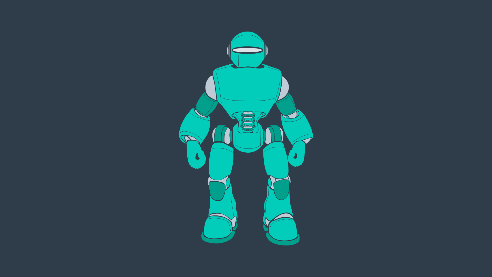
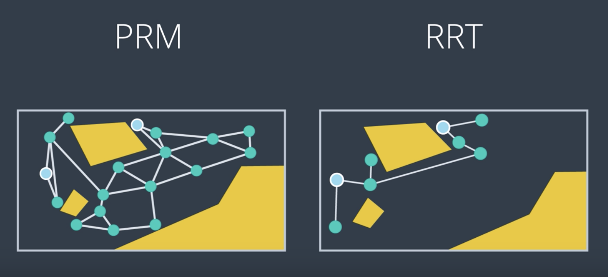

# Introduction to Sample-Based & Probabilistic Path Planning
The examples that we investigated in discrete (or combinatorial) planning were quite simple. They were two-dimensional examples of limited size. There are times when you can simplify your environment and robot to a two-dimensional representation. For instance, a vaccum robot traversing somebody's house. In such as case, there isn't a need for a complex three-dimensional representation, as a little robot can't do anything more than translate and rotate on the 2D plane that is the floor. 

But, there will also be times when you find yourself limited by the two-dimensional representation and will need to work in a three-dimensional world, with robots that have six degrees of freedom or more. Such a scenario is a lot more challenging to perform path planning in. It may be possible to apply the algorithms that you learned in the previous lesson, however, the efficiency of these algorithms becomes more and more critical. 

Performing a complete discretization of the entire space and applying a graph search algorithm to the space may be too costly. To tackle the path planning problems of larger size and greater dimension, there exists alternate algorithms that fall under the umbrella of the **sample-based path planning**.

Instead of conducting a complete discretization of the configuration space, there algorithms randomly sample the space hoping that the collection of samples will adequately represent the configuration space. 

See the video [here](https://youtu.be/msgVwQCM2C8).

# Why Sample-Based Planning?
So why exactly can’t we use discrete planning for higher dimensional problems? Well, it’s incredibly hard to discretize such a large space. The complexity of the path planning problem increases exponentially with the number of dimensions in the C-space.

### Increased Dimensionality
For a 2-dimensional 8-connected space, every node has 8 successors (8-connected means that from every cell you can move laterally or diagonally). Imagine a 3-dimensional 8-connected space, how many successors would every node have? 26. As the dimension of the C-space grows, the number of successors that every cell has increases substantially. In fact, for an n-dimensional space, it is equal to `3^n - 1`. 

It is not uncommon for robots and robotic systems to have large numbers of dimensions. Recall the robotic arm that you worked with in the pick-and-place project - that was a 6-DOF arm. If multiple 6-DOF arms work in a common space, the computation required to perform path planning to avoid collisions increases substantially. Then, think about the complexity of planning for humanoid robots such as the one depicted below. Such problems may take intolerably long to solve using the combinatorial approach.

### Constrained Dynamics
Aside from robots with many degrees of freedom and multi-robot systems, another computational difficulty involves working with robots that have constrained dynamics. For instance, a car is limited in its motion - it can move forward and backward, and it can turn with a limited turning radius - as you can see in the image below.

However, the car is not able to move laterally - as depicted in the following image. (As unfortunate as it is for those of us that struggle to parallel park!)

In the case of the car, more complex motion dynamics must be considered when path planning - including the derivatives of the state variables such as velocity. For example, a car's safe turning radius is dependent on it's velocity.

Robotic systems can be classified into two different categories - holonomic and non-holonomic. **Holonomic systems** can be defined as systems where every constraint depends exclusively on the current pose and time, and not on any derivatives with respect to time. **Nonholonomic systems**, on the other hand, are dependent on derivatives. Path planning for nonholonomic systems is more difficult due to the added constraints.

In this section, you will learn two different path planning algorithms, and understand how to tune their parameters for varying applications.

# Weakening Requirements
Combinatorial path planning algorithms are too inefficient to apply in high-dimensional environments, which means that some practical compromise is required to solve the problem! Instead of looking for a path planning algorithm that is both complete and optimal, what if the requirements of the algorithm were weakened?

Instead of aspiring to use an algorithm that is complete, the requirement can be weakened to use an algorithm that is probabilistically complete. A **probabilistically complete** algorithm is one who’s probability of finding a path, if one exists, increases to 1 as time goes to infinity.

Similarly, the requirement of an optimal path can be weakened to that of a feasible path. A **feasible path** is one that obeys all environmental and robot constraints such as obstacles and motion constraints. For high-dimensional problems with long computational times, it may take unacceptably long to find the optimal path, whereas a feasible path can be found with relative ease. Finding a feasible path proves that a path from start to goal exists, and if needed, the path can be optimized locally to improve performance.

Sample-based planning is probabilistically complete and looks for a feasible path instead of the optimal path.

# Sample-Based Path Planning
Sample-based path planning differs from combinatorial path planning in that it does not try to systematically discretize the entire configuration space. Instead, it samples the configuration space randomly (or semi-randomly) to build up a representation of the space. The resultant graph is not as precise as one created using combinatorial planning, but it is much quicker to construct because of the relatively small number of samples used.

Such a method is probabilistically complete because as time passes and the number of samples approaches infinity, the probability of finding a path, if one exists, approaches 1.

Such an approach is very effective in high-dimensional spaces, however it does have some downfalls. Sampling a space uniformly is not likely to reach small or narrow areas, such as the passage depicted in the image below. Since the passage is the only way to move from start to goal, it is critical that a sufficient number of samples occupy the passage, or the algorithm will return ‘no solution found’ to a problem that clearly has a solution.

Different sample-based planning approaches exist, each with their own benefits and downfalls. In the next few pages you will learn about,

- Probabilistic Roadmap Method
- Rapidly Exploring Random Tree Method

You will also learn about Path Smoothing - one improvement that can make resultant paths more efficient.

# Probabilistic Roadmap (PRM)
One common sampled-based path planning method is called the **Probabilistic Roadmap (PRM)**. PRM randomly samples the workspace, building up a graph to represent the free space. 

It does so without needing to construct the C space or discretize it. All that PRM requires is a collision check function to test whether a randomly generated nodes lies in the free space or is in collision with an obstacle. 

Let's consider the below workspace and add a few random samples to this workspace and see how PRM works. 

The process of building up a graph is called the **learning phase**. Since that's what the PRM does by sampling random configurations and adding them to the graph. It does so by generating a new random configuration represented by a node in the graph, and checking to see if it is in collision. If it is not, like the node you see here (the purple one), then PRM will try to connect the node to its neighbors. There are few different ways of doing so. 

- PRM can look for any number of neighbors within a certain radius of the node, or
- it could look for the nodes K nearest neighbors. 

Once the neighbors have been selected, PRM will see if they can successfully create an edge to each of its neighbors. As you see in the image above, one edge is in collision with an obstacle while the other three are safe to add. This node has been added to the graph and now this process can be repeated for another randomly generated node. The local planner must find a path between tow nodes or return that such a path does not exist, and it must do so quickly, since this step is repeated for every neighbor of every new node. 

One easy way to accomplish this is to draw a straight line between the two nodes and then check if any part of it collides with an obstacle. To do this, you can place a number of evenly spaced samples on the line (image below) and see whether any one of them is in a collision. You can work incrementally starting on one side of the edge and moving towards the other, or you can take a binary approach, checking the sample at the midpoint first. In this image below, that returns a collision right away. But if you didn't, you could continue breaking the edge up into segments, checking each midpoint sample for a collision. If all of the samples return no collision found, then the edge can be added to the graph. 

The process of adding new nodes and connecting them to the graph continues. Eventually, a certain criteria is met, such as a specific number of nodes or edges have been created, or a particular amount of time has elapsed. **At this point, the learning phase is over**. Then, PRM enters the **query phase**, where it uses the resulting graph to find a path from start to goal. 

- First, it must connect each of these to the graph. PRM does so by looking for the nodes closest to the start and goal and using the local planner to try to build a connection. 
- If this process is successful, then a search algorithm like A* search can be applied to find the path from start to goal. The resulting path may not be optimal, but it proves that moving from start to goal is feasible. 

See the video [here](https://youtu.be/hs9Xkujs-5M).

### Algorithm
The pseudocode for the PRM learning phase is provided below.

After the learning phase, comes the query phase.

### Setting Parameters
There are several parameters in the PRM algorithm that require tweaking to achieve success in a particular application. Firstly, the **number of iterations** can be adjusted - the parameter controls between how detailed the resultant graph is and how long the computation takes. For path planning problems in wide-open spaces, additional detail is unlikely to significantly improve the resultant path. However, the additional computation is required in complicated environments with narrow passages between obstacles. Beware, setting an insufficient number of iterations can result in a ‘path not found’ if the samples do not adequately represent the space.

Another decision that a robotics engineer would need to make is **how to find neighbors** for a randomly generated configuration. One option is to look for the k-nearest neighbors to a node. To do so efficiently, a [k-d](https://xlinux.nist.gov/dads/HTML/kdtree.html) tree can be utilized - to break up the space into ‘bins’ with nodes, and then search the bins for the nearest nodes. Another option is to search for any nodes within a certain distance of the goal. Ultimately, knowledge of the environment and the solution requirements will drive this decision-making process.

The choice for what type of **local planner** to use is another decision that needs to be made by the robotics engineer. The local planner demonstrated in the video is an example of a very simple planner. For most scenarios, a simple planner is preferred, as the process of checking an edge for collisions is repeated many times (k*n times, to be exact) and efficiency is key. However, more powerful planners may be required in certain problems. In such a case, the local planner could even be another PRM.

### Probabilistically Complete
As discussed before, sample-based path planning algorithms are probabilistically complete. Now that you have seen one such algorithm in action, you can see why this is the case. As the number of iterations approaches infinity, the graph approaches completeness and the optimal path through the graph approaches the optimal path in reality.

### Variants
The algorithm that you learned here is the vanilla version of PRM, but many other variations to it exist. The following link discusses several alternative strategies for implementing a PRM that may produce a more optimal path in a more efficient manner.

- [A Comparative Study of Probabilistic Roadmap Planners](http://www.staff.science.uu.nl/~gerae101/pdf/compare.pdf)

### PRM is a Multi-Query Planner
The Learning Phase takes significantly longer to implement than the Query Phase, which only has to connect the start and goal nodes, and then search for a path. However, the graph created by the Learning Phase can be reused for many subsequent queries. For this reason, PRM is called a **multi-query planner**.

This is very beneficial in static or mildly-changing environments. However, some environments change so quickly that PRM’s multi-query property cannot be exploited. In such situations, PRM’s additional detail and computational slow nature is not appreciated. A quicker algorithm would be preferred - one that doesn’t spend time going in all directions without influence by the start and goal.

**Some Notes on Probabilistic Roadmaps**

- PRM is indeed a multi-query planner. In it’s Learning Phase, PRM generates a representation of the entire environment, which can be applied in future queries.
- With an insufficient number of configurations in the graph, or many configurations resulting in collisions, a path may not be constructed between start and goal even if one exists.
- Due to the random sampling of nodes, the true optimal path is unlikely to be present in the connected graph.

# Rapidly Exploring Random Tree Method (RRT)
Another commonly utilized sample-based planning method is the **rapidly exploring random tree** method. RRT differs from PRM in that it is a single query planner. If you recall, PRM spent its learning phase building up a representation of the entire workspace. This was **computationally expensive**, but the resultant graph can be used for multiple queries. 

RRT disregards the need for a comprehensive graph, and builds on a new for each individual query, taking into account the start and goal positions as it does so. This results in a much smaller but more directed graph with a faster computation time. 

PRM is great for static environments, where you can reuse the graph, but certain environments change too quickly and the RRT method serves these environments well. 

Let's see what the RRT method looks like in the same environment as before with the same start and goal configurations. However, instead of adding these in the learning phase, they will be explicitly considered from the start. 

Then, we start to build up a representation of the workspace. **While the PRM built up a graph, RRT will build a tree, that is a type of graph where each node only has one parent**.

In a **single query planner**, you are only concerned about getting from start to goal and the lack of lateral connections between seemingly neighboring nodes is less of a concern. So, **what's the algorithm?**

- RRT will randomly generate a node; then it will find its closest neighbor. 
- If the node is within a certain distance, **`δ`** of the neighbor, then it can be connected directly, if the local planner determines the edge to be collision-free.
- However, if a newly generated node is a far distance away from all other nodes, then the chance of the edge between the node and and its nearest neighbor being collision-free is unlikely. In such a case, instead of connecting to this node, RRT will create a new node in the same direction, but a distance **`δ`** away. Then, this edge is checked for collisions, and if it's in the clear, the node is added to the tree. 
- Nodes can be generated by uniformly sampling the search space, which would favor wide unexplored spaces, or alternatively, some greediness can be introduced by increasing the probability of sampling near the goal, which would bias new samples in the direction of the goal. 
- Since RRT is a single query planner, slight biasing is often favorable to introduce. 
- One variation of the RRT method is one that grows two trees: one from the start and one from the goal. RRT alternates growing each tree, and at every step it tries to build an edge between the most recently added node and the other tree. Eventually, it succeeds and RRT knows that a path has been found from start to goal. 

**NOTE:** PRM and RRT are exemplary performers in multidimensional spaces for robots with many degrees of freedom. In fact, they have been able to solve problems that traditional path planning algorithms are unable to solve. 

See the video [here](https://youtu.be/kOS76UR7Fo8).

### Algorithm
The pseudocode for the RRT learning phase is provided below.

### Setting Parameters
Just like with PRM, there are a few parameters that can be tuned to make RRT more efficient for a given application.

The first of these parameters is the sampling method (ie. how a random configuration is generated). As discussed in the video, you can sample uniformly - which would favour wide unexplored spaces, or you can sample with a bias - which would cause the search to advance greedily in the direction of the goal. Greediness can be beneficial in simple planning problems, however in some environments it can cause the robot to get stuck in a local minima. It is common to utilize a uniform sampling method with a small hint of bias.

The next parameter that can be tuned is `δ`. As RRT starts to generate random configurations, a large proportion of these configurations will lie further than a distance `δ` from the closest configuration in the graph. In such a situation, a randomly generated node will dictate the direction of growth, while `δ` is the growth rate.

Choosing a small `δ` will result in a large density of nodes and small growth rate. On the other hand, choosing a large `δ` may result in lost detail, as well as an increasing number of nodes being unable to connect to the graph due to the greater chance of collisions with obstacles. `δ` must be chosen carefully, with knowledge of the environment and requirements of the solution.

### Single-Query Planner
Since the RRT method explores the graph starting with the start and goal nodes, the resultant graph cannot be applied to solve additional queries. RRT is a single-query planner.

RRT is, however, much quicker than PRM at solving a path planning problem. This is so because it takes into account the start and end nodes, and limits growth to the area surrounding the existing graph instead of reaching out into all distant corners, the way PRM does. RRT is more efficient than PRM at solving large path planning problems (ex. ones with hundreds of dimensions) in dynamic environments.

Generally speaking, RRT is able to solve problems with 7 dimensions in a matter of milliseconds, and may take several minutes to solve problems with over 20 dimensions. In comparison, such problems would be impossible to solve with the combinatorial path planning method.

### RRT & Non-holonomic Systems
While we will not go into significant detail on this topic, the RRT method supports planning for non-holonomic systems, while the PRM method does not. This is so because the RRT method can take into consideration the additional constraints (such as a car’s turning radius at a particular speed) when adding nodes to a graph, the same way it already takes into consideration how far away a new node is from an existing tree.

**Some Notes on RRT:**

- When a randomly generated configuration is greater than a distance, delta, from its closest neighbour, the algorithm will create a new node precisely a distance delta away, but along the same path.
- Unlike PRM, RRT is able to process the additional constraints to handle non-holonomic systems.
- If delta is set to a small value, the growth rate will be limited. If delta is set to a large value, it is more likely that edges between new and existing nodes will be in collision with obstacles.

# Path Smoothing
When you look at the paths produced by PRM and RRT, they're by no means optimal and can be quite jerky.

Instead of using these paths directly, some post-processing can be applied to smooth out the paths and improve the results. One simple algorithm that can be used is often referred to as **path shortcutter**. It looks for ways to shorten the resulting path, by connecting two non-neighboring nodes together. If it's able to find a pair of nodes whose edge is collision-free, then the original path between the two nodes is replaced with the shortcut edge. If this process is successful, then a search algorithm like A* search can be applied to find the path from start to goal. The resultant path may not be optimal, but it proves that moving from start to goal is feasible. 

See the video [here](https://youtu.be/R20Mpz5y7-w).

### Algorithm:
The following algorithm provides a method for smoothing the path by shortcutting.

Keep in mind that the path’s distance is not the only thing that can be optimized by the Path Shortcutter algorithm - it could optimize for path smoothness, expected energy use by the robot, safety, or any other measurable factor.

After the Path Shortcutting algorithm is applied, the result is a more optimized path. It may still not be the _optimal path_, but it should have at the very least moved towards a local minimum. There exist more complex, informed algorithms that can improve the performance of the Path Shortcutter. These are able to use information about the workspace to better guide the algorithm to a more optimal solution.

For large multi-dimensional problems, it is not uncommon for the time taken to optimize a path to exceed the time taken to search for a feasible solution in the first place.

# Overall Concerns

### Not Complete
Sample-based planning is not complete, it is probabilistically complete. In applications where decisions need to be made quickly, PRM & RRT may fail to find a path in difficult environments, such as the one shown below.

To path plan in an environment such as the one presented above, alternate means of sampling can be introduced (such as Gaussian or Bridge sampling). Alternate methods bias their placement of samples to obstacle edges or vertices of the open space.

### Not Optimal
Sample-based path planning isn’t optimal either - while an algorithm such as A* will find the most optimal path within the graph, the graph is not a thorough representation of the space, and so the true optimal path is unlikely to be represented in the graph.

### Conclusion
Overall, there is no silver bullet algorithm for sample-based path planning. The PRM & RRT algorithms perform acceptably in most environments, while others require customized solutions. An algorithm that sees a performance improvement in one application, is not guaranteed to perform better in others.

Ultimately, sample-based path planning makes multi-dimensional path planning feasible!

# Sample-Based Planning Wrap-Up
Probabilistic roadmaps and rapidly exploring random trees are two alternate algorithms for path planning which are espacially applicable in large high-dimensional spaces. Although the algorithms are not complete, they are considered to be **probabilistically complete**, as their completeness grows exponentially with the number of samples collected. The algorithms that we learned here are incredibly applicable in real world robotics. 

### Extended Reading
At this point, you have the knowledge to read through a paper on path planning. The following paper, [Path Planning for Non-Circular Micro Aerial Vehicles in Constrained Environments](https://www.cs.cmu.edu/~maxim/files/pathplanforMAV_icra13.pdf), addresses the problem of path planning for a quadrotor.

It is an enjoyable read that culminates the past two sections of path planning, as it references a number of planning methods that you have learned, and introduces a present-day application of path planning. Reading the paper will help you gain an appreciation of this branch of robotics, as well as help you gain confidence in the subject.

Some additional definitions that you may find helpful while reading the paper:

- **Anytime algorithm:** an anytime algorithm is an algorithm that will return a solution even if it's computation is halted before it finishes searching the entire space. The longer the algorithm plans, the more optimal the solution will be.
- **RRT*:** RRT* is a variant of RRT that tries to smooth the tree branches at every step. It does so by looking to see whether a child node can be swapped with it's parent (or it's parent's parent, etc) to produce a more direct path. The result is a less zig-zaggy and more optimal path.

# Introduction to Probabilistic Path Planning
Recall the exploratory rover introducted at the start of previous lesson. 

Its task was to find a path from its drop-off location to the goal location that would be safe for humans to follow. The terrain contains a lot of different hazards. The operator of the rover is willing to take whatever risk is necessary, but would naturally want to minimize it as much as possible. **The algorithms that we've learned thus far are unable to adequately model the risk**. For instance, a combinatorial path planning algorithm would have no difficulty finding the path to the goal location. The path may be the best by all other means, but due to the uncertainty of the rover motion, there is a chance that the rover will meet its demise along this path. 

It is possible to inflate the size of the rover to ensure that there is enough room to maneuver. But as we have seen, the algorithm will no longer be complete. 

Another idea is to give negative rewards to dangerous areas of the map so that the search algorithm is more likely to select alternate paths. 

Similar to what we do in reinforcement learning, this is a step in the right direction and would cause the rover to avoid dangerous areas. But, it does not actually consider the uncertainty of rover motion. 

What we'd really like is to model the uncertainty by considering a _**non-deterministic transition model**_. For instance, since the path execution is uncertain, an algorithm that takes the uncertainty into account explicitly is more likely to produce realistic paths. **So, where does that leave us?**

We're back to **Markov decision processes**. 

See the video [here](https://youtu.be/CF6kz2H00ZU).

# Markov Decision Process

