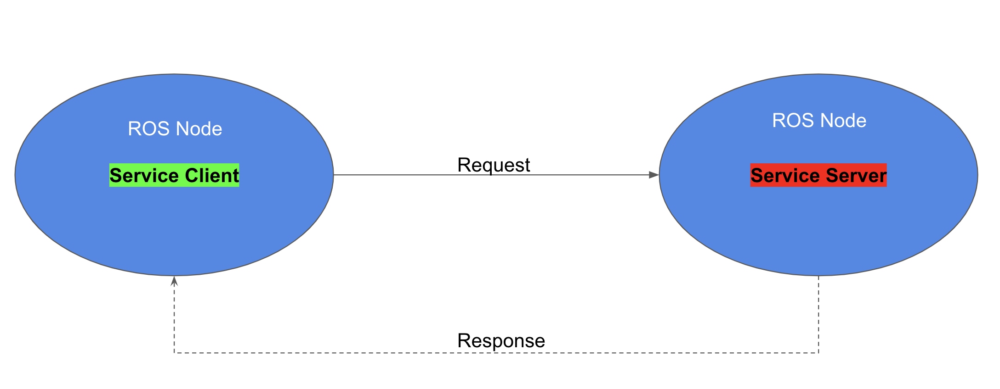

# Overview
Here, we'll write nodes in C++. The first node that we'll write is called `simple_mover`. The `simple_mover` node does nothing more than publish joint angle commands to `simple_arm`.

Then, we'll write another node called `arm_mover`. The `arm_mover` node provides a service called `safe_move`, which allows the arm to be moved to any position within its workspace that has been deemed safe. The safe zone is bounded by minimum and maximum joint angles, and is configurable via the ROS parameter server.

The last node we'll write is the `look_away` node. This node subscribes to the arm joint positions and a topic where camera data is being published. When the camera detects an image with uniform color, meaning that it’s looking at the sky, and the arm is not moving, the node will call the `safe_move` service via a client to move the arm to a new position.

# ROS Publishers
Before we write the code for `simple_mover`, it may be helpful to see how ROS Publishers work in C++.

Publishers allow a node to send messages to a topic, so that data from the node can be used in other parts of ROS. In C++, ROS publishers typically have the following definition format, although other parameters and arguments are possible:

```cpp
ros::Publisher pub1 = n.advertise<message_type>("/topic_name", queue_size);
```

The `pub1` object is a publisher object instantiated from the `ros::Publisher` class. This object allows you to publish messages by calling the `publish()` function.

To communicate with ROS master in C++, you need a **NodeHandle**. The node handle `n` will fully initialize the node.

The `advertise()` function is used to communicate with ROS and inform that you want to publish a message on a given topic name. The `"/topic_name"` indicates which topic the publisher will be publishing to.

The `message_type` is the type of message being published on "/topic_name". For example, the string message data type in ROS is `std_msgs::String`.

The `queue_size` indicates the number of messages that can be stored in a queue. A publisher can store messages in a queue until the messages can be sent. If the number of messages stored exceeds the size of the queue, the oldest messages are dropped.

Once the publisher object `pub1` has been created, as above, a `message` with the specified data type can be published as follows:

```cpp
pub1.publish(msg);
```

For more information about C++ ROS publishers, see the documentation [here](http://docs.ros.org/jade/api/roscpp/html/classros_1_1Publisher.html).

**Quiz!** Assume that a queued message is typically picked up in an average time of 1/10th of a second with a standard deviation of 1/20th of a second, and your publisher is publishing at a frequency of 10Hz. Of the options below, which would be the best setting for `queue_size`?

**Answer!** Choosing a good queue_size is somewhat subjective, but since messages are picked up at roughly the same rate that they are published, a `queue_size` of 2 provides a little room for messages to queue without being too large.

# Simple Mover
You will now go through the process of implementing your first ROS node in C++. This node is called `simple_mover`. As its name implies, this node only has one responsibility,and that is to command joint movements for `simple_arm`.

**Goal**

The goal of the `simple_mover` node is to command each joint in the simple arm and make it swing between -pi/2 to pi/2 over time. Here’s a demonstration of this node in action in [this video](https://youtu.be/Ki5LkE_xir4).

## Topics

To do so, it must publish joint angle command messages to the following topics:

| | |
|--------------|--------------------------------------------------------------|
| **Topic Name**   | /simple_arm/joint_1_position_controller/command              |
| **Message Type** | std_msgs/Float64                                             |
| **Description**  | Commands joint 1 to move counter-clockwise, units in radians |
| **Topic Name**   | /simple_arm/joint_2_position_controller/command              |
| **Message Type** | std_msgs/Float64                                             |
| **Description**  | Commands joint 2 to move counter-clockwise, units in radians |

**NOTE:** If you no longer have the `catkin_ws` or `simple_arm` package from the previous lesson, you need to re-create a new `catkin_ws` and clone the package inside your `/home/workspace/catkin_ws/src` with:

```bash
$ mkdir -p /home/workspace/catkin_ws/src/
$ cd /home/workspace/catkin_ws/src/
$ git clone -b first_interaction https://github.com/udacity/RoboND-simple_arm/ simple_arm
```

## Adding the source directory
In order to create a new node in C++, you must first create the `src` directory within the `simple_arm` package as it does not yet exist.

```bash
$ cd /home/workspace/catkin_ws/src/simple_arm/
$ mkdir src
```

## Creating a new script
Once the source directory has been created, C++ scripts can be added to the package. Now, create the `simple_mover` C++ script inside the source directory of the package.

```bash
$ cd /home/workspace/catkin_ws/src/simple_arm/src/
$ touch simple_mover.cpp
```

## The code
Below is the complete code for the `simple_mover` C++ node, with line-by-line comments embedded. You can copy and paste this code into the `simple_mover` script you created in `/home/workspace/catkin_ws/src/simple_arm/src/` directory like this:

First, open a new terminal. Then:

```bash
$ cd /home/workspace/catkin_ws/src/simple_arm/src/
$ gedit simple_mover.cpp
```

Below is the code for `simple_mover`:

```cpp
#include "ros/ros.h"
#include "std_msgs/Float64.h"

int main(int argc, char** argv)
{
    // Initialize the arm_mover node
    ros::init(argc, argv, "arm_mover");

    // Create a handle to the arm_mover node
    ros::NodeHandle n;

    // Create a publisher that can publish a std_msgs::Float64 message on the /simple_arm/joint_1_position_controller/command topic
    ros::Publisher joint1_pub = n.advertise<std_msgs::Float64>("/simple_arm/joint_1_position_controller/command", 10);
    // Create a publisher that can publish a std_msgs::Float64 message on the /simple_arm/joint_2_position_controller/command topic
    ros::Publisher joint2_pub = n.advertise<std_msgs::Float64>("/simple_arm/joint_2_position_controller/command", 10);

    // Set loop frequency of 10Hz
    ros::Rate loop_rate(10);

    int start_time, elapsed;

    // Get ROS start time
    while (not start_time) {
        start_time = ros::Time::now().toSec();
    }

    while (ros::ok()) {
        // Get ROS elapsed time
        elapsed = ros::Time::now().toSec() - start_time;

        // Set the arm joint angles
        std_msgs::Float64 joint1_angle, joint2_angle;
        joint1_angle.data = sin(2 * M_PI * 0.1 * elapsed) * (M_PI / 2);
        joint2_angle.data = sin(2 * M_PI * 0.1 * elapsed) * (M_PI / 2);

        // Publish the arm joint angles
        joint1_pub.publish(joint1_angle);
        joint2_pub.publish(joint2_angle);

        // Sleep for the time remaining until 10 Hz is reached
        loop_rate.sleep();
    }

    return 0;
}
```

See the video [here](https://youtu.be/mj7lwGqouEA)

## The code: Explained

```cpp
#include "ros/ros.h"
```

`ros` is the official client library for ROS. It provides most of the fundamental functionality required for interfacing with ROS via C++. It has tools for creating Nodes and interfacing with Topics, Services, and Parameters.

```cpp
#include "std_msgs/Float64.h"
```

From the `std_msgs` package, the Float64 header file is imported. The [std_msgs](http://wiki.ros.org/std_msgs) package also contains the primitive message types in ROS. Later, you will be publish Float64 messages to the position command topics for each joint.

```cpp
ros::init(argc, argv, "arm_mover");
```

A ROS node is initialized with the `init()` function and registered with the ROS Master. Here `arm_mover` is the name of the node. Notice that the main function takes both `argc` and `argv` arguments and passes them to the `init()` function.

```cpp
ros::NodeHandle n;
```

A node handle object `n` is instantiated from the NodeHandle class. This node handle object will fully initialize the node and permits it to communicate with the ROS Master.

```cpp
ros::Publisher joint1_pub = n.advertise<std_msgs::Float64>("/simple_arm/joint_1_position_controller/command", 10);
ros::Publisher joint2_pub = n.advertise<std_msgs::Float64>("/simple_arm/joint_2_position_controller/command", 10);
```

Two publishers are declared, one for joint 1 commands, and one for joint 2 commands. The node handle will tell the ROS master that a Float64 message will be published on the joint topic. The node handle also sets the queue size to 10 in the second argument of the advertise function.

```cpp
ros::Rate loop_rate(10);
```

A frequency of 10HZ is set using the `loop_rate` object. Rates are used in ROS to limit the frequency at which certain loops cycle. Choosing a rate that is too high may result in unnecessary CPU usage, while choosing a value too low could result in high latency. Choosing sensible values for all of the nodes in a ROS system is a bit of a fine art.

```cpp
start_time = ros::Time::now().toSec();
```

We set `start_time` to the current time. In a moment we will use this to determine how much time has elapsed. When using ROS with simulated time (as we are doing here), `ros-Time-now` will initially return 0, until the first message has been received on the `/clock` topic. This is why `start_time` is set and polled continuously until a nonzero value is returned.

```cpp
elapsed = ros::Time::now().toSec() - start_time;
```

In the main loop, the elapsed time is evaluated by measuring the current time and subtracting the start time.

```cpp
std_msgs::Float64 joint1_angle, joint2_angle;
joint1_angle.data = sin(2 * M_PI * 0.1 * elapsed) * (M_PI / 2);
joint2_angle.data = sin(2 * M_PI * 0.1 * elapsed) * (M_PI / 2);
```

The joint angles are sampled from a sine wave with a period of 10 seconds, and in magnitude from [-pi/2, +pi/2].

```cpp
joint1_pub.publish(joint1_angle);
joint2_pub.publish(joint2_angle);
```

Each trip through the body of the loop will result in two joint command messages being published.

```cpp
loop_rate.sleep();
```

Due to the call to `loop_rate.sleep()`, the loop is traversed at approximately 10 Hertz. When the node receives the signal to shut down (either from the ROS Master, or via a signal from a console window), the loop will exit.

## Build and Run
Before you can run the `simple_mover` node, you have to compile the C++ script.

**Modifying CMakeLists.txt**

In order for catkin to generate the C++ libraries, you must first modify `simple_arm`’s `CMakeLists.txt`.

CMake is the build tool underlying catkin, and `CMakeLists.txt` is a CMake script used by catkin. If you’re familiar with the concept of makefiles, this is similar.

Navigate to the package `CMakeLists.txt` file and open it:

```bash
$ cd /home/workspace/catkin_ws/src/simple_arm/
$ gedit CMakeLists.txt 
```

First, ensure that the `find_package()` macro lists `std_msgs`, `message_generation`, and `controller_manager` as required packages. The `find_package()` macro should look as follows:

```cpp
find_package(catkin REQUIRED COMPONENTS
        std_msgs
        message_generation
        controller_manager
)
```

As the names might imply, the `std_msgs` package contains all of the basic message types, and `message_generation` is required to generate message libraries for all the supported languages (cpp, lisp, python, javascript). The `contoller_manager` is another package responsible for controlling the arm.

Now, add the following block of code at the bottom of the file:

```cpp
include_directories(include ${catkin_INCLUDE_DIRS})

add_executable(simple_mover src/simple_mover.cpp)
target_link_libraries(simple_mover ${catkin_LIBRARIES})
add_dependencies(simple_mover simple_arm_generate_messages_cpp)
```

These instructions ask the compiler to include the directories, executable file, link libraries, and dependencies for your C++ code:

```cpp
add_executable(node_name sourcecode_directory)
```

Creates the executable `simple_mover` file.

```cpp
target_link_libraries(node_name ${catkin_LIBRARIES})
```

This will add all the linked libraries to the compiler.

```cpp
add_dependencies(node_name package_name_generate_messages_cpp)
```

Generates message headers for this package before you can use them.

Keep in mind that you should always include these instructions whenever you want to write a C++ ROS node. For more information about CMakeLists.txt check out [the CMakeLists.txt page](http://wiki.ros.org/catkin/CMakeLists.txt) on the ROS wiki.

**Building the Package**

Now that you have included specific instructions for your compiler, let’s build the package:

```bash
$ cd /home/workspace/catkin_ws/
$ catkin_make
```

**Running simple_mover**

Assuming that your workspace has recently been built, you can launch `simple_arm` as follows:

```bash
$ cd /home/workspace/catkin_ws/
$ source devel/setup.bash
$ roslaunch simple_arm robot_spawn.launch
```

Once the ROS Master, Gazebo, and all of our relevant nodes are up and running, we can finally launch `simple_mover`. To do so, open a new terminal and type the following commands:

```bash
$ cd /home/workspace/catkin_ws/
$ source devel/setup.bash
$ rosrun simple_arm simple_mover
```

You can always download a copy of this branch [here](https://github.com/udacity/RoboND-simple_arm/tree/simple_mover).

## ROS Services
Now that you've written your first ROS node, you've seen how publishing to a topic works, and you were able to control the robotic arm by publishing to the `/simple_arm/joint_1_position_controller/command` topic and `/simple_arm/joint_2_position_controller/command` topic. Next, we'll see another node called `arm_mover`, which implements the `safe_move` service to allow service calls to control the arm.

**Defining services**

A ROS service allows request/response communication to exist between nodes. Within the node providing the service, request messages are handled by functions or methods. Once the requests have been handled successfully, the node providing the service sends a message back to the requester node. In C++, a ROS service server can be created using the following definition format:

```cpp
ros::ServiceServer service = n.advertiseService(`service_name`, handler);
```

In ROS, the service class name `ServiceServer` comes from the file name where the service definition exists. Each service provides a definition in a `.srv` file; this is a text file that provides the proper message type for both requests and responses.

The `advertiseService()` allows you to communicate with ROS through the node handle `n` and inform ROS that you want to create a service.

The `service_name` is the name given to the service. Other nodes will use this name to specify the service to which they are sending requests.

The `handler` is the name of the function or method that handles the incoming service message. This function is called each time the service is called, and the message from the service call is passed to the `handler` function as an argument. The `handler` should return an appropriate service response message.

### Using Services

**Command Line**

Services can be called directly from the command line, with:

```bash
$ rosservice call service_name “request”
```

After calling the service, you will wait for an answer.

**ROS Service Client**

Another approach is to use a ROS service programmatically, from within a node. You will define a `ROS client`, which provides the interface for sending messages to the service:

```cpp
ros::ServiceClient client = n.serviceClient<package_name::service_file_name>("service_name");
```

One way the `ROS Client` can then be used is to send requests is as follows:

```cpp
client.call(srv);    // request a service 
```

For now, we’ll focus on how to create the ROS **service server**. Later, in the `look_away` node, we will practice calling the service from a **service client** node.

See the ROS documentation [on services](http://wiki.ros.org/roscpp/Overview/Services) for detailed instructions on how to create and call ROS services.

<p align="center">

</p>

# Arm Mover
But before we rush off, we have more ground to cover:

- Custom message generation
- Services
- Parameters
- Launch Files

In order to gain an understanding of the above, we will write another node called `arm_mover`.

**Description of Arm Mover**

In many respects, `arm_mover` is quite similar to `simple_mover`. Like `simple_mover`, it is responsible for commanding the arm to move. However, instead of simply commanding the arm to follow a predetermined trajectory, the `arm_mover` node provides the service `safe_move`, which allows other nodes in the system to send `movement_commands`.

In addition to allowing movements via a service interface, `arm_mover` also allows for configurable minimum and maximum joint angles, by using parameters.

**Creating a new service definition**

An interaction with a service consists of two messages. A node passes a request message to the service, and the service returns a response message to the node. The definitions of the request and response message types are contained within .srv files living in the `srv` directory under the package’s root.

Let’s define a new service for `simple_arm`. We shall call it `GoToPosition`.

```bash
$ cd /home/workspace/catkin_ws/src/simple_arm/
$ mkdir srv
$ cd srv
$ gedit GoToPosition.srv
```

You should now edit `GoToPosition.srv` with gedit, so it contains the following:

```txt
float64 joint_1
float64 joint_2
---
string msg_feedback
```

Service definitions always contain two sections, separated by a ‘---’ line. The first section is the definition of the request message. Here, a request consists of two float64 fields, one for each of `simple_arm`’s joints. The second section contains the service response. The response contains only a single field, msg_feedback. The `msg_feedback` field is of type string, and is responsible for indicating that the arm has moved to a new position.

**NOTE:** Defining a custom message type is very similar. The only differences is that message definitions live within the `msg` directory of the package root, have a `.msg` extension, and do not contain the --- section divider. You can find more detailed information on creating [messages](http://wiki.ros.org/msg) and [services](http://wiki.ros.org/srv) on the ROS wiki.

**Modifying CMakeLists.txt**

As a reminder, in order for catkin to generate the C++ libraries which allow you to utilize messages in your code you must modify `simple_arm`’s `CMakeLists.txt` file. You can find this file in `/home/workspace/catkin_ws/src/simple_arm/`.

First, uncomment the `add_service_files()` macro so it looks like this:

```txt
add_service_files(
   FILES
   GoToPosition.srv
)
```

This tells catkin to add the newly created service file.

Then, make sure that the `generate_messages()` macro is uncommented:

```txt
generate_messages(
   DEPENDENCIES
   std_msgs  # Or other packages containing msgs
)
```

This macro is actually responsible for generating the code.

To force ROS to compile your C++ code with C++ 11 include this line of code:

```txt
add_compile_options(-std=c++11)
```

**Modifying package.xml**

Now that you have updated the `CMakeLists.txt` file, there’s one more file which needs to be modified: `package.xml`.

`package.xml` is responsible for defining many of the package’s properties, such as the name of the package, version numbers, authors, maintainers, and dependencies.

Right now, we’ll focus on the dependencies. We already learned about build-time dependencies and run-time package dependencies. When `rosdep` is searching for these dependencies, it’s the `package.xml` file that is being parsed. So we should make sure that the `message_generation` build dependency and the `message_runtime` run dependency exist in `package.xml`.

```xml
<buildtool_depend>catkin</buildtool_depend>
<build_depend>message_generation</build_depend>
<run_depend>controller_manager</run_depend>
<run_depend>effort_controllers</run_depend>
<run_depend>gazebo_plugins</run_depend>
<run_depend>gazebo_ros</run_depend>
<run_depend>gazebo_ros_control</run_depend>
<run_depend>joint_state_controller</run_depend>
<run_depend>joint_state_publisher</run_depend>
<run_depend>robot_state_publisher</run_depend>
<run_depend>message_runtime</run_depend>
<run_depend>xacro</run_depend>
```

For more information about `package.xml`, check out the [ROS Wiki](http://wiki.ros.org/catkin/package.xml).

**Checking Service with ROS**

Now that you’ve created your `GoToPosition` service file, let's make sure that ROS can see it using the `rossrv show` command:

```bash
$ cd /home/workspace/catkin_ws/
$ source devel/setup.bash
$ rossrv show GoToPosition
```

We will see:

```txt
[simple_arm/GoToPosition]:
float64 joint_1
float64 joint_2
---
string msg_feedback
```

This indicates that ROS can see your service.

## Arm Mover: The Code

### Creating the empty `arm_mover` node script

The steps that we should take to create the `arm_mover` node are exactly the same as the steps we took to create the `simple_mover` node, except the actual name of the node itself.

Open a new terminal, and type the following:

```bash
$ cd /home/workspace/catkin_ws/src/simple_arm/src/
$ gedit arm_mover.cpp
```

Now copy and paste the code below into the source code and save the file.

**arm_mover.cpp**

```cpp
#include "ros/ros.h"
#include "simple_arm/GoToPosition.h"
#include <std_msgs/Float64.h>

// Global joint publisher variables
ros::Publisher joint1_pub, joint2_pub;

// This function checks and clamps the joint angles to a safe zone
std::vector<float> clamp_at_boundaries(float requested_j1, float requested_j2)
{
    // Define clamped joint angles and assign them to the requested ones
    float clamped_j1 = requested_j1;
    float clamped_j2 = requested_j2;

    // Get min and max joint parameters, and assigning them to their respective variables
    float min_j1, max_j1, min_j2, max_j2;
    // Assign a new node handle since we have no access to the main one
    ros::NodeHandle n2;
    // Get node name
    std::string node_name = ros::this_node::getName();
    // Get joints min and max parameters
    n2.getParam(node_name + "/min_joint_1_angle", min_j1);
    n2.getParam(node_name + "/max_joint_1_angle", max_j1);
    n2.getParam(node_name + "/min_joint_2_angle", min_j2);
    n2.getParam(node_name + "/max_joint_2_angle", max_j2);

    // Check if joint 1 falls in the safe zone, otherwise clamp it
    if (requested_j1 < min_j1 || requested_j1 > max_j1) {
        clamped_j1 = std::min(std::max(requested_j1, min_j1), max_j1);
        ROS_WARN("j1 is out of bounds, valid range (%1.2f,%1.2f), clamping to: %1.2f", min_j1, max_j1, clamped_j1);
    }
    // Check if joint 2 falls in the safe zone, otherwise clamp it
    if (requested_j2 < min_j2 || requested_j2 > max_j2) {
        clamped_j2 = std::min(std::max(requested_j2, min_j2), max_j2);
        ROS_WARN("j2 is out of bounds, valid range (%1.2f,%1.2f), clamping to: %1.2f", min_j2, max_j2, clamped_j2);
    }

    // Store clamped joint angles in a clamped_data vector
    std::vector<float> clamped_data = { clamped_j1, clamped_j2 };

    return clamped_data;
}

// This callback function executes whenever a safe_move service is requested
bool handle_safe_move_request(simple_arm::GoToPosition::Request& req,
    simple_arm::GoToPosition::Response& res)
{

    ROS_INFO("GoToPositionRequest received - j1:%1.2f, j2:%1.2f", (float)req.joint_1, (float)req.joint_2);

    // Check if requested joint angles are in the safe zone, otherwise clamp them
    std::vector<float> joints_angles = clamp_at_boundaries(req.joint_1, req.joint_2);

    // Publish clamped joint angles to the arm
    std_msgs::Float64 joint1_angle, joint2_angle;

    joint1_angle.data = joints_angles[0];
    joint2_angle.data = joints_angles[1];

    joint1_pub.publish(joint1_angle);
    joint2_pub.publish(joint2_angle);

    // Wait 3 seconds for arm to settle
    ros::Duration(3).sleep();

    // Return a response message
    res.msg_feedback = "Joint angles set - j1: " + std::to_string(joints_angles[0]) + " , j2: " + std::to_string(joints_angles[1]);
    ROS_INFO_STREAM(res.msg_feedback);

    return true;
}

int main(int argc, char** argv)
{
    // Initialize the arm_mover node and create a handle to it
    ros::init(argc, argv, "arm_mover");
    ros::NodeHandle n;

    // Define two publishers to publish std_msgs::Float64 messages on joints respective topics
    joint1_pub = n.advertise<std_msgs::Float64>("/simple_arm/joint_1_position_controller/command", 10);
    joint2_pub = n.advertise<std_msgs::Float64>("/simple_arm/joint_2_position_controller/command", 10);

    // Define a safe_move service with a handle_safe_move_request callback function
    ros::ServiceServer service = n.advertiseService("/arm_mover/safe_move", handle_safe_move_request);
    ROS_INFO("Ready to send joint commands");

    // Handle ROS communication events
    ros::spin();

    return 0;
}
```

See the video [here](https://youtu.be/TjYL_qmr_kg).

### The code: Explained

```cpp
#include "ros/ros.h"
#include "simple_arm/GoToPosition.h"
#include <std_msgs/Float64.h>
```

The included modules for `arm_mover` are the same as `simple_arm`, with the exception of one new file. Namely, the `GoToPosition.h` header file, which is the header file generated from the `GoToPosition.srv` file we created earlier.

```cpp
ros::init(argc, argv, "arm_mover");
ros::NodeHandle n;
```

Inside the C++ main function, the `arm_mover` node is initialized and a ROS NodeHandle object `n` is instantiated to communicate with ROS.

```cpp
joint1_pub = n.advertise<std_msgs::Float64>("/simple_arm/joint_1_position_controller/command", 10);
joint2_pub = n.advertise<std_msgs::Float64>("/simple_arm/joint_2_position_controller/command", 10);
```

As we did earlier in the `simple_arm` node, two publisher objects are created to publish joint angles to the arm. These objects are defined globally so as to be easily accessible from all the other functions.

```cpp
ros::ServiceServer service = n.advertiseService("/arm_mover/safe_move", handle_safe_move_request);
```

Next, the `GoToPosition` service is created with the node name followed by `safe_move`. Generally, you want to name your services with the node name first to easily find them in large projects. This service is defined with a `handle_safe_move_request` callback function. The callback function runs when a service request is received.

```cpp
ros::spin();
```

The `ros::spin()` function simply blocks until a shutdown request is received by the node.

```cpp
bool handle_safe_move_request(simple_arm::GoToPosition::Request& req, simple_arm::GoToPosition::Response& res)
```

When a client sends a `GoToPosition` request to the `safe_move` service, either from the terminal or from a separate node the `handle_safe_move_request` function is called. The function parameter `req` is of type `GoToPosition::Request`. And the service response parameter `res` is of type `GoToPosition::Response`.

```cpp
std::vector<float> joints_angles = clamp_at_boundaries(req.joint_1, req.joint_2);
```

This function passes the requested angles to the `clamp_at_boundaries()` function.

```cpp
std::vector<float> clamp_at_boundaries(float requested_j1, float requested_j2)
{
    // Define clamped joint angles and assign them to the requested ones
    float clamped_j1 = requested_j1;
    float clamped_j2 = requested_j2;

    // Get min and max joint parameters, and assign them to their respective variables
    float min_j1, max_j1, min_j2, max_j2;
    // Assign a new node handle since we have no access to the main one
    ros::NodeHandle n2;
    // Get node name
    std::string node_name = ros::this_node::getName();
    // Get joints min and max parameters
    n2.getParam(node_name + "/min_joint_1_angle", min_j1);
    n2.getParam(node_name + "/max_joint_1_angle", max_j1);
    n2.getParam(node_name + "/min_joint_2_angle", min_j2);
    n2.getParam(node_name + "/max_joint_2_angle", max_j2);

    // Check if joint 1 falls in the safe zone, otherwise clamp it
    if (requested_j1 < min_j1 || requested_j1 > max_j1) {
        clamped_j1 = std::min(std::max(requested_j1, min_j1), max_j1);
        ROS_WARN("j1 is out of bounds, valid range (%1.2f,%1.2f), clamping to: %1.2f", min_j1, max_j1, clamped_j1);
    }
    // Check if joint 2 falls in the safe zone, otherwise clamp it
    if (requested_j2 < min_j2 || requested_j2 > max_j2) {
        clamped_j2 = std::min(std::max(requested_j2, min_j2), max_j2);
        ROS_WARN("j2 is out of bounds, valid range (%1.2f,%1.2f), clamping to: %1.2f", min_j2, max_j2, clamped_j2);
    }

    // Store clamped joint angles in a clamped_data vector
    std::vector<float> clamped_data = { clamped_j1, clamped_j2 };

    return clamped_data;
}
```

The `clamp_at_boundaries()` function is responsible for enforcing the minimum and maximum joint angles for each joint. If the joint angles passed in are outside of the operable range, they will be “clamped” to the nearest allowable value. The minimum and maximum joint angles are retrieved from the parameter server each time `clamp_at_boundaries` is called. The rest of this function simply clamps the joint angle if necessary. Warning messages are logged if the requested joint angles are out of bounds.

```cpp
std_msgs::Float64 joint1_angle, joint2_angle;

joint1_angle.data = joints_angles[0];
joint2_angle.data = joints_angles[1];

joint1_pub.publish(joint1_angle);
joint2_pub.publish(joint2_angle);
```

Then, the `handle_safe_move_request()` function publishes the clamped joint angles to the arm.

```cpp
ros::Duration(3).sleep();
```

The `safe_move` service will be blocked for 3 seconds so the arm has enough time to move to the requested position.

```cpp
res.msg_feedback = "Joint angles set - j1: " + std::to_string(joints_angles[0]) + " , j2: " + std::to_string(joints_angles[1]);
ROS_INFO_STREAM(res.msg_feedback);
```

Finally, the `safe_move` service returns back a message indicating that the arm has moved to its new position and displays the clamped joint angles.


