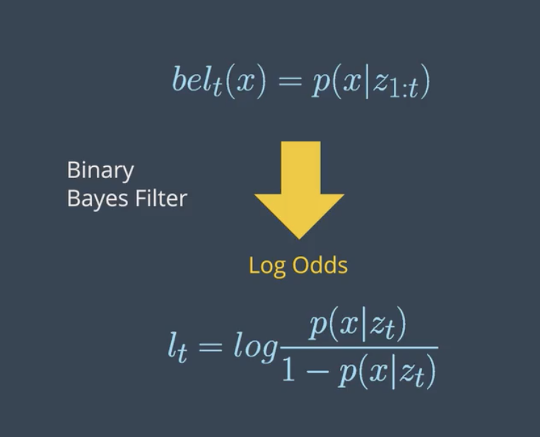
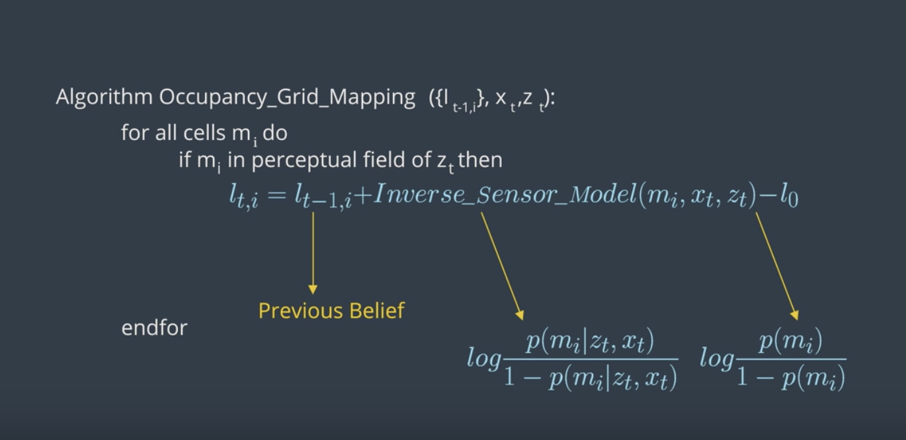
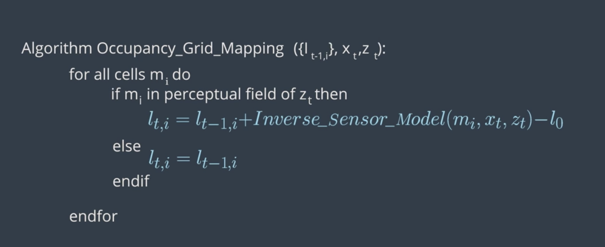

# Introduction to SLAM

This section is about how robots learn to map their envinronment and **SLAM (Simultaneous Localization And Mapping)**. In localization, we estimate the robot's pose given the map of the environment. So, given the map and robot's access to sensor and movement, it can pose. But, _what if the map of environment doesn't exist?_ This can happen either to a changing environment or maybe just the fact that map doesn't exist. In such a case, the robot will have to construct a map. This leads us to **robotic mapping**.

**Mapping:** In mapping, the robot produces a map of the environment given the its pose(s). Therefore, given the pose and access to sensor and movement data, robot creates a map of the surrounding. _**However**_, in real world, even knowing the pose can be uncommon. This is where **SLAM** comes in. 

**SLAM:** with access to only sensor and movement data, the bot must simultaneously estimate the pose and produce the map of the environment and localizing itself relative to the map.

To recap, in localization, assuming the map, bot estimates its pose whereas in mapping, assuming the pose, the bot estimates the environment. 

**Challenge in mapping:** Pose usually consists of few variables (depends on the robot) that describe the state. But, mapping happens in continuous space, so there is infinite possibilities. Combine this with the uncertainties present in perception and the mapping task becomes even more challenging. There are also some other challenges. For example, the geometry of some of the surrounding objects might look alike and repeated throughout the environment (e.g. car driving in a street where similar trees are planted). 

There are number of algorithms for mapping. Here, we focus on **Occupancy Grid Mapping** algorithm. It divides the environment into finite number of grid cells. By estimating the state of each individual cell, it'll come up with a map of environment. 

Next, we move to **SLAM**. In SLAM, the robot must create the map while simultaneously localizing itself relative to the map. This is more challenging than both localization and mapping since neither the map nor the pose are provided. The existing uncertainty in both map and pose, make the robot's estimate of both _**correlated**_. In another words, the accuracy of the map depends on the accuracy of localization and vice versa. SLAM is often called the "chicken or egg" problem. The map is needed for localization and the robot's pose needed for mapping. _**This challenge is fundamental to robotics**_. For robots to be useful, they must be able to move around the environment they've never seen before (e.g. robot vacuum cleaner or self-driving cars). 

**SLAM Algorithms**:

- Extended Kalman Filter SLAM (EKF)
- Sparse Extended Information Filter (SEIF)
- Extended Information Form (EIF)
- FastSLAM
- GraphSLAM

We'll be covering "FastSLAM" and "GraphSLAM" here.

# Occupancy Grid Mapping

**Localization:**

- Assumption: Known Map
- Estimation: Robot's Trajectory

**Mapping:**

- Assumption: Robot's Trajectory
- Estimation: Map

Here, we'll learn how to map an environment with the Occupancy Grid Mapping algorithm!

**The importance of mapping:** Mapping is important because environment is dynamic. Even with a given map, there's always a chance that something changes. So, the robot needs capability to simulatneously update the map.

## Mapping challenges: 
There are two main challenges with mapping:

- **Unknown Map and Poses:** Both map and poses are unknown to us, so we either have to assume the map and estimate the pose or assume the pose and estimate the map and localize robot with respect to it. Estimating the map is a challenging problem because of the large number of variables. This can be solved using the _**occupancy grid**_ algorithm. Estimating pose and map when both are unknown will be covered in SLAM. 
- **Hypothesis space is huge:** This is because the hypothesis is huge, so when robots are deployed into an open environment where the robot has to sense an infinite number of objects. The _occupancy grid mapping_ provides a discrete representation of the map. But even with that approximation, the space of all possible maps will be large. So, the challenge is to estimate the full posterior maps for maps with high dimensional spaces. The Bayes posterior approach used in localization will diverge. An extension to it need to be used to accomodate the huge hypothesis space. 

To map an environment, we need information about walls and objects. For example, we can deploy a robot with a laser range finder sensor. The robot collects sensory information to detect obstacle around it. By using one of the mapping algorithms, we can group this data into a resulting map. However, there are difficulties in using this data as follows:

- **Size:** mapping large spaces is difficult because there's large amonut of data needs to be processed. The robot has to collect the information from all the sensors, combine them all to form a map and localize the robot every moment. This becomes particularly challenging when the size of the map is larger than the robot's perceptual range. 
- **Noise:** There is always noise associated with sensory data, which needs to be filtered. 
- **Perceptual ambiguity:** The ambiguity occurs when two places look alike. So, the robot needs to know at which point it passed which one. This is particularly important when robot travels in cyclic manner. In cyclic travels, the odometry accumulate errors and at the end of the cycle the error is large. 

## Mapping with known poses
In mapping with known poses, poses (`X`) are known, we also have the measurements (`Z`). Then, using a mapping algorithm (say occupancy grid mapping), we can estimate the posterior map given the noisy measurements and known poses. **However**, in most robotic applications, the odometry dats is noisy, so the robot poses are unknown to us. _So, why mapping is necessary under such a situation?_ **Mapping usually happens after SLAM**. So, the power of mapping is its post-processing. In SLAM, the problem changes from mapping with known poses to mapping with unknown poses. During SLAM, the robot will build a map of the environment, localize itself with respect to the map. After SLAM, the **occupancy grid algorithm** uses the exact poses filtered from SLAM. Then, with the known poses from SLAM and noisy measurements, generates a map for path planning and navigation. 

### Posterior Probability
Going back to the graphical model of mapping with known poses, our goal is to implement a mapping algorithm and estimate the map given noisy measurements and assuming known poses.

The Mapping with Known Poses problem can be represented with `P(m|Z_{1:t}, X_{1:t})` function. With this function, we can compute the posterior over the map given all the measurements up to time **t** and all the poses up to time **t** represented by the robot trajectory.

In estimating the map, we’ll exclude the controls **u** since the robot path is provided to us from SLAM. However, keep in mind that the robot controls will be included later in SLAM to estimate the robot’s trajectory.

**2D maps:**

For now, we will only estimate the posterior for two-dimensional maps. In the real world, a mobile robot with a two-dimensional laser rangefinder sensor is generally deployed on a flat surface to capture a slice of the 3D world. Those two-dimensional slices will be merged at each instant and partitioned into grid cells to estimate the posterior through the occupancy grid mapping algorithm. Three-dimensional maps can also be estimated through the occupancy grid algorithm, but at much higher computational memory because of the large number of noisy three-dimensional measurements that need to be filtered out.

**Probability equations:**

- Localization: `P(X_{1:t}|u_{1:t}, m, Z_{1:t})`
- Mapping: `P(m|X_{1:t}, Z_{1:t})`
- SLAM: `P(X_{1:t}, m|u_{1:t}, Z_{1:t})`

## Grid Cells
To estimate the posterior map, the occupancy grid will uniformly partition the two-dimensional space in a finite number of grid cells. Each of the grid cells will hold the binary random value that corresponds to the location it covers. Based on the measurement data, the grid will be filled with zeros and ones. If the laser range finder detects an obstacle, the cell will be considered occupied and its value will be one. Therefore, in a 2D space, `number of maps = 2^cells`. 

See the video [here](https://youtu.be/WxRLYM7qHbc).

## Computing the Posterior

### First Approach: `P(m|X_{1:t}, Z_{1:t})`
We just saw that maps have high dimensionality so it will be too pricey in terms of computational memory to compute the posterior under this first approach.

### Second Approach: `P(m_{i}|X_{1:t}, Z_{1:t})`
A second or better approach to estimating the posterior map is to decompose this problem into many separate problems. In each of these problems, we will compute the posterior map `m_{i}` at each instant. However, this approach still presents some drawbacks because we are computing the probability of each cell independently. Thus, we still need to find a different approach that addresses the dependencies between neighboring cells.

### Third Approach: `Π_{i} (P(m_{i}|X_{1:t}, Z_{1:t}))`
Now, the third approach is the best approach to computing the posterior map by relating cells and overcoming the huge computational memory, is to estimate the map with the product of marginals or factorization.

## Filtering
So far, we managed to calculate the probability of grid cells using the factorization method. Due to factorization, we are now solving a binary estimation problem in which grid cells hold a static (state of system does not change during sensing) state that do not change over time. Locally, a filter to this problem exists, and is known as **Binary Bayes Filter**. It solves the static problem by taking log odds ratio of the belief. 

With static state, the belief is now a function of the measurements only. Depending on the measurement values reflected, the state of the grid cell is updated. This belief is known by **inverse measurement model**, which represents the binary state of grid cells with respect to measurements. The **inverse measurement model** is generally used when measurements are more complex than the binary static state. For example, assume a mobile robot equipped with an RGB-D camera wants to estimate if a door is open or closed. The field of measurements represented by the camera image is huge compared to a simple binary state of the door either open or close. In such situations, it's always easier to use an **inverse sensor model** than a **forward sensor model**. The **Binary Bayes Filter** will solve the **inverse measurement model** with the log odds ratio representation. The advantage of using a log odds ratio representation is to avoid probability instabilities near zero or one. Another advantage relates to system speed, accuracy, and simplicity. Check out these two sources for more information on log probability and numerical stability:

1. [Log Probability](https://en.wikipedia.org/wiki/Log_probability)
2. [Numerical Stability](https://en.wikipedia.org/wiki/Numerical_stability)

See the video [here](https://youtu.be/gvSuVqEI5OI).

**Forward vs. Inverse Measurement Model**

_Forward Measurement Model_ - `P(z1:t| x)`: Estimating a posterior over the measurement given the system state.

_Inverse Measurement Model_ - `P(x | z1:t)`: Estimating a posterior over the system state given the measurement.

The inverse measurement model is generally used when measurements are more complex than the system's state.

## Binary Bayes Filter Algorithm

**Input**

The binary Bayes filter algorithm computes the log odds of the posterior belief denoted by `l_t`. Initially, the filter takes the previous log odds ratio of the belief `t-1` and the measurements `z_t` as parameters.

**Computation**

Then, the filter computes the new posterior belief of the system `l_t` by adding the previous belief `l_{t-1}` to the log odds ratio of the inverse measurement model and subtracting the prior probability state also known by initial belief. The initial belief represents the initial state of the system before taking any sensor measurements into consideration.

**Output**

Finally, the algorithm returns the posterior belief of the system `l_t`, and a new iteration cycle begins.

## Occupancy Grid Mapping Algorithm
Now, let's code the algorithm in C++.

Below, is the pseudo algorithm:

Also, what [this video](https://youtu.be/sDQ0KRYuPJM) for a detailed explanation.

Now, let's assume a robot equipped with **eight sonar rangefinder sensors** circulates in an environment to map it. This robot is provided with its exact poses at each timestamp. The code structure is as follows:

**Data Files**

1. `measurement.txt`: The measurements from the sonar rangefinder sensors attached to the robot at each time stamp recorded over a period of 413 seconds. (timestamp, measurement 1:8).
2. `poses.txt`: The exact robot poses at each timestamp recorded over a period of 413 seconds. (timestamp, x, y, ϴ).

**Global Functions**

1. `inverseSensorModel()`: We'll code this function second after doing the inverse sensor model for sonar rangefinder sensors.
2. `occupancyGridMapping()`: We'll code this function here first.

**Main Function**

1. `File Scan`: Scanning both the measurement and poses files to retrieve the values. At each time stamp, the values are passed to the occupancy grid mapping function.
2. `Display Map`: After processing all the measurements and poses, the map is displayed.

Here are the steps to write the `occupancyGridMapping()` function:

- Generate a grid (size 300x150) and then loop through all the cells.
- Inside the loop, compute the center of mass of each cell `x_{i}` and `y_{i}`.
- Inside the loop, check if each cell falls under the perceptual field of the measurement.

**NOTE:** A cell would usually fall under the perceptual field of the measurements if the distance between the cell centroid and the robot pose is smaller or equal than the maximum measurements `Zmax`.

Find the codes [here](codes/occupancy_grid_mapping/main.cpp)