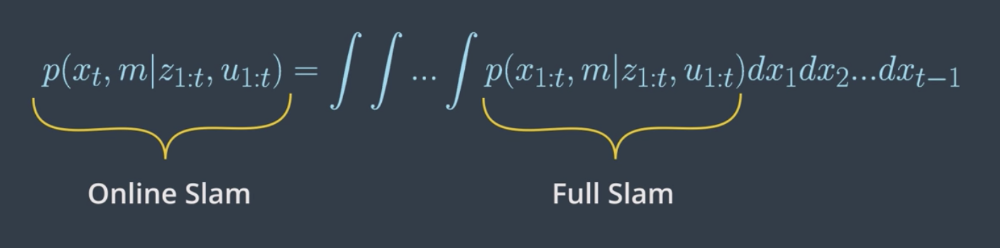
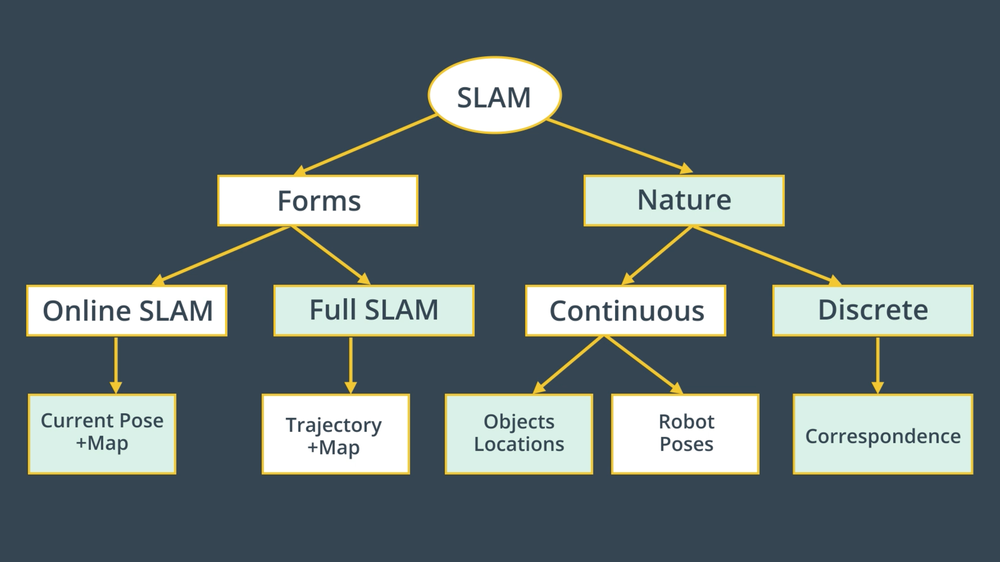
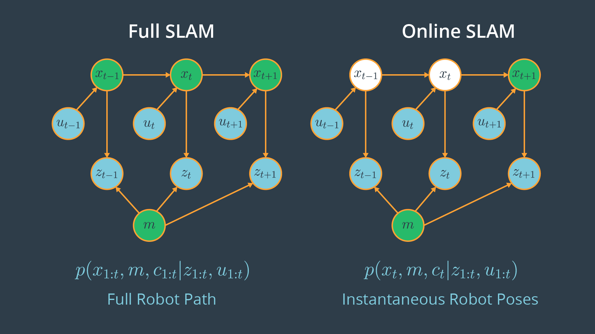
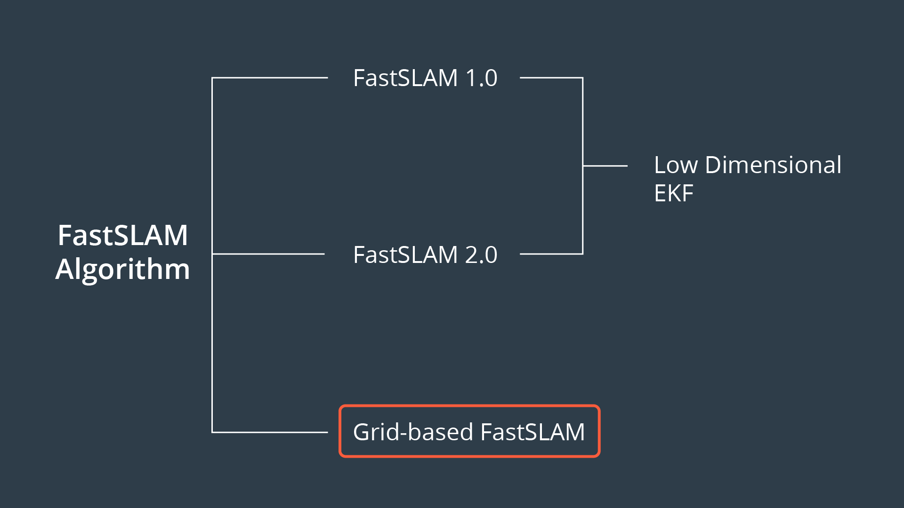
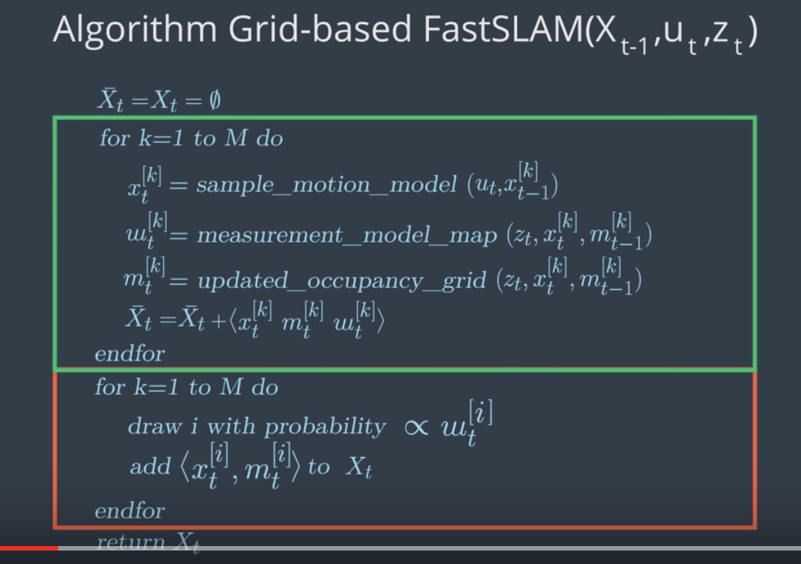
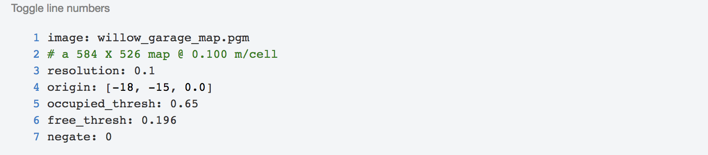

# Introduction

In SLAM, we'll map the environment given the noisy measurements and localize the robot relative to its own map giving the controls. This makes it a much more difficult problem than localization or mapping since both the map and the poses are now unknown to you. 

In real-world environments, we will primarily be faced with with SLAM problems and we will aim to estimate the map and localize the robot. 

An exmaple of a robot solving its SLAM problem is a robotic vacuum cleaner that uses the measurements provided by its laser finder sensors and data from the encoders to estimate the map and localize itself relative to it. 

## Online SLAM
Given the measurements `z` and the control `u`, you'll learn how to solve the posterior map `m` along with the poses `x`. 

The SLAM problem comes into two forms: **1. online SLAM and 2. full SLAM**. Both forms are important in robotics.

**Online SLAM Problem**

- At time `t-1`, the robot will estimate its current pose `x_{t-1}` and the map `m` given its current measurements `z_{t-1}` and controls `u_{t-1}`.
- At time `t`, the robot will estimate its new pose `x_t` and the map `m` given only its current measurements `z_t` and controls `u_t`.
- At time `t+1`, the robot will estimate its current pose `x_{t+1}` and the map `m` given the measurements `z_{t+1}` and controls `u_{t+1}`.

So, with **online SLAM** problems, we solve instantaneous poses independently from previous measurements and controls. This problem can be modeled with the probability equation `p(x_t , m | z_{1:t} , u_{1:t})` where we solve the posterior represented by the instantaneous pose `x_t` and the map `m` given the measurements `z_{1:t}` and controls `u_{1:t}`. Thus, with online SLAM we estimate variables that occur at time `t` only.

<p align="center">

</p>

See the video [here](https://youtu.be/bQ9aQj46cMI).

## Full SLAM
In full SLAM, also known as offline SLAM, you will estimate the entire path up to time `t`, instead of an instantaneous pose given all the measurements and controls. 

**Full SLAM Problem**

- At time `t-1`, the robot will estimate the robot pose `x_{t-1}` and map `m`, given the measurements `z_{t-1}` and controls `u_{t-1}`.
- At time `t`, the robot will estimate the entire path `x_{t-1:t}` and map `m`, given all the measurements `z_{t-1:t}` and controls `u_{t-1:t}`.
- At time `t+1`, the robot will estimate the entire path `x_{t-1:t+1}` and map `m`, given all the measurements `z_{t-1:t+1}` and controls `u_{t-1:t+1}`.

**Comparing full vs online SLAM**

Clearly, the difference between the two forms of SLAM is in their poses. One represents the posterior over the entire path, while the other represents a posterior over the current pose. Now, _**is there any relationship between these two forms of SLAM?**_

Yes, a relation between online and full SLAM exists by integrating the previous poses from the full SLAM problem once at a time, you obtain the online SLAM problem. 

<p align="center">

</p>

See the video [here](https://youtu.be/L7aE6TFt2zw).

## Nature of SLAM

<p align="center">

</p>

**Forms**

We’ve just reviewed the first key feature of the SLAM problem which has to do with its two forms. The online SLAM problem computes a posterior over the current pose along with the map and the full SLAM problem computes a posterior over the entire path along with the map.

**Nature**

Now, the second key feature of the SLAM problem relates to its nature. SLAM problems generally have a continuous and a discrete element.

**Nature - Continuous**

Let’s start with the continuous component of the SLAM problem. During SLAM, a robot continuously collects odometry information to estimate the robot poses and continuously senses the environment to estimate the location of the object or landmark. Thus, both robots poses and object location are continuous aspects of the SLAM problem.

**Nature - Discrete**

Now, moving to the second component of the SLAM problem. As I mentioned earlier, robots continuously sense the environment to estimate the location of the objects, when doing so SLAM algorithms have to **identify if a relation exists between any newly detected objects and previously detected ones. This helps the robot understand if it has been in this same location before**. At each moment, the robot has to answer the question, **“Have I been here before?”**. The answer to this question is binary - either yes or no - and that’s what makes the relation between objects a discrete component of the SLAM problem.This discrete relation between objects is known by _**correspondence**_.

## Correspondence
In previous section, we concluded that SLAM is a continuous discrete estimation problem. Discrete component of the SLAM problem has to do with **correspondence**. Since it's an important aspect of the problem, we could include it in our posterior estimation by adding the correspondence values in both of the online and full SLAM problems. The online and full SLAM problems will be:

- **Online SLAM:** `p(x_t , m, c_t | z_{1:t} , u_{1:t})` 
- **Full SLAM:** `p(x_{1:t} , m, c_{1:t} | z_{1:t} , u_{1:t})` 

The **advantage** of adding correspondence values to the posterior is to have the robot better understand where it is located by establishing a relation between objects. 

The relation between online and full SLAMs are also as follows,

<p align="center">

</p>

To recap, let's summarize the **key features of SLAM** one more time:

**1-Forms**

- **Online SLAM:** Robot estimates its current pose and the map using current measurements and controls.
- **Full SLAM:** Robot estimates its entire trajectory and the map using all the measurements and controls.

**2- Nature**

- **Continuous:** Robot continuously senses its pose and the location of the objects.
- **Discrete:** Robot has to identify if a relation exists between any newly detected and previously detected objects.

See the video [here](https://youtu.be/9fe6Tzx8H78).

## SLAM Challenges
Computing the full posterior composed of the robot pose, the map and the correspondence under SLAM poses a big challenge in robotics mainly due to the **continuous** and **discrete** portion.

<p align="center">

</p>

**Continuous**

The continuous parameter space composed of the robot poses and the location of the objects is highly dimensional. While mapping the environment and localizing itself, the robot will encounter many objects and have to keep track of each one of them. Thus, the number of variables will increase with time, and this makes the problem highly dimensional and challenging to compute the posterior.

**Discrete**

Next, the discrete parameter space is composed out of the correspondence values, and is also highly dimensional due to the large number of correspondence variables. Not only that, the correspondence values increase exponentially over time since the robot will keep sensing the environment and relating the newly detected objects to the previously detected ones. Even if you assume known correspondence values, the posterior over maps is still highly dimensional as we saw in the mapping.

You can now see why it’s infeasible to compute the posterior under unknown correspondence. Thus, SLAM algorithms will have to rely on approximation while estimating a posterior in order to conserve computational memory.

## Particle Filter Approach to SLAM
While solving the localization problem, we use different approaches (e.g. EKF, MCL) to estimate a robot's pose inside an environment. One of these approaches is the "Particle Filter Approach" which is implemented in the Monte Carlo localization algorithm. Each of the particles have the robot pose along with the importance weight of the particle. Using this approach, we are able to accurately estimate any robot's pose. 

Now, let's imagine that you modified the particle approach by adding another dimension to each particle. The new particle will now hold the robot's pose, as well as the map. **Would that solve the SLAM problem? Not Really!**

This approach will fade and that's because _the map is modeled with many variables resulting in high dimensionality_. Thus, the particle filter approach to SLAM in this current form will scale exponentially and doomed to fail.

See the video [here](https://youtu.be/0DiiZi5t75U).

## Introduction to FastSLAM
The FastSLAM algorithm uses a custom particle filter approach to solve the full SLAM problem with known correspondences. Using particles, FastSLAM estimates a posterior over the robot path along with the map. Each of these particles holds the robot trajectory which will give an advantage to SLAM to solve the problem of mapping with known poses. In addition to the robot trajectory, each particle holds a map and each feature of the map is represented by a local Gaussian. 

With the FastSLAM algorithm, the problem is now divided into separate independent problems, each of which aims to solve the problem of estimating features of the map. To solve these independent mini problems, FastSLAM will use the low dimensional extended Kalman filter. 

While math features are treated independently, dependency only exists between robot pose uncertainty. This custom approach of representing posterior with particle filter and Gaussian is known by the **Rao-Blackwellized Particle Filter** approach.

To recap, the **FastSLAM** algorithm solves the Full SLAM problem with known correspondences.

- **Estimating the Trajectory:** FastSLAM estimates a posterior over the trajectory using a particle filter approach. This will give an advantage to SLAM to solve the problem of mapping with known poses.
- **Estimating the Map:** FastSLAM uses a low dimensional Extended Kalman Filter to solve independent features of the map which are modeled with local Gaussian.
- 
The custom approach of representing the posterior with particle filter and Gaussian is known by the **Rao-Blackwellized** particle filter approach.

See the video [here](https://youtu.be/HIrt25hK-oI).

## FastSLAM Instances

<p align="center">

</p>

We’ve seen that the FastSLAM algorithm can solve the full SLAM problem with known correspondences. Since FastSLAM uses a particle filter approach to solve SLAM problems, some roboticists consider it a powerful algorithm capable of solving both the **Full SLAM** and **Online SLAM** problems.

- FastSLAM estimates the full robot path, and hence it solves the **Full SLAM** problem.
- On the other hand, each particle in FastSLAM estimates instantaneous poses, and thus FastSLAM also solves the **Online SLAM** problem.

<p align="center">

</p>

Now, three different instances of the FastSLAM algorithm exist.

**FastSLAM 1.0**

The FastSLAM 1.0 algorithm is simple and easy to implement, but this algorithm is known to be inefficient since particle filters generate sample inefficiency.

**FastSLAM 2.0**

The FastSLAM 2.0 algorithm overcomes the inefficiency of FastSLAM 1.0 by imposing a different distribution, which results in a low number of particles. Keep in mind that both of the FastSLAM 1.0 and 2.0 algorithms use a low dimensional Extended Kalman filter to estimate the posterior over the map features.

**Grid-based FastSLAM**

The third instance of FastSLAM is really an extension to FastSLAM known as the grid-based FastSLAM algorithm, which adapts FastSLAM to grid maps. In this lesson, you will learn grid-based FastSLAM. For more information on the fastSLAM 1.0 and 2.0 algorithms refer to the probabilistic robotics book.

## Adapting FastSLAM to Grid Maps

<p align="center">

</p>

**FastSLAM 1.0 & 2.0**

The main advantage of the FastSLAM algorithm is that it uses a particle filter approach to solve the SLAM problem. Each particle will hold a guess of the robot trajectory, and by doing so, the SLAM problem is reduced to mapping with known poses. But, in fact, this algorithm presents a big disadvantage since it must always assume that there are known landmark positions, and thus with FastSLAM we are not able to model an arbitrary environment. Now, what if landmark positions are unavailable to us? Are we still able to solve the SLAM problem?

**Grid-based FastSLAM**

Yes, with the grid mapping algorithm you can model the environment using grid maps without predefining any landmark position. So by extending the FastSLAM algorithm to occupancy grid maps, you can now solve the SLAM problem in an arbitrary environment. While mapping a real-world environment, you will mostly be using mobile robots equipped with range sensors. You’ll then extend the FastSLAM algorithm and solve the SLAM problem in term of grid maps.

<p align="center">

</p>

**Robot Trajectory**

Just as in the FastSLAM algorithm, with the grid-based FastSLAM each particle holds a guess of the robot trajectory.

**Map**

In addition, each particle maintains its own map. The grid-based FastSLAM algorithm will update each particle by solving the mapping with known poses problem using the occupancy grid mapping algorithm.

## Grid-based FastSLAM Techniques
Adapting the FastSLAM algorithm to grid maps is altered in the grid-based FastSLAM algorithm. Since the grid-based FastSLAM algorithm uses a particle filter approach and represents the world in terms of grid maps, we will need to combine what we learned from MCL and the Occupancy Mapping algorithm. 

We will need three different techniques represented by three probability functions to adapt FastSLAM to grid mapping. These techniques are known as:

- Sampling Motion
- Map Estimation
- Importance Weight

**Sampling Motion**

This technique estimates the current pose given the K-th particle previous pose and the current controls. 

**Map Estimation**

The map estimation's objective is to estimate the current map given the current measurements, the current K-th particle pose, and the previous K-th particle map. Looking closely at its probability function, we can relate it to the mapping problem in which we aim to estimate the map, given the robot's trajectory. So, to solve the map estimation problem, we can rely on the Occupancy Grid Mapping algorithm. 

**Importance Weight**

It computes the importance weight of each individual particle. This method estimates the current likelihood of the measurement given the current K-th particle pose and the current K-th particle map. 

To recap, to adapt FastSLAM to grid mapping, we need three different techniques:

1. **Sampling Motion:** `p(x_t| x[k]_{t-1}, u_t)` Estimates the current pose given the k-th particle previous pose and the current controls u.
2. **Map Estimation:** `p(m_t|z_t, x[k]_{t}, m[k]_{t-1})` Estimates the current map given the current measurements, the current k-th particle pose, and the previous k-th particle map.
3. **Importance Weight:** `p(z_t|x[k]_{t}, m[k])` Estimates the current likelihood of the measurement given the current k-th particle pose and the current k-th particle map.

See the video [here](https://youtu.be/0VwPYaQk98U).

## The Grid-based FastSLAM Algorithm
The sampling motion, map estimation, and importance weight techniques are the essence of the Grid-based FastSLAM algorithm. 

<p align="center">

</p>

Grid-based FastSLAM implements them to estimate both the map and the robot trajectory given the measurements and the controls. 

Here is the Grid-based FastSLAM algorithm which looks very similar to the MCL algorithm with some additional statements concerning the map estimation. In fact, this algorithm is the result of combining MCL algorithm and the Occupancy Grid Mapping one. 

<p align="center">

</p>

As in the MCL algorithm, the Grid-based FastSLAM algorithm is composed of two sections represented by two full loops. The first section (the green rectangle) includes the motion, sensor, and not update steps. The second one (the red rectangle), includes the re-sampling process. At each iteration, the algorithm takes the previous belief or pose, `x_{t-1}`, the activation command, `u_t`, and the sensor measurements, `z_t`, as input. 

Initially, the hypothetical belief is obtained by randomly generating M particles.

Then, in the first section, each particle implements the three techniques covered earlier to estimate the kth particle's current pose, likelihood of the measurement, and the map. Each particle begins by implementing the sampling technique in the **sample motion model** to estimate the **current pose** of the k particle. 

Next, in the measurement update step, each particle implements the _important Suede technique_ in the measurement model map function to estimate the current likelihood of the kth particle measurement. 

Moving on to the map update step, each particle will implement the map estimation technique into updated occupancy grid map function to estimate the current kth particle map. This map estimation problem will be solved under the occupancy grid mapping algorithm. 

Now, the newly estimated kth particle pose map and the likelihood of the measurements are all added to the hypothetical belief. 

Moving on to the second section of the algorithm (**red rectangle**), the re-sampling process happen through re-sampling wheel. Here, particles with measurement value close to the robot's measurement value survive and are redrawn in the next iteration, while the others die. The surviving particles poses end map are added to the system belief. 

Finally, the algorithm outputs the new belief and another cycle if iterations starts implementing the newly completed belief, the next motion, and the new sensor measurements. 

`Previous Belief` --> `Sampling Motion` --> `Importance Weight` --> `Map Estimation` --> `Resampling` --> `New Belief`

See the video [here](https://youtu.be/yFKc-2j6BMs).

## `gmapping` ROS Package
In this lab, we’ll implement a `gmapping` ROS package which is based on the Grid-based FastSLAM algorithm to map an environment. For a brief description watch [this video](https://youtu.be/45kWFvCgTdA).

`gmapping` provides laser based SLAM. Meaning that you can feed its node with the robot laser measurements and odometry values and expect it to provide you with a 2D occupancy grid map of the environment. The map will be updated as the robot moves and collect sensory information using its laser range finder sensor.

<p align="center">

</p>

**`gmapping` package documentation**

Access [this link](http://wiki.ros.org/gmapping) and go over the documentation of the `gmapping` ROS package.

**Deploying a Turltebot in a Willow Garage environment**

We will be deploying a turtlebot in a willow garage environment. Thus, navigate to the next concept, enable GPU, and GO TO DESKTOP.

Below instructions are specifically for Udacity Workspace, however, it can used (maybe with minor changes) in any other workspace:

**Create a `catkin_ws` in `/home/workspace/`**

```bash
$ mkdir -p /home/workspace/catkin_ws/src
$ cd /home/workspace/catkin_ws/src
$ catkin_init_workspace
$ cd ..
$ catkin_make
```

**Perform a System Update/Upgrade**

```bash
$ apt-get update
$ apt-get upgrade -y
```

**Clone `turtlebot_gazebo` and `turtlebot_teleop` in `src`**

```bash
$ cd src/
$ git clone https://github.com/turtlebot/turtlebot_simulator
$ git clone https://github.com/turtlebot/turtlebot
```

**Install packages dependencies**

```bash
$ cd ..
$ source devel/setup.bash
$ rosdep -i install turtlebot_gazebo
$ rosdep -i install turtlebot_teleop
```

**Build the packages**

```bash
$ catkin_make
$ source devel/setup.bash
```

**Deploying a Turltebot in a Willow Garage environment**

```bash
$ roslaunch turtlebot_gazebo turtlebot_world.launch world_file:=worlds/willowgarage.world
```

Now, interface the `gmapping` package with your robot to perform SLAM!

## SLAM with ROS
Watch [this video](https://youtu.be/APwvoT_w9Cw) for instructions.

**SLAM with ROS**

Here's the [LAB solution](https://github.com/udacity/RoboND-SLAMLAb)! While scrolling through the instructions, you will notice that some statements are a bit different than the one presented in the videos. The reason behind that is the different environment used. In the videos, a **Virtual Machine** booted with LUbuntu is used. Here in the description, you are presented with instructions on how to replicate the steps in the **Udacity Workspace**. The only difference between what you see and what is listed is the directory of the `catkin_ws`. In VM, you can store it anywhere you want, preferably in the root `~` directory. Whereas, in the Udacity workspace, you will have to store it under `/home/workspace/` so it won't get deleted after a reboot.

First, clone the gmapping package, install its system dependencies, and build your catkin workspace:

```bash
$ cd /home/workspace/catkin_ws/src
$ git clone https://github.com/ros-perception/slam_gmapping
$ rosdep install gmapping
$ cd..
$ catkin_make
```

**Terminal 1**

Launch the turtlebot in a Willow Garage environment:

```bash
$ cd /home/workspace/catkin_ws
$ source devel/setup.bash
$ roslaunch turtlebot_gazebo turtlebot_world.launch world_file:=worlds/willowgarage.world 
```

Turtlebot should now appear in a Willow Garage environment.

**Terminal 2**

Launch the keyboard teleop node:

```bash
$ cd /home/workspace/catkin_ws
$ source devel/setup.bash
$ roslaunch turtlebot_teleop keyboard_teleop.launch
```

Don’t move your robot yet!

**Terminal 3**

Run the slam_gmapping node:

```bash
$ cd /home/workspace/catkin_ws
$ source devel/setup.bash
$ rosrun gmapping slam_gmapping
```

The node should start registering your first scan.

**Terminal 4**

Run rviz and subscribe to different published topics to visualize the map:

```bash
$ rosrun rviz rviz
```

Edit the rviz configuration as follows:

- Change the **Fixed Frame** to `map`
- Keep **Reference Frame** as default
- Add a **RobotModel**
- Add a **camera** and select the `/camera/rgb/image_raw` topic
- Add a **map** and select the `/map` topic
  
Now, map the environment by driving your robot using keyboard commands.

**Terminal 5**

Save a map of the environment and share it with your classmates

```bash
$ cd /home/workspace/
$ rosrun map_server map_saver -f myMap
```

With the [map_server](http://wiki.ros.org/map_server) you can load and save maps. Running map_server will generate the **map.pgm** and the **map.yaml** files:

<p align="center">

</p>

1- **map.pgm**: Picture of the map in occupancy grid representation

- _White pixels_: Free cells
- _Black pixels_: Occupied cells
- _Gray pixels_: Unknown state

<p align="center">

</p>

2- **map.yaml**: The map metadata

- _image_: Map name
- _resolution_: Resolution of the map (meters/pixel)
- _origin_: Pose of the lower-left pixel in the map (x, y, Θ)
- _Occupied_thresh_: Cell is considered occupied if its probability is greater than this threshold.
- _free_thresh_: Cell is considered unoccupied or free if its probability is less than this threshold.
- _negate_: This value will check whether the notation of black colored cell=occupied and white colored cell = free should be preserved.

**Wondering why you got a bad quality map?**

That’s because the gmapping parameters values used were the default values. In general, it’s essential to tune them in order to get a 100% accurate map. These parameters are all listed under the gmapping documentation, where you can look at them yourself. If you experiment with some of these parameter values, you should be able to get better maps.

For example, you might try, reducing the angularUpdate and linearUpdate values so the map gets updated for smaller ranges of movements, reducing the x and y limits, which represent the initial map size, increasing the number of particles. You can try tweaking these parameters and/or any other parameter you think should be changed.

**Here is a good recap [video](https://youtu.be/l7vdjOekQhE)**.

