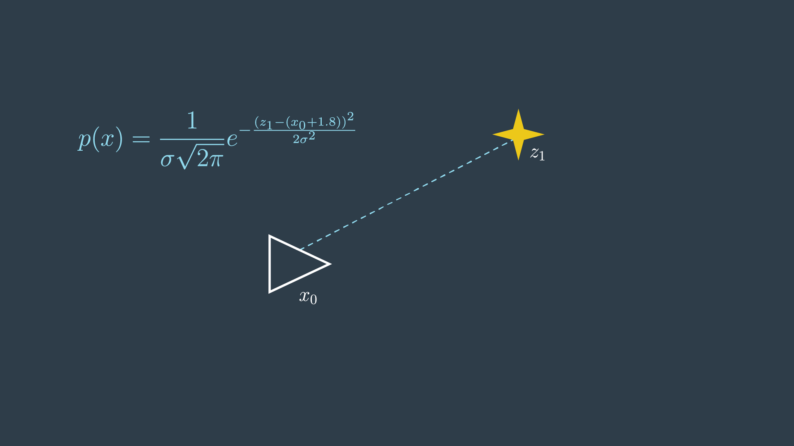
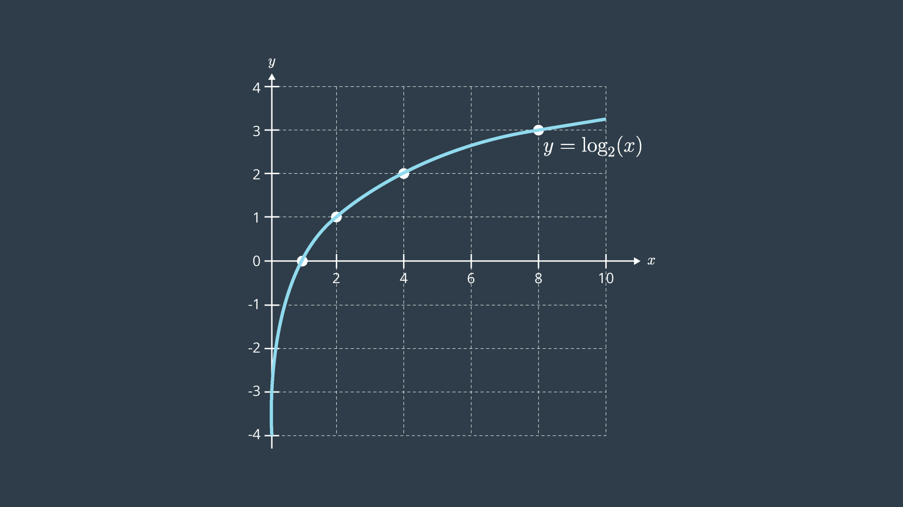
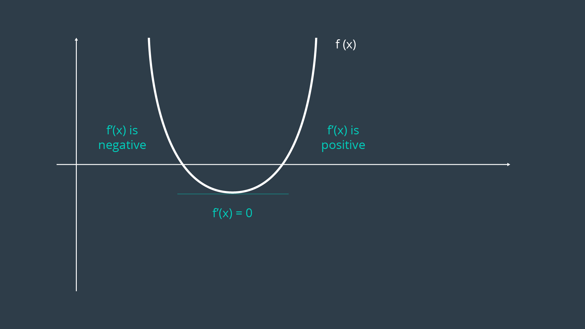
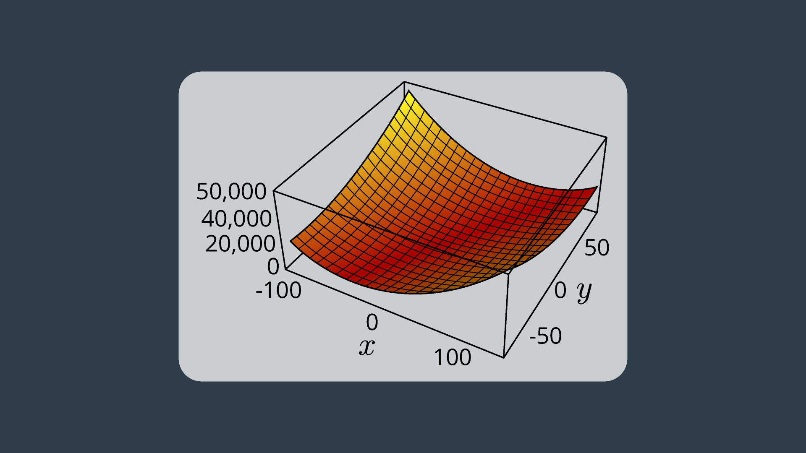
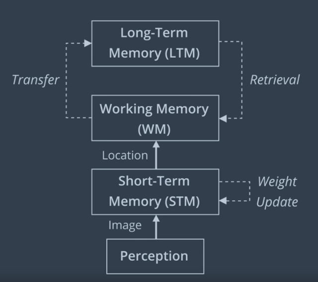

# Introduction
GraphSLAM is a SLAM algorithm that solves the full SLAM problem. This means that the algorithm recovers the entire path and map, instead of just the most recent pose and map. This difference allows it to consider dependencies between current and previous poses. 

One example of GraphSLAM would be applicable is an underground mining. Large machines called "bores" spent every day cutting away at the rockface. The environment changes rapidly, and it's important to keep an accurate map of the workspace. One way to map this workspace would be to drive a vehicle with a LIDAR around the environment and collects data about the surroundings. Then, after the fact, the data can be analyzed to create an accurate map of the environment. 

**GraphSLAM vs FastSLAM**

GraphSLAM has several advantages including the reduced need for significant onboard processing capability. Another advantage that can be immediately appreciated is its improved accuracy over FastSLAM. FastSLAM uses particles to estimate the robot's most likely pose. However, at any point in time, it's possible that there isn't a particle in the most likely location. In fact, the chances are slim to none especially in large environments. Since GraphSLAM solves the full SLAM problem, this means that it can work with all of the data at once to find the optimal solution. FastSLAM uses tidbits of information with a finite number of particles, so there is room for error. 

## Graphs
GraphSLAM uses graphs to represent robot's poses and environment. 

A robot's pose, i.e. its position and orientation, can be represented by a node. Usually the first node is arbitrarily constrained to (0,0) or its equivalent in greater dimensions. The robot's pose at time step 1 can be represented by another node and the two would be connected by an edge (sometimes called an arc). This edge is a soft spatial constraint between the two robot poses. These constraints are called "soft" because as we have seen before motion and measurement data is uncertain. The constraint will have some have some amount of error present. 

**Soft constraints** come in two forms. **Motion constraints** between two successive robot poses and **measurement constraints** between a robot pose and a feature in the environment. 

**NOTE:** Note that we use solid edges for motion constraints and dashed edges for measurement constraints. 

Over time the graph constructed by the mobile robot becomes very large in size. Luckily, GraphSLAM is able to handle large numbers of features. 

**Summary of Notation**

- **Poses** are represented with triangles.
- **Features** from the environment are represented with stars.
- **Motion constraints** tie together two poses, and are represented by a solid line.
- **Measurement constraints** tie together a feature and a pose, and are represented by a dashed line.

## Constraints
One way to look at soft constraints is to intrepret them as masses connected by rubber bands or springs. When no external forces are acting on them, the springs will naturally bring the system into a configuration, where the forces exprienced by all of the springs are minimized. When the nodes are connected in a linear function as so, the resting configuration is easy to find, but the process become more challenging as nodes become more and more inter-connected. The spring will all try to push or pull the system in their own ways. 

This is very similar to how constraints work in a graph. Every motion or measurement constraint pulls a system closer to that constraints desired state. Since the measurement and motions are uncertain, constraints will conflict with each other and there will always be some error present. In the end, the goal is to find the node configuration that minimizes the overall error present in all constraints. 

See the video [here](https://youtu.be/oo6G_ABDa80).

## Front-End vs Back-End
The goal of GraphSLAM is to create a graph of all robot poses and features encountered in the environment and find the most likely robot's path and map of the environment. This task can be broken into two sections, the front-end and the back-end.

The **front-end** of the GraphSLAM looks at how to construct the graph using the odometry and the sensory measurements collected by the robot. This includes interpreting sensory data, creating the graph, and continuing to add nodes and edges to it as the robot traverses the environment. Naturally, the front-end can differ greatly from application to application depending on the desired goal, including accuracy, the sensor used, and other forces. For instance, the front-end of a mobile robot applying SLAM in the office using a laser rangefinder would differ greatly from the front-end for a vehicle operating on a large outdoor environment and using a stereo camera. The front-end of GraphSLAM also has the challenge of solving the data association problem. In simpler terms, this means accurately identifying whether features in the environment have been previously seen. 

The **back-end** of GraphSLAM is where the magic happens. The input to the back-end is the completed graph with all of the constraints, and the output is the most probable configuration of robot poses and map features. The back-end is an optimization process that takes all of the constraints and find the system configuration that produces the smallest error. The back-end is a lot more consistent across applications. 

The front-end and the back-end can be completed in succession or can be preformed iteratively where the back-end feeding an updated graph to the front-end for furthe processing. 

See the video [here](https://youtu.be/mLKwe-AAJc8).

## Maximum Likelihood Estimation
At the core of GraphSLAM is graph optimization - the process of minimizing the error present in all of the constraints in the graph. Let’s take a look at what these constraints look like, and learn to apply a principle called _maximum likelihood estimation_ (MLE) to structure and solve the optimization problem for the graph.

**Likelihood**

Likelihood is a complementary principle to probability. While probability tries to estimate the outcome given the parameters, likelihood tries to estimate the parameters that best explain the outcome. For example,

> **Probability:** What is the probability of rolling a 2 on a 6-sided die?

(Answer: 1/6)

> **Likelihood:** I’ve rolled a die 100 times, and a 2 was rolled 10% of the time, how many sides does my die have?

(Answer: 10 sides)

When applied to SLAM, likelihood tries to estimate the most likely configuration of state and feature locations given the motion and measurement observations.

**Feature Measurement Example**

Let’s look at a very simple example - one where our robot is taking repeated measurements of a feature in the environment. This example will walk you through the steps required to solve it, which can then be applied to more complicated problems.

The robot’s initial pose has a variance of 0 - simply because this is its start location. Recall that wherever the start location may be - we call it location 0 in our relative map. Every action pose and measurement hereafter will be uncertain. In GraphSLAM, we will continue to make the assumption that motion and measurement data has Gaussian noise.

The robot takes a measurement of a feature, `m_1`, and it returns a distance of 1.8 metres.

If we return to our spring analogy - 1.8m is the spring’s resting length. This is the spring’s most desirable length; however, it is possible for the spring to be compressed or elongated to accommodate other forces (constraints) that are acting on the system.

This probability distribution for this measurement can be defined as so,

In simpler terms, the probability distribution is highest when z1 and x0 are 1.8 meters apart.

However, since the location of the first pose `x_0` is set to 0, this term can simply be removed from the equation.

Next, the robot takes another measurement of the same feature in the environment. This time, the data reads 2.2m. With two conflicting measurements, this is now an overdetermined system - as there are more equations than unknowns!

With two measurements, the most probable location of the feature can be represented by the product of the two probabilities.

In this trivial example, it is probably quite clear to you that the most likely location of the feature is at the 2.0 meter mark. However, it is valuable to go through the maximum likelihood estimation process to understand the steps entailed, to then be able to apply it to more complicated systems.

To solve this problem analytically, a few steps can be taken to reduce the equations into a simpler form.

**Remove Scaling Factors**

The value of m that maximizes the equation does not depend on the constants in front of each of the exponentials. These are scaling factors, however in SLAM we are not usually interested in the absolute value of the probabilities, but finding the maximum likelihood estimate. For this reason, the factors can simply be removed.

**Log-Likelihood**

The product of the probabilities has been simplified, but the equation is still rather complicated - with exponentials present. There exists a mathematical property that can be applied here to convert this product of exponentials into the sum of their exponents.

The natural logarithm is a [monotonic function](https://en.wikipedia.org/wiki/Monotonic_function) - in the log’s case - it is always increasing - as can be seen in the graph below. There can only be a one-to-one mapping of its values. This means that optimizing the logarithm of the likelihood is no different from maximizing the likelihood itself.

One thing to note when working with logs of likelihoods, is that they are always negative. This is because probabilities assume values between 0 and 1, and the log of any value between 0 and 1 is negative. This can be seen in the graph above. For this reason, when working with log-likelihoods, optimization entails minimizing the negative log-likelihood; whereas in the past, we were trying to maximize the likelihood.

Lastly, as was done before, the constants in front of the equation can be removed without consequence. As well, for the purpose of this example, we will assume that the same sensor was used in obtaining both measurements - and will thus ignore the variance in the equation.

**Optimization**

At this point, the equation has been reduced greatly. To get it to its simplest form, all that is left is to multiply out all of the terms. To find the minimum of this equation, you can take the first derivative of the equation and set it to equal 0.

By doing this, you are finding the location on the curve where the slope (or gradient, in multi-dimensional equations) is equal to zero - the trough! This property can be visualized easily by looking at a graph of the error function.

In more complex examples, the curve may be multimodal, or exist over a greater number of dimensions. If the curve is multimodal, it may be unclear whether the locations discovered by the first derivative are in fact troughs, or peaks. In such a case, the second derivative of the function can be taken - which should clarify whether the local feature is a local minimum or maximum.

**Overview**

The procedure that you executed here is the analytical solution to an MLE problem. The steps included,

- Removing inconsequential constants,
- Converting the equation from one of likelihood estimation to one of negative log-likelihood estimation, and
- Calculating the first derivative of the function and setting it equal to zero to find the extrema.
- 
In GraphSLAM, the first two steps can be applied to every constraint. Thus, any measurement or motion constraint can simply be labelled with its negative log-likelihood error. For a **measurement constraint**, this would resemble the following,

And for a **motion constraint**, the following,

Thus, from now on, constraints will be labelled with their negative log-likelihood error,

with the estimation function trying to minimize the sum of all constraints,

**Optimization with Non-Trivial Variances**

For this calculation, assume that the measurements and motion have equal variance. To make matters a little bit more complicated, let’s actually take into consideration the variances of each measurement and motion. Turns out that our robot has the fanciest wheels on the market - they’re solid rubber (they won’t deflate at different rates) - with the most expensive encoders. But, it looks like the funds ran dry after the purchase of the wheels - the sensor is of very poor quality.

Redo your math with the following new information,

- Motion variance: 0.02,
- Measurement variance: 0.1.

That seemed to be a fair bit more work than the first example! At this point, we just have three constraints - imagine how difficult this process would be if we had collected measurement and motion data over a period of half-an hour, as may happen when mapping a real-life environment. The calculations would be tedious - even for a computer!

Solving the system analytically has the advantage of finding the correct answer. However, doing so can be very computationally intensive - especially as you move into multi-dimensional problems with complex probability distributions. In this example, the steps were easy to perform, but it only takes a short stretch of the imagination to think of how complicated these steps can become in complex multidimensional problems.

Well, what is the alternative? you may ask. Finding the maximum value can be done in two ways - analytically and numerically. Solving the problem numerically allows for a solution to be found rather quickly, however its accuracy may be sub-optimal. Next, you will look at how to solve complicated MLE problems numerically.

## Numerical Solution to MLE
The method that you applied in the previous two examples was very effective at finding a solution quickly - but that is not always the case. In more complicated problems, finding the analytical solution may involve lengthy computations.

Luckily there is an alternative - numerical solutions to maximum likelihood problems can be found in a fraction of the time. We will explore what a numerical solution to the previous example would look like.

### Numerical solution
The graph of the error function from the previous example is seen below. In this example, it is very easy to see where the global minimum is located. However, in more complicated examples with multiple dimensions this is not as trivial.

This MLE can be solved numerically by applying an optimization algorithm. The goal of an optimization algorithm is to speedily find the optimal solution - in this case, the local minimum. There are several different algorithms that can tackle this problem; in SLAM, the [gradient descent](https://en.wikipedia.org/wiki/Gradient_descent), [Levenberg-Marquardt](https://en.wikipedia.org/wiki/Levenberg%E2%80%93Marquardt_algorithm), and [conjugate gradient](https://en.wikipedia.org/wiki/Conjugate_gradient_method) algorithms are quite common. A brief summary of gradient descent.

**Quick Refresher on Gradient Descent**

Recall that the gradient of a function is a vector that points in the direction of the greatest rate of change; or in the case of an extrema, is equal to zero.

In gradient descent - you make an initial guess, and then adjust it incrementally in the direction opposite the gradient. Eventually, you should reach a minimum of the function.

This algorithm does have a shortcoming - in complex distributions, the initial guess can change the end result significantly. Depending on the initial guess, the algorithm converges on two different local minima. The algorithm has no way to determine where the global minimum is - it very naively moves down the steepest slope, and when it reaches a local minima, it considers its task complete. One solution to this problem is to use stochastic gradient descent (SGD), an iterative method of gradient descent using subsamples of data.

## Recap

Watch the video [here](https://youtu.be/_xbQgoFqNgE)

## 1-D to n-D
### 1-Dimensional Graphs
In the previous examples, you were working with 1-dimensional graphs. The robot's motion and measurements were limited to one dimension - they could either be performed forwards or backwards.

In such a case, each constraint could be represented in the following form,

**1-D Measurement constraint:**

**1-D Motion constraint:**

### n-Dimensional Graphs
In multi-dimensional systems, we must use matrices and covariances to represent the constraints. This generalization can be applied to system of 2-dimensions, 3-dimensions, and really any n-number of dimensions. The equations for the constraints would look like so,

**n-D Measurement constraint:**

**n-D Motion constraint:**

where `h()` and `g()` represent the measurement and motion functions, and `Q_t` and `R_t` are the covariances of the measurement and motion noise. These naming conventions should be familiar to you, as they were all introduced in the Localization module.

The multidimensional formula for the sum of all constraints is presented below.

The first element in the sum is the initial constraint - it sets the first robot pose to equal to the origin of the map. The covariance, `Ω_0`, represents complete confidence. Essentially,

Now that we are working with multi-dimensional graphs and multi-dimensional constraints, it makes sense to use a more intelligent data structure to work with our data. The information matrix and information vector are just that!

## Information Matrix and Vector
Now that we know what multi-dimensional matrix looks like, it's time to learn a more elegant solution to solving the system of linear equations produced by a graph of constraints. The **information matrix** and **information vector** are two data structures that we will use to store information from our constraints. 

The information matrix is denoted `Ω`, and the information vector is denoted `ξ`. Fundamentally, the information matrix is the inverse of the covariance matrix. This means that higher certainty is represented with larger values in the information matrix, the opposite of the covariance matrix, where complete certainty was represented by zero. 

The matrix and vector hold over all of the poses and all of the features in the environment. Every off-diagonal cell in the matrix is a link between two poses, a pose and a feature, or two features. When no information is available about a link, the cell has a value of zero. The information matrix and information vector exploit the additive property of the negative log likelihood of constraints. For a system with linear measurement and motion models, the constraints can be populated into the information matrix and information vector in an additive manner. 

It is common for the number of poses and features to be in the thousands or even tens of thousands. The **information matrix is considered sparse** because most off-diagonal elements are zero, since there is no relative information to tie them together. **This sparsity is very valuable** when it comes to solving the system of equations that is embedded in the information matrix and vector. 

To recap:

- A motion constraint ties together two poses,
- A measurement constraint ties together the feature and the pose from which is was measured,
- Each operation updates 4 cells in the information matrix and 2 cells in the information vector,
- All other cells remain 0. Matrix is called ‘sparse’ due to large number of zero elements,
- Sparsity is a very helpful property for solving the system of equations.

See the video [here](https://youtu.be/3rsLNj2fQ4Y).

## Inference
Once the information matrix and information vector have been populated, the path and map can be recovered by the following operation,

The result is a vector, `μ` defined over all poses and features, containing the best estimate for each. This operation is very similar to what you encountered before in the simple one-dimensional case, with a bit of added structure. Just as before, all constraints are considered when computing the solution.

Completing the above operation requires solving a system of equations. In small systems, this is an easily realizable task, but as the size of the graph and matrix grows - efficiency becomes a concern.

The efficiency of this operation, specifically the matrix inversion, depends greatly on the topology of the system.

### Linear Graph
If the robot moves through the environment once, without ever returning to a previously visited location, then the topology is linear. Such a graph will produce a rather sparse matrix that, with some effort, can be reordered to move all non-zero elements to near the diagonal. This will allow the above equation to be completed in linear time.

### Cyclical Graph
A more common topology is cyclical, in which a robot revisits a location that it has been to before, after some time has passed. In such a case, features in the environment will be linked to multiple poses - ones that are not consecutive, but spaced far apart. The further apart in time that these poses are - the more problematic, as such a matrix cannot be reordered to move non-zero cells closer to the diagonal. The result is a matrix that is more computationally challenging to recover.

However, all hope is not lost - a variable elimination algorithm can be used to simplify the matrix, allowing for the inversion and product to be computed quicker.

### Variable Elimination
Variable elimination can be applied iteratively to remove all cyclical constraints. Just like it sounds, variable elimination entails removing a variable (ex. feature) entirely from the graph and matrix. This can be done by adjusting existing links or adding new links to accommodate for those links that will be removed.

If you recall the spring analogy, variable elimination removes features, but keeps the net forces in the springs unaltered by adjusting the tension on other springs or adding new springs where needed.

This process is demonstrated in the following two images. The first image shows the graph, matrix, and vector as they were presented in the previous video.

The second image shows the elimination of `m_1`. You can see that in this process the matrix will have five cells reset to zero (indicated in red), and four cells will have their values adjusted (indicated in green) to accommodate the variable elimination. Similarly, the information vector will have one cell removed and two adjusted.

This process is repeated for all of the features, and in the end the matrix is defined over all robot poses. At this point, the same procedure as before can be applied, 

Performing variable elimination on the information matrix/vector prior to performing inference is less computationally intense than attempting to solve the inference problem directly on the unaltered data.

In practice, the analytical inference method described above is seldom applied, as numerical methods are able to converge on a sufficiently accurate estimate in a fraction of the time. More will be said on this topic later, but first it is important to explore how nonlinear constraints are handled in GraphSLAM.

## Nonlinear Constraints
In the Localization lesson, you were introduced to nonlinear motion and measurement models. The idea that a robot only moves in a linear fashion is quite limiting, and so it became important to understand how to work with nonlinear models. In localization, nonlinear models couldn’t be applied directly, as they would have turned the Gaussian distribution into a much more complicated distribution that could not be computed in closed form (analytically, in a finite number of steps). The same is true of nonlinear models in SLAM - most motion and measurement constraints are nonlinear, and must be linearized before they can be added to the information matrix and information vector. Otherwise, it would be impractical, if not impossible, to solve the system of equations analytically.

Luckily, you will be able to apply the same procedure that you learned in the EKF lesson of Localization to linearize nonlinear constraints for SLAM.

If you recall, a Taylor Series approximates a function using the sum of an infinite number of terms. A linear approximation can be computed by using only the first two terms and ignoring all higher order terms. In multi-dimensional models, the first derivative is replaced by a Jacobian - a matrix of partial derivatives.

### Linearizing Constraints
A linearization of the measurement and motion constraints is the following,

To linearize each constraint, you need a value for `μ_{t-1}` or `μ_t` to linearize about. This value is quite important since the linearization of a nonlinear function can change significantly depending on which value you choose to do so about. So, what `μ_{t-1}` or `μ_t` is a reasonable estimate for each constraint?

Well, when presented with a completed graph of nonlinear constraints, you can apply only the motion constraints to create a pose estimate, `[x_0, ..., x_t]^T` , and use this primitive estimate in place of `μ` to linearize all of the constraints. Then, once all of the constraints are linearized and added to the matrix and vector, a solution can be computed as before, using

This solution is unlikely to be an accurate solution. The pose vector used for linearization will be erroneous, since applying just the motion constraints will lead to a graph with a lot of drift, as errors accumulate with every motion. Errors in this initial pose vector will propagate through the calculations and affect the accuracy of the end result. This is especially so because the errors may increase in magnitude significantly during a poorly positioned linearization (where the estimated `μ_t` is far from reality, or the estimated `μ_t`  lies on a curve where a small step in either direction will make a big difference).

To reduce this error, we can repeat the linearization process several times, each time using a better and better estimate to linearize the constraints about.

### Iterative Optimization
The first iteration will see the constraints linearized about the pose estimate created using solely motion constraints. Then, the system of equations will be solved to produce a solution, `μ`.

The next iteration will use this solution, `μ`, as the estimate used to linearize about. The thought is that this estimate would be a little bit better than the previous; after all, it takes into account the measurement constraints too.

This process continues, with all consequent iterations using the previous solution as the vector of poses to linearize the constraints about. Each solution incrementally improves on the previous, and after some number of iterations the solution converges.

### Summary
Nonlinear constraints can be linearized using Taylor Series, but this inevitably introduces some error. To reduce this error, the linearization of every constraint must occur as close as possible to the true location of the pose or measurement relating to the constraint. To accomplish this, an iterative solution is used, where the point of linearization is improved with every iteration. After several iterations, the result, `μ`, becomes a much more reasonable estimate for the true locations of all robot poses and features.

The workflow for GraphSLAM with nonlinear constraints is summarized below:

- Collect data, create graph of constraints,
- Until convergence:
- Linearize all constraints about an estimate, \muμ, and add linearized constraints to the information matrix & vector,
- Solve system of equations using

## GraphSLAM at a Glance
So far, we've learned how to:

- construct a graph: of poses and features,
- define constraints: both in 1-D and multi-D systems,
- solve the system of equations: to determine the most likely set of poses given the observations.
- linearize: to handle non-linear measurement in motion constraints by linearizing them,
- iterate: to solve the system of equations iteratively until convergence to achieve the best results. 

If you'd like to dive deeper into the mathematics of GraphSLAM, feel free to explore the following resources:

[A Tutorial on Graph-Based SLAM, Grisetti](http://www2.informatik.uni-freiburg.de/~stachnis/pdf/grisetti10titsmag.pdf)

[The GraphSLAM Algorithm with Applications to Large-Scale Mapping of Urban Structures, Thrun](http://robot.cc/papers/thrun.graphslam.pdf)

## Intro to 3D SLAM with RTAB-Map
We're going to dive into a GraphSLAM approach called **Real-Time Appearance-Based Mapping** or **RTAB-Map**. 

**Appearance-Based** SLAM means that the algorithm uses data collected from vision sensors to localize the robot and map the environment. In Appearance-Based methods, a process called loop closure is used to determine whether the robot has seen a location before. As the robot travels to new areas in its environment, the map is expanded, and the number of images that each new image must be compared to increases. This causes the loop closure to take longer with complexity increasing linearly. 

RTAB-Map is optimized for large-scale and long-term SLAM by using multiple strategies to allow for loop closure to be done in real-time. In this context, this means that the loop closure is happening fast enough that the result can be obtained before the next camera images are acquired. 

See the video [here](https://youtu.be/CbVNZ0J5Pmg).

## 3D SLAM with RTAB-Map
Here, we discuss the front-end and back-end specific to RTAB-Map. 

The **front-end** focuses on sensor data used to obtain the constraints that are used for feature optimization approaches. Although landmark constraints are used for othe GraphSLAM methods like 2D GraphSLAM method we saw earlier, RTAB-Map does not use them. Only **odometry constraints** and **loop closure constraints** are considered here. 

The **odometry constraints** can come from wheel encoders, IMU, LIDAR, or visual odometry. **Visual odometry** is accomplished using 2D features such as Speeded Up Robust Features or _SURF_. Remember that RTAB-Map is appearance-based with no metric distance information. RTAB-Map can use a single monocular camera to detect loop closure. For metric GraphSLAM, RTAB-Map requires an RGB-D camera or a stereo camera to compute the geometric constraint between the images of a loop closure. A laser rangefinder can also be used to improve or refine this geometric constraint by providing a more precise localization. 

The frint-end also involves graph management, which includes node creation and loop closure detection using bag-of-words.

The **back-end** includes graph optimization, an assembly of an occupancy grid from the data of the graph. We will discuss these components in more detail starting with loop closure.

**Loop closure** detection is the process of finding a match between the current and previously visited location ins SLAM. There are **two types** of loop closure detection: **local** and **global**. 

Many probabilistic SLAM methods use **local** loop closure detection where matches are found a new observation and a limited map region. The size and location of this limited map region is determined by the uncertainty associated with the robot's position. This type of approach fails if the estimated position is incorrect. As we've already seen, it is likely that the events in real world that the robot is operating in will cause errors in the estimated position. 

In a **global** loop closure detection, a new location is compared with previously viewed locations. If no matched found, the new location is added to the memory. As the map grows and more locations are added, the amount of time to check whether the location has been previously seen increases linearly. If the time it takes to search and compare new images to the one stored in the memory becomes larger than the acquisition time, the map becomes ineffective. RTAB-Map uses a global loop closure approach combined with other techniques to ensure that the loop closure process happens in real time. 

As you can see in below image the ultimate map output is significantly improved with loop closure detection. 

The importance of loop closure is best understood by seeing a map result without it!

When loop closure is disabled, you can see parts of the map output that are repeated, and the resulting map looks a lot more choppy. It is not an accurate representation of the environment. This is caused by the robot not using loop closure to compare new images and locations to ones that are previously viewed, and instead it registers them as new locations. When loop closure is enabled, the map is significantly smoother and is an accurate representation of the room.

For example, on the left, where loop closure is disabled, you'll see highlighted where the door is represented as multiple corners and parts of a door, where on the right, you see a single clearly defined door.

See the video [here](https://youtu.be/YpDVapcNaVw).

## Visual Bag-of-Words
In RTAB-Mapping, loop closure is detected using a bag-of-words approach. Bag-of-words is commonly used in vision-based mapping. A feature is a very specific characteristic of an image like a patch with a complex texture or a well-defined edge or corner. 

In RATB-Map, the default method for extracting features from an image is called **Speeded Up Robust Features** or **SURF**. Each feature has a descriptor associated with it. A **feature descriptor** is a unique and robust representation of the pixels that make up a feature. In SURF, the point of interests where the feature is located is split into smaller square sub-regions. From these sub-regions, the pixel intensities in regions of regularly spaced sample points are calculated and compared. The differences between the sample points are used to categorize the sub-regions of the image. 

Comparing feature descriptors directly is time consuming, so vocabulary is used for faster comparison. This is where similar features or synonyms are **clustered** together. The collection of these clusters represent the **vocabulary**. When a feature descriptor is mapped to one of the vocabulary, it is called **quantization**. At this point, the feature is now linked to a word that can be referred to as a visual word. **When all the features in an image are quantized, the image is now a bag-of-words**. 

Each words keeps a link to images that it is associated with, making image retrieval more efficient over a large data set. To compare an image with our previous images, a matching score is given to all images containing the same words. Each word keeps track of whic images it has been seen in, so similar images can be found. This is called **inverted index**. If a word is seen in an image, the score of this image will increase. If an image shares many visual words with the query image, it will score higher. A **Bayesian filter is used to evaluate the scores**. This is the hypothesis that an image has been seen before. When the hypothesis reaches a predefined threshold H, a loop closure is detected. 

See the video [here](https://youtu.be/7-T3Vo5bWnI).

## RTAB-Map Memory Management

!! ADD EXPLANATION HERE

See the video [here](https://youtu.be/Cs4mO5y4xYY).

RTAB-Map uses a memory management technique to limit the number of locations considered as candidates during loop closure detection. This technique is a key feature of RTAB-Map and allows for loop closure to be done in real time.

The overall strategy is to keep the most recent and frequently observed locations in the robot’s **Working Memory (WM)**, and transfer the others into **Long-Term Memory (LTM)**.

- When a new image is acquired, a new node is created in the **Short Term Memory (STM)**.
- When creating a node, recall that features are extracted and compared to the vocabulary to find all of the words in the image, creating a bag-of-words for this node.
- Nodes are assigned a weight in the STM based on how long the robot spent in the location - where a longer time means a higher weighting.
- The STM has a fixed size of S. When STM reaches S nodes, the oldest node is moved to WM to be considered for loop closure detection.
- Loop closure happens in the WM.
- WM size depends on a fixed time limit T. When the time required to process new data reaches T, some nodes of graph are transferred from WM to LTM - as a result, WM size is kept nearly constant.
- Oldest and less weighted nodes in WM are transferred to LTM before others, so WM is made up of nodes seen for longer periods of time.
- LTM is not used for loop closure detection and graph optimization.
- If loop closure is detected, neighbours in LTM of an old node can be transferred back to the WM (a process called retrieval).

## RTAB-Map Optimization and Output
Here we will discuss graph and map optimization, as well as time complexity considerations.

### Graph Optimization
When a loop closure hypothesis is accepted, a new constraint is added to the map’s graph, then a graph optimizer minimizes the errors in the map. RTAB-Map supports 3 different graph optimizations: Tree-based network optimizer, or TORO, General Graph Optimization, or G2O and GTSAM (Smoothing and Mapping).

All of these optimizations use node poses and link transformations as constraints. When a loop closure is detected, errors introduced by the odometry can be propagated to all links, correcting the map.

Recall that Landmarks are used in the graph optimization process for other methods, whereas RTAB-Map doesn't use them. Only odometry constraints and loop closure constraints are optimized.

You can see the impact of graph optimization in the comparison below.

### Map assembly and Output
The possible outputs of RTAB-Map are a 2d Occupancy grid map, 3d occupancy grid map (3d octomap), or a 3D point cloud.

### Graph SLAM Complexity and the Complexity of RTAB-Map
By providing constraints associated with how many nodes are processed for loop closure by memory management, the time complexity becomes constant in RTAB-Map.

## Recep

!! ADD EXPLANATION HERE

See the video [here](https://youtu.be/PN6cQJA1N40).

