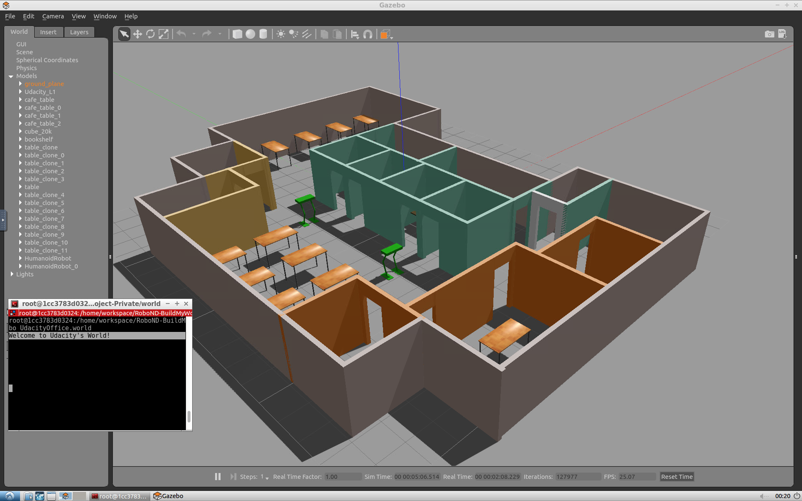
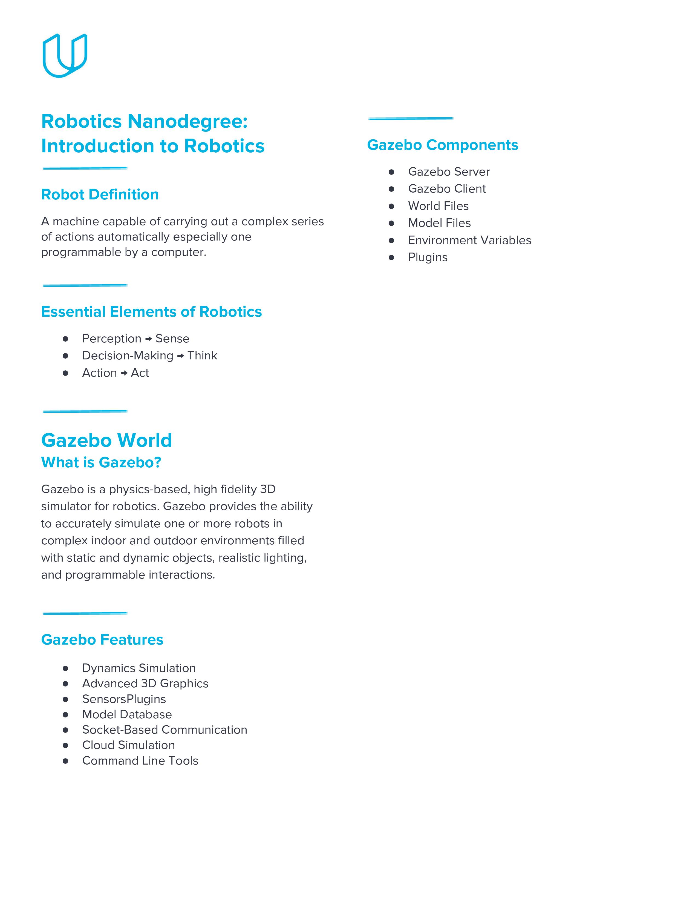

# Introduction
In this project, we'll learn how to create a Gazebo world, interact with it through plugins, and design models using Gazebo tools such as the moderator tool and the building editor tool. 

Now, we'll build our own robotic simulated environment. We'll design a Gazebo world, use it as a simulation environment for all other upcoming projects. Specifically, we'll use the building editor tool to design and build a sculpture to house your future robot. 

Furthermore, we would design an object using the moderator tool. Then, we would include multiple instances of that object in our world. 

We will also import a model of the Gazebo online library and include it in our Gazebo world theme. To interact with our world, we will write the world plugin to display a welcome message for anyone visiting the world. 

# Sample Simulation World

To help you get started, I’ve included a sample simulation. Reviewing the sample, its aspects, and the directory structure will help you build your own world in Gazebo. Please note that you have only visual access to the sample simulation as it's not provided to you in the Udacity Workspace or anywhere else.

We are providing you with a Udacity Workspace for your project. You can find this Workspace under the headline  **Gazebo in the Workspace**. Whenever you feel ready, launch the Workspace, go to desktop, and start the project!

## Output Image

<p align="center">

</p>

## Project Aspects
Inside the Gazebo world you can identify:

-   **Udacity Office**: A building model designed on the Building Editor tool of Gazebo. The structure contains features, and colors.
-   **Green humanoid robot**: Two instances of a model designed on the Model Editor tool of Gazebo.
-   **Tables**: A model imported from the Gazebo online library.
-   **Terminal**: A welcome message generated from a world plugin and printed to the terminal.

## Directory Structure
The sample simulation world folder has the following directory structure:

```
    .Project1                          # Build My World Project 
    ├── model                          # Model files 
    │   ├── Building
    │   │   ├── model.config
    │   │   ├── model.sdf
    │   ├── HumanoidRobot
    │   │   ├── model.config
    │   │   ├── model.sdf
    ├── script                         # Gazebo World plugin C++ script      
    │   ├── welcome_message.cpp
    ├── world                          # Gazebo main World containing models 
    │   ├── UdacityOffice.world
    ├── CMakeLists.txt                 # Link libraries 
    └──                              
```

## Your task
Note that your project should have the same aspects and should follow the same directory structure as the sample project! Pick a place where you want to deploy your robot, for example: your apartment, your office, or your favorite restaurant. In addition, create any model of your choice and import a model from the Gazebo library.

# Gazebo in the Workspace
You can chose to work on your project in the Udacity Workspace. As before, follow these simple steps to boot up Gazebo in your Workspace:

- First, enable the GPU on your workspace by clicking  `Enable GPU.`
- Open the visual desktop by clicking on  `Go to Desktop.`  The workspace is best supported on  **Google Chrome**  and might not load on other browsers.
- Then, update and upgrade the Workspace image to get the latest features of Gazebo. To do so, open a terminal, and write the following statement:
    
    ```
    $ sudo apt-get update && sudo apt-get upgrade -y 
    ```
    
**Note**: Remember to update and upgrade your image after each reboot since these updates(or any package that you install) are not permanent. Ignore any error you get while upgrading.
    

- Now launch Gazebo from the terminal by typing:
    
    ```
    $ gazebo
    ```

Be advised that occasionally Gazebo gets stuck in a loading loop. If Gazebo does not fully load after about one minute, try closing it by pressing Ctrl+C while the Gazebo terminal is active. Then, try running the command again to restart Gazebo.

# Project Cheat Sheet

<p align="center">

</p>

# Summary of Tasks

Let’s summarize what you should do in this project to create a simulation world for all your projects in this Robotics Software Engineer Nanodegree Program.

1.  Build a single floor wall structure using the  **Building Editor**  tool in Gazebo. Apply at least one feature, one color, and optionally one texture to your structure. Make sure there's enough space between the walls for a robot to navigate.
2.  Model any object of your choice using the  **Model Editor**  tool in Gazebo. Your model links should be connected with joints.
3.  Import your structure and two instances of your model inside an empty  **Gazebo World**.
4.  Import at least one model from the  **Gazebo online library**  and implement it in your existing Gazebo world.
5.  Write a C++  **World Plugin**  to interact with your world. Your code should display “Welcome to  ’s World!” message as soon as you launch the Gazebo world file.

These tasks are just the basic requirements for you to pass the project! Feel free to have fun designing and importing multiple models.

## Evaluation

Once you finish designing your world in Gazebo, check the  [Project Rubric](https://review.udacity.com/#!/rubrics/2346/view)  to see if your world meets the specifications. If so, then you are ready to submit!

## Submission Folder

Here are the files that you need to include in your project submission folder:

-   **model**  folder:
    -   Any object or robot designed in the Model Editor tool of Gazebo
    -   A single floor structure designed in the Building Editor tool of Gazebo
-   **world**  folder:
    -   Gazebo world file that includes the models
-   **script**  folder:
    -   Gazebo world plugin C++ script
-   **CMakeLists.txt**  file to link the C++ code to libraries

## Ready to submit your project?

Click on the "Submit Project" button and follow the instructions to submit!

## Project Submission Checklist

**Before submitting your project, please review and confirm the following items.**

I am confident all rubric items have been met and my project will pass as submitted. (If not, I will discuss with my mentor prior to submitting.)

Project builds correctly without errors and runs.

All required functionality exists and my project behaves as expected per the project's specifications.