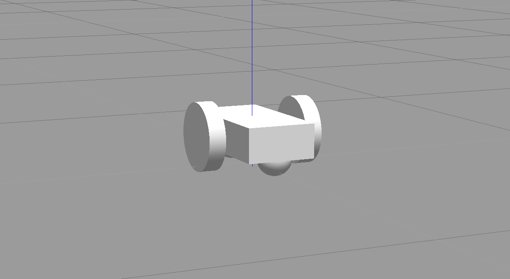
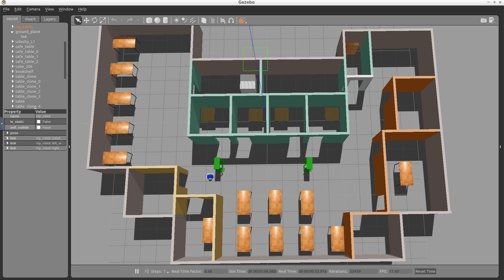
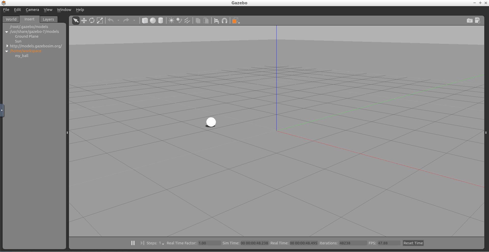

# Introduction
In this project, we'll build a ball chaser mobile robot with ROS. The project is divided into two major tasks. 

- First, design the robot and house it inside your world. 
- Second, program it to chase white colored balls through the world. 

In the first task, you'll learn how to model a mobile robot that can interface with ROS. You'll use what you learned in this module to design and customize the robot. Then, house it inside the environment you created in the "build my world project". 

In the second task, you'll write two ROS nodes. The first node, drive bot, will provide a service to drive the robot. The second node, process image, will subscribe to the robot's camera images, search for a white ball and if it exists, identify its position and requests a service from your first node to drive the robot toward the white-colored ball. 

[video](https://youtu.be/pzZKvUSFkgs)

## Project Preview
Here’s a preview of the final outcome of this project. Note that your world and the robot will look different than mine as you will be implementing you own world and robot.

See the [video](https://youtu.be/HxYGmwMp2uw).

# Setting up my_robot
The first task in this project is to create the  `my_robot`  ROS package. Inside  `my_robot`, you will store and launch an empty Gazebo world file. As you proceed with the project, you will model and store a robot, as well as replace the empty world file with the world you created in the  **Build My World**  project. For now, follow these steps to set up  `my_robot`.

_Note: Do not have more than one my_robot instance in the Gazebo world otherwise it would not be able to launch._

## Create the  `my_robot`  Package

**1- Create and initialize a  `catkin_ws`**

Feel free to skip if you already have a  `catkin_ws`.

```bash
$ mkdir -p /home/workspace/catkin_ws/src
$ cd /home/workspace/catkin_ws/src
$ catkin_init_workspace
```

**2- Navigate to the  `src`  directory of your  `catkin_ws`  and create the  `my_robot`  package**:

```bash
$ cd /home/workspace/catkin_ws/src/
$ catkin_create_pkg my_robot
```

**3- Next, create a  `worlds`  directory and a  `launch`  directory, that will further define the structure of your package**:

```bash
$ cd /home/workspace/catkin_ws/src/my_robot/
$ mkdir launch
$ mkdir worlds
```

## Create and Store an Empty Gazebo World File

Inside the  `worlds`  directory, create and store an empty Gazebo world file. As a reminder, in Gazebo a  **world**  is a collection of models, such as your robot, together with a specific environment. You can also define several other physical properties specific to this world.

**1- Create an empty Gazebo world**

An empty world in Gazebo is a simple world, with no objects or models.

```bash
$ cd /home/workspace/catkin_ws/src/my_robot/worlds/
$ touch empty.world
```

**2- Add the following to  `empty.world`**

```xml
<?xml version="1.0" ?>

<sdf version="1.4">

  <world name="default">

    <include>
      <uri>model://ground_plane</uri>
    </include>

    <!-- Light source -->
    <include>
      <uri>model://sun</uri>
    </include>

    <!-- World camera -->
    <gui fullscreen='0'>
      <camera name='world_camera'>
        <pose>4.927360 -4.376610 3.740080 0.000000 0.275643 2.356190</pose>
        <view_controller>orbit</view_controller>
      </camera>
    </gui>

  </world>
</sdf>
```

The  `.world`  file uses the XML file format to describe all the elements with respect to the Gazebo environment. The simple world that you are creating here has the following elements:

- `<sdf>`: The base element which encapsulates the entire file structure and content.
- `<world>`: The world element defines the world description and several properties pertaining to that world. In this example, you are adding a ground plane, a light source, and a camera to your world. Each model or property can have further elements that add detail. For example, the  `camera`  has a  `pose`  element which defines its position and orientation.
- `<include>`: The include element, along with the  `<uri>`  element, provide a path to a particular model. In Gazebo there are several models that are available by default.

## Create a Launch File
Launch files in ROS allow us to execute more than one node simultaneously, which helps avoid the potentially tedious task of defining and launching several nodes in separate shells or terminals.

**1- Create the  `world.launch`  file**

```bash
$ cd /home/workspace/catkin_ws/src/my_robot/launch/
$ touch world.launch
```

**2- Add the following to  `world.launch`**

```xml
<?xml version="1.0" encoding="UTF-8"?>

<launch>

  <!-- World File -->
  <arg name="world_file" default="$(find my_robot)/worlds/empty.world"/>

  <!-- Launch Gazebo World -->
  <include file="$(find gazebo_ros)/launch/empty_world.launch">
    <arg name="use_sim_time" value="true"/>
    <arg name="debug" value="false"/>
    <arg name="gui" value="true" />
    <arg name="world_name" value="$(arg world_file)"/>
  </include>

</launch>
```

As in the case of the  `.world`  file, the  `.launch`  files are also based on XML. The structure for the launch files has two parts -

- First, define arguments using the  `<arg>`  element. Each such element will have a  `name`  attribute and a  `default`  value.
- Second, include the  `world.launch`  file from the  `gazebo_ros`  package. The  [empty_world](https://github.com/ros-simulation/gazebo_ros_pkgs/blob/kinetic-devel/gazebo_ros/launch/empty_world.launch)  file includes a set of important definitions that are inherited by the world that we create. Using the  `world_name`  argument and the path to your  `.world`  file passed as the  `value`  to that argument, you will be able to launch your world in Gazebo.

## Launch  `empty.world`

```bash
$ cd /home/workspace/catkin_ws/
$ catkin_make
$ source devel/setup.bash
$ roslaunch my_robot world.launch
```

<p align="center">

</p>

# Understanding Unified Robot Description Format (URDF)
In the Build My World project, you used the  **Model Editor**  tool in Gazebo to model a robot with the Simulation Description Format, or  **SDF**. Now that you are working with ROS, you have to model a robot with the Unified Robot Description Format, or  **URDF**. Both of these formats use  [**XML**](https://www.w3schools.com/xml/xml_whatis.asp)  markup language. We can use a URDF file to define a robot model, its kinodynamic properties, visual elements and even model sensors for the robot. URDF can only describe a robot with rigid links connected by joints in a chain or tree structure. It cannot describe a robot with flexible or parallel links.

A simple robot with two links and a joint can be described using URDF as follows:

```xml
<?xml version="1.0"?>
<robot name="two_link_robot">
  <!--Links-->
  <link name="link_1">
    <visual>
      <geometry>
        <cylinder length="0.5" radius="0.2"/>
      </geometry>
    </visual>
  </link>
  <link name="link_2">
    <visual>
      <geometry>
        <box size="0.6 0.1 0.2"/>
      </geometry>
    </visual>
  </link>
  <!--Joints-->
  <joint name="joint_1" type="continuous">
    <parent link="link_1"/>
    <child link="link_2"/>
  </joint>
</robot>
```

Since we use URDF files to describe several robot and environmental properties, the files tend to be long and tedious. This is why we use Xacro (XML Macros) to divide our single URDF file into multiple Xacro files. While the syntax remains the same, we can now divide our robot description into smaller subsystems.

Since URDF (and Xacro) files are basically XML, they use tags to define robot geometry and properties. The most important and commonly used tags with their elements are described below:

## `<robot>`  `</robot>`
This is a top level tag that contains all the other tags related to a given robot.

## `<link>`  `</link>`
Each rigid link in a robot must have this tag associated with it.

### Attributes
**name**: Requires a unique link name attribute.

### Elements
#### `<visual>`  `</visual>`

This element specifies the appearance of the object for visualization purposes.

- `<origin>`: The reference frame of the visual element with respect to the reference frame of the link.
- `<geometry>`: The shape of the visual object.
- `<material>`: The material of the visual element.

#### `<collision>`  `</collision>`
The collision properties of a link. Note that this can be different from the visual properties of a link, for example, simpler collision models are often used to reduce computation time.

- `<origin>`: The reference frame of the collision element, relative to the reference frame of the link.
- `<geometry>`: See the geometry description in the above visual element.

#### `<inertial>`  `</inertial>`
The inertial properties of the link are described within this tag.

- `<origin>`: This is the pose of the inertial reference frame, relative to the link reference frame. The origin of the inertial reference frame needs to be at the center of gravity.

- `<mass>`: The mass of the link is represented by the value attribute of this element.

- `<inertia>`: The 3x3 rotational inertia matrix, represented in the inertia frame. Because the rotational inertia matrix is symmetric, only 6 above-diagonal elements of this matrix are specified here, using the attributes ixx, ixy, ixz, iyy, iyz, izz.

Example snippet for  `<link>`  tag with important elements:

```xml
  <link name="link_1">
    <inertial>
      <origin xyz="0 0 0.4" rpy="0 0 0"/>
      <mass value="${mass1}"/>
      <inertia ixx="30" ixy="0" ixz="0" iyy="50" iyz="0" izz="50"/>
    </inertial>
    <visual>
      <origin xyz="0 0 0" rpy="0 0 0"/>
      <geometry>
        <mesh filename="package://kuka_arm/meshes/kr210l150/visual/link_1.dae"/>
      </geometry>
      <material name="">
        <color rgba="0.75294 0.75294 0.75294 1"/>
      </material>
    </visual>
    <collision>
      <origin xyz="0 0 0" rpy="0 0 0"/>
      <geometry>
        <mesh filename="package://kuka_arm/meshes/kr210l150/collision/link_1.stl"/>
      </geometry>
    </collision>
  </link>

```

The  `<link>`  tag has many more optional elements that can be used to define other properties like color, material, texture, etc. Refer  [this link](http://wiki.ros.org/urdf/XML/link)  for details on those tags.

## `<joint>`  `</joint>`
This tag typically defines a single joint between two links in a robot. The type of joints you can define using this tag include:

- **Fixed**: Rigid joint with no degrees of freedom. Used to  **weld**  links together.
- **Revolute**: A range-limited joint that rotates about an axis.
- **Prismatic**: A range-limited joint that slides along an axis
- **Continuous**: Similar to  **Revolute**  joint but has no limits. It can rotate continuously about an axis.
- **Planar**: A 2D  **Prismatic**  joint that allows motion in a plane perpendicular to an axis.
- **Floating**: A joint with 6 degrees of freedom, generally used for Quadrotors and UAVs.

### Attributes

**name**  Unique joint name

**type**  Type of joint

### Elements

To define a joint, we need to declare the axis of rotation/translation and the relationship between the two links that form the joint.

- `<origin>`: This is the transform from the parent link to the child link. The joint is located at the origin of the child link.

- `<parent>`: Name of the Parent link for the respective joint.

- `<child>`: Name of the child link for the respective joint.

- `<axis>`: Defines the axis of rotation for revolute joints, the axis of translation for prismatic joints, and the surface normal for planar joints. Fixed and floating joints do not use the axis field.

Example snippet for  `<joint>`  tag with important elements:

```xml
<joint name="joint_2" type="revolute">
  <origin xyz="0.35 0 0.42" rpy="0 0 0"/>
  <parent link="link_1"/>
  <child link="link_2"/>
  <axis xyz="0 1 0"/>
</joint>
```

Other optional elements under the  `<joint>`  tag can be  [found here](http://wiki.ros.org/urdf/XML/joint).

There are many more optional tags and attributes that help to define various dynamic and kinematic properties of a robot, along with sensors and actuators. For a full list, refer to the  [ROS documentation on URDF](http://wiki.ros.org/urdf).

# Robot Basic Setup
Let’s build a basic mobile robot model by creating a URDF file and launch it inside an empty Gazebo world.

We can break the effort down into smaller components - a robot base, wheels, and sensors.

For this model, we will create a cuboidal base with two caster wheels. The caster wheels will help stabilize this model. They aren't always required, but they can help with weight distribution, preventing the robot from tilting along the z-axis.

<p align="center">

</p>

## Create the  **URDF**  File

**1- Create a  `urdf`  directory in the  `my_robot`  package**

```bash
$ cd /home/workspace/catkin_ws/src/my_robot/
$ mkdir urdf
```

**2- Create the robot’s  `xacro`  file inside the  `urdf`  directory**

```bash
$ cd /home/workspace/catkin_ws/src/my_robot/urdf/
$ touch my_robot.xacro
```

**3- Copy the following code into  `my_robot.xacro`  file**

```xml
<?xml version='1.0'?>

<robot name="my_robot" xmlns:xacro="http://www.ros.org/wiki/xacro">

  <link name="robot_footprint"></link>

  <joint name="robot_footprint_joint" type="fixed">
    <origin xyz="0 0 0" rpy="0 0 0" />
    <parent link="robot_footprint"/>
    <child link="chassis" />
  </joint>

  <link name='chassis'>
    <pose>0 0 0.1 0 0 0</pose>

    <inertial>
      <mass value="15.0"/>
      <origin xyz="0.0 0 0" rpy=" 0 0 0"/>
      <inertia
          ixx="0.1" ixy="0" ixz="0"
          iyy="0.1" iyz="0"
          izz="0.1"
      />
    </inertial>

    <collision name='collision'>
      <origin xyz="0 0 0" rpy=" 0 0 0"/> 
      <geometry>
        <box size=".4 .2 .1"/>
      </geometry>
    </collision>

    <visual name='chassis_visual'>
      <origin xyz="0 0 0" rpy=" 0 0 0"/>
      <geometry>
        <box size=".4 .2 .1"/>
      </geometry>
    </visual>


    <collision name='back_caster_collision'>
      <origin xyz="-0.15 0 -0.05" rpy=" 0 0 0"/>
      <geometry>
        <sphere radius="0.0499"/>
      </geometry>
    </collision>

    <visual name='back_caster_visual'>
      <origin xyz="-0.15 0 -0.05" rpy=" 0 0 0"/>
      <geometry>
        <sphere radius="0.05"/>
      </geometry>
    </visual>

    <collision name='front_caster_collision'>
      <origin xyz="0.15 0 -0.05" rpy=" 0 0 0"/>
      <geometry>
        <sphere radius="0.0499"/>
      </geometry>
    </collision>

    <visual name='front_caster_visual'>
      <origin xyz="0.15 0 -0.05" rpy=" 0 0 0"/>
      <geometry>
        <sphere radius="0.05"/>
      </geometry>
    </visual>

  </link>

</robot>
```

We have a single link, with the  `name`  defined as "chassis", encompassing the base as well as the caster wheels. Every link has specific elements, such as the  `inertial`  or the  `collision`  elements. You can quickly review the details of these elements covered in the previous section. The chassis is a cube, whereas the casters are spherical, as denoted by their  `<geometry>`  tags. Each link (or joint) has an origin (or pose), as well. Every element of that link or joint will have its own origin, which will be relative to the link's frame of reference.

For this base, the casters are included as part of the link for stability. There is no need for any additional links to define the casters, and therefore no joints to connect them. The casters do, however, have  `friction`  coefficients defined for them. These friction coefficients are set to 0, to allow for free motion while moving.

## Launch the Robot

Now that you’ve built the basic robot model, let’s create a launch file to load it inside an empty Gazebo world.

**1- Create a new launch file to load the  `URDF`  model file**

```bash
$ cd /home/workspace/catkin_ws/src/my_robot/launch/
$ touch robot_description.launch
```

**2- Copy the following code into  `robot_description.launch`  file**

```xml
<?xml version="1.0"?>
<launch>

  <!-- send urdf to param server -->
  <param name="robot_description" command="$(find xacro)/xacro --inorder '$(find my_robot)/urdf/my_robot.xacro'" />

</launch>
```

To generate the URDF file from the Xacro file, you must first define a parameter,  `robot_description`. This parameter will set a single command to use the  [xacro package](http://wiki.ros.org/urdf/Tutorials/Using%20Xacro%20to%20Clean%20Up%20a%20URDF%20File)  to generate the URDF from the xacro file.

### 3- Update the  `world.launch`  file created earlier so that Gazebo can load the robot  `URDF`  model

Add the following to the launch file (after  `<launch>`):

```xml
  <!-- Robot pose -->
  <arg name="x" default="0"/>
  <arg name="y" default="0"/>
  <arg name="z" default="0"/>
  <arg name="roll" default="0"/>
  <arg name="pitch" default="0"/>
  <arg name="yaw" default="0"/>

  <!-- Launch other relevant files-->
  <include file="$(find my_robot)/launch/robot_description.launch"/>
```

**Note: If you have copied your gazebo world from Project 1 then you could skip this step, since you already have  `my_robot`  in your Gazebo world.**

Add the following to the launch file (before  `</launch>`):

```xml
<!-- Find my robot Description-->
  <param name="robot_description" command="$(find xacro)/xacro --inorder '$(find my_robot)/urdf/my_robot.xacro'"/>

  <!-- Spawn My Robot -->
  <node name="urdf_spawner" pkg="gazebo_ros" type="spawn_model" respawn="false" output="screen" 
        args="-urdf -param robot_description -model my_robot 
              -x $(arg x) -y $(arg y) -z $(arg z)
              -R $(arg roll) -P $(arg pitch) -Y $(arg yaw)"/>
```

The  [gazebo_ros package](http://wiki.ros.org/gazebo_ros)  spawns the model from the URDF that  `robot_description`  helps generate.

## Launch

```bash
$ cd /home/workspace/catkin_ws/
$ catkin_make
$ source devel/setup.bash
$ roslaunch my_robot world.launch

```

**Note**: Launching Gazebo for the first time with a model can take time for everything to load up.

# Robot Enhancement
Now that you’ve built a basic model of your robot, enhance it and add wheels. Each wheel is represented as a  `link`  and is connected to the base link (the chassis) with a  `joint`.

<p align="center">

</p>

## Create Wheel  `Links`
You will first create the links for each wheel using the specifications given below and add that to your Xacro file. For each wheel, you will have a  `collision`,  `inertial`, and  `visual`  element, along with the following properties:

- `link name`  - "SIDE_wheel", where the SIDE is either left or right.
- `geometry`  - "cylinder" with radius 0.1 and length 0.05.
- `origin`  for each element - [0, 0, 0, 0, 1.5707, 1.5707]
- `mass`  of each wheel - "5".
- You can use the same  `inertia`  values as the ones for the chassis for simplicity:
    
    ```
        ixx="0.1" ixy="0" ixz="0"
        iyy="0.1" iyz="0"
        izz="0.1"
    ```
    

## Create  `Joints`  for the two wheels

Once define the links, you need to create the corresponding joints. The following elements will create a joint between your left wheel (the child link) and the robot chassis (the parent link):

```xml
  <joint type="continuous" name="left_wheel_hinge">
    <origin xyz="0 0.15 0" rpy="0 0 0"/>
    <child link="left_wheel"/>
    <parent link="chassis"/>
    <axis xyz="0 1 0" rpy="0 0 0"/>
    <limit effort="10000" velocity="1000"/>
    <dynamics damping="1.0" friction="1.0"/>
  </joint>

```

The  `joint type`  is set to "continuous" and is similar to a revolute joint but has no limits on its rotation. This means that the joint can rotate continuously. The joint will have its own  `axis`  of rotation. Also, the joint will have certain  `limits`  to enforce the maximum "effort" and "velocity" for that joint. The limits are useful constraints in for a real robot and can help in simulation as well. ROS has  [good documentation on safety limits](http://wiki.ros.org/pr2_controller_manager/safety_limits). In addition, the joint will have specific joint  `dynamics`  that correspond to the physical properties of the joint like "damping" and “friction”.

Add the left wheel joint to your Xacro file. Then use it as a template to create the joint between the right wheel and the chassis.

# Robot Sensors
Earlier, you built a very basic robot model by creating its own URDF file. Then, you enhanced the model and added a wheel and a joint on each side of the chassis. Now, it’s time to add sensors to our robot so it can perceive its surroundings. You’ll add two sensors - a  **camera**  and a  **lidar**.

## Sensors
**Camera:**  Cameras are one of the most common sensors in Robotics. They capture information that is easily interpreted by humans at a high resolution compared to other sensors. Every image captures millions of pixels. To extract depth information from camera images, people have started using stereo cameras. These work like your eyes do and are able to estimate distances to objects.

**Lidar:**  Lidar stands for Light Detection and Ranging. It uses arrays of lasers to sense “point cloud” models of the environment. By measuring thousands of millions of times per second, lidar builds an accurate model of the world. However, the resolution is not nearly as high as that of a camera.

<p align="center">

</p>

## Add a **Camera**

First, add the camera link and a corresponding joint. Open the  `my_robot.xacro`  file and add a camera sensor based on the following specifications:

-   `link name`  - "camera"
-   `link origin`  - "[0, 0, 0, 0, 0, 0]"
-   `geometry`  - box with size "[0.05, 0.05, 0.05]"
-   `mass`  - "0.1"
-   `box_inertia`  - m="0.1" x="0.05" y="0.05" z="0.05"
-   `inertia`  - ixx="1e-6" ixy="0" ixz="0" iyy="1e-6" iyz="0" izz="1e-6"
    
-   `joint name`  - "camera_joint"
    
-   `joint type`  - "fixed"
-   `joint axis`  - "[0, 1, 0]"
-   `joint origin`  - "[0.2, 0, 0, 0, 0, 0]"
-   `joint parent link`  - "chassis"
-   `joint child link`  - "camera"

As we covered in the previous section, each link should have its own  `visual`,  `collision`  and  `inertial`  elements.

## Add a  **Lidar**

Now, let's add the lidar sensor. ROS supports many different types of  [sensors](http://wiki.ros.org/Sensors#A2D_range_finders). One of them, that you will use for this robot and for the project, is the Hokuyo rangefinder sensor.

<p align="center">

</p>

The Hokuyo sensor can be added to your robot model just like the camera sensor, except that you first need to add a mesh file to your robot model. Mesh files define the shape of the object or model you are working with. There are some basic shapes, like the box or cylinder, that do not require a mesh file. However, for more advanced designs, mesh files are necessary. The mesh file should be located in a directory called  `meshes`  that you can create in your package folder,  `my_robot`.

**1- Create  `meshes`  directory**

Let’s create a  `meshes`  directory in  `my_robot`  to hold sensor mesh files:

```bash
$ cd /home/workspace/catkin_ws/src/my_robot/
$ mkdir meshes
```

**2- Now, download this  [hokuyo.dae](https://s3-us-west-1.amazonaws.com/udacity-robotics/hokuyo.dae)  file and place it under the  `meshes`  directory you just created.**

Wondering where I got the mesh file for the Hokuyo sensor? Gazebo shares the mesh files for its  [entire library of models](http://models.gazebosim.org/).

**3- Add the Hokuyo sensor to  `my_robot.xacro`**

Here are the Hokuyo lidar sensor specifications:

- `link name`  - "hokuyo"
- `link origin`  - "[0, 0, 0, 0, 0, 0]"
- `geometry`  for  `<collision>`  - box with size "[0.1, 0.1, 0.1]"
- `geometry`  for  `<visual>`  - filename = “package://my_robot/meshes/hokuyo.dae”
- `mass`  - "1e-5"
- `inertia`  - ixx="1e-6" ixy="0" ixz="0" iyy="1e-6" iyz="0" izz="1e-6" 
- `joint name`  - "hokuyo_joint"
- `joint type`  - "fixed"
- `joint axis`  - "[0 1 0]"
- `joint origin`  - "[0.15, 0, .1, 0, 0, 0]"
- `joint parent link`  - "chassis"
- `joint child link`  - "hokuyo"

As we covered in the previous section, each link should have its own  `visual`,  `collision`  and  `inertial`  elements.

## Launch
Excellent work! You created a robot model and added sensors to it. Now you can test your updated model in Gazebo:

```bash
$ cd /home/workspace/catkin_ws/
$ source devel/setup.bash
$ roslaunch my_robot world.launch
```

Now, let's see what your model looks like!

<p align="center">

</p>

Wait, something's definitely wrong here.

# Gazebo Plugins
You added sensors to your robot, allowing it to visualize the world around it! But how exactly does the  **camera**  sensor takes those images in simulation? How does a  **lidar** sensor take laser measurements in simulation? How exactly does your robot  **move** in a simulated environment?

URDF in itself can't help with that. However, Gazebo allows for plugins that implement specific use-cases.

## Sensor and Actuators Plugins
We will cover the use of three such plugins:

- A plugin for the  **camera**  sensor.
- A plugin for the  **Hokuyo lidar**  sensor.
- A plugin for the  **wheel joints**  actuator.

## Add Plugins

Download the [my_robot.gazebo](https://s3-us-west-1.amazonaws.com/udacity-robotics/my_robot.gazebo)  file, which includes the 3 plugins mentioned above, and place it inside the  `urdf`  directory of  `my_robot`.

## Gazebo Plugin Files
Since we have a two-wheeled mobile robot, we will use a plugin that implements a differential drive controller. Let's take a look at how the plugin is defined in the  `my_robot.gazebo`  file.

```xml
  <gazebo>
    <plugin name="differential_drive_controller" filename="libgazebo_ros_diff_drive.so">
      <legacyMode>false</legacyMode>
      <alwaysOn>true</alwaysOn>
      <updateRate>10</updateRate>
      <leftJoint>left_wheel_hinge</leftJoint>
      <rightJoint>right_wheel_hinge</rightJoint>
      <wheelSeparation>0.4</wheelSeparation>
      <wheelDiameter>0.2</wheelDiameter>
      <torque>10</torque>
      <commandTopic>cmd_vel</commandTopic>
      <odometryTopic>odom</odometryTopic>
      <odometryFrame>odom</odometryFrame>
      <robotBaseFrame>robot_footprint</robotBaseFrame>
      <publishWheelTF>false</publishWheelTF>
      <publishWheelJointState>false</publishWheelJointState>
      <rosDebugLevel>na</rosDebugLevel>
      <wheelAcceleration>0</wheelAcceleration>
      <wheelTorque>5</wheelTorque>
      <odometrySource>world</odometrySource>
      <publishTf>1</publishTf>
      <publishOdomTF>true</publishOdomTF>
    </plugin>
  </gazebo>

```

`libgazebo_ros_diff_drive.so`  is the shared object file created from compiling the C++ source code. The plugin accepts information specific to your robot's model, such as wheel separation, joint names, and more. Then it calculates and publishes the robot's odometry information to the topics that you specified, like  `odom`. In an upcoming section, you will send velocity commands to your robot to move it in a specific direction. This controller helps achieve that result.

If you'd like to understand how this plugin was created, you can refer to its C++  [source code](https://bitbucket.org/osrf/gazebo/src/afe08834571835008fa7419f1feba5b7f89b9d62/plugins/DiffDrivePlugin.cc?at=gazebo7&fileviewer=file-view-default).

Gazebo already has several such plugins publicly available. We will utilize the preexisting plugins for the  [camera sensor](http://gazebosim.org/tutorials?tut=ros_gzplugins#Camera)  and the preexisting plugins for the Hokuyo lidar sensor. Both of these are already included in the  `my_robot.gazebo`  file linked previously.

## ROS Communication

You need to define the topics to which each sensor publishes.

For the wheel joints, it's the  `cmd_vel`  topic.

```xml
<commandTopic>cmd_vel</commandTopic>
```

For the camera, it's the  `rgb/image_raw`  topic.

```xml
<imageTopicName>rgb/image_raw</imageTopicName>
```

And for the lidar, it's the  `scan`  topic

```xml
<topicName>/scan</topicName>
```

## Import Plugins

Before we proceed to test these sensors and actuators with ROS, you need to make sure that your plugins are imported by your URDF  `my_robot.xacro`  file as well. Import the sensors plugins by adding the following code to the top of the file (immediately before you define the  `robot_footprint`  link):

```xml
<xacro:include filename="$(find my_robot)/urdf/my_robot.gazebo"/>
```

## Next

Now, you’re ready to test these sensors with ROS!

# RViz Basics

## RViz
RViz stands for ROS Visualization. RViz is our one-stop tool to visualize all three core aspects of a robot: perception, decision-making, and actuation.

While Gazebo is a physics simulator, RViz can visualize any type of sensor data being published over a ROS topic: camera images, point clouds, ultrasonic measurements, lidar data, inertial measurements, and more. This data can be a live stream directly from the sensor or pre-recorded data stored as a  **bagfile**.

You can also visualize live joint angle values from a robot and hence construct a real-time 3D representation of any robot. Having said that, RViz is not a simulator and does not interface with a physics engine. So RViz models neither collisions nor dynamics. RViz is not an alternative to Gazebo, but rather a complementary tool to keep an eye on every single process under the hood of a robotic system.

## Running RViz
Since RViz is a ROS package, it requires roscore. In a terminal spin up roscore:

```bash
$ roscore
```

In another terminal, run rviz:

```bash
$ rosrun rviz rviz
```

“rviz” is a node located in an “rviz” package. Once launched, RViz should look something like this:

<p align="center">

</p>

The empty window in the center is called  **3D view**. This is where you will spend most of your time observing the robot model, the sensors, and other meta-data.

The panel on the left is a list of loaded  **displays**, while the one on the right shows different  **views**  available.

At the top we have a number of useful  **tools**. The bottom bar displays information like time elapsed, frames per second, and some handy instructions for the selected tool.

## Displays

For anything to appear in the  **3D view**, you first need to load a proper display. A display could be as simple as a basic 3D shape or a complex robot model.

Displays can also be used to visualize sensor data streams like 3D point clouds, lidar scans, or depth images.

RViz by default starts with two fixed property fields that cannot be removed:  **Global Options**  and  **Global Status**. One governs simple global settings, while the other detects and displays useful status notifications.

For more information on RViz, check out their official guide  [here](http://wiki.ros.org/rviz/UserGuide).

# RViz Integration

In this section, you will display your model into RViz and visualize data from the  **camera**  and  **lidar**  sensors. You will also  **actuate**  your robot and drive it around!

## Modify robot_description

Start by modifying the  `robot_description.launch`  file. Open it and add these lines after the first  `param`  definition.

```xml
  <!-- Send fake joint values-->
  <node name="joint_state_publisher" pkg="joint_state_publisher" type="joint_state_publisher">
    <param name="use_gui" value="false"/>
  </node>

  <!-- Send robot states to tf -->
  <node name="robot_state_publisher" pkg="robot_state_publisher" type="robot_state_publisher" respawn="false" output="screen"/>
```

Those elements add two nodes - the  **joint_state_publisher**  and the  **robot_state_publisher**.

-   `joint_state_publisher`: Publishes joint state messages for the robot, such as the angles for the non-fixed joints.
-   `robot_state_publisher`: Publishes the robot's state to tf (transform tree). Your robot model has several frames corresponding to each link/joint. The robot_state_publisher publishes the 3D poses of all of these links. This offers a convenient and efficient advantage, especially for more complicated robots.

## Modify  `world.launch`

Next, you need to launch RViz along with Gazebo. Open the  `world.launch`  file and add these elements after the  `urdf_spawner`  node definition:

```xml
<!--launch rviz-->
<node name="rviz" pkg="rviz" type="rviz" respawn="false"/>
```

This will create a node that launches the package  `rviz`. Let's launch it 🚀

## Launch!

```bash
$ cd /home/workspace/catkin_ws/
$ source devel/setup.bash
$ roslaunch my_robot world.launch
```

This time both Gazebo and RViz should launch!

### RViz Setup

Setup RViz to visualize the sensor readings. On the left side of RViz, under  `Displays`:

-   Select  `odom`  for  **fixed frame**
-   Click the  **Add**  button and
    -   add  `RobotModel`  and your robot model should load up in RViz.
    -   add  `Camera`  and select the  **Image topic**  that was defined in the camera Gazebo plugin
    -   add  `LaserScan`  and select the  **topic**  that was defined in the Hokuyo Gazebo plugin

### Add Objects

In Gazebo, add a box, sphere or cylinder object in front of your robot. Your robot’s sensors should be able to visualize it. You can check the  `Camera`  viewer on the bottom left side of RViz to see a picture of the new object. Also, you can see a red  `Laser`  scan inside the scene, reflecting from your object.

<p align="center">

</p>

### Drive Around

While everything above is still running, test the robot’s actuators and drive it around. Open a new terminal window and publish velocity commands to the robot’s wheel actuators:

```bash
$ cd /home/workspace/catkin_ws/
$ source devel/setup.bash
$ rostopic pub /cmd_vel geometry_msgs/Twist  "linear:
  x: 0.1
  y: 0.0
  z: 0.0
angular:
  x: 0.0
  y: 0.0
  z: 0.1" 
```

This command publishes messages to  `cmd_vel`, a topic which was defined in the drive controller plugin. The values set for  `linear.x`  and  `angular.z`  will enable the robot to start moving in a circle!

# House your Robot

So far, you created a robot model from scratch, added sensors to it to visualize its surroundings, and developed a package to launch the robot in a simulated environment. That's a real accomplishment!

But you haven’t yet placed the robot in an environment. Let’s house it inside the world you built in  **Build My World**  project.

<p align="center">

</p>

## Adding the World File

Copy the  `<yourname>.world`  file from the  `world`  directory of the  **Build My World**  project and paste it in the  `worlds`  directory of  `my_robot.`

Inside your package’s  `worlds`  directory you should now see two files - the  `empty.world`  that we created earlier and the  `<yourname>.world`  file that you just added.

Feel free to delete the  `empty.world`  file. We won’t need it anymore.

## Launch the World

Edit the  `world.launch`  file and add a reference to the  `<yourname>.world`  file that you just added. To do so, open the  `world.launch`  file and edit this line:

```xml
<arg name="world_file" default="$(find my_robot)/worlds/empty.world"/>
```

Replace it with this:

```xml
<arg name="world_file" default="$(find my_robot)/worlds/<yourname>.world"/>
```

## Launch!

Now, that you’ve added your world file to the  `my_robot`  package, let’s launch and visualize our robot inside our home.

```bash
$ cd /home/workspace/catkin_ws/
$ source devel/setup.bash
$ roslaunch my_robot world.launch
```

<p align="center">

</p>

## Initialize the Robot’s Position and Orientation

As you can see, my robot’s initial position is outside of my world! You might face the same problem. I have to change my robot’s initial pose: its position and orientation. This can be done through editing the  `world.launch`  file:

```xml
  <!-- Robot pose -->
  <arg name="x" default="0"/>
  <arg name="y" default="0"/>
  <arg name="z" default="0"/>
  <arg name="roll" default="0"/>
  <arg name="pitch" default="0"/>
  <arg name="yaw" default="0"/>
```

The best way to figure out these numbers is to change the robot’s position and orientation within Gazebo, record its pose, and then update the launch file.

<p align="center">

</p>

# Setting up ball_chaser

The second major task in this project is to create the  `ball_chaser`  ROS package. Within this package, you'll analyze the image captured by the camera to determine the position of a white ball. Then you’ll drive the robot toward the ball. The nodes in  `ball_chaser`  will communicate with the  `my_robot`  package by subscribing to the robot camera sensor and publishing to the robot’s wheel joints.

## Package Nodes

The  `ball_chaser`  package will have two C++ nodes: the  `drive_bot`  and  `process_image`

-   `drive_bot`: This server node will provide a  `ball_chaser/command_robot`  **service**  to drive the robot around by controlling its linear x and angular z velocities. The service will  **publish**  a message containing the velocities to the wheel joints.
-   `process_image`: This client node will  **subscribe**  to the robot’s camera images and analyze each image to determine the position of the white ball. Once ball position is determined, the client node will request a service to drive the robot either left, right or forward.

Now, follow along with the steps to set up  `ball_chaser`.

## Create the  `ball_chaser`  Package

**1- Navigate to the  `src`  directory of your  `catkin_ws`  and create the  `ball_chaser`  package:**

We will be writing nodes in C++. Since we already know in advance that this package will contain C++ source code and messages, let’s create the package with those dependencies:

```bash
$ cd /home/workspace/catkin_ws/src/
$ catkin_create_pkg ball_chaser roscpp std_msgs message_generation
```

**2- Next, create an  `srv`  and a  `launch`  folder, which will further define the structure of your package:**

```bash
$ cd /home/workspace/catkin_ws/src/ball_chaser/
$ mkdir srv
$ mkdir launch
```

Remember,  `srv`  is the directory where you store  **service**  files and  **launch**  is the directory where you store launch files. The  `src`  directory where you will store C++ programs is created by default.

## Build the Package

```bash
$ cd /home/workspace/catkin_ws/
$ catkin_make
```

Now you should be ready to write some code!

# ROS Node: drive_bot

This server node provides a  `ball_chaser/command_robot`  **service**  to drive the robot around by setting its linear x and angular z velocities. The service server  **publishes**  messages containing the velocities for the wheel joints.

After writing this node, you will be able to request the  `ball_chaser/command_robot`  service, either from the terminal or from a client node, to drive the robot by controlling its linear x and angular z velocities.

## Reference

The  `drive_bot.cpp`  node is similar to the  `arm_mover.cpp`  node that you already wrote. Both nodes contain a ROS  **publisher**  and  **service**. But this time, instead of publishing messages to the arm joint angles, you have to publish messages to the wheels joint angles. Please refer to the  `arm_mover.cpp`  node before you begin coding the  `drive_bot.cpp`  node.

## ROS Service File

**1- Write the  `DriveToTarget.srv`  file**

Create a  `DriveToTarget.srv`  file under the  `srv`  directory of  `ball_chaser`. Then, define the  `DriveToTarget.srv`  file as follows:

**Request**:

-   `linear_x`  type  **float64**
-   `angular_z`  type  **float64**

**Response**:

-   `msg_feedback`  type  **string**

**2- Test  `DriveToTarget.srv`**

After writing the service file, test it with ROS. Open a new terminal and execute the following:

```bash
$ cd /home/workspace/catkin_ws/
$ source devel/setup.bash
$ rossrv show DriveToTarget
```

You should receive this response:

```bash
[ball_chaser/DriveToTarget]:
float64 linear_x
float64 angular_z
---
string msg_feedback
```

## `drive_bot.cpp`  Node

Now it’s time to write the  `drive_bot.cpp`  server node that will provide the  `ball_chaser/command_robot`  service. Create the script under the  `src`  directory of your  `ball_chaser`  package. It might be a bit challenging to write this script from scratch, thus I am providing you with some hints.

Attached below is a program that will continuously publish to the robot  `/cmd_vel`  topic. This code will drive your robot forward:

```cpp
#include "ros/ros.h"
#include "geometry_msgs/Twist.h"
//TODO: Include the ball_chaser "DriveToTarget" header file

// ROS::Publisher motor commands;
ros::Publisher motor_command_publisher;

// TODO: Create a handle_drive_request callback function that executes whenever a drive_bot service is requested
// This function should publish the requested linear x and angular velocities to the robot wheel joints
// After publishing the requested velocities, a message feedback should be returned with the requested wheel velocities

int main(int argc, char** argv)
{
    // Initialize a ROS node
    ros::init(argc, argv, "drive_bot");

    // Create a ROS NodeHandle object
    ros::NodeHandle n;

    // Inform ROS master that we will be publishing a message of type geometry_msgs::Twist on the robot actuation topic with a publishing queue size of 10
    motor_command_publisher = n.advertise<geometry_msgs::Twist>("/cmd_vel", 10);

    // TODO: Define a drive /ball_chaser/command_robot service with a handle_drive_request callback function

    // TODO: Delete the loop, move the code to the inside of the callback function and make the necessary changes to publish the requested velocities instead of constant values
    while (ros::ok()) {
        // Create a motor_command object of type geometry_msgs::Twist
        geometry_msgs::Twist motor_command;
        // Set wheel velocities, forward [0.5, 0.0]
        motor_command.linear.x = 0.5;
        motor_command.angular.z = 0.0;
        // Publish angles to drive the robot
        motor_command_publisher.publish(motor_command);
    }

    // TODO: Handle ROS communication events
    //ros::spin();

    return 0;
}
```

Take a look at this program and try to understand what is happening. Then, copy it to  `drive_bot.cpp`, and make the necessary changes to define a  `ball_chaser/command_robot`  service.

## Edit CMakeLists.txt

After you write the server node in C++, you’ll have to add the following dependencies:

-   Add the  `add_compile_options`  for C++ 11 dependency, this step is optional and depends on your code
-   Add the  `add_service_files`  dependency which defines the DriveToTarget.srv file
-   Add the  `generate_messages`  dependency
-   Add  `include_directories`  dependency
-   Add the  `add_executable`,  `target_link_libraries`, and  `add_dependencies`  dependency for your  `drive_bot.cpp`script

## Build Package

Now that you’ve included specific instructions for your  `drive_bot.cpp`  code in  `CMakeLists.txt`  file, compile it with:

```bash
$ cd /home/workspace/catkin_ws/
$ catkin_make
```

## Test  `drive_bot.cpp`

To test if the service you wrote is working, first launch the robot inside your world. Then call the  `/ball_chaser/command_robot`  service to drive the robot forward, left, and then right.

**1- Launch the robot inside your world**

```bash
$ cd /home/workspace/catkin_ws/
$ source devel/setup.bash
$ roslaunch my_robot world.launch
```

**2- Run the  `drive_bot`  node**

```bash
$ cd /home/workspace/catkin_ws/
$ source devel/setup.bash
$ rosrun ball_chaser drive_bot
```

**3- Request a  `ball_chaser/command_robot`  service**

Test the service by requesting different sets of velocities from the terminal.

Open a new terminal while all the nodes are running and type:

```bash
$ cd /home/workspace/catkin_ws/
$ source devel/setup.bash

$ rosservice call /ball_chaser/command_robot "linear_x: 0.5
angular_z: 0.0"  # This request should drive your robot forward

$ rosservice call /ball_chaser/command_robot "linear_x: 0.0
angular_z: 0.5"  # This request should drive your robot left

$ rosservice call /ball_chaser/command_robot "linear_x: 0.0
angular_z: -0.5"  # This request should drive your robot right

$ rosservice call /ball_chaser/command_robot "linear_x: 0.0
angular_z: 0.0"  # This request should bring your robot to a complete stop
```

## Launch Files

Let’s add the  `drive_bot`  node to a launch file. Create a  `ball_chaser.launch`  file under the  `launch`  directory of your  `ball_chaser`  package and then copy this code to it:

```xml
<launch>

 <!-- The drive_bot node -->
  <node name="drive_bot" type="drive_bot" pkg="ball_chaser" output="screen">
  </node>

</launch>
```

This code will launch your  `drive_bot`  node, which is contained in the  `ball_chaser`  package. The server node outputs all the logs to the terminal window.

# Model a White Ball

Before you proceed to code the  `process_image`  client node, you have to model a white ball and place it in your Gazebo World scene.

After modeling the white ball, you'll control its position in Gazebo by placing it at different positions in front of the robot’s camera. The  `process_image`  client node will be responsible for analyzing the robot’s image and requesting services from the server  `drive_bot`  node to drive the robot towards it.

Now, let’s go ahead and model the white ball using the Model Editor tool in Gazebo!

## Model Editor

Here’s a reminder of how to open the model editor:

```bash
$ gazebo # then Edit-> Model Editor
```

## Insert Sphere

Under the  **simple shapes**  menu of the Model Editor tool, click on a sphere and insert it anywhere in the scene.

## Edit Size

Double click on the sphere, and change its radius to  **0.1**  both in  `Visual`  and  `Collision`.

## Change Color

To change the ball’s color to white, set its  **Visual**  Ambient, Diffuse, Specular, and Emissive  `RGBA`  values to 1.

<p align="center">

</p>

## Save

Save the white ball model as  `my_ball`  under the  `/home/workspace`  directory. Then exit the Model Editor tool and go back to the Gazebo main world.

## Insert Ball

Now that you are back in the Gazebo main world, you can click on “Insert” and drop the white ball anywhere in the scene.

<p align="center">

</p>

## Relaunch Nodes

Now that you modeled the white ball, relaunch the nodes inside  `world.launch`. Then verify that you can insert a  `my_ball`  anywhere inside your world.

<p align="center">

</p>

## Save

Place the white ball anywhere outside of your building structure, so that the robot would not see it. Then, save a copy of this new world under  `/home/workspace/catkin_ws/src/my_robot/worlds`  by replacing your old  `<yourname>.world`  file. Whenever you launch this newly saved world you should be able to see your building environment, in addition, the white ball.

<p align="center">

</p>

# ROS Node: process_image

The second node that you’ll write in this project is the  `process_image`  node. This client node will  **subscribe**  to the robot’s camera images and analyze them to determine the position of the white ball. Once the ball position is determined, the client node will request a service from the  `drive_bot`  server node to drive the robot toward the ball. The robot can drive either left, right or forward, depending on the robot position inside the image.

After you write this node, place the white ball in front of the robot’s camera. If everything works, your node should analyze the image, detect the ball’s position, and then request a  `ball_chaser/command_robot`  service to drive the robot towards the ball!

## Reference

The  `process_image.cpp`  client node is similar to the  `look_away.cpp`  client node that you wrote in this lesson. Both nodes contain a ROS  **subscriber**  and  **client**. Please review the  `look_away.cpp`  node before you start coding the  `process_image.cpp`  node.

## Analyzing the Images

To identify the ball’s  **presence**  and  **position**  inside the image, you will use a simple approach. First, search for white pixels inside the array image. Since the ball is the only object in the world that is white, white pixels indicate the ball’s presence. Then, once you find that the ball, identify its position with respect to the camera - either the left, middle, or right side of the image.

<p align="center">

</p>

You’ll have to subscribe to the  `/camera/rgb/image_raw`  topic to get instantaneous images from the robot’s camera. Inside the callback function, retrieve the image by reading the image data message. The image message contains many fields, such as the image height, data and more. Check out the complete  [ROS  `sensor_msgs/Image`  documentation](http://docs.ros.org/melodic/api/sensor_msgs/html/msg/Image.html). Now that you have the image messages, you have to loop through the image data. For each pixel compare it to a value of 255 indicating a bright white pixel, if this pixel is found try to identify in which section of the image it fall either left, mid, or right. Then, request a service to drive toward that direction.

## Write  `process_image.cpp`

Now it’s time to write the  `process_image.cpp`  client node. This node will analyze the image and request services to drive the robot. Create the source code file within the  `src`  directory of your  `ball_chaser`  package. It might be a bit challenging to write this program from scratch, thus I am providing you with some hints. Attached below is a piece of the complete code with multiple hints to help you finish the implementation.

```cpp
#include "ros/ros.h"
#include "ball_chaser/DriveToTarget.h"
#include <sensor_msgs/Image.h>

// Define a global client that can request services
ros::ServiceClient client;

// This function calls the command_robot service to drive the robot in the specified direction
void drive_robot(float lin_x, float ang_z)
{
    // TODO: Request a service and pass the velocities to it to drive the robot
}

// This callback function continuously executes and reads the image data
void process_image_callback(const sensor_msgs::Image img)
{

    int white_pixel = 255;

    // TODO: Loop through each pixel in the image and check if there's a bright white one
    // Then, identify if this pixel falls in the left, mid, or right side of the image
    // Depending on the white ball position, call the drive_bot function and pass velocities to it
    // Request a stop when there's no white ball seen by the camera
}

int main(int argc, char** argv)
{
    // Initialize the process_image node and create a handle to it
    ros::init(argc, argv, "process_image");
    ros::NodeHandle n;

    // Define a client service capable of requesting services from command_robot
    client = n.serviceClient<ball_chaser::DriveToTarget>("/ball_chaser/command_robot");

    // Subscribe to /camera/rgb/image_raw topic to read the image data inside the process_image_callback function
    ros::Subscriber sub1 = n.subscribe("/camera/rgb/image_raw", 10, process_image_callback);

    // Handle ROS communication events
    ros::spin();

    return 0;
}

```

Copy this code to  `process_image.cpp`, and make the necessary changes.

## Edit CMakeLists.txt

In addition to all the dependencies you added earlier for  `drive_bot.cpp`, these are the dependencies that you should add for  `process_image.cpp`  :

-   Add  `add_executable`
-   Add  `target_link_libraries`
-   Add  `add_dependencies`

## Build Package

Now that you’ve included specific instructions for your  `process_image.cpp`  code in  `CMakeLists.txt`, compile it with:

```bash
$ cd /home/workspace/catkin_ws/
$ catkin_make
```

## Launch File

Edit the  `ball_chaser.launch`  file saved under  `/home/workspace/catkin_ws/src/ball_chaser/launch`  and add the  `process_image`  node to it.

Now, launching this file should run the  `drive_bot`  and  `process_image`!

## Test  `process_image`

To test if the code you just wrote is working as expected, first launch the robot inside your world and then run both the  `drive_bot`  and  `process_image`  nodes.

**1- Launch the robot inside your world**

This can be done by launching the  `world.launch`  file:

```bash
$ cd /home/workspace/catkin_ws/
$ source devel/setup.bash
$ roslaunch my_robot world.launch
```

**2- Run  `drive_bot`  and  `process_image`**

This can be done by executing  `ball_chaser.launch`:

```bash
$ cd /home/workspace/catkin_ws/
$ source devel/setup.bash
$ roslaunch ball_chaser ball_chaser.launch
```

### 3- Visualize

To visualize the robot’s camera images, you can subscribe to camera RGB image topic from RViz. Or you can run the rqt_image_view node:

```bash
$ cd /home/workspace/catkin_ws/
$ source devel/setup.bash
$ rosrun rqt_image_view rqt_image_view  
```

Now place the white ball at different positions in front of the robot and see if the robot is capable of chasing the ball!

<p align="center">

</p>

# Project Description

## Summary of Tasks

In this project, you should create two ROS packages inside your  `catkin_ws/src`: the  `drive_bot`  and the  `ball_chaser`. Here are the steps to design the robot, house it inside your world, and program it to chase white-colored balls:

1.  `drive_bot`:
    
    -   Create a  `my_robot`  ROS package to hold your robot, the white ball, and the world.
    -   Design a differential drive robot with the Unified Robot Description Format. Add two sensors to your robot: a lidar and a camera. Add Gazebo plugins for your robot’s differential drive, lidar, and camera. The robot you design should be significantly different from the one presented in the project lesson. Implement significant changes such as adjusting the color, wheel radius, and chassis dimensions. Or completely redesign the robot model! After all you want to impress your future employers :-D
    -   House your robot inside the world you built in the  **Build My World**  project.
    -   Add a white-colored ball to your Gazebo world and save a new copy of this world.
    -   The  `world.launch`  file should launch your world with the white-colored ball and your robot.
2.  `ball_chaser`:
    
    -   Create a  `ball_chaser`  ROS package to hold your C++ nodes.
    -   Write a  `drive_bot`C++ node that will provide a  `ball_chaser/command_robot`  service to drive the robot by controlling its linear x and angular z velocities. The service should publish to the wheel joints and return back the requested velocities.
    -   Write a  `process_image`  C++ node that reads your robot’s camera image, analyzes it to determine the presence and position of a white ball. If a white ball exists in the image, your node should request a service via a client to drive the robot towards it.
    -   The  `ball_chaser.launch`  should run both the  `drive_bot`  and the  `process_image`  nodes.

The robot you design in this project will be used as a base model for all your upcoming projects in this Robotics Software Engineer Nanodegree Program.

## Evaluation

Once you finish designing your robot and building the nodes, check the  [Project Rubric](https://review.udacity.com/#!/rubrics/2397/view)  to see if it meets the specifications. If you meet the specifications, then you are ready to submit!

If you do not meet specifications, keep working and discussing with your fellow students and mentors.

## Submission Folder

Your submission should follow the directory structure and contain all the files listed here:

```bash
    .Project2                          # Go Chase It Project
    ├── my_robot                       # my_robot package                   
    │   ├── launch                     # launch folder for launch files   
    │   │   ├── robot_description.launch
    │   │   ├── world.launch
    │   ├── meshes                     # meshes folder for sensors
    │   │   ├── hokuyo.dae
    │   ├── urdf                       # urdf folder for xarco files
    │   │   ├── my_robot.gazebo
    │   │   ├── my_robot.xacro
    │   ├── world                      # world folder for world files
    │   │   ├── <yourworld>.world
    │   ├── CMakeLists.txt             # compiler instructions
    │   ├── package.xml                # package info
    ├── ball_chaser                    # ball_chaser package                   
    │   ├── launch                     # launch folder for launch files   
    │   │   ├── ball_chaser.launch
    │   ├── src                        # source folder for C++ scripts
    │   │   ├── drive_bot.cpp
    │   │   ├── process_images.cpp
    │   ├── srv                        # service folder for ROS services
    │   │   ├── DriveToTarget.srv
    │   ├── CMakeLists.txt             # compiler instructions
    │   ├── package.xml                # package info                  
    └──                              

```

## Ready to submit your project?

Click on the "Submit Project" button and follow the instructions to submit!

## Project Submission Checklist

**Before submitting your project, please review and confirm the following items.**

I am confident all rubric items have been met and my project will pass as submitted. (If not, I will discuss with my mentor prior to submitting.)

Project builds correctly without errors and runs.

All required functionality exists and my project behaves as expected per the project's specifications.

**Once you have checked all these items, you are ready to submit!**

